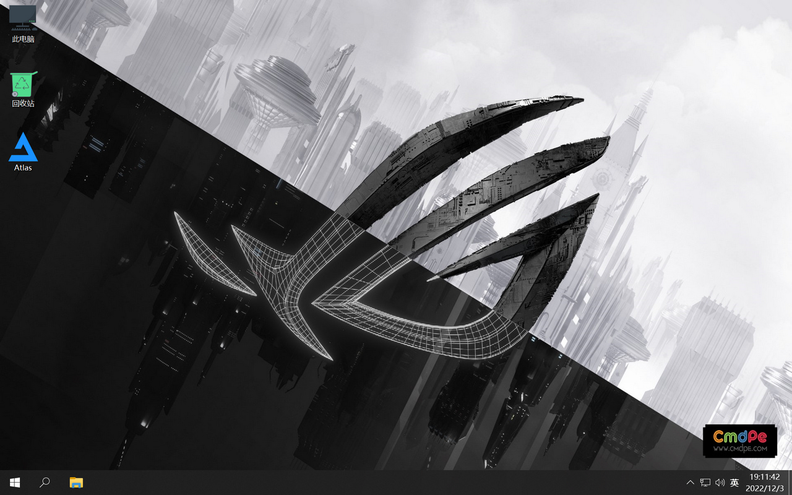
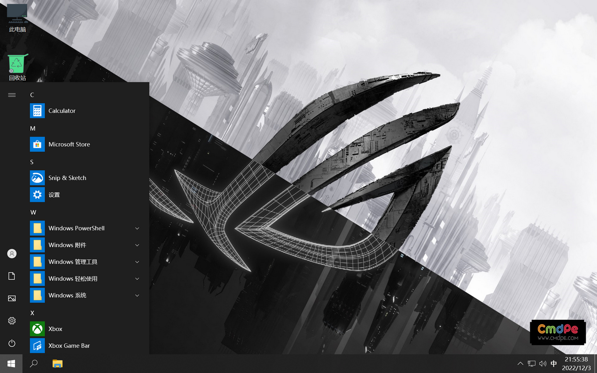
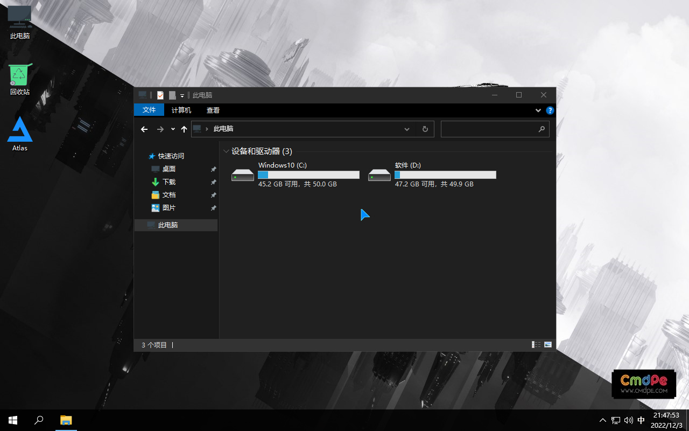
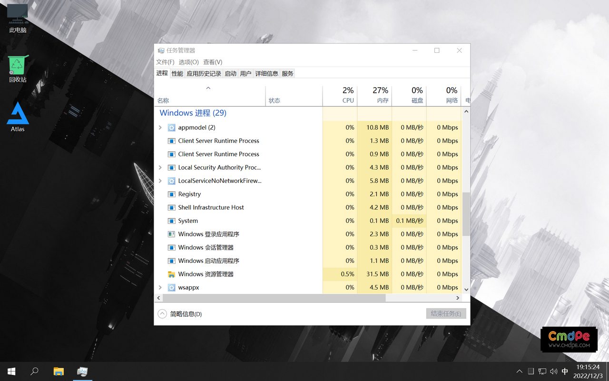
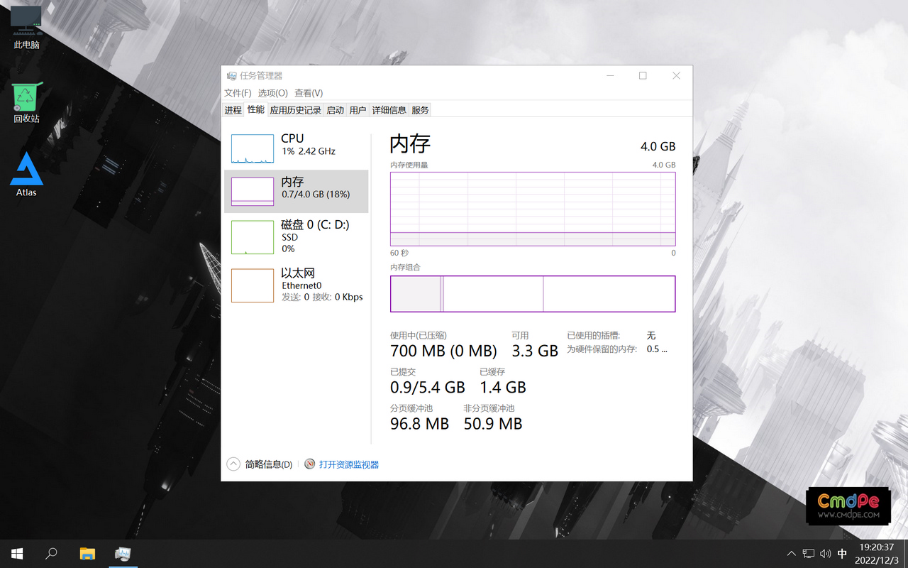
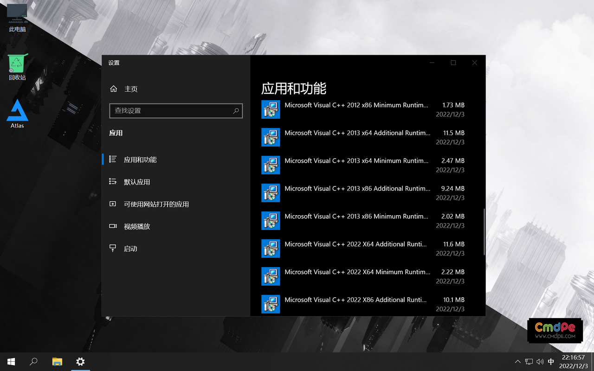
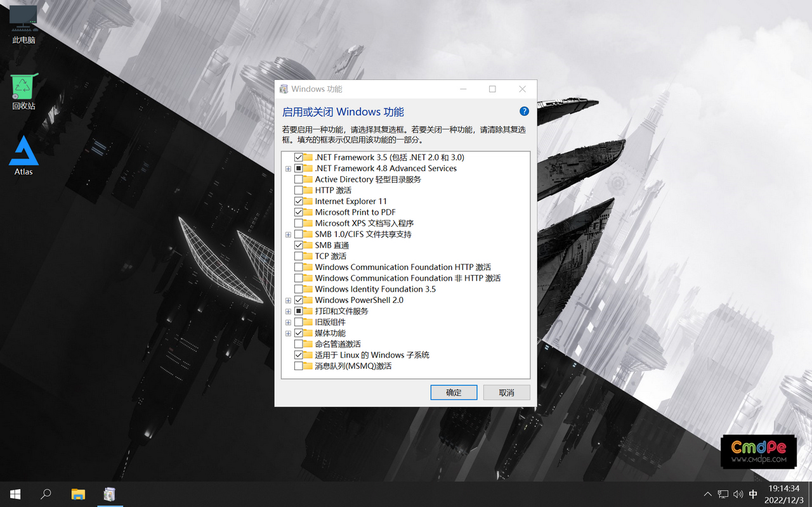
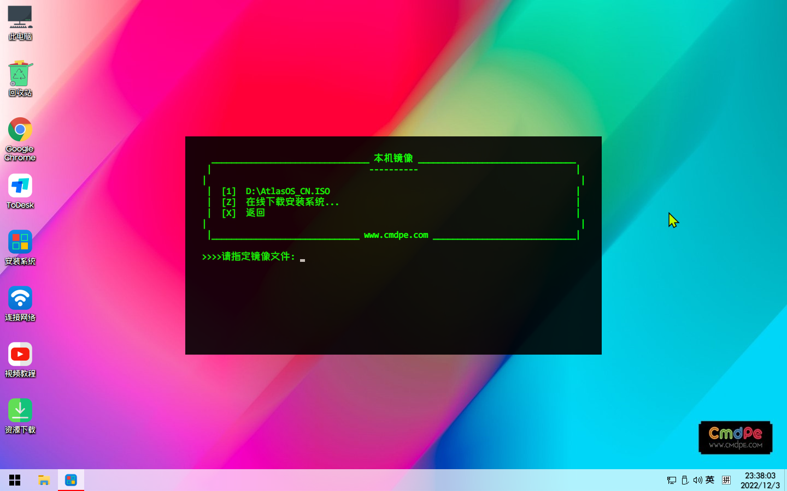

 	
## 
 		

- [首页](http://www.cmdpe.com/)
- [下载](https://www.cmdpe.com/post/147.html#)
   - [网络VIP版下载](https://www.cmdpe.com/post/70.html)
   - [查询订单](https://www.cmdpe.com/buys_query.html)
   - [功能介绍](https://www.cmdpe.com/category-16.html)
   - [更新日志](https://www.cmdpe.com/65.html)
- [福利](https://www.cmdpe.com/category-20.html)
   - [福利](https://www.cmdpe.com/category-20.html)
   - [游戏](https://www.cmdpe.com/category-25.html)
- [一行代码](https://www.cmdpe.com/post/147.html#)
   - [一行代码-重装系统](https://www.cmdpe.com/post/100.html)
   - [一行代码-激活系统](https://www.cmdpe.com/post/192.html)
   - [一行代码-下载系统](https://www.cmdpe.com/post/246.html)
   - [一行代码-安装Office](https://www.cmdpe.com/post/194.html)
   - [一行代码-安装专业软件](https://www.cmdpe.com/post/195.html)
- [操作系统](https://www.cmdpe.com/post/147.html#)
   - [MacOS](https://www.cmdpe.com/category-4.html)
   - [Windows](https://www.cmdpe.com/category-5.html)
   - [Windows-下载](https://www.cmdpe.com/post/246.html)
   - [Windows-封装工具](https://www.cmdpe.com/category-3.html)
- [软件下载](https://www.cmdpe.com/post/147.html#)
   - [系统镜像](https://www.cmdpe.com/post/246.html)
   - [实用工具](https://www.cmdpe.com/post/147.html#)
      - [系统工具](https://www.cmdpe.com/category-10.html)
      - [图形图像](https://www.cmdpe.com/category-7.html)
      - [媒体工具](https://www.cmdpe.com/category-9.html)
      - [办公软件](https://www.cmdpe.com/category-12.html)
      - [编程开发](https://www.cmdpe.com/category-23.html)
      - [影音娱乐](https://www.cmdpe.com/category-21.html)
      - [网络软件](https://www.cmdpe.com/category-8.html)
      - [社交通讯](https://www.cmdpe.com/category-22.html)
   - [专业软件下载](https://www.cmdpe.com/post/195.html)
      - [Office](https://www.cmdpe.com/post/249.html)
      - [Adobe](https://www.cmdpe.com/post/219.html)
      - [AutoCAD](https://www.cmdpe.com/post/220.html)
      - [平面设计](https://www.cmdpe.com/post/221.html)
      - [三维设计](https://www.cmdpe.com/post/222.html)
      - [影视动画](https://www.cmdpe.com/post/223.html)
      - [建筑设计](https://www.cmdpe.com/post/224.html)
      - [机械设计](https://www.cmdpe.com/post/225.html)
      - [电子电路](https://www.cmdpe.com/post/226.html)
- [我们很好](https://www.cmdpe.com/post/147.html#)
   - [叽叽喳喳](https://www.cmdpe.com/114.html)
   - [高逼格聊天室](https://chat.cmdpe.link/)
   - [桌面CPU天梯图](https://m.ithome.com/html/projects/cpus/index.html)
   - [独立显卡天梯图](https://m.ithome.com/html/projects/graphics/index.html)
- [人工智能](https://www.cmdpe.com/post/147.html#)
   - [HelloGPT-中文镜像站](https://hellogpt123.xyz/)
   - [ChatGPT-账号交易中心](https://pay.cmdpe.link/)

 			 			 		
 	
 	
 						 
**AtlasOS**一款基于Windows 10 20H2 版定制的替代操作系统，专门为游戏玩家开发，一切以游戏性能为目标，删除了Windows不必要的组件与功能，减少进程，降低延迟，旨在帮助老硬件发挥更好的性能或为高端玩家删除一切阻碍。
[AtlasOS](https://atlasos.net/)官网只提供英文版下载，**本人已将其完全汉化，并再次进行深度优化。**系统占用空间为**5G**（原版Win10大约占用**19G**），后台进程只有**30**个（原版Win10大约**185**个后台进程），内存占用只有**700M**（原版Win10大约占用内存**1.9G**）。
**安装教程**与**下载地址**在本文最后面，追求低延迟、高性能的朋友拿去发挥吧。

本人已将其完全汉化

可以看到安装完系统只占用磁盘大约**5G**空间，原版Win10大约占用**19G**。

后台进程已缩减至**29**个，原版Win10大约**185**个后台进程。

运行内存只有**700M**，原版Win10大约占用内存**1.9G**。

已整合完整运行库

#### 安装教程：
建议先在**虚拟机**中内安装，体验后再考虑实机安装，[虚拟机VMware Workstation Pro v10-17官方正式版+正版激活码](https://www.cmdpe.com/post/45.html)。或者安装**双系统**保留原系统，[安装双系统教程](https://www.cmdpe.com/post/95.html)。
进**PE**系统进行安装，此处以[cmdpe-网络版](https://www.cmdpe.com/)为例。进**PE**后打开桌面“**安装系统**”，选【1】全盘搜索系统镜像，然后在搜索出的系统镜像中选择 **AtlasOS_CN.ISO **即可...

#### 下载地址：
[https://www.123pan.com/s/CPa8Vv-KGbrv](https://www.123pan.com/s/CPa8Vv-KGbrv)
 	 	 	 	 
 	 	
 	
#### 发表评论
 	
 	 		 	
 	 
 	 	 	
 	
#### 评论列表
 	
 	

-  		

 		 		

-  		 		[访客](https://www.cmdpe.com/post/147.html) 		_2022.12.4 	  	 [回复](https://www.cmdpe.com/post/147.html#comment) 	  	  	

 	

-  	 请问这个是64位的吗，除了打游戏，日常办公有没有影响				 

 	

   -  		

 		 		

   -  		 		[heimen](https://www.cmdpe.com/post/147.html) 		_2022.12.4 	  	 [回复](https://www.cmdpe.com/post/147.html#comment) 	  	  	

 	

   -  	 可以				 

 	

      -  		

 		 		

      -  		 		[访客](https://www.cmdpe.com/post/147.html) 		_2022.12.4 	  	 [回复](https://www.cmdpe.com/post/147.html#comment) 	  	  	

 	

      -  	 非常感谢			
   - 			
- 			

 	 		
 	

-  		

 		 		

-  		 		[访客](https://www.cmdpe.com/post/147.html) 		_2022.12.5 	  	 [回复](https://www.cmdpe.com/post/147.html#comment) 	  	  	

 	

-  	 多谢大佬			

 	 		
 	

-  		

 		 		

-  		 		[访客](https://www.cmdpe.com/post/147.html) 		_2022.12.6 	  	 [回复](https://www.cmdpe.com/post/147.html#comment) 	  	  	

 	

-  	 没通知中心啊，笔记本用得很难受			

 	 		
 	

-  		

 		 		

-  		 		[zlz](https://www.cmdpe.com/post/147.html) 		_2022.12.6 	  	 [回复](https://www.cmdpe.com/post/147.html#comment) 	  	  	

 	

-  	 请问桌面上的那个atlas的文件夹有什么用，可以删除吗				 

 	

   -  		

 		 		

   -  		 		[heimen](https://www.cmdpe.com/post/147.html) 		_2022.12.6 	  	 [回复](https://www.cmdpe.com/post/147.html#comment) 	  	  	

 	

   -  	 原作者放的，可以删。			
- 			

 	 		
 	

-  		

 		 		

-  		 		[访客](https://www.cmdpe.com/post/147.html) 		_2022.12.6 	  	 [回复](https://www.cmdpe.com/post/147.html#comment) 	  	  	

 	

-  	 无网上邻居				 

 	

   -  		

 		 		

   -  		 		[heimen](https://www.cmdpe.com/post/147.html) 		_2022.12.6 	  	 [回复](https://www.cmdpe.com/post/147.html#comment) 	  	  	

 	

   -  	 精简系统，很多功能都被删了			
- 			

 	 		
 	

-  		

 		 		

-  		 		[访客](https://www.cmdpe.com/post/147.html) 		_2022.12.6 	  	 [回复](https://www.cmdpe.com/post/147.html#comment) 	  	  	

 	

-  	 您好,我装了这个系统后凡是UWP的应用都复制不了东西,尝试复制就卡死或者闪退,是少了哪个运行库吗?				 

 	

   -  		

 		 		

   -  		 		[heimen](https://www.cmdpe.com/post/147.html) 		_2022.12.6 	  	 [回复](https://www.cmdpe.com/post/147.html#comment) 	  	  	

 	

   -  	 精简系统，很多功能都被删了			
- 				 

 	

   -  		

 		 		

   -  		 		[访客](https://www.cmdpe.com/post/147.html) 		_2022.12.6 	  	 [回复](https://www.cmdpe.com/post/147.html#comment) 	  	  	

 	

   -  	 貌似安装完系统后第一时间关掉那个配置系统的就没事了，但是之后开机依然启动配置系统			
- 			

 	 		
 	

-  		

 		 		

-  		 		[访客](https://www.cmdpe.com/post/147.html) 		_2022.12.6 	  	 [回复](https://www.cmdpe.com/post/147.html#comment) 	  	  	

 	

-  	 您好，这个系统装完之后会出现一个cmd窗口，显示正在配置系统请勿关闭，但是配置完后会导致一些bug（比如调不了亮度，UWP软件复制文字会闪退等）				 

 	

   -  		

 		 		

   -  		 		[heimen](https://www.cmdpe.com/post/147.html) 		_2022.12.7 	  	 [回复](https://www.cmdpe.com/post/147.html#comment) 	  	  	

 	

   -  	 这些都是原作者设计的，具体有哪些Bug，我也不晓得。			
- 				 

 	

   -  		

 		 		

   -  		 		[访客](https://www.cmdpe.com/post/147.html) 		_2022.12.7 	  	 [回复](https://www.cmdpe.com/post/147.html#comment) 	  	  	

 	

   -  	 装驱动			
- 			

 	 		
 	

-  		

 		 		

-  		 		[Once](https://www.cmdpe.com/post/147.html) 		_2022.12.8 	  	 [回复](https://www.cmdpe.com/post/147.html#comment) 	  	  	

 	

-  	 安装后弹出的DOS是干什么的啊？一直就一个界面，让等待，然后未见任何响应				 

 	

   -  		

 		 		

   -  		 		[访客](https://www.cmdpe.com/post/147.html) 		_2022.12.8 	  	 [回复](https://www.cmdpe.com/post/147.html#comment) 	  	  	

 	

   -  	 我的也是，等了半天没反应，直接按重启键了！			
- 				 

 	

   -  		

 		 		

   -  		 		[heimen](https://www.cmdpe.com/post/147.html) 		_2022.12.8 	  	 [回复](https://www.cmdpe.com/post/147.html#comment) 	  	  	

 	

   -  	 那是原作者弄的配置脚本，原本有好几个窗口，我只是把它合成到一个窗口了，具体配置什么我也没仔细看，总之很多项。时间比较久，等等就可以了，运行完会自动重启一次。			
- 			

 	 		
 	

-  		

 		 		

-  		 		[访客](https://www.cmdpe.com/post/147.html) 		_2022.12.9 	  	 [回复](https://www.cmdpe.com/post/147.html#comment) 	  	  	

 	

-  	 为什么我的240hz屏幕只有60hz 选项了啊？？？				 

 	

   -  		

 		 		

   -  		 		[heimen](https://www.cmdpe.com/post/147.html) 		_2022.12.10 	  	 [回复](https://www.cmdpe.com/post/147.html#comment) 	  	  	

 	

   -  	 装驱动			
- 			

 	 		
 	

-  		

 		 		

-  		 		[Beluga](https://www.cmdpe.com/post/147.html) 		_2022.12.9 	  	 [回复](https://www.cmdpe.com/post/147.html#comment) 	  	  	

 	

-  	 真不错！				 

 	

   -  		

 		 		

   -  		 		[瞎忙](http://undefined/) 		_2023.6.4 	  	 [回复](https://www.cmdpe.com/post/147.html#comment) 	  	  	

 	

   -  	 安装了没有网络驱动用不了			
- 			

 	 	 	
 	‹‹ 	1 	2 	3 	4 	5 	› 	››
 	
 	 
			
 	 

> 来自: [AtlasOS-中文优化版、进程少、延迟低、极限性能](https://www.cmdpe.com/post/147.html)

