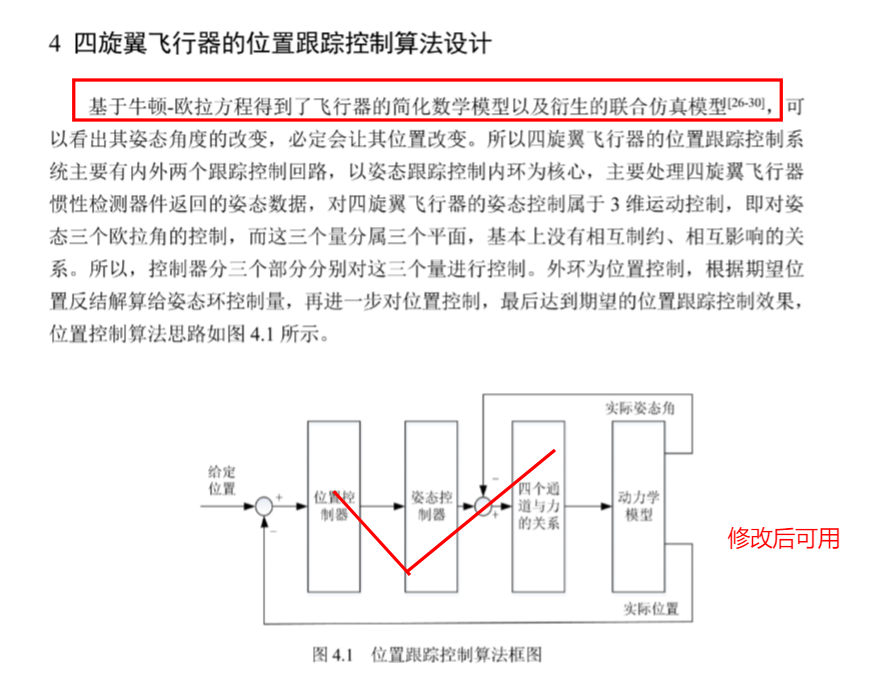

### 划了一下感觉重要的点，有针对的搜一下资料
[2024年第九届数维杯大学生数学建模挑战赛A题.pdf](https://www.yuque.com/attachments/yuque/0/2024/pdf/40770342/1715313222522-a181f26d-667f-4d72-9aa5-eda9c3f5cb96.pdf?_lake_card=%7B%22src%22%3A%22https%3A%2F%2Fwww.yuque.com%2Fattachments%2Fyuque%2F0%2F2024%2Fpdf%2F40770342%2F1715313222522-a181f26d-667f-4d72-9aa5-eda9c3f5cb96.pdf%22%2C%22name%22%3A%222024%E5%B9%B4%E7%AC%AC%E4%B9%9D%E5%B1%8A%E6%95%B0%E7%BB%B4%E6%9D%AF%E5%A4%A7%E5%AD%A6%E7%94%9F%E6%95%B0%E5%AD%A6%E5%BB%BA%E6%A8%A1%E6%8C%91%E6%88%98%E8%B5%9BA%E9%A2%98.pdf%22%2C%22size%22%3A1146411%2C%22ext%22%3A%22pdf%22%2C%22source%22%3A%22%22%2C%22status%22%3A%22done%22%2C%22download%22%3Atrue%2C%22taskId%22%3A%22u7849f468-ee34-49e5-8247-cd7da148617%22%2C%22taskType%22%3A%22upload%22%2C%22type%22%3A%22application%2Fpdf%22%2C%22__spacing%22%3A%22both%22%2C%22mode%22%3A%22title%22%2C%22id%22%3A%22u53a28bc6%22%2C%22margin%22%3A%7B%22top%22%3Atrue%2C%22bottom%22%3Atrue%7D%2C%22card%22%3A%22file%22%7D)
[2024年第九届数维杯大学生数学建模挑战赛A题.pdf](https://www.yuque.com/attachments/yuque/0/2024/pdf/40770342/1715313231381-16155ede-eaa2-441f-9a87-ffb2bcad317f.pdf)
### 知网相关资料

- 筛一下具体的流程，或者公式，思路等等，随便找了几个，可以继续找，
- 飞行器动力学的一些论文，可以用到计算飞行器自身的三维空间位置上

[四旋翼飞行器位置跟踪控制系统的研究_翟栋.pdf](https://www.yuque.com/attachments/yuque/0/2024/pdf/40770342/1715311170556-c2274f5a-254c-4706-8777-9d992044f102.pdf?_lake_card=%7B%22src%22%3A%22https%3A%2F%2Fwww.yuque.com%2Fattachments%2Fyuque%2F0%2F2024%2Fpdf%2F40770342%2F1715311170556-c2274f5a-254c-4706-8777-9d992044f102.pdf%22%2C%22name%22%3A%22%E5%9B%9B%E6%97%8B%E7%BF%BC%E9%A3%9E%E8%A1%8C%E5%99%A8%E4%BD%8D%E7%BD%AE%E8%B7%9F%E8%B8%AA%E6%8E%A7%E5%88%B6%E7%B3%BB%E7%BB%9F%E7%9A%84%E7%A0%94%E7%A9%B6_%E7%BF%9F%E6%A0%8B.pdf%22%2C%22size%22%3A7513880%2C%22ext%22%3A%22pdf%22%2C%22source%22%3A%22%22%2C%22status%22%3A%22done%22%2C%22download%22%3Atrue%2C%22taskId%22%3A%22ub832689d-8abc-4bd8-be2e-81ef2d01a87%22%2C%22taskType%22%3A%22upload%22%2C%22type%22%3A%22application%2Fpdf%22%2C%22__spacing%22%3A%22both%22%2C%22mode%22%3A%22title%22%2C%22id%22%3A%22u920dee1f%22%2C%22margin%22%3A%7B%22top%22%3Atrue%2C%22bottom%22%3Atrue%7D%2C%22card%22%3A%22file%22%7D)[高超声速飞行器的定位与轨迹预测_程甘志.pdf](https://www.yuque.com/attachments/yuque/0/2024/pdf/40770342/1715311165425-011ff6eb-7bc8-4b1f-a095-daab8b9121cb.pdf?_lake_card=%7B%22src%22%3A%22https%3A%2F%2Fwww.yuque.com%2Fattachments%2Fyuque%2F0%2F2024%2Fpdf%2F40770342%2F1715311165425-011ff6eb-7bc8-4b1f-a095-daab8b9121cb.pdf%22%2C%22name%22%3A%22%E9%AB%98%E8%B6%85%E5%A3%B0%E9%80%9F%E9%A3%9E%E8%A1%8C%E5%99%A8%E7%9A%84%E5%AE%9A%E4%BD%8D%E4%B8%8E%E8%BD%A8%E8%BF%B9%E9%A2%84%E6%B5%8B_%E7%A8%8B%E7%94%98%E5%BF%97.pdf%22%2C%22size%22%3A3728878%2C%22ext%22%3A%22pdf%22%2C%22source%22%3A%22%22%2C%22status%22%3A%22done%22%2C%22download%22%3Atrue%2C%22taskId%22%3A%22u4cd8727f-494d-4570-8812-c9e3e5322d3%22%2C%22taskType%22%3A%22upload%22%2C%22type%22%3A%22application%2Fpdf%22%2C%22__spacing%22%3A%22both%22%2C%22mode%22%3A%22title%22%2C%22id%22%3A%22uba042dc9%22%2C%22margin%22%3A%7B%22top%22%3Atrue%2C%22bottom%22%3Atrue%7D%2C%22card%22%3A%22file%22%7D)[一种小型四轴飞行器目标跟踪控制算法_顾兆军.pdf](https://www.yuque.com/attachments/yuque/0/2024/pdf/40770342/1715311168032-797ba223-c7de-4228-945c-75887662c4a1.pdf?_lake_card=%7B%22src%22%3A%22https%3A%2F%2Fwww.yuque.com%2Fattachments%2Fyuque%2F0%2F2024%2Fpdf%2F40770342%2F1715311168032-797ba223-c7de-4228-945c-75887662c4a1.pdf%22%2C%22name%22%3A%22%E4%B8%80%E7%A7%8D%E5%B0%8F%E5%9E%8B%E5%9B%9B%E8%BD%B4%E9%A3%9E%E8%A1%8C%E5%99%A8%E7%9B%AE%E6%A0%87%E8%B7%9F%E8%B8%AA%E6%8E%A7%E5%88%B6%E7%AE%97%E6%B3%95_%E9%A1%BE%E5%85%86%E5%86%9B.pdf%22%2C%22size%22%3A4716884%2C%22ext%22%3A%22pdf%22%2C%22source%22%3A%22%22%2C%22status%22%3A%22done%22%2C%22download%22%3Atrue%2C%22taskId%22%3A%22u26e7fd17-851c-41fb-ac27-aada3dd7a0e%22%2C%22taskType%22%3A%22upload%22%2C%22type%22%3A%22application%2Fpdf%22%2C%22__spacing%22%3A%22both%22%2C%22mode%22%3A%22title%22%2C%22id%22%3A%22u75e6ae76%22%2C%22margin%22%3A%7B%22top%22%3Atrue%2C%22bottom%22%3Atrue%7D%2C%22card%22%3A%22file%22%7D)   （这篇没啥用）[基于谱方法的四旋翼飞行器轨迹优化与跟踪控制研究_胡清泉.pdf](https://www.yuque.com/attachments/yuque/0/2024/pdf/40770342/1715311167489-16be3e6c-7479-4147-8e0b-d81db43416bd.pdf?_lake_card=%7B%22src%22%3A%22https%3A%2F%2Fwww.yuque.com%2Fattachments%2Fyuque%2F0%2F2024%2Fpdf%2F40770342%2F1715311167489-16be3e6c-7479-4147-8e0b-d81db43416bd.pdf%22%2C%22name%22%3A%22%E5%9F%BA%E4%BA%8E%E8%B0%B1%E6%96%B9%E6%B3%95%E7%9A%84%E5%9B%9B%E6%97%8B%E7%BF%BC%E9%A3%9E%E8%A1%8C%E5%99%A8%E8%BD%A8%E8%BF%B9%E4%BC%98%E5%8C%96%E4%B8%8E%E8%B7%9F%E8%B8%AA%E6%8E%A7%E5%88%B6%E7%A0%94%E7%A9%B6_%E8%83%A1%E6%B8%85%E6%B3%89.pdf%22%2C%22size%22%3A4816448%2C%22ext%22%3A%22pdf%22%2C%22source%22%3A%22%22%2C%22status%22%3A%22done%22%2C%22download%22%3Atrue%2C%22taskId%22%3A%22u5c5de86c-25b3-454d-b59d-3a0dc7ab639%22%2C%22taskType%22%3A%22upload%22%2C%22type%22%3A%22application%2Fpdf%22%2C%22__spacing%22%3A%22both%22%2C%22mode%22%3A%22title%22%2C%22id%22%3A%22ude01e4b2%22%2C%22margin%22%3A%7B%22top%22%3Atrue%2C%22bottom%22%3Atrue%7D%2C%22card%22%3A%22file%22%7D)

- 机会信号定位与导航（重点）

[多源机会信号飞行器EKF融合导航方法_刘俊妧.pdf](https://www.yuque.com/attachments/yuque/0/2024/pdf/40770342/1715312602095-285a1112-a44e-4d9c-8024-49712117a0b1.pdf?_lake_card=%7B%22src%22%3A%22https%3A%2F%2Fwww.yuque.com%2Fattachments%2Fyuque%2F0%2F2024%2Fpdf%2F40770342%2F1715312602095-285a1112-a44e-4d9c-8024-49712117a0b1.pdf%22%2C%22name%22%3A%22%E5%A4%9A%E6%BA%90%E6%9C%BA%E4%BC%9A%E4%BF%A1%E5%8F%B7%E9%A3%9E%E8%A1%8C%E5%99%A8EKF%E8%9E%8D%E5%90%88%E5%AF%BC%E8%88%AA%E6%96%B9%E6%B3%95_%E5%88%98%E4%BF%8A%E5%A6%A7.pdf%22%2C%22size%22%3A1109289%2C%22ext%22%3A%22pdf%22%2C%22source%22%3A%22%22%2C%22status%22%3A%22done%22%2C%22download%22%3Atrue%2C%22taskId%22%3A%22u6ef93ed8-ba3e-4f49-be23-439b42f776c%22%2C%22taskType%22%3A%22upload%22%2C%22type%22%3A%22application%2Fpdf%22%2C%22__spacing%22%3A%22both%22%2C%22mode%22%3A%22title%22%2C%22id%22%3A%22ua97b81d5%22%2C%22margin%22%3A%7B%22top%22%3Atrue%2C%22bottom%22%3Atrue%7D%2C%22card%22%3A%22file%22%7D)
[基于机会信号的自主导航定位技术_李达.pdf](https://www.yuque.com/attachments/yuque/0/2024/pdf/40770342/1715312949524-f671b95f-e6e0-4640-bf0a-e3df962eeade.pdf?_lake_card=%7B%22src%22%3A%22https%3A%2F%2Fwww.yuque.com%2Fattachments%2Fyuque%2F0%2F2024%2Fpdf%2F40770342%2F1715312949524-f671b95f-e6e0-4640-bf0a-e3df962eeade.pdf%22%2C%22name%22%3A%22%E5%9F%BA%E4%BA%8E%E6%9C%BA%E4%BC%9A%E4%BF%A1%E5%8F%B7%E7%9A%84%E8%87%AA%E4%B8%BB%E5%AF%BC%E8%88%AA%E5%AE%9A%E4%BD%8D%E6%8A%80%E6%9C%AF_%E6%9D%8E%E8%BE%BE.pdf%22%2C%22size%22%3A1942731%2C%22ext%22%3A%22pdf%22%2C%22source%22%3A%22%22%2C%22status%22%3A%22done%22%2C%22download%22%3Atrue%2C%22taskId%22%3A%22ubfed8589-34d5-420c-8036-b8c76cfece1%22%2C%22taskType%22%3A%22upload%22%2C%22type%22%3A%22application%2Fpdf%22%2C%22__spacing%22%3A%22both%22%2C%22mode%22%3A%22title%22%2C%22id%22%3A%22u24388eef%22%2C%22margin%22%3A%7B%22top%22%3Atrue%2C%22bottom%22%3Atrue%7D%2C%22card%22%3A%22file%22%7D)

[多源机会信号飞行器EKF融合导航方法_刘俊妧.pdf](https://www.yuque.com/attachments/yuque/0/2024/pdf/40770342/1715312588051-b8dfe6fe-177a-4501-bf80-16fdc58f3495.pdf)

[四旋翼飞行器位置跟踪控制系统的研究_翟栋.pdf](https://www.yuque.com/attachments/yuque/0/2024/pdf/40770342/1715311252984-36655e30-ec7e-4033-9c31-7f7513687d47.pdf)

[高超声速飞行器的定位与轨迹预测_程甘志.pdf](https://www.yuque.com/attachments/yuque/0/2024/pdf/40770342/1715311248453-9b4d4401-4bf2-43cd-85ea-47eca2cd1860.pdf)

[基于谱方法的四旋翼飞行器轨迹优化与跟踪控制研究_胡清泉.pdf](https://www.yuque.com/attachments/yuque/0/2024/pdf/40770342/1715311251123-e137bb46-691e-4c34-9d77-d82547d3ee36.pdf)

### 其他资料，B站，知乎等等

- 借鉴一下大概思路，不能雷同，仅借鉴

1. 

2. 

3. 

### 资料总结

- 需要用到的内容

翟栋

