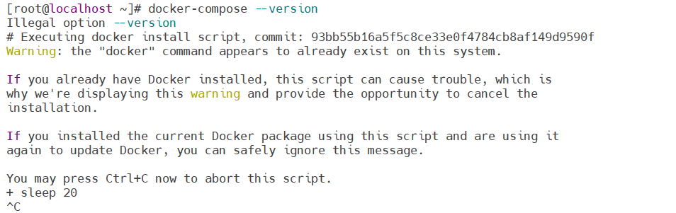

## Centos7下[安装docker](https://so.csdn.net/so/search?q=%E5%AE%89%E8%A3%85docker&spm=1001.2101.3001.7020) compose
安装docker composse必须先安装完docker，如果没有安装docker可以参照我
http://t.csdn.cn/GbupB
**官方文档安装：**
curl -SL https://github.com/docker/compose/releases/download/v2.17.2/[docker-compose](https://so.csdn.net/so/search?q=docker-compose&spm=1001.2101.3001.7020)-linux-x86_64 -o /usr/local/bin/docker-compose
国外源下载速度很慢
**更换为国内源安装：**
curl -SL https://get.daocloud.io/docker/compose/releases/download/v2.17.2/docker-compose-linux-x86_64 -o /usr/local/bin/docker-compose
```
[root@localhost ~]# curl -SL https://get.daocloud.io/docker/compose/releases/download/v2.17.2/docker-compose-linux-x86_64 -o /usr/local/bin/docker-compose
  % Total    % Received % Xferd  Average Speed   Time    Time     Time  Current
                                 Dload  Upload   Total   Spent    Left  Speed
100   145  100   145    0     0    218      0 --:--:-- --:--:-- --:--:--   218
100 18997  100 18997    0     0  11963      0  0:00:01  0:00:01 --:--:-- 47492
```
赋权
> chmod +x /usr/local/bin/docker-compose

**查看版本**
这里有个坑，好像是从2023年1月起，官方取消了`docker-compose --version` 这条查看版本的命令还是其他原因，安装完用这条命令查看版本会报这个

官方文档通知：

按照官方文档，现在查看查看版本的命令是
> docker compose version

```
[root@localhost ~]# docker compose version
Docker Compose version v2.16.0

# 这样就不会提示些奇奇怪怪的了
```


> 来自: [Centos7下安装docker compose（零基础无脑直接安装，一看就会）_centos7 安装docker-compose-CSDN博客](https://blog.csdn.net/huz1Vn/article/details/129882493)

