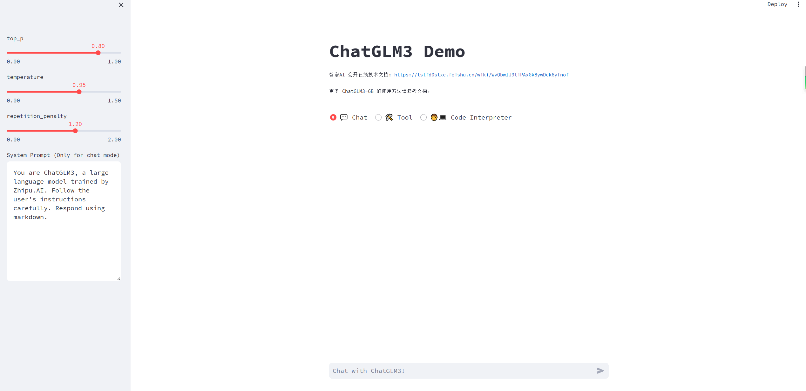
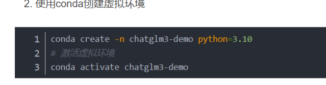
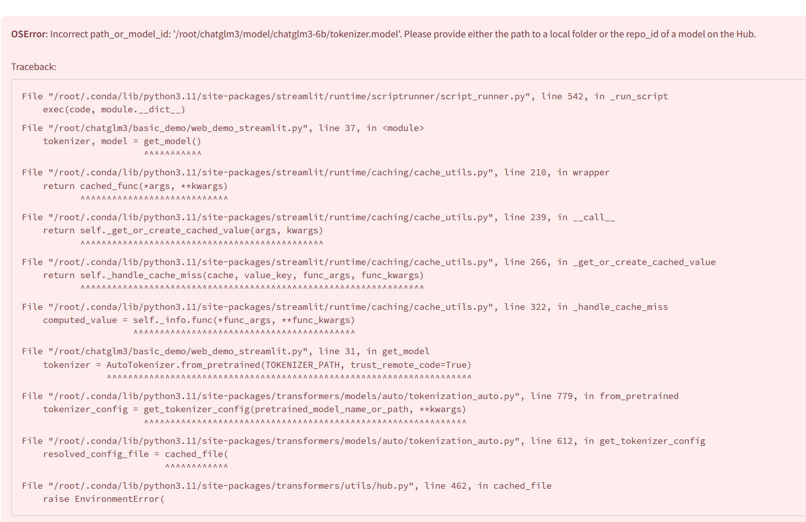

ChatGLM3-6b部署、量化以及遇到的问题解决方案

- [一、准备工作](https://blog.csdn.net/qq_40231723/article/details/134622935#_3)
   - [1. 模型下载](https://blog.csdn.net/qq_40231723/article/details/134622935#1__4)
   - [2. 初始化项目仓库](https://blog.csdn.net/qq_40231723/article/details/134622935#2__13)
- [二、运行demo](https://blog.csdn.net/qq_40231723/article/details/134622935#demo_42)
- [三、模型量化](https://blog.csdn.net/qq_40231723/article/details/134622935#_56)
> 这里主要介绍我在安装ChatGLM3-6b时的步骤以及遇到的问题如何解决，以作记录，项目地址：[https://github.com/THUDM/ChatGLM3](https://github.com/THUDM/ChatGLM3)

## 一、准备工作
### 1. 模型下载
这里我放在指定[文件夹](https://so.csdn.net/so/search?q=%E6%96%87%E4%BB%B6%E5%A4%B9&spm=1001.2101.3001.7020)下，后续通过环境变量暴露，也可直接下载到项目中的models文件夹中
```
# 这里换成你的模型目录
cd /home/models
# 执行后须等待一段时间，可打开任务管理器观察网络使用情况判断下载情况
git clone https://www.modelscope.cn/ZhipuAI/chatglm2-6b.git
```
### 2. 初始化项目仓库

1. 克隆仓库
```
git clone https://github.com/THUDM/ChatGLM3.git
```

1. 使用conda创建虚拟环境
```
conda create -n chatglm3-demo python=3.10
# 激活虚拟环境
conda activate chatglm3-demo
```

1. 下载所有的依赖
```
pip install -r requirements.txt
```

1. 使用code interpreter安装jupyter内核
```
# 如果没有安装jupyter，请安装
pip install jupyter
# name为项目demo中指定的，使用demo的话默认内核名称为chatglm3-6b-demo
ipython kernel install --name chatglm3-demo --user
# 可以自定义内核
# export IPYKERNEL=<kernel_name>
```
## 二、运行demo
这里我只运行了`composite_demo/main.py`这个例子
```
conda activate chatglm3-demo
# 这里由于我的模型不在默认文件夹中，需要配置MODEL_PATH
export MODEL_PATH=/home/models/chatglm3-6b
# 这里是项目根目录
cd /home/ChatGLM3
streamlit run composite_demo/main.py
```
运行后访问[http://localhost:8501](http://localhost:8501/)效果如图所示：

## 三、模型量化
> 如果量化失败报错，可以查看第四部分内容

只需要找到加载模型的代码调整一下，下面以`composite_demo`为例。
它的模型加载放在`client.py`中，代码如下：
```
class HFClient(Client):
    def __init__(self, model_path: str, tokenizer_path: str, pt_checkpoint: str | None = None, DEVICE = 'cpu'):
        self.model_path = model_path
        self.tokenizer = AutoTokenizer.from_pretrained(tokenizer_path, trust_remote_code=True)

        if pt_checkpoint is not None:
            config = AutoConfig.from_pretrained(model_path, trust_remote_code=True, pre_seq_len=128)
            self.model = AutoModel.from_pretrained(model_path, trust_remote_code=True, config=config)
            prefix_state_dict = torch.load(os.path.join(pt_checkpoint, "pytorch_model.bin"))
            new_prefix_state_dict = {}
            for k, v in prefix_state_dict.items():
                if k.startswith("transformer.prefix_encoder."):
                    new_prefix_state_dict[k[len("transformer.prefix_encoder."):]] = v
            print("Loaded from pt checkpoints", new_prefix_state_dict.keys())
            self.model.transformer.prefix_encoder.load_state_dict(new_prefix_state_dict)
        else:
            self.model = AutoModel.from_pretrained(model_path, trust_remote_code=True)

        self.model = self.model.to(DEVICE).eval() if 'cuda' in DEVICE else self.model.float().to(DEVICE).eval()
```
我们只需要最后一行修改一下即可
```
# 原来的代码
self.model = self.model.to(DEVICE).eval() if 'cuda' in DEVICE else 
# 修改后的代码
self.model = self.model.quantize(4).cuda().to(DEVICE).eval() if 'cuda' in DEVICE else self.model.float().to(DEVICE).eval()
```
根据实际使用情况来看，不量化默认FP16精度大约需要13GB显存，INT8大约需要8GB显存，INT4大约需要5GB显存。
## 


### 2. RuntimeError: Library cudart is not initialized
参考[https://github.com/THUDM/ChatGLM-6B/issues/115](https://github.com/THUDM/ChatGLM-6B/issues/115),可能是由于我们的虚拟环境中缺少cudatoolkit。
确定虚拟环境中cuda运行时版本：
```
conda list | grep cuda
```
如果11.8以下，可以尝试：
```
# 如果cuda版本11.7，否则改为对应版本
conda install cudatoolkit=11.7 -c nvidia
```
如果12.1以上版本，可以尝试：
```
# 具体对应版本可以在https://anaconda.org/nvidia/cuda-toolkit查看
conda install -c "nvidia/label/cuda-12.1.1" cuda-toolkit
```
### 3. ModuleNotFoundError: No module named ‘chardet’
缺少chardet依赖包，下载即可
```
pip install chardet
```
----------------------------------------------------------------------------------------------------------------------

> 来自: [ChatGLM3-6b部署、量化以及遇到的问题解决方案-CSDN博客](https://blog.csdn.net/qq_40231723/article/details/134622935)


##### 

# 以上是csdn的问题，下面是我遇到的问题
:::info
注意了，要学一下aconda创建虚拟环境



1.

:::
```shell
 #先从GitHub下载chatglm3的仓库，在下载模型，注意，是两步，是两步

 #下载仓库，得到ChatGLM3文件夹
 git clone https://github.com/THUDM/ChatGLM3.git

 #进入ChatGLM3文件夹，下载模型（魔搭社区）得到chatglm3-6b文件夹
 
 git lfs install
 git clone https://www.modelscope.cn/ZhipuAI/chatglm3-6b.git


#第三步，改路径
进入
```
:::info

**OSError**: Incorrect path_or_model_id: '/root/chatglm3/model/chatglm3-6b/tokenizer.model'. Please provide either the path to a local folder or the repo_id of a model on the Hub.




:::

