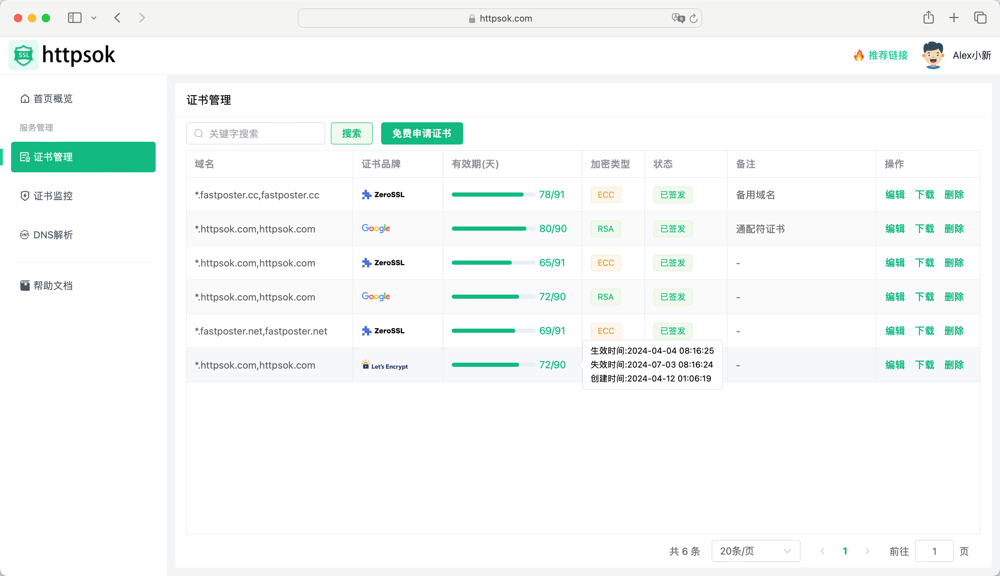

## 介绍

**     ChatGLM3-Nofire消防规范问答模型**是我们基于清华大学KEG实验室与智谱AI发布的ChatGLM3系列的**ChatGLM3-6B**模型经过对**消防领域多个专业规范PDF**进行知识抽取构建的**QA问答数据集**多次**Lora微调**得到的**可靠、专业、智能**的问答模型，后续我们会逐步对模型进行优化，敬请期待！

:::tip
Let's Go
[快速开始](https://supreme-chainsaw-ww5g75g4wvwf5jv5-5173.app.github.dev/api-examples.html)
:::


---

## 特性

- **⚡️ 专业可靠**   数据收集与制作由LLM自动化处理+打分机制筛选+人工复查
- **✅ 量化版本   **避免模型过大占用显存，采用4-bit量化处理，模型更加轻量化
- **✅ 多平台部署** 兼容主流Linux系统 `Debain` `CentOS` `Ubuntu`  后续会增加 `docker容器`环境部署
- **✅ 模型开源**  代码已托管至modelscope社区，支持下载模型进行二开
- **✅ 搭配知识图谱** 以构建出消防领域专业规范实体关系知识图谱，数据量丰富

## 模型对比
### 现有AI通用大模型
2023-2024年期间，AI通用大模型种类繁多，姿态各异，不乏能力出众的GPT-4,LLaMA3,Claude等等，在面对市场实际的通用场景下，AI大模型能能展现出非常出色的问答变现；在面对特定领域时，AI大模型知识储备较为匮乏，表现较差；针对上述问题，我们收集消防专业领域多类技术规范进行QA数据集制作，使用现有的Lora微调技术对Ai通用模型进行参数冻结训练，将训练结果合并至原始模型得到针对消防专业领域技术规范较好问答表现的现有模型。
案例：
语言模型：如GPT、BERT等，主要应用于自然语言处理领域，如机器翻译、文本生成、情感分析等。 
图像模型：如ResNet、Inception等，主要应用于计算机视觉领域，如图像分类、目标检测、图像分割等。 
推荐模型：如DNN、RNN等，主要应用于推荐系统领域，如商品推荐、广告推荐等。 
聊天机器人：如Seq2Seq、Transformer等，主要应用于智能客服、智能助手等场景。 
金融风控：如XGBoost、LightGBM等，主要应用于银行、证券等金融机构的风控场景，如信用评分、反欺诈等。 
医疗影像诊断：如DeepLung、DeepLesion等，主要应用于医疗影像诊断领域，如肺癌诊断、病理学分析等。 
在发布会上，华为表示，华为盘古大模型主要以AI赋能产业，运用在电力、金融、农业等多个行业，其中CV大模型落地矿山，NLP大模型落地智能文档检索。 

## 使用场景

- 在人工智能蓬勃发展的今天，传统非结构化文本形式的规范已难以满足合规审查、关联分析等法规智能应用场景。
- 海量复杂的规范体系为建筑设计、建造及管理人员带来了极大的挑战，如何高效的检索、查询和利用消防规范中蕴含的知识和经验已成为当前亟待解决的难题之一。
- 目前，有关规范仍以传统 PDF 文档、网页等形式存储和管理，检索和利用效率低，已成为消防乃至建筑领域的智能化水平和转型升级的瓶颈。

## 快速开始

只需二步，轻松搞定SSL证书自动续签。

### 一、安装httpsok

登陆控制台 👉 👉 👉 [**获取token**](https://httpsok.com/?p=4c9n)

```bash
curl -s https://get.httpsok.com | bash -s 'your token'
```

安装成功后，脚本会自动检测一次系统中的`nginx`证书，并同步到控制台。

### 二、DNS解析配置

**根据脚本运行的实际情况**，添对应的的DNS解析记录。[DNS解析配置参考](https://httpsok.com/doc/guide/dns.html)


### 三、完成

没错，已经结束，SSL证书自动续签就这么简单。快登录 [**控制台**](https://httpsok.com/?p=4c9n) 查看自己的证书吧。



## 问题反馈

欢迎大家添加作者微信，共同交流一些技术、想法。

作者微信 请备注 `httpsok`


