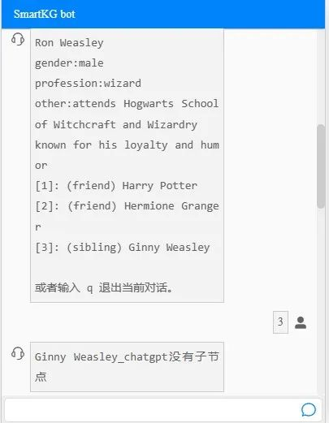

本期微软ATP特邀微软首席算法工程师Julia老师带大家见证魔法的诞生：看看爆火的ChatGPT如何好玩又有趣，与微软开源工具SmartKG一同生成《哈利波特》的人物及其关系的可视化图谱！（文末含详解视频哟）

ChatGPT 能聊天，能用它生成知识图谱吗？当然可以了，今天就带大家来利用ChatGPT生成一款哈利波特知识图谱。
当然，ChatGPT的功能在于抽取《哈利波特》中的实体和关系，要存储、搜索、可视化图谱，我们还需要一款知识图谱引擎，此处选用开源的 SmartKG——
SmartKG是微软开源的一款产品，作为轻量级知识图谱可视化+[智能对话](https://cloud.tencent.com/product/tbp?from_column=20065&from=20065)框架，它能够根据用户输入的实体和关系数据自动生成知识图谱，并提供图谱可视化及基于图谱的[智能对话机器人](https://cloud.tencent.com/product/icr?from_column=20065&from=20065)。 
SmartKG官方下载地址>>
https://github.com/microsoft/SmartKG
如下附Julia老师的介绍SmartKG&知识图谱的B站视频链接，速戳>> 
https://www.bilibili.com/video/BV1wN411X7Gw/?spm_id_from=333.337.search-card.all.click&vd_source=e1101e74d0123dc5ba17bf523052c5a5
▍**用ChatGPT抽取知识图谱的实体和关系**
工具选好用SmartKG之后，首先要做的是将《哈利波特》中的人物转化成实体（图节点），这一步由ChatGPT承担。
我们设计这样一个问题来提示ChatGPT：
“我需要一个list，这个list里面都是Harry Potter里面的角色”，然后输入两个例子：
一是Harry，如下列出他的信息：
“Harry是男的，巫师，在霍格沃茨，被大众熟知为是大难不死的男孩”。
二是赫敏，也是巫师,也是在霍格沃茨上学,由于她特别的聪明,所以她被人们所知道。
按照如上描述，输入给ChatGPT,它就给出了下图的回复。

大家看输出的 “Harry Potter”，中间都已经用逗号隔开，这样的一个文本就基本上已经是格式化文本了。
有了节点介绍之后，就需要的是「关系」，很简单就是三元组。
接下来，需要继续地给ChatGPT描述上面这些角色之间的关系，同样我要给它一个格式，按照输入的格式，ChatGPT输出的结果如下图所示

通过重复要求ChatGPT输出，之后把所有的这些内容都copy至一个文本文件，存成了nodes.csv。
哈利波特里面分正邪双方，通过ChatGPT可以输出谁是善良的一方，谁是邪恶的一方。

大家可以将这些都存在一个文档里，其实并不需要它很格式化。因为只是需要得到每一个名字生成节点的时候会需要用，以及介绍他们都是什么人，之后就可以反复地生成一系列人物的关系。
**▍用ChatGPT写Python脚本进行数据处理**
现在我们需要把实体和关系存储为SmartKG的模板定义的格式。这里就需要一个脚本来处理刚才存储的CSV文件。
我们当然可以自己写脚本，不过有ChatGPT ，为什么不让它直接生成代码呢？

如上图所示，我们要求ChatGPT生成 python code，去读CSV文件，一行行读，然后忽略空行，每一行用逗号把它们separate出来，然后把第一个element放到一个set里面去。
之后再要求：如果当前的这一行的第一个element，它已经在这个set里了，那就不处理它。
反过来如果它还不在这个set里，就要进一步去把它整个这一行里面的所有的内容都转到一个 excel 文档里面去。
经过后期稍微的修改和调试，再按照 SmartKG 的模板，首先将它分为 vertexes 和 edges两个sheets。大家可以用名字本身来作为实体ID，属性设置有gender和profession等。
**▍用SmartKG对知识图谱进行存储和运算**
之后用 SmartKG新建一个数据仓库就叫 HarryPotter，然后上载数据。之后进入知识图谱页，选择数据仓库和场景，先进行图谱可视化。

根据上图大家可以看到，我们总共生成了28个人物和20对关系。分了两个颜色，蓝色代表伏地魔，这显然就是邪恶的一方；绿色的整体上是善良的，或者至少是不邪恶的。
此处图谱完全是通过 ChatGPT直接生成的，没有加任何其他的额外的人工干预的结果。
**▍基于知识图谱进行智能对话**
接下来，便可以测试一下基于 SmartKG的对话。如下图所示： 

左右滑动查看“测试对话”
通过 ChatGPT直接生成的「节点」还有「边」，然后再通过 ChatGPT 生成 code，对案例中存下来的数据进行处理，再用 SmartKG就可以生成这样的一个知识图谱。
基于这个知识图谱还可以进行对话，真的是非常神奇的一段体验！
**心动不如行动！大家也赶紧动手试一试吧！**
本文参与 [腾讯云自媒体分享计划](https://cloud.tencent.com/developer/support-plan)，分享自微信公众号。
原始发表：2023-02-14，如有侵权请联系 [cloudcommunity@tencent.com](mailto:cloudcommunity@tencent.com) 删除

> 来自: [ChatGPT+SmartKG 3分钟生成「哈利波特」知识图谱-腾讯云开发者社区-腾讯云](https://cloud.tencent.com/developer/article/2243382)

