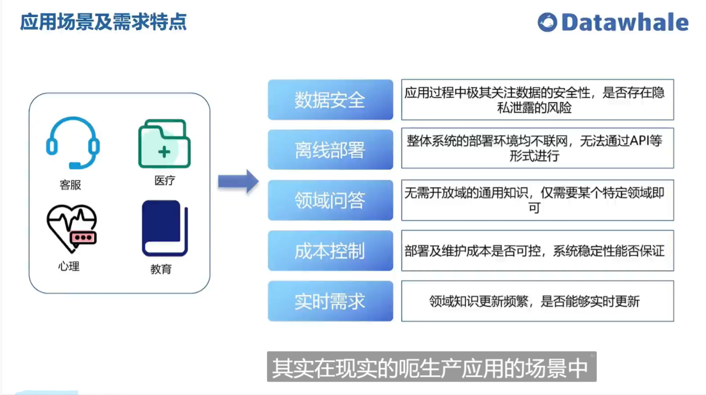

吴恩达的llm课程，官网：

[Attention Required! | Cloudflare](https://learn.deeplearning.ai/)

# DeepLearning.AI Short Courses
## Course Available
[JavaScript RAG Web Apps with LlamaIndexNew](https://learn.deeplearning.ai/courses/javascript-rag-web-apps-with-llamaindex/lesson/1/introduction)
[ChatGPT Prompt Engineering for Developers](https://learn.deeplearning.ai/courses/chatgpt-prompt-eng/lesson/1/introduction)
[LangChain for LLM Application Development](https://learn.deeplearning.ai/courses/langchain/lesson/1/introduction)
[How Diffusion Models Work](https://learn.deeplearning.ai/courses/diffusion-models/lesson/1/introduction)
[Building Systems with the ChatGPT API](https://learn.deeplearning.ai/courses/chatgpt-building-system/lesson/1/introduction)
[LangChain Chat with Your Data](https://learn.deeplearning.ai/courses/langchain-chat-with-your-data/lesson/1/introduction)
[Building Generative AI Applications with Gradio](https://learn.deeplearning.ai/courses/huggingface-gradio/lesson/1/introduction)
[Evaluating and Debugging Generative AI](https://learn.deeplearning.ai/courses/evaluating-debugging-generative-ai/lesson/1/introduction)
[Large Language Models with Semantic Search](https://learn.deeplearning.ai/courses/large-language-models-semantic-search/lesson/1/introduction)
[Finetuning Large Language Models](https://learn.deeplearning.ai/courses/finetuning-large-language-models/lesson/1/introduction)
[How Business Thinkers Can Start Building AI Plugins With Semantic Kernel](https://learn.deeplearning.ai/courses/microsoft-semantic-kernel/lesson/1/introduction)
[Understanding and Applying Text Embeddings](https://learn.deeplearning.ai/courses/google-cloud-vertex-ai/lesson/1/introduction)
[Pair Programming with a Large Language Model](https://learn.deeplearning.ai/courses/pair-programming-llm/lesson/1/introduction)
[Functions, Tools and Agents with LangChain](https://learn.deeplearning.ai/courses/functions-tools-agents-langchain/lesson/1/introduction)
[Vector Databases: from Embeddings to Applications](https://learn.deeplearning.ai/courses/vector-databases-embeddings-applications/lesson/1/introduction)
[Quality and Safety for LLM Applications](https://learn.deeplearning.ai/courses/quality-safety-llm-applications/lesson/1/introduction)
[Building and Evaluating Advanced RAG](https://learn.deeplearning.ai/courses/building-evaluating-advanced-rag/lesson/1/introduction)
[Reinforcement Learning From Human Feedback](https://learn.deeplearning.ai/courses/reinforcement-learning-from-human-feedback/lesson/1/introduction)
[Advanced Retrieval for AI with Chroma](https://learn.deeplearning.ai/courses/advanced-retrieval-for-ai/lesson/1/introduction)
[Build LLM Apps with LangChain.js](https://learn.deeplearning.ai/courses/build-llm-apps-with-langchain-js/lesson/1/introduction)
[LLMOps](https://learn.deeplearning.ai/courses/llmops/lesson/1/introduction)
[Automated Testing for LLMOps](https://learn.deeplearning.ai/courses/automated-testing-llmops/lesson/1/introduction)
[Building Applications with Vector Databases](https://learn.deeplearning.ai/courses/building-applications-vector-databases/lesson/1/introduction)
[Serverless LLM Apps Amazon Bedrock](https://learn.deeplearning.ai/courses/serverless-LLM-apps-amazon-bedrock/lesson/1/introduction)
[Prompt Engineering with Llama 2](https://learn.deeplearning.ai/courses/prompt-engineering-with-llama-2/lesson/1/introduction)
[Open Source Models with Hugging Face](https://learn.deeplearning.ai/courses/open-source-models-hugging-face/lesson/1/introduction)
[Knowledge Graphs  for RAG](https://learn.deeplearning.ai/courses/knowledge-graphs-rag/lesson/1/introduction)
[Efficiently Serving LLMs](https://learn.deeplearning.ai/courses/efficiently-serving-llms/lesson/1/introduction)
[Click here to see all of our courses and specializations](https://www.deeplearning.ai/courses/)
# Please [sign in](https://learn.deeplearning.ai/login) to see your enrolled courses
`
`
