[English](https://github.com/HPUhushicheng/vitepress-pro/blob/main/README.en.md) | 中文
# 查尔斯的知识库
[](http://creativecommons.org/licenses/by-sa/4.0/)[](https://github.com/Charles7c/charles7c.github.io/blob/main/LICENSE)[](https://github.com/Charles7c/charles7c.github.io/actions/workflows/deploy-pages.yml)
📝 **查尔斯的个人技术知识库，记录 & 分享个人碎片化、结构化、体系化的技术知识内容。**
🐢 [GitHub Pages（完整体验）](https://blog.charles7c.top/) | 🐇 [Gitee Pages（无法评论）](https://charles7c.gitee.io/)
## 开始
```
# 1.克隆本仓库
git clone https://github.com/Charles7c/charles7c.github.io.git
# 2.安装 PNPM
npm install pnpm -g
# 3.设置淘宝镜像源
pnpm config set registry https://registry.npmmirror.com/
# 4.安装依赖
pnpm install
# 5.dev 运行，访问：http://localhost:5173
pnpm dev
# 6.打包，文件存放位置：docs/.vitepress/dist
# 如果是部署到 GitHub Pages，可以利用 GitHub Actions，在 push 到 GitHub 后自动部署打包
# 详情见：.github/workflows/deploy-pages.yml，根据个人需要删减工作流配置
pnpm build
# 7.部署
# 7.1 push 到 GitHub 仓库，部署到 GitHub Pages：需要在仓库设置中启用 GitHub Pages（本仓库采用此种部署方式）
# 7.2 在其他平台部署, 例如：Gitee Pages、Vercel、Netlify、个人虚拟主机、个人服务器等
```
## 已扩展功能（持续优化细节）

- 拆分配置文件：解决“大”配置文件问题，提取公有配置选项进行复用，方便维护
- GitHub Actions：push 到 GitHub，自动进行项目打包及 GitHub Pages 部署，并同步到 Gitee Pages（可根据个人需要自行删减同步 Gitee Pages 部分工作流配置）
- 自动生成侧边栏：将文章按规律性目录存放后，侧边栏将自动生成，支持文章置顶🔝（在文章 frontmatter 中配置 `isTop: true`，即可在侧边栏自动出现置顶分组）
- 主页美化：参照 vite 文档主页进行美化
- 自定义页脚：支持ICP备案号、公安备案号、版权信息配置（符合大陆网站审核要求）
- 文章元数据信息显示：文章标题下显示是否原创、作者、发布时间、所属分类、标签列表等信息，可全局配置作者及作者主页信息
   -  已扩展文章阅读数信息，默认已启用，可在 docs/.vitepress/config/theme.ts 中 articleMetadataConfig 配置中关闭（开启需要自行提供并配置好 API 服务，API 服务可参考：[Charles7c/charles7c-api](https://github.com/Charles7c/charles7c-api)，目前来看搞起来还有点麻烦，不喜欢折腾的可以直接关闭或更换其他方式提供 API 服务，欢迎提建议）
- 《我的标签》：模仿语雀标签页风格，另有标签云展示。语雀标签页地址：[https://www.yuque.com/r/语雀用户名/tags?tag=](https://www.yuque.com/r/%E8%AF%AD%E9%9B%80%E7%94%A8%E6%88%B7%E5%90%8D/tags?tag=)
- 《我的归档》：自定义时间轴，展示历史文章数据。年份前可展示生肖，还可按分类、标签筛选
- 文章评论：目前仅支持Gitalk
- 版权声明：文末显示原创或转载文章的版权声明，可自由配置采用的版权协议
- ~~徽章：标题后可显示徽章，此功能来自于 VitePress 未合并的 PR，如若后续被合并，则改用官方主题功能（~~[官方已合并于 v1.0.0-alpha.27](https://github.com/vuejs/vitepress/issues/1239)~~）~~
- ~~本地文档搜索支持：VitePress 官方目前仅提供了对接 algolia 的在线搜索配置，而且对接起来的流程也较为麻烦。所幸寻到一个本地文档搜索插件 ~~[emersonbottero/vitepress-plugin-search](https://github.com/emersonbottero/vitepress-plugin-search)~~。目前对接了 ~~[vitepress-plugin-pagefind](https://www.npmjs.com/package/vitepress-plugin-pagefind)~~ 本地搜索插件，中文搜索相对友好一些，如需体验，可将 ~~`~~docs/vite.config.ts~~`~~ 文件中的注释去除掉。目前 VitePress 官方有一个 PR 正在处理离线搜索功能，再过段时间应该就能合并了，到时候体验一下试试看。~~

~~注意：本地文档搜索和 algolia 搜索无法同时使用，开启本地文档搜索后 algolia 搜索配置将不再生效。~~

- Mermaid 流程图：在 Markdown 中绘制流程图、状态图、时序图、甘特图、饼图等，更多语法请参见：[Mermaid 官方文档](https://github.com/mermaid-js/mermaid/blob/develop/README.zh-CN.md) 。（Typora 编辑器也支持 `mermaid` 语法）
- Markdown 脚注、Markdown 公式支持
- 更多细节优化：敬请发现
   -  文章内图片增加圆角样式优化（[#56](https://github.com/Charles7c/charles7c.github.io/issues/56)）
   -  浏览器滚动条样式优化（支持 Firfox、谷歌系浏览器）（[#69](https://github.com/Charles7c/charles7c.github.io/pull/69)）
   -  侧边栏分组中的文章列表增加序号显示
   -  ......
## 部分页面截图
### 主页美化
[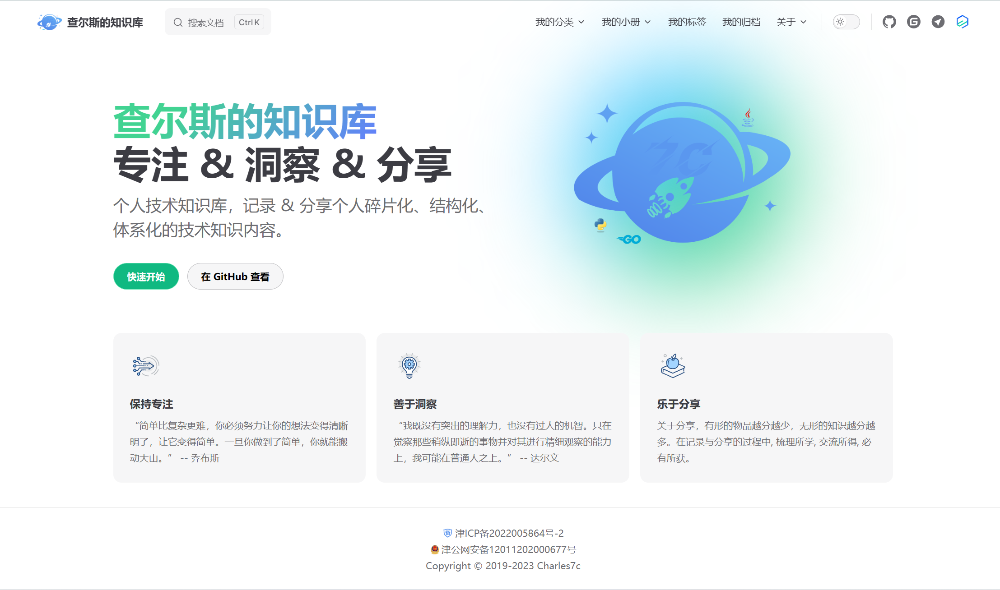](https://github.com/HPUhushicheng/vitepress-pro/blob/main/docs/public/screenshot/%E4%B8%BB%E9%A1%B5.png)
### 侧边栏置顶分组（自动生成侧边栏及置顶分组）
[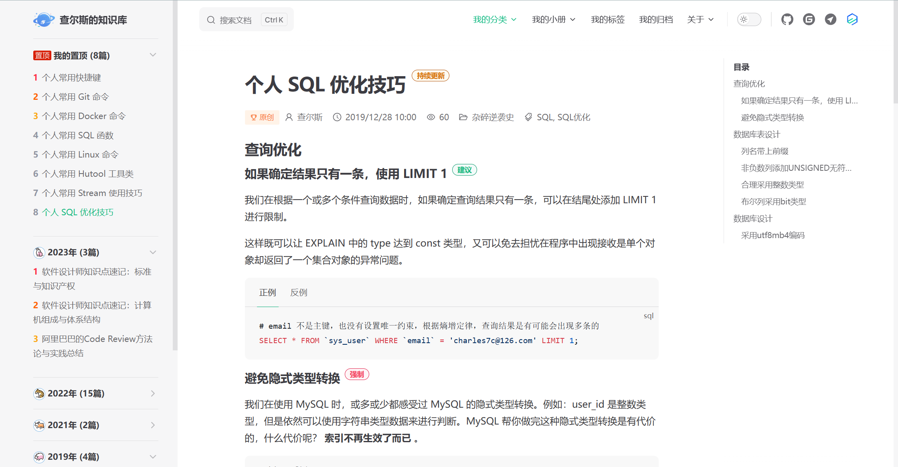](https://github.com/HPUhushicheng/vitepress-pro/blob/main/docs/public/screenshot/%E4%BE%A7%E8%BE%B9%E6%A0%8F%E7%BD%AE%E9%A1%B6%E5%88%86%E7%BB%84.png)
### 文章元数据信息
[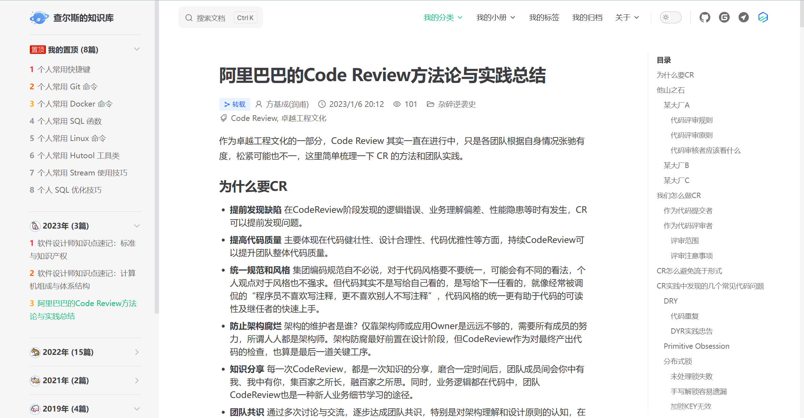](https://github.com/HPUhushicheng/vitepress-pro/blob/main/docs/public/screenshot/%E6%96%87%E7%AB%A0%E5%85%83%E6%95%B0%E6%8D%AE%E4%BF%A1%E6%81%AF.png)
### 我的标签
[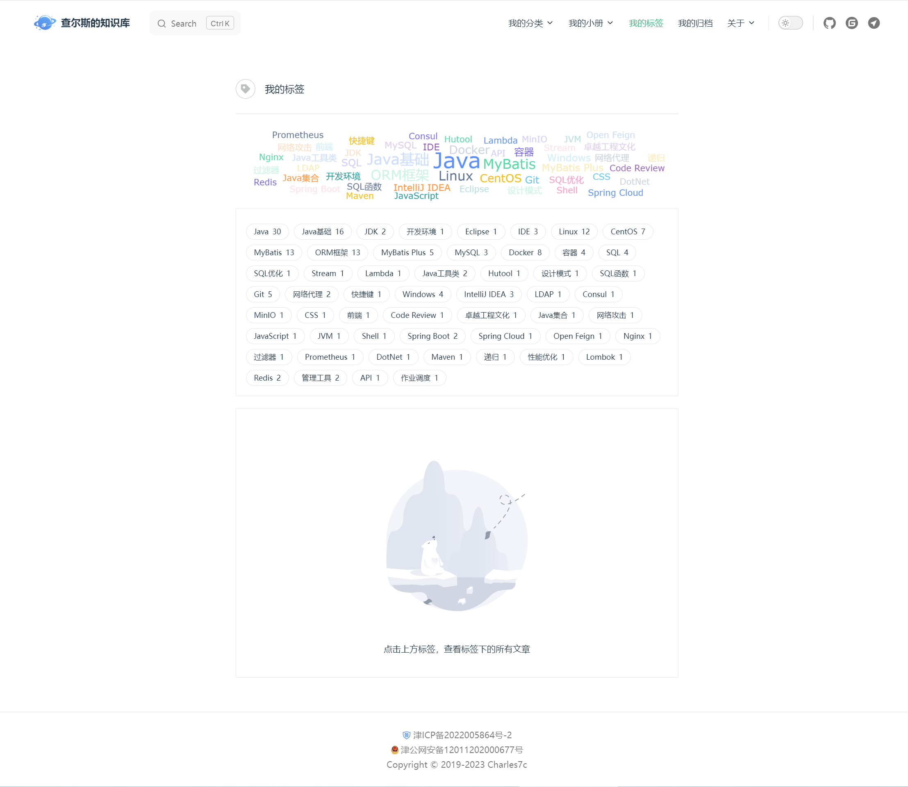](https://github.com/HPUhushicheng/vitepress-pro/blob/main/docs/public/screenshot/%E6%88%91%E7%9A%84%E6%A0%87%E7%AD%BE1.png)[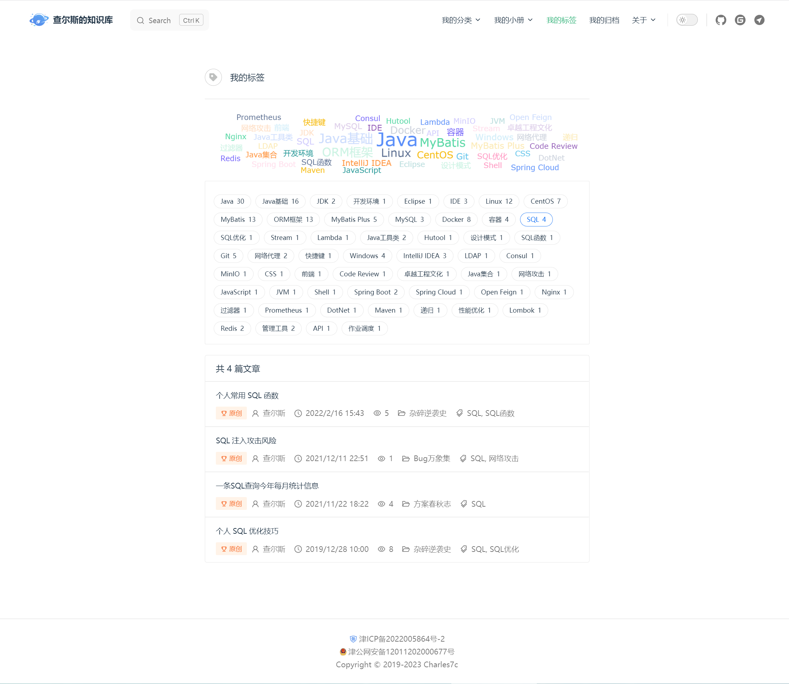](https://github.com/HPUhushicheng/vitepress-pro/blob/main/docs/public/screenshot/%E6%88%91%E7%9A%84%E6%A0%87%E7%AD%BE2.png)
### 我的归档
[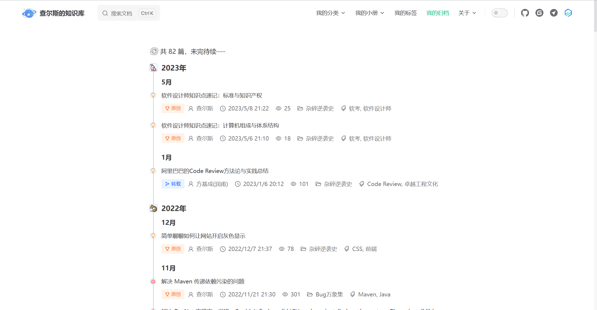](https://github.com/HPUhushicheng/vitepress-pro/blob/main/docs/public/screenshot/%E6%88%91%E7%9A%84%E5%BD%92%E6%A1%A31.png)[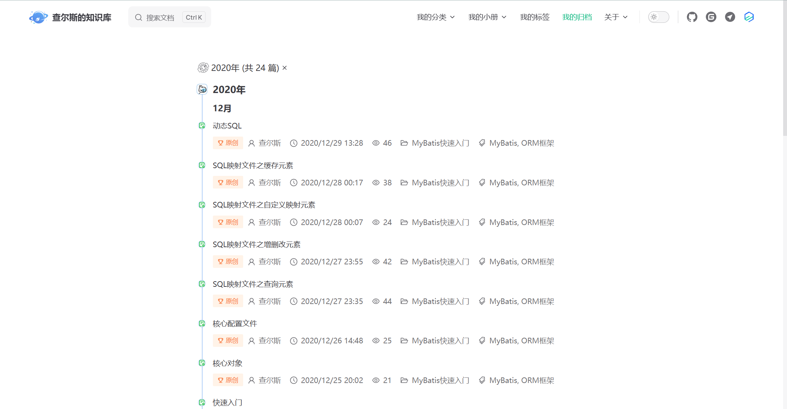](https://github.com/HPUhushicheng/vitepress-pro/blob/main/docs/public/screenshot/%E6%88%91%E7%9A%84%E5%BD%92%E6%A1%A32.png)
### 文章评论
[](https://github.com/HPUhushicheng/vitepress-pro/blob/main/docs/public/screenshot/%E6%96%87%E7%AB%A0%E8%AF%84%E8%AE%BA1.png)[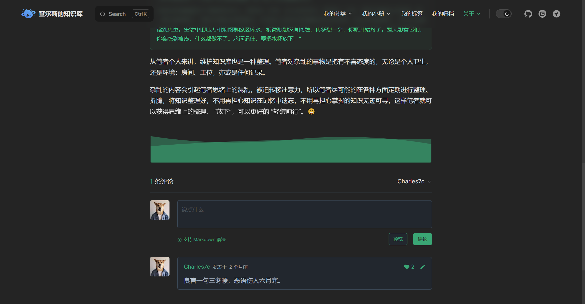](https://github.com/HPUhushicheng/vitepress-pro/blob/main/docs/public/screenshot/%E6%96%87%E7%AB%A0%E8%AF%84%E8%AE%BA2.png)[](https://github.com/HPUhushicheng/vitepress-pro/blob/main/docs/public/screenshot/%E6%96%87%E7%AB%A0%E8%AF%84%E8%AE%BA3.png)
### 版权声明
[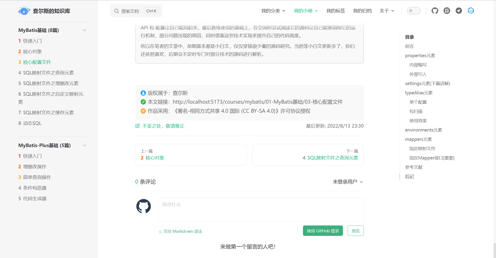](https://github.com/HPUhushicheng/vitepress-pro/blob/main/docs/public/screenshot/%E7%89%88%E6%9D%83%E5%A3%B0%E6%98%8E.png)
### Mermaid 流程图
[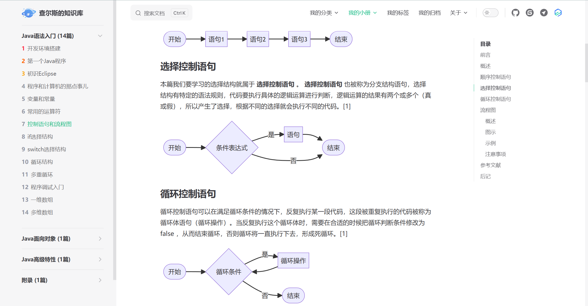](https://github.com/HPUhushicheng/vitepress-pro/blob/main/docs/public/screenshot/Mermaid%E6%B5%81%E7%A8%8B%E5%9B%BE1.png)[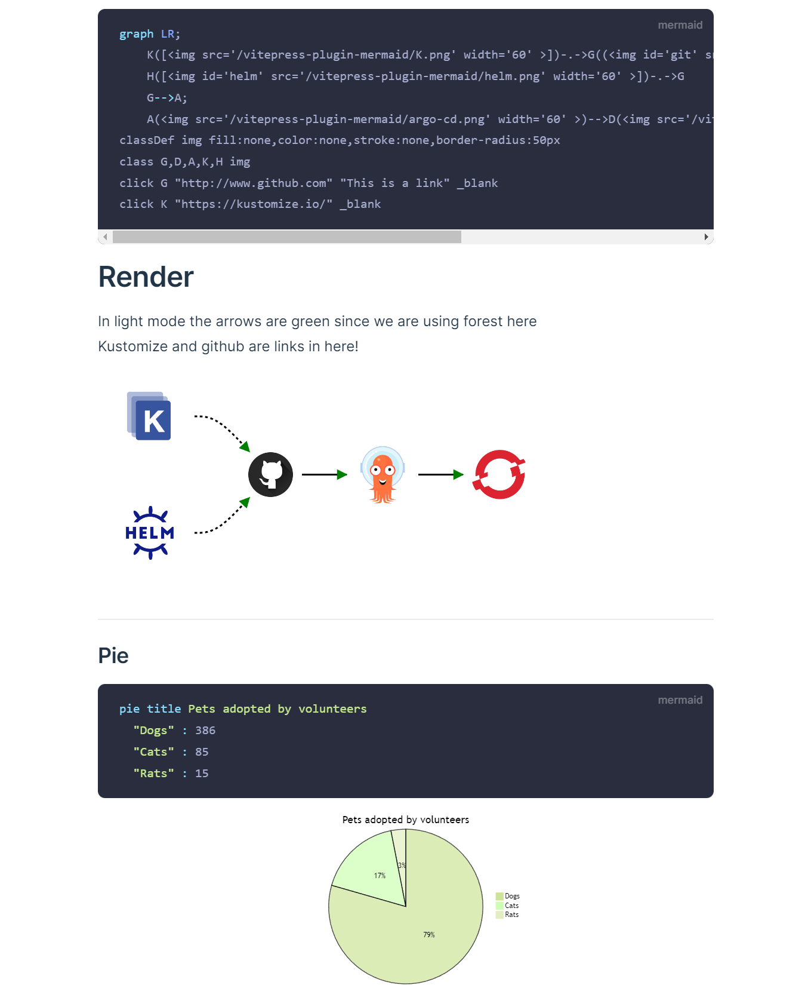](https://github.com/HPUhushicheng/vitepress-pro/blob/main/docs/public/screenshot/Mermaid%E6%B5%81%E7%A8%8B%E5%9B%BE2.png)
## 特别鸣谢

- [vuejs/vitepress](https://github.com/vuejs/vitepress) （本知识库基于 VitePress 构建）
- [vitejs/vite](https://github.com/vitejs/vite) （参考主页美化）
- [windicss/docs](https://github.com/windicss/docs) （参考配置文件拆分）
- [brc-dd/vitepress-blog-demo](https://github.com/brc-dd/vitepress-blog-demo) （感谢 VitePress 维护者 brc-dd 的热心帮助）
- [brc-dd/vitepress-with-arco](https://github.com/brc-dd/vitepress-with-arco)
- [clark-cui/vitepress-blog-zaun](https://github.com/clark-cui/vitepress-blog-zaun) （参考文章标签的数据处理方案）
- [dingqianwen/my-blog](https://github.com/dingqianwen/my-blog) （参考 Gitalk 配置暗黑主题）
- [Dedicatus546/Dedicatus546.github.io](https://github.com/Dedicatus546/Dedicatus546.github.io) （参考 Gitalk 跨域调用 API 失效的解决方案）
- [xiaoxian521/pure-admin-utils-docs](https://github.com/xiaoxian521/pure-admin-utils-docs) （参考词云组件的使用）
- [arco-design/arco-design-vue](https://github.com/arco-design/arco-design-vue) （使用部分组件及图标）
- [antvis/G2plot](https://github.com/antvis/G2plot) （使用部分图表）
- [emersonbottero/vitepress-plugin-mermaid](https://github.com/emersonbottero/vitepress-plugin-mermaid) （VitePress Mermaid 流程图插件）
- [mermaid-js/mermaid](https://github.com/mermaid-js/mermaid/blob/develop/README.zh-CN.md)
- ......
## License

- 文章遵循[CC 4.0 BY-SA](http://creativecommons.org/licenses/by-sa/4.0/)版权协议，转载请附上原文出处链接和声明
- 源码遵循 [MIT](https://github.com/Charles7c/charles7c.github.io/blob/main/LICENSE) 许可协议
- Copyright © 2019-2022 Charles7c


> 来自: [HPUhushicheng/vitepress-pro: 基于 VitePress 构建的个人知识库/博客](https://github.com/HPUhushicheng/vitepress-pro)

