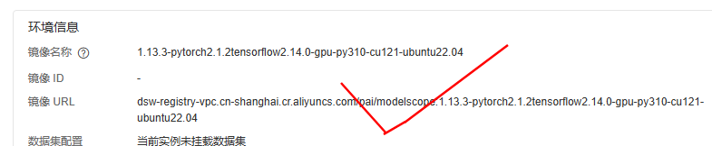

langchain-chatchat踩坑
> 来自: [Langchain-ChatChat Windows部署踩坑及问题解决 - 知乎](https://zhuanlan.zhihu.com/p/682817567)


```
conda create -n llmchat python=3.11 
conda activate llmchat
```
```
# 拉取仓库
git clone https://github.com/chatchat-space/Langchain-Chatchat.git
# 进入目录
cd Langchain-Chatchat

# 安装全部依赖，为了提升速度修改为国内的源
#需要进入requirements.txt去修改streamlit版本，修改成1.28.0
'''
如果安装了，
pip uninstall streamlit
pip install streamlit==1.28.0
'''

pip install -i https://pypi.tuna.tsinghua.edu.cn/simple -r requirements.txt  
pip install -i https://pypi.tuna.tsinghua.edu.cn/simple -r requirements_api.txt 
pip install -i https://pypi.tuna.tsinghua.edu.cn/simple -r requirements_webui.txt  

or
pip install -r requirements.txt
pip install -r requirements_api.txt
pip install -r requirements_webui.txt

# 默认依赖包括基本运行环境（FAISS向量库）。如果要使用 milvus/pg_vector 等向量库，请将 requirements.txt 中相应依赖取消注释再安装。
```
```
#cd ../ 到root目录下
git lfs install

git clone https://www.modelscope.cn/ZhipuAI/chatglm3-6b.git

#git clone https://www.modelscope.cn/AI-ModelScope/bge-large-zh.git
git clone https://www.modelscope.cn/AI-ModelScope/bge-large-zh-v1.5.git

cd Langchain-Chatchat

python copy_config_example.py

cd Langchain-Chatchat/configs/model_config.py

#修改路径，
'''
第6行和d第9行暂时不用修改，不用修改
29可改，
156和159要改其一，我该159行，因为我用的是bge-large-zh-v1.5,你要是用的是其他的就该其他的对应的位置
172要改成chatglm3-6b的文件夹位置
其他的后续再看
然后直接运行
python startup.py -a
'''

```
```
python startup.py -a

```
[LLaMA Factory](https://github.com/hiyouga/LLaMA-Factory)是一个 LLM 微调工具，支持预训练（Pre-Training）、指令监督微调（Supervised Fine-Tuning）、奖励模型训练（Reward Modeling）等训练方式，每种方式都支持 LoRA 和 QLoRA 微调策略。它的前身是[ChatGLM-Efficient-Turning](https://github.com/hiyouga/ChatGLM-Efficient-Tuning)，是基于 ChatGLM 模型做的一个微调工具，后面慢慢支持了更多的 LLM 模型，包括 BaiChuan，QWen，LLaMA 等，于是便诞生了 LLaMA Factory。

[](https://www.yuque.com/docs/165053471?_lake_card=%7B%22status%22%3A%22done%22%2C%22name%22%3A%22Tab-Langchain-Chatchat_WebUI.mp4%22%2C%22size%22%3A4620454%2C%22taskId%22%3A%22ucffef232-1d74-400f-b6b4-772947ac604%22%2C%22taskType%22%3A%22upload%22%2C%22url%22%3Anull%2C%22cover%22%3Anull%2C%22videoId%22%3A%22inputs%2Fprod%2Fyuque%2F2024%2F40770342%2Fmp4%2F1715689177703-4fb4a793-31e1-456c-91ef-df6d5676e7db.mp4%22%2C%22download%22%3Afalse%2C%22__spacing%22%3A%22both%22%2C%22id%22%3A%22Qx9oo%22%2C%22margin%22%3A%7B%22top%22%3Atrue%2C%22bottom%22%3Atrue%7D%2C%22card%22%3A%22video%22%7D#Qx9oo)