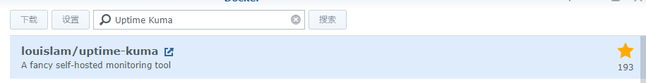
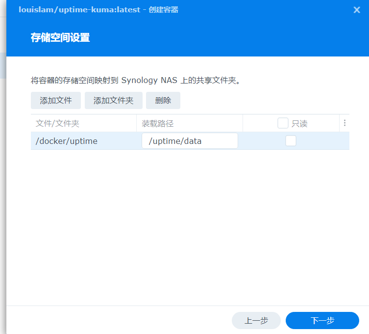
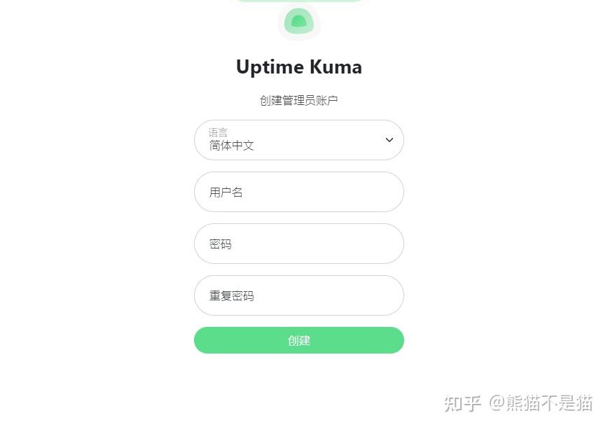
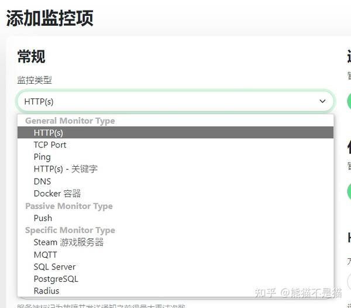
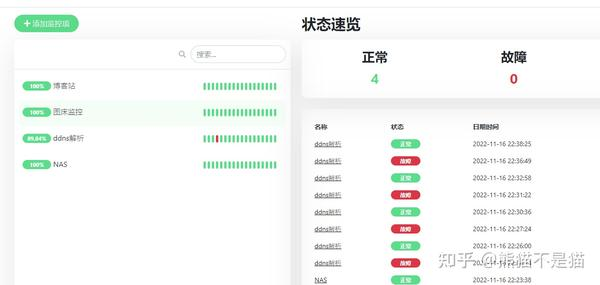
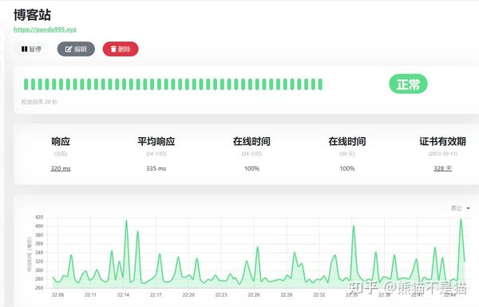
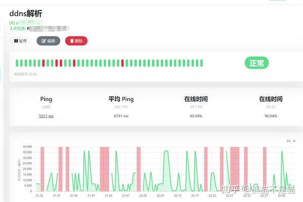
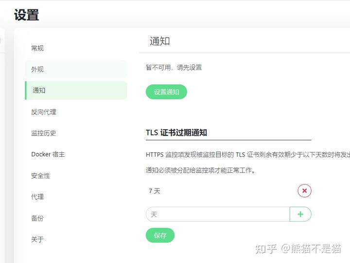
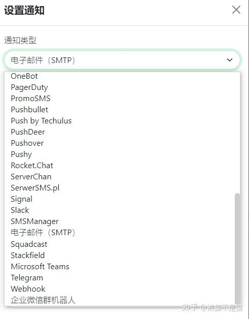

## ⭐特征
- 监控 HTTP（s） / TCP / HTTP（s） 关键字 / ping/DNS 记录 / 推送 / Steam 游戏服务器 / Docker 容器等服务。
- 花哨的，反应式的，快速的UI和交互。
- 通过电报，Discord，Gotify，Slack，Pushover，电子邮件（SMTP）和90 +通知服务的通知方式。
- 最低可设置20 秒监控间隔
- 多语言界面UI
- 可自定义多个状态页面
- 将状态页面映射到域
- 可查看pinh值图
- 支持监控证书信息
- 可设置代理支持
- 2FA 可用
## 搭建方式

1.  首先还是老样子，咱么打开群晖的docker，在注册表中搜索**Uptime Kuma**第一个就是，直接下载 

下载容器

1.  其次设置容器，这里容器端口为3001不可更改，本地端口随意，建议设置为大于10000的端口号；存储空间这边我们在docker中新建**uptime**文件夹，然后映射文件夹为**uptime/data**即可

2. 最后启动容器即可完成搭建，访问IP或域名+端口号即可进入web界面。

## 使用方式
首次进入web界面会提示你创建用户，这里需要注意的是密码必须为字母加数字的才行。 

首次配置
### 监控项设置
进入界面后什么都没有，所有的监控项需要你自己根据自己的想法来设置 

监控项
这其中包括了http(s)，tcp服务，ping值检测，dns检测，docker守护进程监控等等，甚至还有数据库的监控以及steam的服务器监控。 其中每一项设置好后对应的数据都不一样，我这边给大家看看我设置的监控项。 

总揽

博客监控

ddns解析
可以看到它能够监控我的博客站，并能展示响应速度，在线时长以及证书信息；同时我这边也设置了ddns的监控，其中红点则是监控发现ddns服务失效时的情况，也能看到ping值等情况，平均下来我这个ddns不是特别稳定，不过用来解析域名还是够了。
### 通知设置
监控是有了，那么咱们也不可能一直盯着监控界面，所以这时候就能用到通知设置了。 每个监控项可以设置单独的通知，也可以在设置里面设置一个总的通知。 

通知设置

通知方式
通知中大部分都需要魔法，不过咱们也可以用常规的STMP邮件通知，也可以满足需求了。
## 后述
总的来说还是比较好用的，如果你的nas上或者云服务器上部署了很多服务，那么它一定很适合你集中监控所有信息。而且作者目前还在进行更新，也公布了更新计划，大家有兴趣可以去看。

---

**在这里诚恳的道个歉，因为不知道vertex的作者不让在网络公布，所以之前发布了关于vertex的文章，目前已经删除了。其次很多人问链接的问题以及其他一些问题，因为平台发文规则原因，所以文章中触及违规一类的我没法说的太多，只能说善用搜索引擎吧，最后求个关注**

> 来自: [NAS下搭建一个全功能花哨的自托管监控工具—uptime-kuma - 知乎](https://zhuanlan.zhihu.com/p/587209162)

