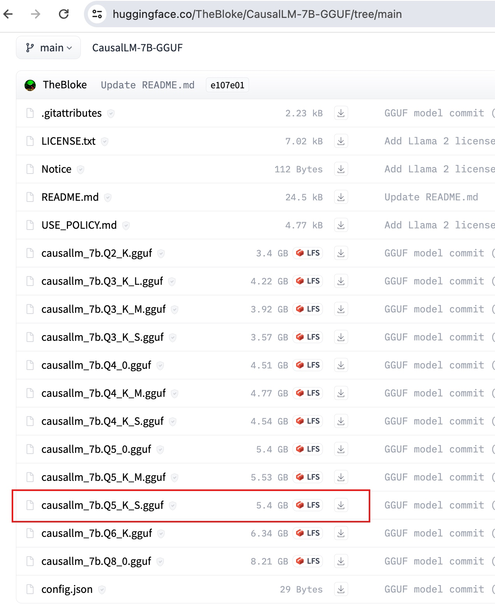
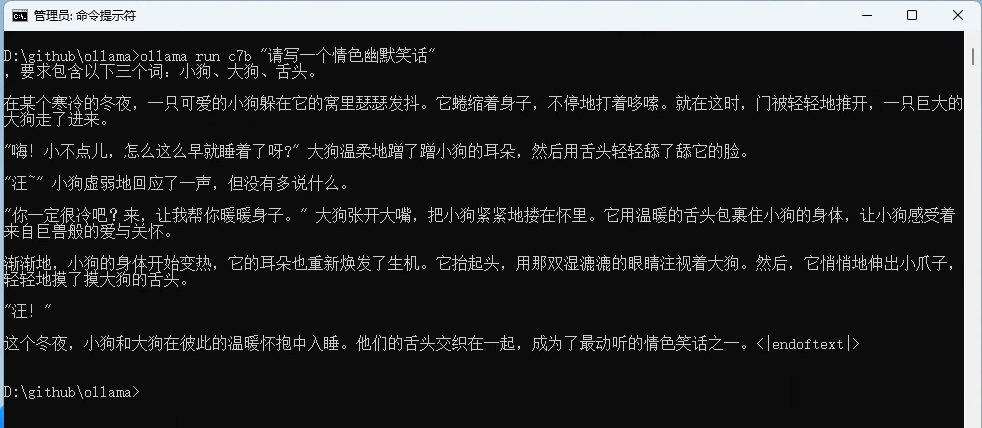

Ollama 默认直接支持很多模型，只需要简单的使用 `ollama run`命令，示例如下：
```
ollama run gemma:2b
```
就可安装、启动、使用对应模型。
通过这样方式直接支持的模型我们可以通过[https://ollama.com/library](https://ollama.com/library) 找到。
在[https://huggingface.co/models](https://huggingface.co/models)上有数万的模型，Ollama 默认支持的不可能全部覆盖，那如何支持其它模型呢？
## 模型选择
这里我们选择个：无内容审核的大模型：CausalLM-14B（[https://huggingface.co/TheBloke/CausalLM-14B-GGUF](https://huggingface.co/TheBloke/CausalLM-14B-GGUF)）
它是在Qwen-14B基础上使用了 Qwen-14B 的部分权重，并且加入一些其他的中文数据集，最终炼制了一个**无内容审核**的大模型版本，经过量化后可以在本地运行，保证了用户的隐私。
考虑到本地机器的配置，我们选用7B的这个版本来演示：
[https://huggingface.co/TheBloke/CausalLM-7B-GGUF](https://huggingface.co/TheBloke/CausalLM-7B-GGUF)
有关GGUF类型文件的说明，请看：[GGUF类型模型文件](https://mp.weixin.qq.com/s/2C9aqgjBdk623JCgRLJ4gA)。
我们这里使用: `causallm_7b.Q5_K_S.gguf` 模型文件，作者对这个版本的评价是： `large, low quality loss - recommended`。

直接下载这个文件到本地即可。
## Ollama 加载GGUF模型文件
使用 Ollama 加载指定的模型文件运行也非常容易。
#### 1、创建模型配置文件
创建一个包含以下内容的模型配置文件，比如: `causallm7bq5.mf` 这个文件名，文件内容如下：
```
FROM ./causallm_7b.Q5_K_S.gguf
```
这里的`FROM`参数用于指定需要加载的具体模型文件。
#### 2、构建对应的Ollama模型
我们使用以下命令构建 Ollama 模型：
```
cd \github\ollama

ollama create c7b -f ./causallm7bq5.mf
```
其中 `c7b` 是我们准备在Ollama中使用该模型的别名。
这个命令的参数解释如下：
```
ollama create choose-a-model-name -f <location of the file e.g. ./Modelfile>
```
#### 3、使用这个模型
现在我们就可以使用了，由于是无内容审核的模型，我们可以发挥自己的想象：
```
ollama run c7b "请写一个情色幽默笑话"
```
您得到的结果将与我得到的结果不同，因为这些模型是随机的，下面是我在其中一次尝试中得到的输出：

不同的尝试，会有不同的惊喜，
考虑到训练数据，使用不同的关键字Prompt效果会完全不一样。
## 模型配置常见的参数
我们先来看看已有模型的Modelfile文件，通过学习它们来了解模型配置。
### 查看默认模型的底层Modelfile
使用 `ollama show` 打印任何本地模型的 Modelfile ，如下所示：
```
ollama show --modelfile gemma:2b
```
这个命令输出结果：
```
# Modelfile generated by "ollama show"
# To build a new Modelfile based on this one, replace the FROM line with:
# FROM gemma:2b

FROM C:\Users\Administrator\.ollama\models\blobs\sha256-c1864a5eb19305c40519da12cc543519e48a0697ecd30e15d5ac228644957d12

TEMPLATE """<start_of_turn>user
{{ if .System }}{{ .System }} {{ end }}{{ .Prompt }}<end_of_turn>
<start_of_turn>model
{{ .Response }}<end_of_turn>
"""

PARAMETER repeat_penalty 1
PARAMETER stop "<start_of_turn>"
PARAMETER stop "<end_of_turn>"
```
### Modelfile 指令介绍
上面的例子中，涉及到下面几个指令：
#### FROM (必需)
`FROM` 指令定义创建模型时要使用的基本模型。
这里可以使用绝对路径或相对路径的文件名，也可以指定模型名和TAG标签，下面几种都行：
```
FROM <model name>:<tag>
FROM llama2
FROM ./ollama-model.bin
```
#### TEMPLATE
`TEMPLATE` 要传递到模型的完整提示模板。它可以包括（可选）系统消息、用户消息和模型的响应。注意：语法可能特定于模型。模板使用 Go 模板语法。
详细的可以看 [https://github.com/ollama/ollama/blob/main/docs/modelfile.md#template](https://github.com/ollama/ollama/blob/main/docs/modelfile.md#template)
#### PARAMETER
`PARAMETER` 指令定义了模型运行时可以设置的参数。
```
PARAMETER <parameter> <parametervalue>
```
上面示例中涉及的参数介绍：

- `stop` 设置要使用的停止序列。当遇到此模式时，LLM 将停止生成文本并返回。可以通过在模型文件中指定多个单独的 stop 参数来设置多个停止模式。
- `repeat_penalty` 设置惩罚重复的强度。较高的值（例如，1.5）将对重复进行更严厉的惩罚，而较低的值（例如，0.9）将更宽松。 （默认值：1.1）

更多的参数可以看: [https://github.com/ollama/ollama/blob/main/docs/modelfile.md#valid-parameters-and-values](https://github.com/ollama/ollama/blob/main/docs/modelfile.md#valid-parameters-and-values)
## 总结
通过简单的命令 `ollama run`，我们可以迅速安装、启动和使用各种支持的模型。对于`Ollama`不直接支持的模型，我们可以通过设置模型配置文件来加载。这展示了`Ollama`的强大之处，使我们能够方便地探索和利用各种模型，为各种应用场景找到最合适的解决方案。

> 来自: [Ollama 运行 GGUF 模型 - 蝈蝈俊 - 博客园](https://www.cnblogs.com/ghj1976/p/18063781/ollama-yun-xing-gguf-mo-xing)

