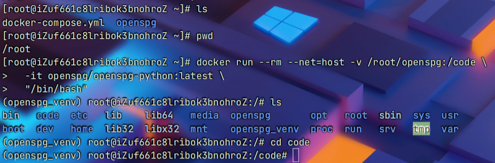

```
docker run --rm --net=host -v /root/openspg:/code \
  -it openspg/openspg-python:latest \
  "/bin/bash"
```
```
# 容器启动后，进入/code目录，即openspg项目源码目录下的code目录
cd /code
```

```
安装docker docker compose


#首先推荐zhumao脚本安装，如果不行的话，在分别安装

#docker
curl -fsSL https://get.docker.com -o get-docker.sh
sudo sh get-docker.sh

sudo systemctl start docker
sudo systemctl enable docker
docker --version


#docekr compose
sudo curl -L "https://hub.gitmirror.com/https://github.com/docker/compose/releases/latest/download/docker-compose-$(uname -s)-$(uname -m)" -o /usr/local/bin/docker-compose
sudo chmod +x /usr/local/bin/docker-compose
docker-compose --version

```
```
#下载yaml文件

docker-compose -f docker-compose.yml up -d
```
[docker-compose.yml](https://www.yuque.com/attachments/yuque/0/2024/yml/40770342/1715144326449-38115510-d989-4cb1-ba67-d7c3b8626dac.yml?_lake_card=%7B%22src%22%3A%22https%3A%2F%2Fwww.yuque.com%2Fattachments%2Fyuque%2F0%2F2024%2Fyml%2F40770342%2F1715144326449-38115510-d989-4cb1-ba67-d7c3b8626dac.yml%22%2C%22name%22%3A%22docker-compose.yml%22%2C%22size%22%3A1439%2C%22ext%22%3A%22yml%22%2C%22source%22%3A%22%22%2C%22status%22%3A%22done%22%2C%22download%22%3Atrue%2C%22taskId%22%3A%22u493b4832-f09a-4a0f-8328-8634109127d%22%2C%22taskType%22%3A%22upload%22%2C%22type%22%3A%22%22%2C%22__spacing%22%3A%22both%22%2C%22id%22%3A%22u5160b992%22%2C%22margin%22%3A%7B%22top%22%3Atrue%2C%22bottom%22%3Atrue%7D%2C%22card%22%3A%22file%22%7D)
当 openspg-server 在本地启动后，可以打开 http://127.0.0.1:8887 端口看到前端可视化页面。如果 openspg-server 部署在远程，对应的ip地址需要做对应修改

```
wget https://hub.gitmirror.com/https://github.com/OpenSPG/openspg/blob/master/dev/release/docker-compose.yml
```
