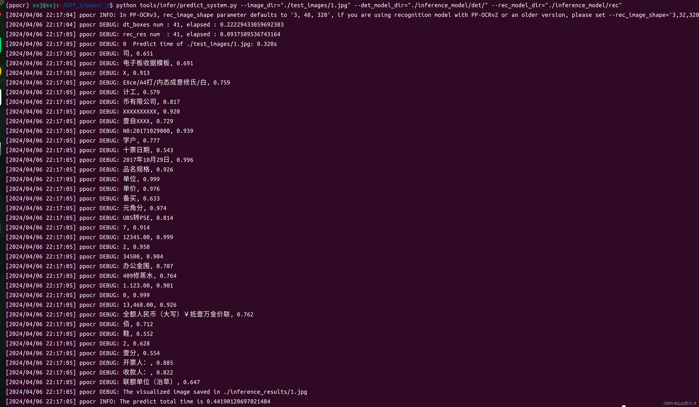

### **前言：**
**OCR场景应用集合**：包含[数码管](https://so.csdn.net/so/search?q=%E6%95%B0%E7%A0%81%E7%AE%A1&spm=1001.2101.3001.7020)、液晶屏、车牌、高精度SVTR模型、手写体识别等**9个垂类模型**，覆盖通用，制造、金融、交通行业的主要OCR垂类应用。

### **一、环境搭建**
### **1、PaddleOCR环境搭建**
```
conda create -n ppocr python==3.8
```
```
conda activate ppocr
```
进入[paddlepaddle官网](https://www.paddlepaddle.org.cn/install/quick?docurl=/documentation/docs/zh/install/pip/linux-pip.html)输入以下指令安装paddlepaddle GPU版本
（我的cuda版本是11.8,根据你电脑装合适版本）
```
pip install paddlepaddle-gpu==2.6.0 -i https://pypi.tuna.tsinghua.edu.cn/simple
```
进入[PaddlePaddle / PaddleOCR官网](https://gitcode.com/PaddlePaddle/PaddleOCR/tree/release%2F2.7?utm_source=csdn_blog_hover)下载 **PaddleOCR_2.7版本，放在你主目录下：**
之后安装命令：
##### 百度云（百度云里面包含百度官方下载软件比较快)
```
pip install -r requirements.txt -i https://mirror.baidu.com/pypi/simple/
```
##### 华为云(华为云有些软件特快，面对百度软件的特慢只有几十K）
```
pip install -r requirements.txt -i https://mirrors.huaweicloud.com/repository/pypi/simple/
```
##### 清华云（下载速度都比较平均）
```
pip install -r requirements.txt -i https://pypi.tuna.tsinghua.edu.cn/simple
```
##### 腾讯云
```
https://mirrors.cloud.tencent.com/pypi/simple/
```
##### 豆瓣
```
https://pypi.douban.com/simple/
```
##### 网易
```
https://mirrors.163.com/pypi/simple/
```
##### 中科大
```
https://pypi.mirrors.ustc.edu.cn/simple/
```
没有报错说明paddlepaddle-gpu环境安装成功。
### 2、[PaddleOCR](https://so.csdn.net/so/search?q=PaddleOCR&spm=1001.2101.3001.7020)模型下载，[PaddleOCR模型官网](https://gitcode.com/PaddlePaddle/PaddleOCR/overview)
分别下载检测和识别的推理模型

模型下载之后为两个压缩包，在PaddleOCR-realase-2.7根目录下新建文件夹
将压缩包解压到该文件夹下，如下图所示。

打开anaconda终端激活环境进入到PaddleOCR-releas-2.7目录下运行以下指令，其中image_dir为所要识别的图片路径，det_model_dir为刚才下载的文字检测模型，rec_model_dir为刚才下载的文字识别模型。
```
python tools/infer/predict_system.py  --image_dir="./test_images/1.jpg" --det_model_dir="./inference_model/ch_PP-OCRv4_det_infer/" --rec_model_dir="./inference_model/ch_PP-OCRv4_rec_infer/"
```

环境搭建成功
+++++++++++++++++++++++++++++++++++++++++++++++++++++++++++++++++++
### 3、安装PPOCRLabel的环境
进入到PPOCRLabel目录下运行：
```
pip install -i https://pypi.tuna.tsinghua.edu.cn/simple -r requirements.txt
```
运行PaddleOCR
```
python PPOCRLabel.py --lang ch
```
遇到问题：
ValueError: operands could not be broadcast together with shapes (213,488,4) (1,1,3) 

解决方法
找到PaddleOCR/data/paddle.png         改成paddle1.png

再次运行：
```
python PPOCRLabel.py --lang ch
```
有报错需要在PPOCRLabel文件目录下的PPOCRLabel.py文件最上面加入以下代码。
```
import os


os.environ["KMP_DUPLICATE_LIB_OK"]="TRUE"
```
弹出PPOCRLabel运行界面：

### 二、制作数据集
选择自动标注点击ok等待自动标注完成
自动标注：

自动标注结束后，从第一张开始检查，漏打标的按下Q框出字体，打标文字错误的，点击方框，在右边修改，并对每一个方框给出关键词列表（点击编辑点击更改box关键词信息）。最后删除无用信息，切换下一张快捷键为D，如下图所示。
全部打标完成之后，点击文件选择导出标记结果，再点击文件选择导出识别结果，完成后再文件夹多出四个文件fileState，Label，rec_gt, crop_img。其中crop_img中的图片用来训练文字识别模型，fileState记录图片的打标完成与否，Label为训练文字检测模型的标签，rec_gt为训练文字识别模型的标签。

打标签后，下面进行数据集的制作。在PaddleOCR根目录下建立train_data文件夹，并且将打标签生成的文件和图片放在该文件夹下。

打开终端进入PPOCRLabel的文件夹下,输入以下代码进行数据集的划分
```
python gen_ocr_train_val_test.py --trainValTestRatio 6:2:2 --datasetRootPath ../train_data/drivingData
```

文字检测和文字识别的数据集就都制作完成！！
#### paddlepaddle中configs里面具体应用：


1. **cls**：代表 **Classification**（分类）。分类任务是机器学习中的一个基本任务，其中模型学习将输入数据划分到预定义的类别中。
2. **det**：代表 **Detection**（检测）。检测任务涉及在图像或视频中定位和识别对象或特征。例如，在目标检测中，模型需要确定图像中对象的类别和位置。
3. **e2e**：代表 **End-to-End**（端到端）。端到端模型通常指的是直接从原始输入生成最终输出的模型，不需要中间的手动干预或特征工程。
4. **kie**：代表 **Key Information Extraction**（关键信息提取）。这是一种从文本中自动提取特定信息（如实体、关系、事件等）的任务。
5. **rec**：代表 **Recognition**（识别）。识别任务可以是多种形式的，例如手写字符识别、语音识别等，其中模型学习将输入数据（如手写文字或语音信号）转换为可读的输出。
6. **sr**：代表 **Super-Resolution**（超分辨率）。超分辨率是一种图像处理技术，用于从低分辨率图像生成高分辨率图像。
7. **table**：与表格的任务有关，例如表格结构识别、表格内容提取等。
### 三、训练文字检测模型
#### 1. 下载模型训练文件                   [下载官方训练模型](https://gitcode.com/PaddlePaddle/PaddleOCR/overview)

下载之后在PaddleOCR-release-2.7根目录下建立pretrain_models文件夹，并将训练模型解压至该文件夹下。如下图：

#### 2. 配置ppocr检测模型文件  
在configs /  det / ch_ppocr_v2.0 /找到 ch_det_res18_db_v2.0.yml配置文件

需要修改参数：
use_gpu: true                   # 是否用GPU，无改为false
epoch_num: 50                # 训练迭代次数
print_batch_step: 2          # 一次图片传输张数
save_epoch_step: 50       # 训练迭代多少次保存一次训练模型
save_model_dir: ./output/ch_db_res18/        # 输出模型路径
pretrained_model: ./pretrain_models/ch_PP-OCRv4_det_train/best_accuracy.pdparams
Train:
dataset:
name: SimpleDataSet
data_dir: ./train_data/    # train_data路径
label_file_list:
- ./train_data/det/train.txt      # 数据集标签路径
Eval:
dataset:
name: SimpleDataSet
data_dir: ./train_data/                   # train_data路径
label_file_list:
- ./train_data/det/val.txt              # 数据集中的评估标签
我自己代码
```
Global:


  use_gpu: true                # 是否用GPU，无改为false


  epoch_num: 50                # 训练迭代次数


  log_smooth_window: 20


  print_batch_step: 2          # 一次图片传输张数


  save_model_dir: ./output/ch_db_res18/   # 输出模型文件路径


  save_epoch_step: 50          # 训练迭代多少次保存一次训练模型


  # evaluation is run every 5000 iterations after the 4000th iteration


  eval_batch_step: [3000, 2000]


  cal_metric_during_train: False


  pretrained_model: ./pretrain_models/ch_PP-OCRv4_det_train/best_accuracy.pdparams # 刚下载好的训练模型路径


  checkpoints:


  save_inference_dir:


  use_visualdl: False


  infer_img: doc/imgs_en/img_10.jpg


  save_res_path: ./output/det_db/predicts_db.txt


 


Architecture:


  model_type: det


  algorithm: DB


  Transform:


  Backbone:


    name: ResNet_vd


    layers: 18


    disable_se: True


  Neck:


    name: DBFPN


    out_channels: 256


  Head:


    name: DBHead


    k: 50


 


Loss:


  name: DBLoss


  balance_loss: true


  main_loss_type: DiceLoss


  alpha: 5


  beta: 10


  ohem_ratio: 3


 


Optimizer:


  name: Adam


  beta1: 0.9


  beta2: 0.999


  lr:


    name: Cosine


    learning_rate: 0.001


    warmup_epoch: 2


  regularizer:


    name: 'L2'


    factor: 0


 


PostProcess:


  name: DBPostProcess


  thresh: 0.3


  box_thresh: 0.6


  max_candidates: 1000


  unclip_ratio: 1.5


 


Metric:


  name: DetMetric


  main_indicator: hmean


 


Train:


  dataset:


    name: SimpleDataSet


    data_dir: ./train_data/             # train_data路径


    label_file_list:


      - ./train_data/det/train.txt      # 数据集标签路径


    ratio_list: [1.0]


    transforms:


      - DecodeImage: # load image


          img_mode: BGR


          channel_first: False


      - DetLabelEncode: # Class handling label


      - IaaAugment:


          augmenter_args:


            - { 'type': Fliplr, 'args': { 'p': 0.5 } }


            - { 'type': Affine, 'args': { 'rotate': [-10, 10] } }


            - { 'type': Resize, 'args': { 'size': [0.5, 3] } }


      - EastRandomCropData:


          size: [960, 960]


          max_tries: 50


          keep_ratio: true


      - MakeBorderMap:


          shrink_ratio: 0.4


          thresh_min: 0.3


          thresh_max: 0.7


      - MakeShrinkMap:


          shrink_ratio: 0.4


          min_text_size: 8


      - NormalizeImage:


          scale: 1./255.


          mean: [0.485, 0.456, 0.406]


          std: [0.229, 0.224, 0.225]


          order: 'hwc'


      - ToCHWImage:


      - KeepKeys:


          keep_keys: ['image', 'threshold_map', 'threshold_mask', 'shrink_map', 'shrink_mask'] # the order of the dataloader list


  loader:


    shuffle: True


    drop_last: False


    batch_size_per_card: 2


    num_workers: 2


 


Eval:


  dataset:


    name: SimpleDataSet


    data_dir: ./train_data/                   # train_data路径


    label_file_list:


      - ./train_data/det/val.txt              # 数据集中的评估标签


    transforms:


      - DecodeImage: # load image


          img_mode: BGR


          channel_first: False


      - DetLabelEncode: # Class handling label


      - DetResizeForTest:


#           image_shape: [736, 1280]


      - NormalizeImage:


          scale: 1./255.


          mean: [0.485, 0.456, 0.406]


          std: [0.229, 0.224, 0.225]


          order: 'hwc'


      - ToCHWImage:


      - KeepKeys:


          keep_keys: ['image', 'shape', 'polys', 'ignore_tags']


  loader:


    shuffle: False


    drop_last: False


    batch_size_per_card: 1 # must be 1


    num_workers: 2
```
#### 3.模型开始训练
打开anaconda终端，激活环境进入到PaddleOCR-releas-2.7根目录下
输入以下指令开始模型训练：
```
python tools/train.py -c configs/det/ch_ppocr_v2.0/ch_det_res18_db_v2.0.yml
```

#### 4. 测试训练模型
找到模型保存的路径：/output/ch_db_res18/ 

使用best_accuracy.pdparams进行我们的模型测试，没有说明训练次数少，用latest.pdparams模型测试
在anaconda终端中输入以下指令进行测试， 其中Global.pretrained_model是训练好并且需要测试的模型，Global.infer_img为所要检测的图片路径。
```
python tools/infer_det.py -c configs/det/ch_ppocr_v2.0/ch_det_res18_db_v2.0.yml -o Global.pretrained_model=output/ch_db_res18/latest.pdparams Global.infer_img="./test_images/1.jpg"
```

查看输出结果：

检测模型完成，接下来进行识别模型训练和测试
### 四、训练文字识别模型
#### 1、修改识别模型配置文件
文字识别使用配置文件为ch_PP-OCRv3_rec.yml
在configs /  rec / PP-OCRv3 /找到 ch_PP-OCRv3_rec.yml 配置文件
修改的地方和文字检测修改类似。
需要修改参数：
use_gpu: true                   # 是否用GPU，无改为false
epoch_num: 50                # 训练迭代次数
print_batch_step: 2          # 一次图片传输张数
save_epoch_step: 50       # 训练迭代多少次保存一次训练模型
save_model_dir: ./output/ch_db_res18/        # 输出模型路径
pretrained_model: ./pretrain_models/ch_PP-OCRv4_rec_train/student.pdparams # 识别训练模型路径
Train:
dataset:
name: SimpleDataSet
data_dir: ./train_data/    # train_data路径
label_file_list:
- ./train_data/rec/train.txt      # 识别训练数据集标签路径
Eval:
dataset:
name: SimpleDataSet
data_dir: ./train_data/                   # train_data路径
label_file_list:
- ./train_data/rec/val.txt              # 识别数据集中的评估标签路径
我自己代码
```
Global:


  debug: false


  use_gpu: true


  epoch_num: 50


  log_smooth_window: 20


  print_batch_step: 1


  save_model_dir: ./output/rec_ppocr_v3


  save_epoch_step: 15


  eval_batch_step: [3000, 2000]


  cal_metric_during_train: true


  pretrained_model: ./pretrain_models/ch_PP-OCRv4_rec_train/student.pdparams # 识别训练模型路径


  checkpoints:


  save_inference_dir:


  use_visualdl: false


  infer_img: doc/imgs_words/ch/word_1.jpg


  character_dict_path: ppocr/utils/ppocr_keys_v1.txt


  max_text_length: &max_text_length 25


  infer_mode: false


  use_space_char: true


  distributed: true


  save_res_path: ./output/rec/predicts_ppocrv4.txt


 


 


 


 


Optimizer:


  name: Adam


  beta1: 0.9


  beta2: 0.999


  lr:


    name: Cosine


    learning_rate: 0.001


    warmup_epoch: 5


  regularizer:


    name: L2


    factor: 3.0e-05


 


 


Architecture:


  model_type: rec


  algorithm: SVTR_LCNet


  Transform:


  Backbone:


    name: MobileNetV1Enhance


    scale: 0.5


    last_conv_stride: [1, 2]


    last_pool_type: avg


    last_pool_kernel_size: [2, 2]


  Head:


    name: MultiHead


    head_list:


      - CTCHead:


          Neck:


            name: svtr


            dims: 64


            depth: 2


            hidden_dims: 120


            use_guide: True


          Head:


            fc_decay: 0.00001


      - SARHead:


          enc_dim: 512


          max_text_length: *max_text_length


 


Loss:


  name: MultiLoss


  loss_config_list:


    - CTCLoss:


    - SARLoss:


 


PostProcess:  


  name: CTCLabelDecode


 


Metric:


  name: RecMetric


  main_indicator: acc


  ignore_space: False


 


Train:


  dataset:


    name: SimpleDataSet


    data_dir: ./train_data/


    ext_op_transform_idx: 1


    label_file_list:


    - ./train_data/rec/train.txt      # 识别训练数据集标签路径


    transforms:


    - DecodeImage:


        img_mode: BGR


        channel_first: false


    - RecConAug:


        prob: 0.5


        ext_data_num: 2


        image_shape: [48, 320, 3]


        max_text_length: *max_text_length


    - RecAug:


    - MultiLabelEncode:


    - RecResizeImg:


        image_shape: [3, 48, 320]


    - KeepKeys:


        keep_keys:


        - image


        - label_ctc


        - label_sar


        - length


        - valid_ratio


  loader:


    shuffle: true


    batch_size_per_card: 16


    drop_last: true


    num_workers: 8


Eval:


  dataset:


    name: SimpleDataSet


    data_dir: ./train_data/


    label_file_list:


    - ./train_data/rec/val.txt         # 识别数据集中的评估标签路径


    transforms:


    - DecodeImage:


        img_mode: BGR


        channel_first: false


    - MultiLabelEncode:


    - RecResizeImg:


        image_shape: [3, 48, 320]


    - KeepKeys:


        keep_keys:


        - image


        - label_ctc


        - label_sar


        - length


        - valid_ratio


  loader:


    shuffle: false


    drop_last: false


    batch_size_per_card: 16


    num_workers: 8
```
#### 2.模型训练
打开anaconda终端，激活环境进入到PaddleOCR-releas-2.7根目录下。输入以下指令开始模型训练。
```
python tools/train.py -c configs/rec/PP-OCRv3/ch_PP-OCRv3_rec.yml
```
报错如下：
Out of memory error on GPU 0. Cannot allocate 120.000000MB memory on GPU 0, 5.726685GB memory has been allocated and available memory is only 41.250000MB.
Please check whether there is any other process using GPU 0.
1. If yes, please stop them, or start PaddlePaddle on another GPU.
2. If no, please decrease the batch size of your model. 
(at /paddle/paddle/fluid/memory/allocation/cuda_allocator.cc:86)

解决办法：
调低      batch_size

识别模型训练完成
#### 3.模型测试
在anaconda终端中输入以下指令进行测试。 其中Global.pretrained_model是我们训练好并且需要测试的模型，Global.infer_img为所要检测的图片路径。
```
python tools/infer_rec.py -c configs/rec/PP-OCRv3/ch_PP-OCRv3_rec.yml -o Global.pretrained_model=output/rec_ppocr_v3/best_accuracy.pdparams Global.infer_img="./test_images/1.jpg"
```
识别模型结束
+++++++++++++++++++++++++++++++++++++++++++++++++++++++++++++++++++++
### 五、转换成推理模型
在anaconda终端中输入指令进行测试
其中Global.pretrained_model是训练好并且需要推理的模型，Global.save_inference_dir为要保存推理模型的位置。推理模型是可以直接被调用进行识别和检测。分别把训练好的文字检测模型和文字识别模型推理。
```
python tools/export_model.py -c "./configs/det/ch_ppocr_v2.0/ch_det_res18_db_v2.0.yml" -o Global.pretrained_model="./output/ch_db_res18/latest.pdparams" Global.save_inference_dir="./inference_model/det/"
```
保存在 inference model is saved to ./inference_model/det/inference
```
python tools/export_model.py -c "./configs/rec/PP-OCRv3/ch_PP-OCRv3_rec.yml" -o Global.pretrained_model="./output/rec_ppocr_v3/latest.pdparams" Global.save_inference_dir="./inference_model/rec/"
```
保存在 inference model is saved to ./inference_model/rec/inference


其中det和rec即是保存的推理模型
用predict_system.py进行验证。打开anaconda终端输入以下指令：
```
python tools/infer/predict_system.py --image_dir="./test_images/1.jpg" --det_model_dir="./inference_model/det/" --rec_model_dir="./inference_model/rec"
```
输入指令后结果如下：


表格识别在下篇文章：[PP-Structure 文档分析-CSDN博客](https://blog.csdn.net/m0_60657960/article/details/137513851)
### 六、推理模型应用
参考文章：[PaddleOCR训练属于自己的模型详细教程（从打标，制作数据集，训练到应用，以行驶证识别为例）-CSDN博客](https://blog.csdn.net/qq_52852432/article/details/131817619)

> 来自: [PaddleOCR环境搭建、模型训练、推理、部署全流程（Ubuntu系统）_1_ubuntu 快速使用paddleocr-CSDN博客](https://blog.csdn.net/m0_60657960/article/details/137072289)

