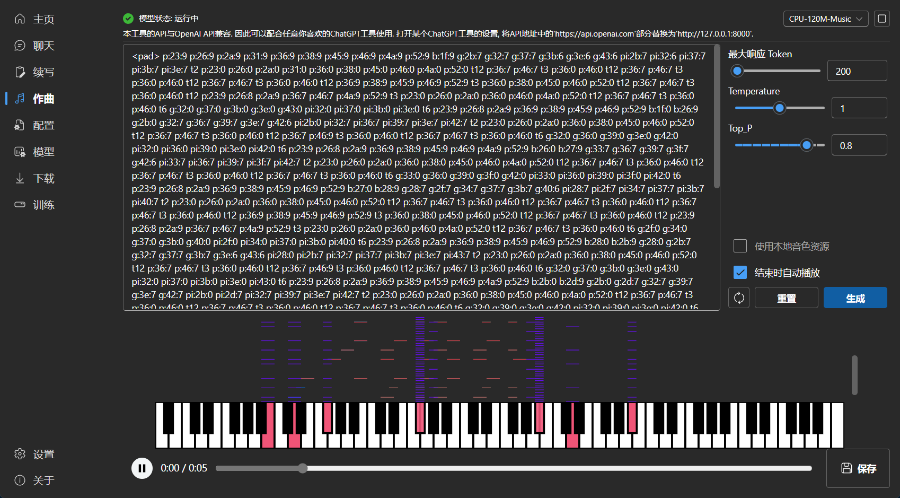

[](https://private-user-images.githubusercontent.com/13366013/239731616-d24834b0-265d-45f5-93c0-fac1e19562af.jpg?jwt=eyJhbGciOiJIUzI1NiIsInR5cCI6IkpXVCJ9.eyJpc3MiOiJnaXRodWIuY29tIiwiYXVkIjoicmF3LmdpdGh1YnVzZXJjb250ZW50LmNvbSIsImtleSI6ImtleTUiLCJleHAiOjE3MTE4NzgxMTgsIm5iZiI6MTcxMTg3NzgxOCwicGF0aCI6Ii8xMzM2NjAxMy8yMzk3MzE2MTYtZDI0ODM0YjAtMjY1ZC00NWY1LTkzYzAtZmFjMWUxOTU2MmFmLmpwZz9YLUFtei1BbGdvcml0aG09QVdTNC1ITUFDLVNIQTI1NiZYLUFtei1DcmVkZW50aWFsPUFLSUFWQ09EWUxTQTUzUFFLNFpBJTJGMjAyNDAzMzElMkZ1cy1lYXN0LTElMkZzMyUyRmF3czRfcmVxdWVzdCZYLUFtei1EYXRlPTIwMjQwMzMxVDA5MzY1OFomWC1BbXotRXhwaXJlcz0zMDAmWC1BbXotU2lnbmF0dXJlPWMwMzllMjcyYTIwNjI2MjY5YzQwMDk2NmQ3ZWMzYTZiNDYyYmZiMWExZGJlZjdmODFjOGNiN2EzZDhiMTVkMDQmWC1BbXotU2lnbmVkSGVhZGVycz1ob3N0JmFjdG9yX2lkPTAma2V5X2lkPTAmcmVwb19pZD0wIn0.Q2j0bYugXnX_sm3-n8auy1bt8ASlZUmr-Z1V9778qeM)
# RWKV Runner
本项目旨在消除大语言模型的使用门槛，全自动为你处理一切，你只需要一个仅仅几MB的可执行程序。此外本项目提供了与OpenAI API兼容的接口，这意味着一切ChatGPT客户端都是RWKV客户端。
[](https://github.com/josStorer/RWKV-Runner/blob/master/LICENSE)[](https://github.com/josStorer/RWKV-Runner/releases/latest)[](https://github.com/josStorer/RWKV-Runner/tree/master/backend-python)
[English](https://github.com/HPUhushicheng/RWKV-Runner/blob/master/README.md) | 简体中文 | [日本語](https://github.com/HPUhushicheng/RWKV-Runner/blob/master/README_JA.md)
### 安装
[](https://github.com/josStorer/RWKV-Runner/blob/master/build/windows/Readme_Install.txt)[](https://github.com/josStorer/RWKV-Runner/blob/master/build/darwin/Readme_Install.txt)[](https://github.com/josStorer/RWKV-Runner/blob/master/build/linux/Readme_Install.txt)
[视频演示](https://www.bilibili.com/video/BV1hM4y1v76R) | [疑难解答](https://www.bilibili.com/read/cv23921171) | [预览](https://github.com/HPUhushicheng/RWKV-Runner/blob/master/README_ZH.md#Preview) | [下载](https://github.com/josStorer/RWKV-Runner/releases) | [懒人包](https://pan.baidu.com/s/1zdzZ_a0uM3gDqi6pXIZVAA?pwd=1111) | [简明服务部署示例](https://github.com/HPUhushicheng/RWKV-Runner/blob/master/README_ZH.md#Simple-Deploy-Example) | [服务器部署示例](https://github.com/josStorer/RWKV-Runner/tree/master/deploy-examples) | [MIDI硬件输入](https://github.com/HPUhushicheng/RWKV-Runner/blob/master/README_ZH.md#MIDI-Input)
```
RWKV-Runner源码: https://github.com/josStorer/RWKV-Runner
下载地址: https://pan.baidu.com/s/1zdzZ_a0uM3gDqi6pXIZVAA?pwd=1111

LoRA微调项目源码: https://github.com/Blealtan/RWKV-LM-LoRA

无限上下文训练: https://github.com/RWKV/RWKV-infctx-trainer
中文说明: https://github.com/SynthiaDL/TrainChatGalRWKV
```

## 小贴士

- 你可以在服务器部署[backend-python](https://github.com/HPUhushicheng/RWKV-Runner/blob/master/backend-python)，然后将此程序仅用作客户端，在设置的`API URL`中填入你的服务器地址
- 如果你正在部署并对外提供公开服务，请通过API网关限制请求大小，避免过长的prompt提交占用资源。此外，请根据你的实际情况，限制请求的 max_tokens 上限: [https://github.com/josStorer/RWKV-Runner/blob/master/backend-python/utils/rwkv.py#L567](https://github.com/josStorer/RWKV-Runner/blob/master/backend-python/utils/rwkv.py#L567), 默认le=102400, 这可能导致极端情况下单个响应消耗大量资源
- 预设配置已经开启自定义CUDA算子加速，速度更快，且显存消耗更少。如果你遇到可能的兼容性(输出乱码) 问题，前往配置页面，关闭`使用自定义CUDA算子加速`，或更新你的显卡驱动
- 如果 Windows Defender 说这是一个病毒，你可以尝试下载[v1.3.7_win.zip](https://github.com/josStorer/RWKV-Runner/releases/download/v1.3.7/RWKV-Runner_win.zip)， 然后让其自动更新到最新版，或添加信任 (`Windows Security` -> `Virus & threat protection` -> `Manage settings` -> `Exclusions` -> `Add or remove exclusions` -> `Add an exclusion` -> `Folder` -> `RWKV-Runner`)
- 对于不同的任务，调整API参数会获得更好的效果，例如对于翻译任务，你可以尝试设置Temperature为1，Top_P为0.3
## 功能

- RWKV模型管理，一键启动
- 前后端分离，如果你不想使用客户端，也允许单独部署前端服务，或后端推理服务，或具有WebUI的后端推理服务。 [简明服务部署示例](https://github.com/HPUhushicheng/RWKV-Runner/blob/master/README_ZH.md#Simple-Deploy-Example) | [服务器部署示例](https://github.com/josStorer/RWKV-Runner/tree/master/deploy-examples)
- 与OpenAI API兼容，一切ChatGPT客户端，都是RWKV客户端。启动模型后，打开 [http://127.0.0.1:8000/docs](http://127.0.0.1:8000/docs) 查看API文档
- 全自动依赖安装，你只需要一个轻巧的可执行程序
- 预设多级显存配置，几乎在各种电脑上工作良好。通过配置页面切换Strategy到WebGPU，还可以在AMD，Intel等显卡上运行
- 自带用户友好的聊天，续写，作曲交互页面。支持聊天预设，附件上传，MIDI硬件输入及音轨编辑。 [预览](https://github.com/HPUhushicheng/RWKV-Runner/blob/master/README_ZH.md#Preview) | [MIDI硬件输入](https://github.com/HPUhushicheng/RWKV-Runner/blob/master/README_ZH.md#MIDI-Input)
- 内置WebUI选项，一键启动Web服务，共享硬件资源
- 易于理解和操作的参数配置，及各类操作引导提示
- 内置模型转换工具
- 内置下载管理和远程模型检视
- 内置一键LoRA微调 (仅限Windows)
- 也可用作 OpenAI ChatGPT, GPT Playground, Ollama 等服务的客户端 (在设置内填写API URL和API Key)
- 多语言本地化
- 主题切换
- 自动更新
## Simple Deploy Example
```
git clone https://github.com/josStorer/RWKV-Runner

# 然后
cd RWKV-Runner
python ./backend-python/main.py #后端推理服务已启动, 调用/switch-model载入模型, 参考API文档: http://127.0.0.1:8000/docs

# 或者
cd RWKV-Runner/frontend
npm ci
npm run build #编译前端
cd ..
python ./backend-python/webui_server.py #单独启动前端服务
# 或者
python ./backend-python/main.py --webui #同时启动前后端服务

# 帮助参数
python ./backend-python/main.py -h
```
## API并发压力测试
ab -p body.json -T application/json -c 20 -n 100 -l http://127.0.0.1:8000/chat/completions
body.json:
```
{
  "messages": [
    {
      "role": "user",
      "content": "Hello"
    }
  ]
}
```
## Embeddings API 示例
注意: 1.4.0 版本对embeddings API质量进行了改善，生成结果与之前的版本不兼容，如果你正在使用此API生成知识库等，请重新生成
如果你在用langchain, 直接使用 `OpenAIEmbeddings(openai_api_base="http://127.0.0.1:8000", openai_api_key="sk-")`
```
import numpy as np
import requests


def cosine_similarity(a, b):
    return np.dot(a, b) / (np.linalg.norm(a) * np.linalg.norm(b))


values = [
    "I am a girl",
    "我是个女孩",
    "私は女の子です",
    "广东人爱吃福建人",
    "我是个人类",
    "I am a human",
    "that dog is so cute",
    "私はねこむすめです、にゃん♪",
    "宇宙级特大事件！号外号外！"
]

embeddings = []
for v in values:
    r = requests.post("http://127.0.0.1:8000/embeddings", json={"input": v})
    embedding = r.json()["data"][0]["embedding"]
    embeddings.append(embedding)

compared_embedding = embeddings[0]

embeddings_cos_sim = [cosine_similarity(compared_embedding, e) for e in embeddings]

for i in np.argsort(embeddings_cos_sim)[::-1]:
    print(f"{embeddings_cos_sim[i]:.10f} - {values[i]}")
```
## 
### 

## 相关仓库:

- RWKV-5-World: [https://huggingface.co/BlinkDL/rwkv-5-world/tree/main](https://huggingface.co/BlinkDL/rwkv-5-world/tree/main)
- RWKV-4-World: [https://huggingface.co/BlinkDL/rwkv-4-world/tree/main](https://huggingface.co/BlinkDL/rwkv-4-world/tree/main)
- RWKV-4-Raven: [https://huggingface.co/BlinkDL/rwkv-4-raven/tree/main](https://huggingface.co/BlinkDL/rwkv-4-raven/tree/main)
- ChatRWKV: [https://github.com/BlinkDL/ChatRWKV](https://github.com/BlinkDL/ChatRWKV)
- RWKV-LM: [https://github.com/BlinkDL/RWKV-LM](https://github.com/BlinkDL/RWKV-LM)
- RWKV-LM-LoRA: [https://github.com/Blealtan/RWKV-LM-LoRA](https://github.com/Blealtan/RWKV-LM-LoRA)
- RWKV-v5-lora: [https://github.com/JL-er/RWKV-v5-lora](https://github.com/JL-er/RWKV-v5-lora)
- MIDI-LLM-tokenizer: [https://github.com/briansemrau/MIDI-LLM-tokenizer](https://github.com/briansemrau/MIDI-LLM-tokenizer)
- ai00_rwkv_server: [https://github.com/cgisky1980/ai00_rwkv_server](https://github.com/cgisky1980/ai00_rwkv_server)
- rwkv.cpp: [https://github.com/saharNooby/rwkv.cpp](https://github.com/saharNooby/rwkv.cpp)
- web-rwkv-py: [https://github.com/cryscan/web-rwkv-py](https://github.com/cryscan/web-rwkv-py)
- web-rwkv: [https://github.com/cryscan/web-rwkv](https://github.com/cryscan/web-rwkv)
## Preview
### 主页
[](https://private-user-images.githubusercontent.com/13366013/286946107-cd82674e-3ee3-4175-bd9c-a11d45437327.png?jwt=eyJhbGciOiJIUzI1NiIsInR5cCI6IkpXVCJ9.eyJpc3MiOiJnaXRodWIuY29tIiwiYXVkIjoicmF3LmdpdGh1YnVzZXJjb250ZW50LmNvbSIsImtleSI6ImtleTUiLCJleHAiOjE3MTE4NzgxMTgsIm5iZiI6MTcxMTg3NzgxOCwicGF0aCI6Ii8xMzM2NjAxMy8yODY5NDYxMDctY2Q4MjY3NGUtM2VlMy00MTc1LWJkOWMtYTExZDQ1NDM3MzI3LnBuZz9YLUFtei1BbGdvcml0aG09QVdTNC1ITUFDLVNIQTI1NiZYLUFtei1DcmVkZW50aWFsPUFLSUFWQ09EWUxTQTUzUFFLNFpBJTJGMjAyNDAzMzElMkZ1cy1lYXN0LTElMkZzMyUyRmF3czRfcmVxdWVzdCZYLUFtei1EYXRlPTIwMjQwMzMxVDA5MzY1OFomWC1BbXotRXhwaXJlcz0zMDAmWC1BbXotU2lnbmF0dXJlPTdmNTU0MGJmN2YzMzYzOTUwZjI1NTA0YTgwYzJmNmEwNjhlOTJmNzIxZjEzYTEyYjkyNWI1ZDUyY2Y5Mzc1OWImWC1BbXotU2lnbmVkSGVhZGVycz1ob3N0JmFjdG9yX2lkPTAma2V5X2lkPTAmcmVwb19pZD0wIn0.7w8SQKMnQd0xkWRVt9xJGKwHmbJL_Oh4WxWxT5H9S0E)
### 聊天
[](https://private-user-images.githubusercontent.com/13366013/252127962-9570e73b-dca2-4316-9e92-09961f3c48c4.png?jwt=eyJhbGciOiJIUzI1NiIsInR5cCI6IkpXVCJ9.eyJpc3MiOiJnaXRodWIuY29tIiwiYXVkIjoicmF3LmdpdGh1YnVzZXJjb250ZW50LmNvbSIsImtleSI6ImtleTUiLCJleHAiOjE3MTE4NzgxMTgsIm5iZiI6MTcxMTg3NzgxOCwicGF0aCI6Ii8xMzM2NjAxMy8yNTIxMjc5NjItOTU3MGU3M2ItZGNhMi00MzE2LTllOTItMDk5NjFmM2M0OGM0LnBuZz9YLUFtei1BbGdvcml0aG09QVdTNC1ITUFDLVNIQTI1NiZYLUFtei1DcmVkZW50aWFsPUFLSUFWQ09EWUxTQTUzUFFLNFpBJTJGMjAyNDAzMzElMkZ1cy1lYXN0LTElMkZzMyUyRmF3czRfcmVxdWVzdCZYLUFtei1EYXRlPTIwMjQwMzMxVDA5MzY1OFomWC1BbXotRXhwaXJlcz0zMDAmWC1BbXotU2lnbmF0dXJlPTYxYzdhYzNiM2NkOTM5OTI3Nzg5NDE3MGRiZjk3OWQyNDc2ZmU2ODFhZjA4ZDFlYWQ5N2ExZDc3MDJiZDhlMGQmWC1BbXotU2lnbmVkSGVhZGVycz1ob3N0JmFjdG9yX2lkPTAma2V5X2lkPTAmcmVwb19pZD0wIn0.LsbvSjAjJ8tIhP5c6DowR_H33LCKYEA0F_pZ7d9BENU)
[](https://private-user-images.githubusercontent.com/13366013/286948134-54bb0e2b-cdc4-4ea0-8d16-9beaf57c232c.png?jwt=eyJhbGciOiJIUzI1NiIsInR5cCI6IkpXVCJ9.eyJpc3MiOiJnaXRodWIuY29tIiwiYXVkIjoicmF3LmdpdGh1YnVzZXJjb250ZW50LmNvbSIsImtleSI6ImtleTUiLCJleHAiOjE3MTE4NzgxMTgsIm5iZiI6MTcxMTg3NzgxOCwicGF0aCI6Ii8xMzM2NjAxMy8yODY5NDgxMzQtNTRiYjBlMmItY2RjNC00ZWEwLThkMTYtOWJlYWY1N2MyMzJjLnBuZz9YLUFtei1BbGdvcml0aG09QVdTNC1ITUFDLVNIQTI1NiZYLUFtei1DcmVkZW50aWFsPUFLSUFWQ09EWUxTQTUzUFFLNFpBJTJGMjAyNDAzMzElMkZ1cy1lYXN0LTElMkZzMyUyRmF3czRfcmVxdWVzdCZYLUFtei1EYXRlPTIwMjQwMzMxVDA5MzY1OFomWC1BbXotRXhwaXJlcz0zMDAmWC1BbXotU2lnbmF0dXJlPTMyMDM3ZTc5NjcyY2M3YThiNDYzNDk5ODkwZWIwNzE4ZDYyZmQ0MWNiZjQ4MjZiODY1MGI3OGRhNTVlMzQ5M2MmWC1BbXotU2lnbmVkSGVhZGVycz1ob3N0JmFjdG9yX2lkPTAma2V5X2lkPTAmcmVwb19pZD0wIn0.M-qFB_3C54BwPEbIQfi3_Q-QP1XJ3pkQktiFlZDibNA)
### 续写
[](https://private-user-images.githubusercontent.com/13366013/252128050-69f9ba7a-2fe8-4a5e-94cb-aa655aa409e2.png?jwt=eyJhbGciOiJIUzI1NiIsInR5cCI6IkpXVCJ9.eyJpc3MiOiJnaXRodWIuY29tIiwiYXVkIjoicmF3LmdpdGh1YnVzZXJjb250ZW50LmNvbSIsImtleSI6ImtleTUiLCJleHAiOjE3MTE4NzgxMTgsIm5iZiI6MTcxMTg3NzgxOCwicGF0aCI6Ii8xMzM2NjAxMy8yNTIxMjgwNTAtNjlmOWJhN2EtMmZlOC00YTVlLTk0Y2ItYWE2NTVhYTQwOWUyLnBuZz9YLUFtei1BbGdvcml0aG09QVdTNC1ITUFDLVNIQTI1NiZYLUFtei1DcmVkZW50aWFsPUFLSUFWQ09EWUxTQTUzUFFLNFpBJTJGMjAyNDAzMzElMkZ1cy1lYXN0LTElMkZzMyUyRmF3czRfcmVxdWVzdCZYLUFtei1EYXRlPTIwMjQwMzMxVDA5MzY1OFomWC1BbXotRXhwaXJlcz0zMDAmWC1BbXotU2lnbmF0dXJlPWRlN2IwODc0NjliNThhM2M4MTEyZjFlNzEyYzVhYzc5Y2YyZmQ4MDJjNjc1YTE1NmMzYjQ0YmUzYjkxM2E1MDcmWC1BbXotU2lnbmVkSGVhZGVycz1ob3N0JmFjdG9yX2lkPTAma2V5X2lkPTAmcmVwb19pZD0wIn0.O454kFo2ga67AKI8NvkTwzFsfRDXZbDt1el-3HhWe2M)
### 作曲
小贴士: 你可以下载 [https://github.com/josStorer/sgm_plus](https://github.com/josStorer/sgm_plus), 并解压到程序的`assets/sound-font`目录, 以使用离线音源. 注意, 如果你正在从源码编译程序, 请不要将其放置在源码目录中
[](https://private-user-images.githubusercontent.com/13366013/256728690-95b34893-80c2-4706-87f9-bc141032ed4b.png?jwt=eyJhbGciOiJIUzI1NiIsInR5cCI6IkpXVCJ9.eyJpc3MiOiJnaXRodWIuY29tIiwiYXVkIjoicmF3LmdpdGh1YnVzZXJjb250ZW50LmNvbSIsImtleSI6ImtleTUiLCJleHAiOjE3MTE4NzgxMTgsIm5iZiI6MTcxMTg3NzgxOCwicGF0aCI6Ii8xMzM2NjAxMy8yNTY3Mjg2OTAtOTViMzQ4OTMtODBjMi00NzA2LTg3ZjktYmMxNDEwMzJlZDRiLnBuZz9YLUFtei1BbGdvcml0aG09QVdTNC1ITUFDLVNIQTI1NiZYLUFtei1DcmVkZW50aWFsPUFLSUFWQ09EWUxTQTUzUFFLNFpBJTJGMjAyNDAzMzElMkZ1cy1lYXN0LTElMkZzMyUyRmF3czRfcmVxdWVzdCZYLUFtei1EYXRlPTIwMjQwMzMxVDA5MzY1OFomWC1BbXotRXhwaXJlcz0zMDAmWC1BbXotU2lnbmF0dXJlPTBjOTIxZWM0ZTQwZjg1MTlhZWZmYzA2MTBkNjFkOGY4NDI2OWM4NTRlYTdkOGQ2ZTA1YzI0YmNjNWY2ZDJjMDUmWC1BbXotU2lnbmVkSGVhZGVycz1ob3N0JmFjdG9yX2lkPTAma2V5X2lkPTAmcmVwb19pZD0wIn0.4aq_yuM5r_wacUmJeYe6WKedHZKLDCcgWd89T6sZAsM)
[](https://private-user-images.githubusercontent.com/13366013/286949427-3cb31ca8-d708-42f1-8768-1605fb0b2174.png?jwt=eyJhbGciOiJIUzI1NiIsInR5cCI6IkpXVCJ9.eyJpc3MiOiJnaXRodWIuY29tIiwiYXVkIjoicmF3LmdpdGh1YnVzZXJjb250ZW50LmNvbSIsImtleSI6ImtleTUiLCJleHAiOjE3MTE4NzgxMTgsIm5iZiI6MTcxMTg3NzgxOCwicGF0aCI6Ii8xMzM2NjAxMy8yODY5NDk0MjctM2NiMzFjYTgtZDcwOC00MmYxLTg3NjgtMTYwNWZiMGIyMTc0LnBuZz9YLUFtei1BbGdvcml0aG09QVdTNC1ITUFDLVNIQTI1NiZYLUFtei1DcmVkZW50aWFsPUFLSUFWQ09EWUxTQTUzUFFLNFpBJTJGMjAyNDAzMzElMkZ1cy1lYXN0LTElMkZzMyUyRmF3czRfcmVxdWVzdCZYLUFtei1EYXRlPTIwMjQwMzMxVDA5MzY1OFomWC1BbXotRXhwaXJlcz0zMDAmWC1BbXotU2lnbmF0dXJlPWRmZDlhMTc2NGIyYmY4OWEyYmUwMDJlOTUzN2Q5MWQwYTkwMGE2OTBmY2UwNGVkMmZkY2UwYjU3ZDQ3ZjAyNWImWC1BbXotU2lnbmVkSGVhZGVycz1ob3N0JmFjdG9yX2lkPTAma2V5X2lkPTAmcmVwb19pZD0wIn0.QC9Zf5xyAher8dQ1spq6-4xdtYw_DMW2llauQWgI7u4)
### 配置
[](https://private-user-images.githubusercontent.com/13366013/286949638-0f4d4f21-8abe-4f4d-8c4f-cd7d5607f20e.png?jwt=eyJhbGciOiJIUzI1NiIsInR5cCI6IkpXVCJ9.eyJpc3MiOiJnaXRodWIuY29tIiwiYXVkIjoicmF3LmdpdGh1YnVzZXJjb250ZW50LmNvbSIsImtleSI6ImtleTUiLCJleHAiOjE3MTE4NzgxMTgsIm5iZiI6MTcxMTg3NzgxOCwicGF0aCI6Ii8xMzM2NjAxMy8yODY5NDk2MzgtMGY0ZDRmMjEtOGFiZS00ZjRkLThjNGYtY2Q3ZDU2MDdmMjBlLnBuZz9YLUFtei1BbGdvcml0aG09QVdTNC1ITUFDLVNIQTI1NiZYLUFtei1DcmVkZW50aWFsPUFLSUFWQ09EWUxTQTUzUFFLNFpBJTJGMjAyNDAzMzElMkZ1cy1lYXN0LTElMkZzMyUyRmF3czRfcmVxdWVzdCZYLUFtei1EYXRlPTIwMjQwMzMxVDA5MzY1OFomWC1BbXotRXhwaXJlcz0zMDAmWC1BbXotU2lnbmF0dXJlPWY0YzdkNjE2ZGU1ZDE1NTdlYWUyYjVjYWIwZWE4YzliYzMyYWFjMTFhMzdjODkyMmIyMmM5Y2Y3MThlMTRkZDgmWC1BbXotU2lnbmVkSGVhZGVycz1ob3N0JmFjdG9yX2lkPTAma2V5X2lkPTAmcmVwb19pZD0wIn0.Sve7wHDrX-BZtwYvbJ5-7mBfyu1t5YVHxHteyoRAQXk)
### 模型管理
[](https://private-user-images.githubusercontent.com/13366013/289233264-871f2d2a-7e41-4be7-9b32-be1b3e00dc3e.png?jwt=eyJhbGciOiJIUzI1NiIsInR5cCI6IkpXVCJ9.eyJpc3MiOiJnaXRodWIuY29tIiwiYXVkIjoicmF3LmdpdGh1YnVzZXJjb250ZW50LmNvbSIsImtleSI6ImtleTUiLCJleHAiOjE3MTE4NzgxMTgsIm5iZiI6MTcxMTg3NzgxOCwicGF0aCI6Ii8xMzM2NjAxMy8yODkyMzMyNjQtODcxZjJkMmEtN2U0MS00YmU3LTliMzItYmUxYjNlMDBkYzNlLnBuZz9YLUFtei1BbGdvcml0aG09QVdTNC1ITUFDLVNIQTI1NiZYLUFtei1DcmVkZW50aWFsPUFLSUFWQ09EWUxTQTUzUFFLNFpBJTJGMjAyNDAzMzElMkZ1cy1lYXN0LTElMkZzMyUyRmF3czRfcmVxdWVzdCZYLUFtei1EYXRlPTIwMjQwMzMxVDA5MzY1OFomWC1BbXotRXhwaXJlcz0zMDAmWC1BbXotU2lnbmF0dXJlPWZkYTkzY2UzYmMxMGNkN2UzNmJiMWVlZmI5NThlYmJjZDc0OWQ1ODg4ODY3ZTI5MmE4MDU1NmVkNWMwYTlhNmMmWC1BbXotU2lnbmVkSGVhZGVycz1ob3N0JmFjdG9yX2lkPTAma2V5X2lkPTAmcmVwb19pZD0wIn0.gPm8lSofDUyYORuzCEzv54tv1vqtL9wCwg4e--MDbMY)
### 下载管理
[](https://private-user-images.githubusercontent.com/13366013/252128138-cc076038-2a91-4d36-bd39-266020e8ea87.png?jwt=eyJhbGciOiJIUzI1NiIsInR5cCI6IkpXVCJ9.eyJpc3MiOiJnaXRodWIuY29tIiwiYXVkIjoicmF3LmdpdGh1YnVzZXJjb250ZW50LmNvbSIsImtleSI6ImtleTUiLCJleHAiOjE3MTE4NzgxMTgsIm5iZiI6MTcxMTg3NzgxOCwicGF0aCI6Ii8xMzM2NjAxMy8yNTIxMjgxMzgtY2MwNzYwMzgtMmE5MS00ZDM2LWJkMzktMjY2MDIwZThlYTg3LnBuZz9YLUFtei1BbGdvcml0aG09QVdTNC1ITUFDLVNIQTI1NiZYLUFtei1DcmVkZW50aWFsPUFLSUFWQ09EWUxTQTUzUFFLNFpBJTJGMjAyNDAzMzElMkZ1cy1lYXN0LTElMkZzMyUyRmF3czRfcmVxdWVzdCZYLUFtei1EYXRlPTIwMjQwMzMxVDA5MzY1OFomWC1BbXotRXhwaXJlcz0zMDAmWC1BbXotU2lnbmF0dXJlPTU4NmEwMDc2NjI0NWExMGVmOTJkYmJkN2YxZDU5MTQzMTk2ODQ3ZThkYTMwZjM5NzU5YWZlYzIwZGU1Y2NkNzImWC1BbXotU2lnbmVkSGVhZGVycz1ob3N0JmFjdG9yX2lkPTAma2V5X2lkPTAmcmVwb19pZD0wIn0.xAMvn66lCwCHKnTMlShErBbNdw0ocICvkG6UHEtE_aA)
### LoRA微调
[](https://private-user-images.githubusercontent.com/13366013/252128144-31939b8f-9546-4f44-b434-295b492ec625.png?jwt=eyJhbGciOiJIUzI1NiIsInR5cCI6IkpXVCJ9.eyJpc3MiOiJnaXRodWIuY29tIiwiYXVkIjoicmF3LmdpdGh1YnVzZXJjb250ZW50LmNvbSIsImtleSI6ImtleTUiLCJleHAiOjE3MTE4NzgxMTgsIm5iZiI6MTcxMTg3NzgxOCwicGF0aCI6Ii8xMzM2NjAxMy8yNTIxMjgxNDQtMzE5MzliOGYtOTU0Ni00ZjQ0LWI0MzQtMjk1YjQ5MmVjNjI1LnBuZz9YLUFtei1BbGdvcml0aG09QVdTNC1ITUFDLVNIQTI1NiZYLUFtei1DcmVkZW50aWFsPUFLSUFWQ09EWUxTQTUzUFFLNFpBJTJGMjAyNDAzMzElMkZ1cy1lYXN0LTElMkZzMyUyRmF3czRfcmVxdWVzdCZYLUFtei1EYXRlPTIwMjQwMzMxVDA5MzY1OFomWC1BbXotRXhwaXJlcz0zMDAmWC1BbXotU2lnbmF0dXJlPWU5NzQwNDBiNDA3NWVkNTMwMzc3MjQ2YWNmMzdmNzE1OTRkZmY4MGU0Y2JkNzNlZDkyN2JkZWM4NTEyMzExZDMmWC1BbXotU2lnbmVkSGVhZGVycz1ob3N0JmFjdG9yX2lkPTAma2V5X2lkPTAmcmVwb19pZD0wIn0.hHNeMVGCxZWlWSI44hhwr0dqta3Hu6u3uMGgnARBB8M)
### 设置
[](https://private-user-images.githubusercontent.com/13366013/252128159-9652d7cc-ac33-4587-a8fb-03e5a6f5ea77.png?jwt=eyJhbGciOiJIUzI1NiIsInR5cCI6IkpXVCJ9.eyJpc3MiOiJnaXRodWIuY29tIiwiYXVkIjoicmF3LmdpdGh1YnVzZXJjb250ZW50LmNvbSIsImtleSI6ImtleTUiLCJleHAiOjE3MTE4NzgxMTgsIm5iZiI6MTcxMTg3NzgxOCwicGF0aCI6Ii8xMzM2NjAxMy8yNTIxMjgxNTktOTY1MmQ3Y2MtYWMzMy00NTg3LWE4ZmItMDNlNWE2ZjVlYTc3LnBuZz9YLUFtei1BbGdvcml0aG09QVdTNC1ITUFDLVNIQTI1NiZYLUFtei1DcmVkZW50aWFsPUFLSUFWQ09EWUxTQTUzUFFLNFpBJTJGMjAyNDAzMzElMkZ1cy1lYXN0LTElMkZzMyUyRmF3czRfcmVxdWVzdCZYLUFtei1EYXRlPTIwMjQwMzMxVDA5MzY1OFomWC1BbXotRXhwaXJlcz0zMDAmWC1BbXotU2lnbmF0dXJlPTViNzdkZTM0ODlhYzMxMDA4NmM1YjA4NTJhNGI3MWM4YjMwZDcwZDE0ZGY4ZDY3ODczZTM0MDYyMzU3NWU0OTEmWC1BbXotU2lnbmVkSGVhZGVycz1ob3N0JmFjdG9yX2lkPTAma2V5X2lkPTAmcmVwb19pZD0wIn0.099Uju0ZuO7rPyUXZQNwpODvcYfPnO9wnB0DcFJnt4o)

> 来自: [RWKV-Runner/README_ZH.md at master · HPUhushicheng/RWKV-Runner](https://github.com/HPUhushicheng/RWKV-Runner/blob/master/README_ZH.md)

