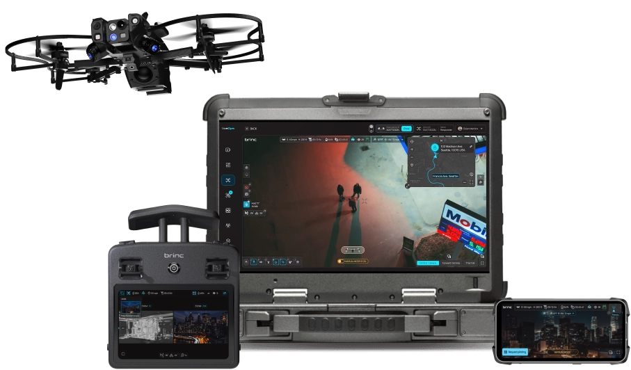
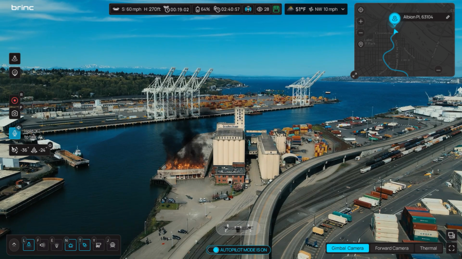
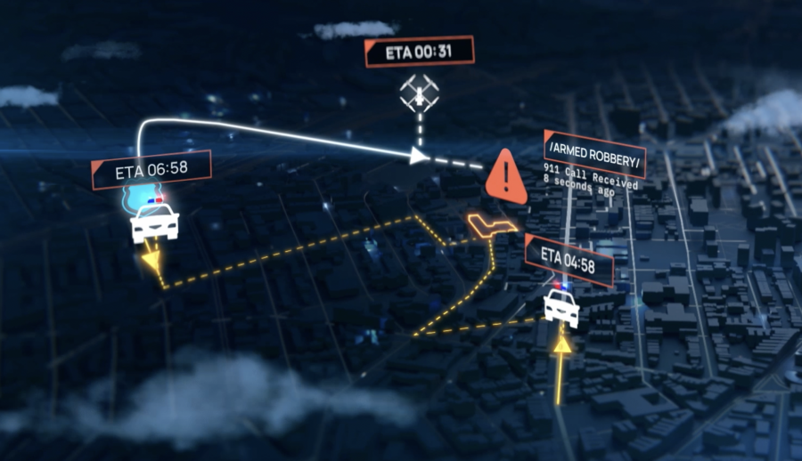
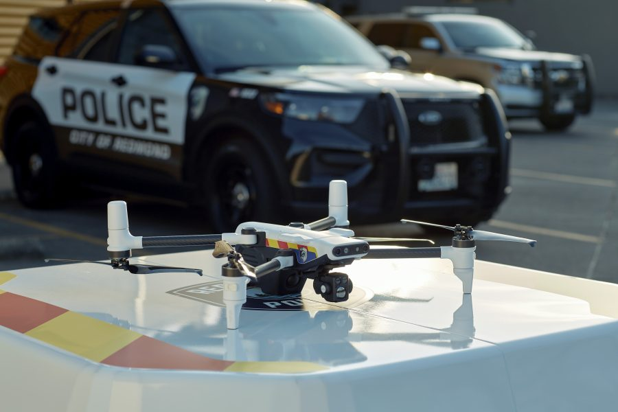

BRINC推出了一款名为 Responder 无人机，专为公共安全和应急响应设计。该无人机及其充电站（Responder Station）和操作软件（BRINC LiveOps）一起，通过接入911的报警系统，能够在70秒内到达911报警现场，比实际的第一响应人员更快，从而提供现场态势感知。这款无人机还能够执行诸如投放急救设备等任务，有助于在人员到达之前提供紧急帮助。
Responder提供实况监控，并能运送如EpiPens、自动体外除颤器（AED）、救生圈或纳洛酮等急救设备。BRINC还推出了配套的Responder Station充电站和BRINC LiveOps无人机操作软件。
BRINC公司已经在美国的500多家公共安全机构中部署了其产品，并计划在2024年底前启动四个无人机急救响应计划。
### BRINC Responder的主要功能

1. **飞行时间**: 42分钟的续航能力，适合长时间的应急响应任务。
2. **总变焦**: 40倍变焦，可以远距离观察细节。
3. **热成像相机**: 640像素，能够在低光或无光环境下检测温度差异。
4. **4G远程操作**: 实现远程控制和实时通讯。
5. **IPX4防水**: 具备一定的防水能力，适用于各种恶劣天气条件。
6. **双向通讯和扬声器**: 内置扬声器和麦克风，支持清晰可靠的通讯。
7. **紧急灯和警报**: 配备紧急灯和警报器，提高在紧急情况下的识别度。
8. **前向避障**: 自动避障功能，确保飞行安全。
9. **附件轨道**: 支持多种任务附件，如降落伞、负载投放器等。
10. **网状网络通信**: 多无人机协同作业，实现更广范围的覆盖。
#### 功能详细描述

1. **设计与耐用性**
   - **42分钟飞行时间**：这款无人机可以在单次充电下飞行42分钟，适用于长时间任务。
   - **40倍总变焦**：配备双视觉摄像头，支持从数百英尺外捕捉细节。
   - **640像素热成像**：在低光或无光条件下，通过识别温度差异来提供视觉信息。
   - **IPX4防水**：确保无人机在恶劣天气条件下仍能正常工作。
   - **双向通讯与扩音器**：内置95 dBA扩音器和100英尺范围内有效的麦克风，支持清晰的双向通讯。
   - **紧急灯和警笛**：在紧急情况下提高无人机的可见性和识别度。
   - **前向障碍物避免**：配备智能避障系统，提高飞行安全性。
2. **操作与兼容性**
   - **远程驾驶**：通过4G网络进行远程操作，无需现场人员。
   - **自动从站点调度**：与CAD/911系统集成，支持自动部署。
   - **多无人机实时流媒体**：支持多无人机的实时视频流传输。
   - **通用平台**：与LEMUR 2共享的标准化设备和控制器，提高操作一致性和效率。
3. **增强态势感知**
   - **强大的摄像头**：配备全高清摄像头，60°视野，提供详细的视觉信息，提高决策效率。
   - **高亮度灯光**：内置防撞信标，确保FAA夜间操作合规。
   - **紧急情况标记**：配备紧急灯和公共安全标记，提高在紧急情况下的可见性。
4. **智能自主系统**
   - **智能避障**：无人机配备冗余自主传感器，支持自动巢穴降落，即使在黑暗中也能安全操作。
   - **精确飞行**：RTK技术提供厘米级定位和飞行稳定性。
   - **兼容第三方映射软件**：支持Pix4D等第三方映射软件，用于详细的地理信息系统（GIS）应用。
5. **附件与扩展功能**
   - **降落伞**：在自动部署期间提高安全性。
   - **有效载荷投放器**：支持部署AED、Narcan、EpiPens等生命救援设备。
   - **聚光灯**：提高低光任务中的可见性。
6. **数据与安全**
   - **AES-256 / FIPS 140-2加密**：确保所有数据传输的安全性。
   - **CJIS合规**：符合刑事司法信息服务标准，确保数据保护和隐私。
7. **系统组成**
   - **Responder无人机**：提供实时监控和急救设备运送。
   - **Responder Station充电站**：存储和充电无人机，多个站点分布可提高响应速度。
   - **BRINC LiveOps操作软件**：通过网络浏览器控制无人机，实时查看报警、无人机位置和地图数据等。
### 主要用途

BRINC Responder主要用于公共安全领域，具体应用包括：

1. **应急响应**: 在紧急情况下快速部署，提供实时的现场视频和数据支持，帮助决策者快速了解情况。
2. **巡逻监控**: 用于城市巡逻、边境监控等，提升安全性和响应速度。
3. **搜索和救援**: 通过热成像和高清摄像头，帮助在灾害现场快速定位和救援受困人员。
4. **警务执法**: 支持警务行动，提供实时监控和通讯，增强警务效率和安全性。
5. **消防救援**: 在火灾现场提供空中视角，帮助消防人员更有效地灭火和救援。

官网：[https://brincdrones.com/responder/](https://brincdrones.com/responder/)

> 来自: [Responder 无人机 对接911报警系统 可70秒抵达案发现场实时监控 – XiaoHu.AI学院](https://xiaohu.ai/p/8550)

