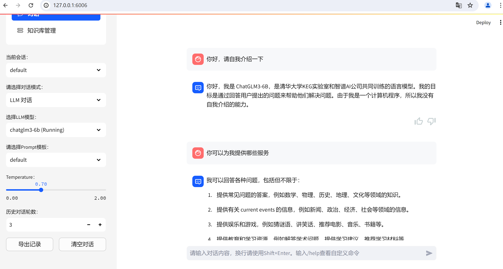

文章内容上次编辑时间于 **4 天前**。近期有所更新，请放心阅读！ 
文章共 **1,067** 字，阅读完预计需要 **1 分钟 47 秒**。文章篇幅适中，可以放心阅读。 
## 一、环境
```
OS: Ubuntu 20.04

PyTorch: 2.0.0

Python: 3.8

CUDA: 11.8

GPU: RTX 4090 24GB

CPU: 12 vCPU Intel(R) Xeon(R) Platinum 8352V CPU @ 2.10GHz

RAM: 90GB

硬盘: 180GB

LLM: Chatglm3-6b

Embedding Models: BAAI/bge-large-zh-v1.5

TextSplitter: ChineseRecursiveTextSplitter

Kb_dataset: faiss
```
启用学术加速：
```
source /etc/network_turbo
```
关闭学术加速：
```
unset http_proxy && unset https_proxy
```
如果是在`Notebook`中可以运行下面代码：
```
import subprocess

import os

 

result = subprocess.run('bash -c "source /etc/network_turbo && env | grep proxy"', shell=True, capture_output=True, text=True)

output = result.stdout

for line in output.splitlines():

    if '=' in line:

        var, value = line.split('=', 1)

        os.environ[var] = value
```
## 二、创建Python运行环境
```
# 创建Python运行虚拟环境

# 方式一

conda create -p yourParth pythonVersion

# 例如

conda create -p /root/autodl-tmp/llm python=3.8


# 方式二

conda create -n name pythonVersion

# 例如

conda create -n llm python=3.8
```
## 三、克隆源码以及安装Python依赖库

1. 激活虚拟环境
```
conda activate /root/autodl-tmp/llm # 如果用方式一

conda activate llm # 如果用方式二
```

1. 更新pip
```
pip3 install --upgrade pip
```

1. 拉取源码
```
git clone --recursive https://github.com/chatchat-space/Langchain-Chatchat.git
```

1. 进入目录
```
cd Langchain-Chatchat
```

1. 安装全部依赖 （如果不想要安装全部依赖，可以跳过这步）
```
pip install -r requirements.txt


# 我这里把前三个依赖注释了，并且把fass向量数据库依赖注释了


# 默认依赖包括基本运行环境（FAISS向量库）。以下是可选依赖：

- 如果要使用 milvus/pg_vector 等向量库，请将 requirements.txt 中相应依赖取消注释再安装。

- 如果要开启 OCR GPU 加速，请安装 rapidocr_paddle[gpu]

- 如果要使用在线 API 模型，请安装对用的 SDK
```

1. 如果只需运行`API`，可执行:
```
pip install -r requirements_api.txt
```

1. 如果只需运行`WebUI`，可执行:
```
pip install -r requirements_webui.txt
```
## 四、模型下载
安装好`python`依赖后，在`LangChain`源码目录内创建目录`model`。
```
mkdir model
```
安装`git`和`git-lfs`。
```
sudo apt update

sudo apt install git

curl -s https://packagecloud.io/install/repositories/github/git-lfs/script.deb.sh | sudo bash

sudo apt-get install git-lfs

git lfs install
```
使用`git`命令克隆模型到服务器。
```
git clone https://huggingface.co/THUDM/chatglm3-6b

git clone https://huggingface.co/BAAI/bge-large-zh-v1.5
```
## 五、初始化向量数据库

- 如果您已经有创建过知识库，可以先执行以下命令创建或更新数据库表：
```
python init_database.py --create-tables
```
如果可以正常运行，则无需再重建知识库。

- 如果您是第一次运行本项目，知识库尚未建立，或者之前使用的是低于最新`master`分支版本的框架，或者配置文件中的知识库类型、嵌入模型发生变化，或者之前的向量库没有开启 `normalize_L2`，需要以下命令初始化或重建知识库：
```
python init_database.py --recreate-vs
```
如果报错：
```
ModuleNotFoundError: No module named 'configs.basic_config'
```
解决方案：
```
python copy_config_example.py
```
## 六、启动
## 1. 修改加载离线模型
```
# 修改 vim /root/autodl-tmp/llm/src/Langchain-Chatchat/startup.py

# 是修改 Work 中的模型路径

model_path='/root/autodl-tmp/llm/src/Langchain-Chatchat/model/chatglm3-6b', # 这里写离线模型的绝对路径
```
## 2. 修改启动端口
`configs/server_config.py`
```
WEBUI_SERVER = {

    "host": DEFAULT_BIND_HOST,

    "port": 6006,

}
```
## 3. 启动
```
python startup.py -a # 启动全部

可选参数包括 -a (或--all-webui), --all-api, --llm-api, -c (或--controller), --openai-api, -m (或--model-worker), --api, --webui，其中：

 

--all-webui 为一键启动 WebUI 所有依赖服务；

--all-api 为一键启动 API 所有依赖服务；

--llm-api 为一键启动 Fastchat 所有依赖的 LLM 服务；

--openai-api 为仅启动 FastChat 的 controller 和 openai-api-server 服务；

其他为单独服务启动选项。

若想指定非默认模型，需要用 --model-name 选项，示例：

 

python startup.py --all-webui --model-name Qwen-7B-Chat

更多信息可通过 python startup.py -h 查看。
```
## 4. 端口映射
```
ssh -CNg -L 6006:127.0.0.1:6006 root@connect.westb.seetacloud.com -p 25229
```
## 七、报错信息以及对应的解决方案
```
初始化向量数据库报错：ModuleNotFoundError: No module named 'configs.basic_config'

执行：python copy_config_example.py

报错：ModuleNotFoundError: No module named 'faiss'

执行：pip install faiss-gpu
```
## 八、运行效果
[](https://image.lukeewin.top/img/202404031536634.png)
Q.E.D. 

> 来自: [Ubuntu部署LangChain-Chatchat - lukeewin的博客](https://blog.lukeewin.top/archives/ubuntu-install-langchain-chatchat)

