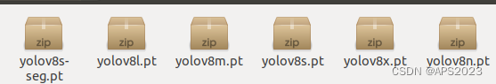

**目录**
[1 配置pytorch环境](https://blog.csdn.net/qq_41694024/article/details/133983334?utm_medium=distribute.pc_relevant.none-task-blog-2~default~baidujs_baidulandingword~default-8-133983334-blog-107413348.235^v43^pc_blog_bottom_relevance_base4&spm=1001.2101.3001.4242.5&utm_relevant_index=9#t0)
[2 配置yolo环境](https://blog.csdn.net/qq_41694024/article/details/133983334?utm_medium=distribute.pc_relevant.none-task-blog-2~default~baidujs_baidulandingword~default-8-133983334-blog-107413348.235^v43^pc_blog_bottom_relevance_base4&spm=1001.2101.3001.4242.5&utm_relevant_index=9#t1)
[3 测试yoloV8的语义分割模型](https://blog.csdn.net/qq_41694024/article/details/133983334?utm_medium=distribute.pc_relevant.none-task-blog-2~default~baidujs_baidulandingword~default-8-133983334-blog-107413348.235^v43^pc_blog_bottom_relevance_base4&spm=1001.2101.3001.4242.5&utm_relevant_index=9#t2)

---

## 1 配置pytorch环境
> 我的电脑为Y9000P 4090，英伟达显卡驱动版本为525.105.17，驱动显示最高的cuda版本号为12.0，cuda版本为11.6，cudnn版本号为8.5.0。Anaconda3版本为22.9.0。如下：
> 
> 对于跑[yolo](https://so.csdn.net/so/search?q=yolo&spm=1001.2101.3001.7020)来说，我们创建python3.8环境。
> 
> 启动yo环境：
> 我的cuda是11.6，[安装pytorch](https://so.csdn.net/so/search?q=%E5%AE%89%E8%A3%85pytorch&spm=1001.2101.3001.7020)1.13.0并用pip加速。
> 
> 安装成功，测试cuda是否可用：
> 这样就是成功的了。

```
conda create -n yo python=3.8
```
```
conda activate yo
```
```
pip install torch==1.13.0 torchvision==0.14.0 torchaudio==0.13.0 -i https://pypi.tuna.tsinghua.edu.cn/simple/
```
```
(yo) liuhongwei@liuhongwei-Legion-Y9000P-IRX8H:~$ python


Python 3.8.18 | packaged by conda-forge | (default, Oct 10 2023, 15:44:36) 


[GCC 12.3.0] on linux


Type "help", "copyright", "credits" or "license" for more information.


>>> import torch


>>> torch.cud


torch.cuda                          torch.cudnn_convolution_relu(


torch.cudnn_affine_grid_generator(  torch.cudnn_convolution_transpose(


torch.cudnn_batch_norm(             torch.cudnn_grid_sampler(


torch.cudnn_convolution(            torch.cudnn_is_acceptable(


torch.cudnn_convolution_add_relu(   


>>> torch.cud


torch.cuda                          torch.cudnn_convolution_relu(


torch.cudnn_affine_grid_generator(  torch.cudnn_convolution_transpose(


torch.cudnn_batch_norm(             torch.cudnn_grid_sampler(


torch.cudnn_convolution(            torch.cudnn_is_acceptable(


torch.cudnn_convolution_add_relu(   


>>> torch.cuda.is_available()


True


>>>
```
## 2 配置yolo环境
> yoloV8环境及其好配置，只需输入一行命令即可安装所有所需依赖：
> 
> 安装完成。
> 从官网下载yolo：
> [yoloV8官网https://github.com/ultralytics/ultralytics](https://github.com/ultralytics/ultralytics)        或者直接克隆到桌面：
> 下载预训练模型：在它的官方网站上有用作各种任务的预训练权重。
> 
> 我们下载目标检测和语义分割权重：
> 
> 将这些权重放到yoloV8目录下，创建权重文件夹weights，将权重放入其中：
> 目录结构如下：
> 
> 至此，我们配置好了yoloV8，开始进行测试。

```
pip install ultralytics
```
```
git clone https://github.com/ultralytics/ultralytics.git
```
## 3 测试yoloV8的[语义分割模型](https://so.csdn.net/so/search?q=%E8%AF%AD%E4%B9%89%E5%88%86%E5%89%B2%E6%A8%A1%E5%9E%8B&spm=1001.2101.3001.7020)
> 我们在网上随便下载一张图像：
> 预测，可能会出错，不用慌，教程没有问题，是你的conda环境有问题，撞库了。
> fusedconv.weight.copy_(torch.mm(w_bn, w_conv).view(fusedconv.weight.shape))
RuntimeError: CUDA error: CUBLAS_STATUS_INVALID_VALUE when calling `cublasSgemm( handle, opa, opb, m, n, k, &alpha, a, lda, b, ldb, &beta, c, ldc)`
> 解决办法：
> 清空运行时库缓存：
> 
> 运行成功，我们把source换成我们自己的图像：
> 
> 成功

```
yolo task=segment mode=predict model=weights/yolov8s-seg.pt source=0
```
```
unset LD_LIBRARY_PATH
```


> 来自: [YOLO V8语义分割模型部署_yolov8语义分割-CSDN博客](https://blog.csdn.net/qq_41694024/article/details/133983334?utm_medium=distribute.pc_relevant.none-task-blog-2~default~baidujs_baidulandingword~default-8-133983334-blog-107413348.235^v43^pc_blog_bottom_relevance_base4&spm=1001.2101.3001.4242.5&utm_relevant_index=9)

