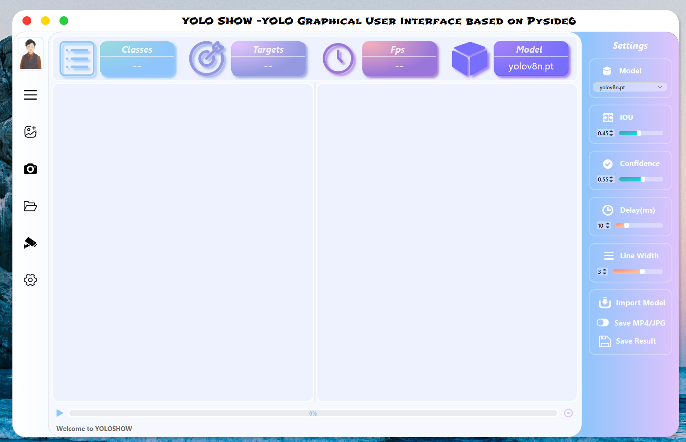

## 介绍
_**YOLOSHOW**_ 是一款集合了 `YOLOv5``YOLOv7``YOLOv8``YOLOv9``RT-DETR`
[English](https://swimmingliu.cn/posts/diary/yoloshow)   |   简体中文 

## 演示视频
`YOLOSHOW v1.x` : [YOLOSHOW-YOLOv9/YOLOv8/YOLOv7/YOLOv5/RTDETR GUI](https://www.bilibili.com/video/BV1BC411x7fW)
`YOLOSHOW v2.x` : [YOLOSHOWv2.0-YOLOv9/YOLOv8/YOLOv7/YOLOv5/RTDETR GUI](https://www.bilibili.com/video/BV1ZD421E7m3)
## 待做清单

-  加入 `YOLOv9` 算法
-  调整UI (菜单栏)
-  完成Rtsp功能
-  支持实例分割 （ `YOLOv5` & `YOLOv8` ）
-  加入 `RT-DETR` 算法 ( `Ultralytics` 仓库)
-  加入模型对比模式（VS Mode）
-  支持姿态估计 （ `YOLOv8` ）
-  追踪和计数模型 ( `工业化` )
## 功能
### 1. 支持 图片 / 视频 / 摄像头 / 文件夹（批量） 目标检测
选择左侧菜单栏的图片 / 视频 / 摄像头 / 文件夹（批量）进行目标检测
### 2. 动态切换模型 / 调整超参数
程序开始检测时，支持动态切换模型 / 调整超参数

1. 支持动态切换 `YOLOv5` / ` YOLOv7` / `YOLOv8` / `YOLOv9` / `RTDETR` / `YOLOv5-seg` / `YOLOv8-seg` 模型
2. 支持动态修改 `IOU` / `Confidence` / `Delay time ` / `line thickness` 超参数
### 3. 动态加载模型
程序可以自动检测`ptfiles` 文件夹中包含 [YOLOv5 Models](https://github.com/ultralytics/yolov5/releases) / [YOLOv7 Models](https://github.com/WongKinYiu/yolov7/releases/) / [YOLOv8 Models](https://github.com/ultralytics/assets/releases/) / [YOLOv9 Models](https://github.com/WongKinYiu/yolov9/releases/)`pt` 模型.
如果你需要导入新的 `pt` 文件, 请点击 `Settings` 框中的 `Import Model` 按钮 来选择需要导入的 `pt` 文件. 然后程序会把该文件复制到 `ptfiles` 文件夹下.
**Notice :**

1. 所有的 `pt` 模型文件命名必须包含 `yolov5` / `yolov7` / `yolov8` / `yolov9` / `rtdetr` 中的任意一个版本. (如 `yolov8-test.pt`)
2. 如果是分割类型的 `pt` 文件, 命名中应包含 `yolov5n-seg` / `yolov8s-seg` 中的任意一个版本. (如 `yolov8n-seg-test.pt`)
3. 如果是姿态检测类型的 `pt` 文件, 命名中应包含`yolov8n-pose` 中的任意一个版本. (如 `yolov8n-pose-test.pt`)
### 4. 加载超参数配置

1. 程序启动后, 自动加载最近保存的超参数配置.
2. 程序关闭后, 自动保存最近修改的超参数配置.
### 5. 保存检测结果
如果需要保存检测结果，请在检测前点击 `Save MP4/JPG` . 然后等待检测完毕，选择需要保存的路径进行结果保存.
### 6. 同时支持目标检测、实例分割和姿态估计
从 _**YOLOSHOW v2.2**_ 起 ，支持目标检测、实例分割和姿态估计多任务。同时支持不同版本的任务切换，如从`YOLOv5` 目标检测任务 切换到 `YOLOv8` 实例分割任务。
### 7. 支持目标检测、实例分割和姿态估计模型对比模式
从 _**YOLOSHOW v2.0**_ 起，支持目标检测、实例分割和姿态估计模型对比模式。
## 运行准备工作
### 实验环境
```
OS : Windows 11 
CPU : Intel(R) Core(TM) i7-10750H CPU @2.60GHz 2.59 GHz
GPU : NVIDIA GeForce GTX 1660Ti 6GB
```
### 1. 创建虚拟环境
创建内置Python 3.9的conda虚拟环境, 然后激活该环境.
```
conda create -n yoloshow python=3.9
conda activate yoloshow
```
### 2. 安装Pytorch框架
```
Windows: pip3 install torch torchvision torchaudio --index-url https://download.pytorch.org/whl/cu118
Linux: pip3 install torch torchvision torchaudio --index-url https://download.pytorch.org/whl/cu118
```
安装其他版本的 Pytorch : [](https://pytorch.org/)
### 3. 安装依赖包
切换到YOLOSHOW程序所在的路径
安装程序所需要的依赖包
```
pip install -r requirements.txt -i https://pypi.tuna.tsinghua.edu.cn/simple
pip install "PySide6-Fluent-Widgets[full]" -i https://pypi.tuna.tsinghua.edu.cn/simple
pip install -U Pyside6 -i https://pypi.tuna.tsinghua.edu.cn/simple
```
### 4. 添加字体
#### Windows 用户
把所有的`fonts` 文件夹中的字体文件 `*.ttf` 复制到 `C:\Windows\Fonts`
#### Linux 用户
```
mkdir -p ~/.local/share/fonts
sudo cp fonts/Shojumaru-Regular.ttf ~/.local/share/fonts/
sudo fc-cache -fv
```
#### MacOS 用户
MacBook实在太贵了，我买不起。你们自己想办法安装吧~😂
### 5. 运行程序
## 使用框架
[](https://www.python.org/)[](https://pytorch.org/)[](https://doc.qt.io/qtforpython-6/PySide6/QtWidgets/index.html)
## 参考文献
### YOLO 算法
[YOLOv5](https://github.com/ultralytics/yolov5)[YOLOv7](https://github.com/WongKinYiu/yolov7) 	[YOLOv8](https://github.com/ultralytics/ultralytics)	[YOLOv9](https://github.com/WongKinYiu/yolov9)
### YOLO 图形化界面
[YOLOSIDE](https://github.com/Jai-wei/YOLOv8-PySide6-GUI)	[PyQt-Fluent-Widgets](https://github.com/zhiyiYo/PyQt-Fluent-Widgets)

> 来自: [YOLOSHOW 中文版 - YOLOv5/YOLOv7/YOLOv8/YOLOv9/RTDETR GUI based on Pyside6 | SwimmingLiu's Blog](https://swimmingliu.cn/posts/diary/yoloshow-cn/)

