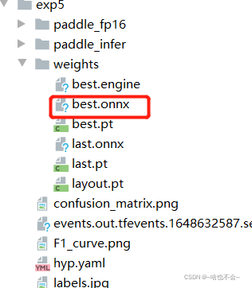

#### 文章目录
- [前言](https://blog.csdn.net/qq_55068938/article/details/124445880#_5)
- [一、环境准备](https://blog.csdn.net/qq_55068938/article/details/124445880#_15)
   - [1、yolov5环境及代码准备](https://blog.csdn.net/qq_55068938/article/details/124445880#1yolov5_16)
   - [2、Paddle环境搭建](https://blog.csdn.net/qq_55068938/article/details/124445880#2Paddle_25)
   - [2.1 直接安装](https://blog.csdn.net/qq_55068938/article/details/124445880#21__27)
   - [2.2 whl安装](https://blog.csdn.net/qq_55068938/article/details/124445880#22_whl_30)
   - [3、x2paddle安装](https://blog.csdn.net/qq_55068938/article/details/124445880#3x2paddle_34)
   - [3.1 直接安装](https://blog.csdn.net/qq_55068938/article/details/124445880#31___36)
   - [3.2 源码安装](https://blog.csdn.net/qq_55068938/article/details/124445880#32__42)
- [二、模型准备](https://blog.csdn.net/qq_55068938/article/details/124445880#_52)
   - [1.pt准备](https://blog.csdn.net/qq_55068938/article/details/124445880#1pt_53)
   - [2.pt->onnx](https://blog.csdn.net/qq_55068938/article/details/124445880#2ptonnx_56)
- [三、模型转换onnx->inference](https://blog.csdn.net/qq_55068938/article/details/124445880#onnxinference_85)
- [四、转换中可能会遇到的问题](https://blog.csdn.net/qq_55068938/article/details/124445880#_109)
- [总结](https://blog.csdn.net/qq_55068938/article/details/124445880#_122)
## 前言
近期，项目部署时同时用了pytorch和[Paddle](https://so.csdn.net/so/search?q=Paddle&spm=1001.2101.3001.7020)，遇到了些问题，觉得可能是框架冲突，所以我去尝试了用Paddle框架去推理[YOLOV5](https://so.csdn.net/so/search?q=YOLOV5&spm=1001.2101.3001.7020)，虽然Paddle框架实现的目标检测网络也不少，但是我的模型已经基本成熟，故不想再去重新训练。本文记录的是第一步，也就是pt模型转换为Paddle 支持的inference模型，如下。

---

## 一、环境准备
### 1、yolov5环境及代码准备
本人所使用的目标检测网络是YOLOV5(建议使用最新版本)，下载链接如下：[https://github.com/ultralytics/yolov5](https://github.com/ultralytics/yolov5)，这里所需的依赖项根据文中的requirements.txt安装即可
```
pip install -r requirements.txt
```
### 2、Paddle环境搭建
### 2.1 直接安装
直接安装的话，参考官网教程：[https://www.paddlepaddle.org.cn/install/quick?docurl=/documentation/docs/zh/install/pip/windows-pip.html](https://www.paddlepaddle.org.cn/install/quick?docurl=/documentation/docs/zh/install/pip/windows-pip.html)
### 2.2 [whl](https://so.csdn.net/so/search?q=whl&spm=1001.2101.3001.7020)安装
由于个人感觉2.1那样安装不太稳定并且还慢，故我一直都是将whl包下下来，然后进行安装的，链接如下：[https://www.paddlepaddle.org.cn/whl/mkl/stable.html](https://www.paddlepaddle.org.cn/whl/mkl/stable.html)，这里包含所有版本下的whl文件，根据你的CUDA、cudnn、python版本进行下载安装即可。
需要注意的是：这里的gpu版本默认不支持tensorrt，如果你想用tensorrt推理，那么按照这个网址去下载对应的版本：[https://www.paddlepaddle.org.cn/inference/v2.2/user_guides/download_lib.html](https://www.paddlepaddle.org.cn/inference/v2.2/user_guides/download_lib.html)，paddle的版本默认是最新的，可以点击页面左上角的倒三角进行切换。
### 3、x2paddle安装
### 3.1 直接安装
```
pip install x2paddle
```
### 3.2 源码安装
```
git clone https://github.com/PaddlePaddle/X2Paddle.git
cd X2Paddle
git checkout develop
python setup.py install
```
方法一较为稳定，方法二可以体验最新的版本，我求稳，故直接安装
## 二、模型准备
### 1.pt准备
如果你已有自己的yolov5模型，那么可以直接进行下一步，如果没有自己的模型，那么可以去参考网上的教程去训练一下自己的模型，也可以先用官方的模型进行试验一把，先把流程跑通。
### 2.pt->onnx
如果你习惯命令行操作，可以去网上参考一些转换教程，这里拿官方模型进行示例：
```
python models/export.py --weights yolov5s.pt --img 640 --batch 1
```
我习惯直接在代码中进行更改，需要在YOLOV5里的export.py进行参数更改，需要注意的参数如下：
```
data: 数据集yaml文件路径
weights:自己的模型路径
imgsz:图片尺寸
batch-size:默认为1，不用更改
device：运行设备，若cpu，则直接写cpu，若gpu，则写0或0,1,2,3
half: 半精度，建议改为False，否则转换inference模型时会出错
dynamic:建议改为False
simplify:建议为True
opset:onnx协议，建议改为11或12
include:列表形式，储存你需要转换的模型后缀，支持torchscript, onnx, engine, coreml, saved_model, pb, tflite, tfjs
```
运行export.py之后，如出现如下界面，则证明转换成功

转换成功后，会在你的模型路径下生成对应的onnx文件，如图：

## 三、模型转换onnx->inference
此步，我们只需要一行命令即可
```
x2paddle --framework=onnx --model=onnx_model.onnx --save_dir=pd_model   #onnx时
x2paddle --framework=tensorflow --model=tf_model.pb --save_dir=pd_model  #tensorflow时
x2paddle --framework=caffe --prototxt=deploy.prototxt --weight=deploy.caffemodel --save_dir=pd_model  #caffe时
```
:::info
x2paddle --framework=onnx --model=onnx_model.onnx --save_dir=pd_model   #onnx时
:::
x2paddle目前支持转换的模型格式为Tensorflow、onnx、caffe，参数说明如下

| 参数 | 含义 |
| --- | --- |
| –freamework | 需要转换的模型类型（即tensorflow、onnx、caffe） |
| –model | 需要转换的模型路径 |
| –save_dir | 保存转换后的模型路径 |
| –prototxt | caffe模型的proto文件路径 |
| –weight | caffe模型的参数文件路径 |

如出现如下界面，则证明转换成功：

转换成功后，会在你指定的save_dir路径下生成如下文件：

其中inference_model文件夹就是我们需要的推理模型。x2paddle_code.py是转换后paddlepaddle构建的模型文件。model.pdparams是对应模型文件的权重（不是推理模型权重）。
## 四、转换中可能会遇到的问题
在pt->onnx时遇到问题：

解决方案已经提示在图中，看样子是opset过高导致，解决它时，我试过将其降低为9，结果出错：

字面上看不太兼容，所以我就直接改为了11,最终出现如下成功的界面

onnx->paddle参考链接如下：[https://blog.csdn.net/libo1004/article/details/119026500](https://blog.csdn.net/libo1004/article/details/119026500)

---

## 总结
这就是本篇所有内容，后期会出一个Paddle推理YOLOV5的文章，还请多多指教。有错写的地方麻烦帮忙指正，有什么问题可以在评论区交流，回复的可能不太及时，还请谅解，另外，喜欢机器视觉的朋友可以加入QQ群：995760755 一起讨论遇到的一些问题。

> 来自: [YOLOV5的pt模型转Paddle的inference模型_yolov5模型转为paddle格式-CSDN博客](https://blog.csdn.net/qq_55068938/article/details/124445880)

