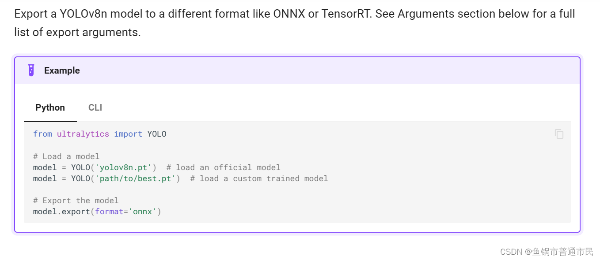
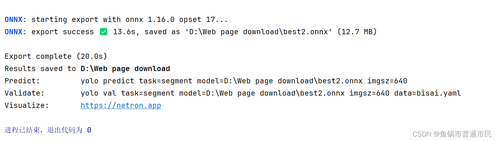

作者在用fastdeploy部署YOLOv8模型时要将pt[文件转换](https://so.csdn.net/so/search?q=%E6%96%87%E4%BB%B6%E8%BD%AC%E6%8D%A2&spm=1001.2101.3001.7020)成onnx
于是可以在官方文件中找到对应方法链接：[Export - Ultralytics YOLOv8 Docs](https://docs.ultralytics.com/modes/export/#usage-examples)

笔者在创建的[虚拟环境](https://so.csdn.net/so/search?q=%E8%99%9A%E6%8B%9F%E7%8E%AF%E5%A2%83&spm=1001.2101.3001.7020)中安装ultralytics
命令行为
```
pip install ultralytics
```
然后笔者新创建了python文件，其中代码示例如下
```
from ultralytics import YOLO


 


# 加载模型


model = YOLO('yolov8n.pt')  # 加载官方模型（示例）


model = YOLO('D:/Web page download/best2.pt')  # 加载自定义训练模型（示例）


 


# 导出模型


model.export(format='onnx')
```
注意自己训练好的**pt文件的地址**和**加载的官方模型**
**最后就可以在对应文件夹下面找到转换成功的onnx文件**


> 来自: [YOLOv8模型转换pt-＞onnx(附上代码)_yolov8n.pt转onnx-CSDN博客](https://blog.csdn.net/2303_80018785/article/details/138194961)

