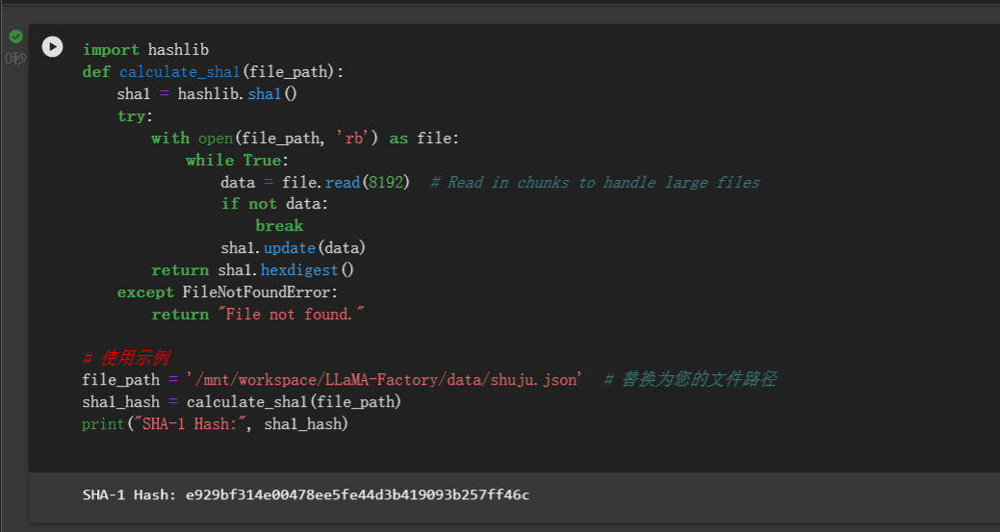

- 隔离环境很必要

- 安装依赖
```
git clone https://github.com/hiyouga/LLaMA-Factory.git
conda create -n llama_factory python=3.10
conda activate llama_factory
cd LLaMA-Factory
#老版本用的 pip install -r requirements.txt,我也感觉这个更好一些
pip install -e .[metrics]

```

- 数据集准备
- 进入data/dataset_info.json,添加self_cognition.json


file_sha1获取：新建一个sha1.ipynb文件,改一下file_path
```
import hashlib
def calculate_sha1(file_path):
    sha1 = hashlib.sha1()
    try:
        with open(file_path, 'rb') as file:
            while True:
                data = file.read(8192)  # Read in chunks to handle large files
                if not data:
                    break
                sha1.update(data)
        return sha1.hexdigest()
    except FileNotFoundError:
        return "File not found."
 
# 使用示例
file_path = './Desktop/self_cognition.json'  # 替换为您的文件路径
sha1_hash = calculate_sha1(file_path)
print("SHA-1 Hash:", sha1_hash)

```



###### 利用 LLaMA Board 可视化界面训练（由 [Gradio](https://github.com/gradio-app/gradio) 驱动）

- 阿里云用户指南,这个点还是很重要的，不设置的话显示界面有问题，因为我使用的是阿里云dsw

如果您在阿里云上使用 LLaMA Board 时遇到显示问题，请尝试在启动前使用以下命令设置环境变量：
```
export GRADIO_ROOT_PATH=/${JUPYTER_NAME}/proxy/7860/
```

```
python src/train_web.py
```

- 导出模型

训练结果：
LLama-Factory/saves/ChatGLM3-6B-Chat/lora/train_2024-05-01-23-23-24
融合结果：
/mnt/workspace/trainmodel/01

- 检测模型
- 


- 更加详细的内容可以看官网信息

[https://github.com/hiyouga/LLaMA-Factory/blob/main/README_zh.md](https://github.com/hiyouga/LLaMA-Factory/blob/main/README_zh.md)


```
参考链接
https://github.com/hiyouga/LLaMA-Factory/blob/main/README_zh.md
https://www.bilibili.com/video/BV1UH4y1W7PH/?spm_id_from=333.880.my_history.page.click&vd_source=cbdbd8d9f59c48c14f18e0c14f857854
https://blog.csdn.net/weixin_44480960/article/details/137092717
https://blog.csdn.net/qq_30308635/article/details/135833838
https://blog.csdn.net/m0_65814643/article/details/138349265
https://blog.csdn.net/qq_39813001/article/details/136088834
https://blog.csdn.net/kebijuelun/article/details/135052157
https://blog.csdn.net/qiqi_ai_/article/details/131299525
```
