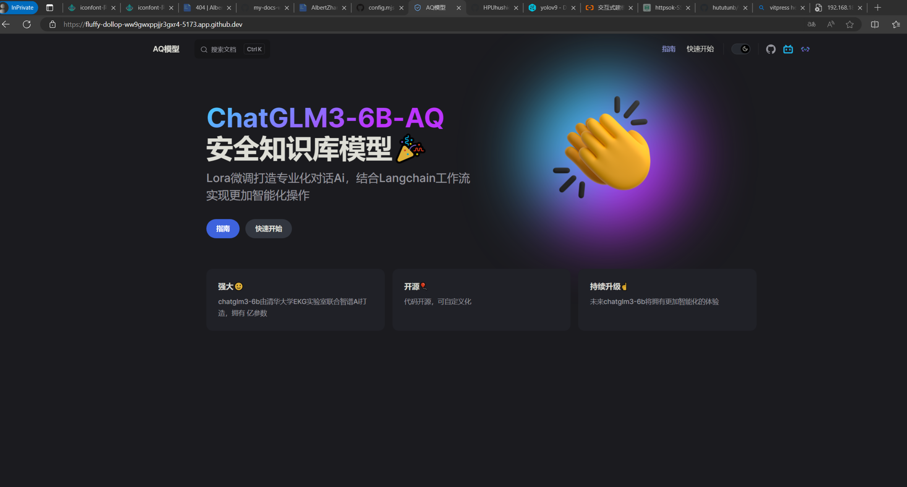
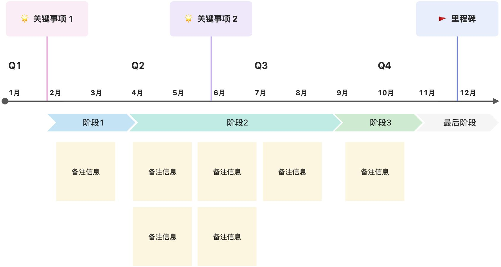

## 项目背景
> 大家都调侃说2023年是AI元年，不得不说AI在我们生活中逐渐扮演着越来越重要的角色，如何有效的把AI模型结合当前生产生活实际显得尤为重要，基于此并结合专业知识，我们想打造一款工业消防类型的AI知识库模型，在现有的AI模型基础之上，使用微调技术，收集所需数据集进行微调。

- 想法来源：

[校企合作！基于文心大模型共建水科学研究助手WaterScholar](https://mp.weixin.qq.com/s/_sJsjdp0sIcD0Vh5oqMMZA)

- 具体思考
> 市面上不缺乏各式各样的对话模型，但是都是基于底层AI大模型的调用，不能做到有针对性的回答某个非常细化的问题，所以说一个细化的AI知识库就显得尤为重要了，但是我们不可能从零开始去训练一个模型，不论是从技术，成本等等方面。随着 ChatGPT 的爆火，很多机构都开源了自己的大模型，比如ChatGLM-6B/ChatGLM-10B/ChatGLM-130B，HuggingFace 的 BLOOM-176B，LLAMA2，
> 这些大公司或者研究机构，都是有足够资源的来开发大模型，但是对于一般的小公司或者个人来说，要想开发自己的大模型几乎不可能，要知道像 ChatGPT 这样的大模型，一次训练的成本就在上千亿美元。
> 那么针对于小公司或者个人，我们怎么能够利用这些开源的大模型，在自己的数据上继续训练，从而应用于自己的业务场景？有没有低成本的方法微调大模型？
> 答案是有的。目前主流的方法包括2019年 Houlsby N 等人提出的 Adapter Tuning，2021年微软提出的 LORA，斯坦福提出的 Prefix-Tuning，谷歌提出的 Prompt Tuning，2022年清华提出的 P-tuning v2。
> 
我选择的是**ChatGLM3-6B模型+LORA/**[**LLaMA-Factory**](https://github.com/hiyouga/LLaMA-Factory)**+**[**LangChain-Chatchat**](https://github.com/chatchat-space/Langchain-Chatchat)**，使用ChatGLM3-6B作为预训练模型，使用LORA和**[**LLaMA-Factory**](https://github.com/hiyouga/LLaMA-Factory)**微调框架，使用**[**LangChain-Chatchat**](https://github.com/chatchat-space/Langchain-Chatchat)**作为应用框架，整体的思路以上这些，下面是实现过程的一些记录，完整的内容可以查看我们推出的文档**

### ChatGLM3-6B介绍
**ChatGLM3** 是智谱AI和清华大学 KEG 实验室联合发布的对话预训练模型。ChatGLM3-6B 是 ChatGLM3 系列中的开源模型，在保留了前两代模型对话流畅、部署门槛低等众多优秀特性的基础上，ChatGLM3-6B 引入了如下特性：

1. **更强大的基础模型：** ChatGLM3-6B 的基础模型 ChatGLM3-6B-Base 采用了更多样的训练数据、更充分的训练步数和更合理的训练策略。在语义、数学、推理、代码、知识等不同角度的数据集上测评显示，* _ChatGLM3-6B-Base 具有在 10B 以下的基础模型中最强的性能_*。
2. **更完整的功能支持：** ChatGLM3-6B 采用了全新设计的 [Prompt 格式](https://github.com/THUDM/ChatGLM3/blob/main/PROMPT.md) ，除正常的多轮对话外。同时原生支持[工具调用](https://github.com/THUDM/ChatGLM3/blob/main/tools_using_demo/README.md)（Function Call）、代码执行（Code Interpreter）和 Agent 任务等复杂场景。
3. **更全面的开源序列：** 除了对话模型 [ChatGLM3-6B](https://huggingface.co/THUDM/chatglm3-6b) 外，还开源了基础模型 [ChatGLM3-6B-Base](https://huggingface.co/THUDM/chatglm3-6b-base) 、长文本对话模型 [ChatGLM3-6B-32K](https://huggingface.co/THUDM/chatglm3-6b-32k) 和进一步强化了对于长文本理解能力的 [ChatGLM3-6B-128K](https://huggingface.co/THUDM/chatglm3-6b-128k)。以上所有权重对学术研究**完全开放** ，在填写 [问卷](https://open.bigmodel.cn/mla/form) 进行登记后**亦允许免费商业使用**。

- 工业上需要
- 痛点2...
- 痛点3...
- 
## 项目目标
> 1. 企业可做到模型可自主部署
> 2. 模型知识库做到较大范围的
> 3. 可以达到的（Attainable）
> 4. 要与其他目标具有一定的相关性（Relevant）
> 5. 有明确的截止期限（Time-bound）

## 
## 关键事项
> 为达成上述目标，需要完成哪些关键事项。

- 关键事项1...
- 关键事项2...
- 关键事项3...
## 里程碑
> 整个项目中，关键节点的里程碑计划。

## 人员安排
> 输入项目的所有干系人，包括内部和外部干系人。

| **人员** | **岗位** |
| --- | --- |
| @提及 | 项目经理 |
| @提及 | 技术负责人 |
| @提及 | 产品负责人 |

## 风险提示
> 对公司战略、项目结题、法务风险问题进行提示，并说明应对措施。

[面向煤矿安全领域的实体识别研究.pdf](https://www.yuque.com/attachments/yuque/0/2024/pdf/40770342/1714629530374-e3087f3b-295a-446e-b3e5-eafe6004e0cc.pdf)
[消防给水及消火栓系统技术规范.pdf](https://www.yuque.com/attachments/yuque/0/2024/pdf/40770342/1714629562122-eb16913e-f07a-41b4-89a3-5f7b98bf2b52.pdf)
[MedInfo2019-QA-Medications.xlsx](https://www.yuque.com/attachments/yuque/0/2024/xlsx/40770342/1714629569677-b06848d3-d856-4057-92bb-0672a8b7bfde.xlsx)
[消防安全.pdf](https://www.yuque.com/attachments/yuque/0/2024/pdf/40770342/1714629583609-0c77385a-41fd-4369-8649-b41856547b0e.pdf)
[消防通用规范.pdf](https://www.yuque.com/attachments/yuque/0/2024/pdf/40770342/1714629597386-fcb71870-f1e0-40b8-8028-6beea285e0bf.pdf)

