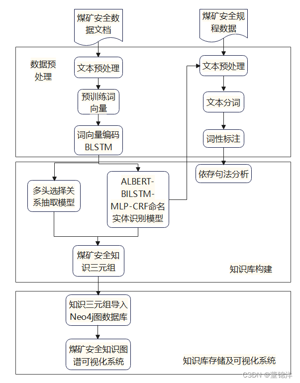

一、研究背景
煤矿安全领域存在着结构化、半结构化以及非结构化等不同种类的数据格式，不同的存储及关联方式，导致煤矿安全领域数据呈现海量离散低效的特点，数据无法被有效地运用起来。构建一个逻辑清晰、覆盖范围广的煤矿安全[知识图谱](https://so.csdn.net/so/search?q=%E7%9F%A5%E8%AF%86%E5%9B%BE%E8%B0%B1&spm=1001.2101.3001.7020)，以帮助煤矿工作人员或对煤矿有兴趣的学者全面查询及学习煤矿安全知识。
知识图谱的本质是一种知识表示形式，通过从多源文本中将隐藏的实体、[关系抽取](https://so.csdn.net/so/search?q=%E5%85%B3%E7%B3%BB%E6%8A%BD%E5%8F%96&spm=1001.2101.3001.7020)出来，并构成（实体-关系-实体）结构化的数据。知识图谱的应用场景分为水平知识图谱和垂直知识图谱两类，垂直知识图谱即只涉及一个领域的知识图谱，要求知识具有一定的深度；而水平知识图谱为涉及多个领域的知识图谱，如日常生活中的常识性问题等组成的知识图谱等。
表1  水平知识图谱与垂直知识图谱对比

| 知识图谱类型 | 广度 | 深度 | 细化程度 | 专家参与 | 自动化程度 |
| --- | --- | --- | --- | --- | --- |
| 水平知识图谱 | 宽 | 浅 | 粗粒度 | 轻度 | 高 |
| 垂直知识图谱 | 窄 | 深 | 细粒度 | 重度 | 低 |

则煤矿安全领域知识图谱的构建属于垂直[知识图谱构建](https://so.csdn.net/so/search?q=%E7%9F%A5%E8%AF%86%E5%9B%BE%E8%B0%B1%E6%9E%84%E5%BB%BA&spm=1001.2101.3001.7020)，需要更深的知识层次，需要煤矿安全领域专家参与以及为了追求知识图谱的质量，必然需要更多人工，自动化程度低。
二、专业领域知识图谱国内外现状
1.LinkedIMDB是由Hassanzadeh等构建的电影领域知识图谱，RDF三元组数量几百万之多；
2.UMLS是美国医学图书馆参与研究开发的医学术语知识图谱系统，该系统包含数百万医学实体及其相互关系；
3.2017年，杜泽宇等人利用知识图谱构建技术构建了电商领域知识图谱；
4.2018年，哈工大的张元博使用Bootstrapping算法和条件随机场构建了医疗图谱的知识库并验证了这方法的可行性；
5.2019年，经过对中国知网等许多期刊文献收录的国内空中交通管理资料进行分析，王建辉等人利用知识图谱实现了空中交通管理分析及可视化；
6.基于2020年新冠疫情OpenKG发布了百科、事件、临床、英雄事迹等一系列新冠开发知识图谱供公共使用。
三、研究内容
1.利用教科书、文献、煤矿安全规程、网络爬虫等途径收集关于煤矿安全数据集中的数据，并对数据进行预处理，构建数据集，对数据进行人工标注，80%作为训练集，10%作为测试集，另外10%作为验证集；
2.从多源煤矿安全文献资料中抽取大量煤矿安全概念实体。使用ALBERT中文预处理模型生成具有上下文信息的词向量，使用MLP将公共数据集THUCNews与ALBERT-BiLSTM模型训练获取到的输出参数作为煤矿安全数据集模型训练的输入参数。最终，构建ALBERT-BiLSTM-MLP-CRF模型进行命名实体识别任务；
3.针对煤矿安全规程文本数据，利用依存句法分析进行知识抽取。采用哈工大开发的自然语言处理平台LTP进行分词以及依存句法分析，获取实体关系并形成三元组；
4.构建煤矿安全领域知识库，把命名实体识别和关系抽取得到的煤矿安全三元组存储到Neo4j图数据库中，完成煤矿安全知识库构建工作；
5.开发煤矿安全领域知识图谱可视化系统。

图1   研究内容流程图

> 来自: [知识图谱应用——煤矿安全知识图谱构建技术研究学习_煤矿知识图谱-CSDN博客](https://blog.csdn.net/yangzai0326/article/details/125209201)

