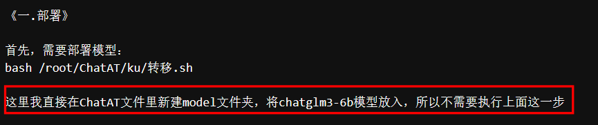
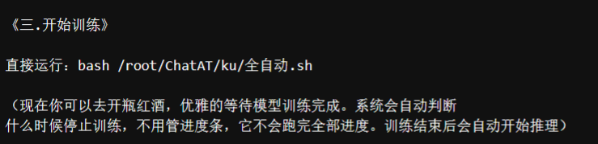
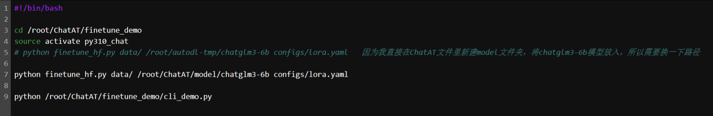
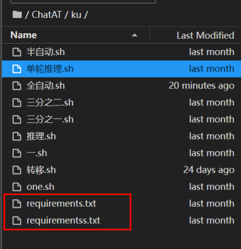
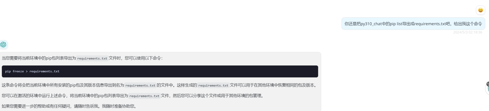

- /root/ChatAT

上传ChatAT压缩包，unzip解压缩
上传 requirements.txt文件，我等会放进去，就不用上传了
-------------------------------------------------------------------
[ChatAT.zip](https://www.yuque.com/attachments/yuque/0/2024/zip/40770342/1714675352046-40b72cd0-1d0a-4ef6-862e-268c903bbede.zip?_lake_card=%7B%22src%22%3A%22https%3A%2F%2Fwww.yuque.com%2Fattachments%2Fyuque%2F0%2F2024%2Fzip%2F40770342%2F1714675352046-40b72cd0-1d0a-4ef6-862e-268c903bbede.zip%22%2C%22name%22%3A%22ChatAT.zip%22%2C%22size%22%3A1312074%2C%22ext%22%3A%22zip%22%2C%22source%22%3A%22%22%2C%22status%22%3A%22done%22%2C%22download%22%3Atrue%2C%22taskId%22%3A%22ucef10c69-f25b-4728-b17a-0801470831f%22%2C%22taskType%22%3A%22upload%22%2C%22type%22%3A%22application%2Fx-zip-compressed%22%2C%22__spacing%22%3A%22both%22%2C%22mode%22%3A%22title%22%2C%22id%22%3A%22u4f55ac7b%22%2C%22margin%22%3A%7B%22top%22%3Atrue%2C%22bottom%22%3Atrue%7D%2C%22card%22%3A%22file%22%7D)   ------>含有chatglm3-6b和requirements.txt文件，
原版：[https://www.codewithgpu.com/i/THUDM/ChatGLM3/chatglm3-6b_finetune](https://www.codewithgpu.com/i/THUDM/ChatGLM3/chatglm3-6b_finetune)  v2版本


### 分析过程
我修改的是两处位置，
1.修改了chatglm3-6b的位置，这里针对的是/root根目录。如果是阿里云话就是/mnt/workspace,比葫芦画瓢改一下就行

2.修改了全自动.sh中的chatglm3-6b位置，因为上文改了，所以这里也要改


3.下面的这两个不用管，都在requrements.txt里，这里的两个貌似不知道作者要表达什么意思，


这里我是问了gpt，因为我看作者镜像用的是py310_chat，所以我要获取requirements.txt的话，就要先激活py310_chat ,再输入
```
source activate py310_chat or conda activate py310_chat ,我观察autodl是使用source
pip freeze > requirements.txt
```


----------------------------------------------------------------------------------------------------------------------
### 部署流程
:::warning
conda环境名不能错了，不容易注意到，创建名为py310_chat的conda环境
:::

```
#创建名为py310_chat的conda环境，因为作者创建的就是这个，我也懒得改了，
#上传压缩包，解压，目录为/root/ChatAT,
conda create -n py310_chat python=3.10
conda activate py310_chat
pip installr -r requirements.txt


#数据集制作
#只需将您的原始文本粘贴到这个文件下：ChatAT/数据集全自动处理/受刑文本.txt   （我也在里面放了一段小说文本，你可以替换掉）
#然后执行：
bash /root/ChatAT/openai_api_demo/二条龙.sh

#他就会自动处理你的原始文本，然后生成可以训练的数据集。

#《三.开始训练》
#直接运行：
bash /root/ChatAT/ku/全自动.sh


#《四.模型推理》
#模型最后训练完会自己推理运行，默认的是多轮对话，想用单轮推理可以用这个指令：

bash /root/ChatAT/ku/单轮推理.sh

#第二个是多轮对话，是这个指令：

bash /root/ChatAT/ku/推理.sh


#注意事项
#apikey是作者提供的，不能用了就去/root/ChatAT/openai_api_demo/第二步模型.py 改一下啊
```

