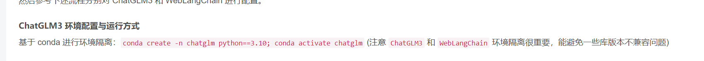

[https://github.com/mymusise/ChatGLM-Tuning/issues/59](https://github.com/mymusise/ChatGLM-Tuning/issues/59)

- 数据集准备参考

[https://github.com/abachaa/Medication_QA_MedInfo2019](https://github.com/abachaa/Medication_QA_MedInfo2019)
教程：[https://github.com/InternLM/Tutorial/tree/main/xtuner#3-%E8%87%AA%E5%AE%9A%E4%B9%89%E5%BE%AE%E8%B0%83](https://github.com/InternLM/Tutorial/tree/main/xtuner#3-%E8%87%AA%E5%AE%9A%E4%B9%89%E5%BE%AE%E8%B0%83)

- 数据集库暂时没有找到安全文本数据集，这里我们是自然语言处理，不是图像处理，所以需要文本数据集，实在不行只能自己手动整理了

[https://github.com/HPUhushicheng/funNLP](https://github.com/HPUhushicheng/funNLP)

- 安全文本数据集搜集

在搜索
找到了煤矿安全的
[https://blog.csdn.net/qiqi_ai_/article/details/131299525](https://blog.csdn.net/qiqi_ai_/article/details/131299525)
[http://jst.tsinghuajournals.com/CN/rhhtml/20190806.htm](http://jst.tsinghuajournals.com/CN/rhhtml/20190806.htm)
[https://cdmd.cnki.com.cn/Article/CDMD-11413-1015304692.htm](https://cdmd.cnki.com.cn/Article/CDMD-11413-1015304692.htm)

- 部署到openxlab

教程：[https://aicarrier.feishu.cn/docx/MQH6dygcKolG37x0ekcc4oZhnCe](https://aicarrier.feishu.cn/docx/MQH6dygcKolG37x0ekcc4oZhnCe)

- chatglm数据集微调

[https://github.com/yanqiangmiffy/InstructGLM](https://github.com/yanqiangmiffy/InstructGLM)
[https://github.com/hikariming/chat-dataset-baseline](https://github.com/hikariming/chat-dataset-baseline)

- 恶意网站数据集，下次有项目可以用

[https://brain.360.cn/opendatasetson?id=9](https://brain.360.cn/opendatasetson?id=9)

### 工业安全生产环境违规使用手机的识别，下次有项目可以用
[https://www.datafountain.cn/competitions/506/datasets](https://www.datafountain.cn/competitions/506/datasets)

可能需要用到[https://jina.ai/](https://jina.ai/)讲html转换成md

- chatglm微调教程，实在不行只能微调chatglml

[https://github.com/liucongg/ChatGLM-Finetuning](https://github.com/liucongg/ChatGLM-Finetuning)
