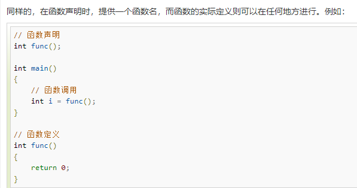

```
pthread_t pthread_self(void); //返回当前线程id


# 创建线程函数
#include <pthead.h>
int pthread_create(pthread_t *thread ,const pthread_attr_t *attr, void *(*start_routine) (void *), void *arg))
```
```
vim pthread.c

#创建线程函数
#include <pthread.h>


void * working(void *arg)
{
 ptintf('子线程，线程id:%ld\n ',pthread_self());
 for(int i =0; i<9;i++)
 {
 printf('child = i: = %ld\n', i);
 }
 return NULL;
}

int main(){
pthread_t tid;
pthrad_create(&tid ,NULL ,working ,NULL )
printf('主线程创建成功，线程id: %ld\n',pthread_self());
for(int i =0 ,i<3 ,i++)
{
printf('i = %d\n', i)
}
sleep(1);
return 0;

}

```
```
// pthread_create.c 
#include <stdio.h>
#include <stdlib.h>
#include <unistd.h>
#include <string.h>
#include <pthread.h>

// 子线程的处理代码
void* working(void* arg)
{
    printf("我是子线程, 线程ID: %ld\n", pthread_self());
    for(int i=0; i<9; ++i)
    {
        printf("child == i: = %d\n", i);
    }
    return NULL;
}

int main()
{
    // 1. 创建一个子线程
    pthread_t tid;
    pthread_create(&tid, NULL, working, NULL);

    printf("子线程创建成功, 线程ID: %ld\n", tid);
    // 2. 子线程不会执行下边的代码, 主线程执行
    printf("我是主线程, 线程ID: %ld\n", pthread_self());
    for(int i=0; i<3; ++i)
    {
        printf("i = %d\n", i);
    }
    
    // 休息, 休息一会儿...
    // sleep(1);
    
    return 0;
}


```
```
#运行文件
gcc pthread.c -lpthread -o pthread
./pthread
gcc xxx.c -lpthread -o xxxx
```
```
#include <iostream>
using namespace std;
 
//函数声明
int func();


int main()
{
   //函数调用
   int i = func();
}

//函数定义
int func()
{
  return 0;
}
```

```
#include <iostream>
using namespace std;
 
int main ()
{
  // 局部变量声明
  int a, b;
  int c;
 
  // 实际初始化
  a = 10;
  b = 20;
  c = a + b;
 
  cout << c;
 
  return 0;
}
```
```
//全局变量声明
#include <iostream>
using namespace std;

int c;

int main()
{

int a,b;
c =a+b;

//实际初始化
a = 10;
b = 20；

cout << c;

return 0;

}
```


- ┭┮﹏┭┮
```
/**
 ********************************************************************************************************
 *                                               示例代码
 *                                             EXAMPLE  CODE
 *
 *                      (c) Copyright 2024; SaiShu.Lcc.; Leo;
 *https://bjsstech.com 版权所属[SASU-北京赛曙科技有限公司]
 *
 *            The code is for internal use only, not for commercial
 *transactions(开源学习,请勿商用). The code ADAPTS the corresponding hardware
 *circuit board(代码适配百度Edgeboard-智能汽车赛事版), The specific details
 *consult the professional(欢迎联系我们,代码持续更正，敬请关注相关开源渠道).
 *********************************************************************************************************
 * @file icar.cpp
 * @author Leo
 * @brief 智能汽车-顶层框架（TOP）
 * @version 0.1
 * @date 2023-12-25
 * @copyright Copyright (c) 2024
 *
 */
#include "../include/common.hpp"     //公共类方法文件
#include "../include/detection.hpp"  //百度Paddle框架移动端部署
#include "../include/uart.hpp"       //串口通信驱动
#include "controlcenter.cpp"         //控制中心计算类
#include "detection/bridge.cpp"      //AI检测：坡道区
#include "detection/danger.cpp"      //AI检测：危险区
#include "detection/parking.cpp"     //AI检测：停车区
#include "detection/racing.cpp"      //AI检测：追逐区
#include "detection/rescue.cpp"      //AI检测：救援区
#include "preprocess.cpp"            //图像预处理类
#include "recognition/crossroad.cpp" //十字道路识别与路径规划类
#include "recognition/ring.cpp"      //环岛道路识别与路径规划类
#include "recognition/tracking.cpp"  //赛道识别基础类
#include <iostream>
#include <opencv2/highgui.hpp> //OpenCV终端部署
#include <opencv2/opencv.hpp>  //OpenCV终端部署
#include <signal.h>
#include <unistd.h>
using namespace std;
using namespace cv;
Mat ai_image;
bool start_ai=false;
bool start_uart=false;
std::thread ai_thread;
std::thread receive_thread;
std::thread send_thread;
std::mutex mut;
void thread_ai(std::shared_ptr<Detection> detection1){
  while(1){
    //std::cout<<"进去"<<std::endl;
    if(start_ai){
    mut.lock();
    Mat ii=ai_image.clone();
    start_ai=false;
    mut.unlock();
    detection1->inference(ii);
    //std::cout<<"进去2"<<std::endl;
    }
    else{
       waitKey(1);
    }
  }
}

int main(int argc, char const *argv[]) {
  Preprocess preprocess;    // 图像预处理类
  Motion motion;            // 运动控制类
  Tracking tracking;        // 赛道识别类
  Crossroad crossroad;      // 十字道路识别类
  Ring ring;                // 环岛识别类
  Bridge bridge;            // 坡道区检测类
  Parking parking;          // 停车区检测类
  Danger danger;            // 危险区检测类
  Rescue rescue;            // 救援区检测类
  Racing racing;            // 追逐区检测类
  ControlCenter ctrlCenter; // 控制中心计算类
  Display display(2);       // 初始化UI显示窗口
  VideoCapture capture;     // Opencv相机类
  float speed=0.8;
  // 目标检测类(AI模型文件)
  shared_ptr<Detection> detection = make_shared<Detection>(motion.params.model);
  detection->score = motion.params.score; // AI检测置信度
  // USB转串口初始化： /dev/ttyUSB0
  shared_ptr<Uart> uart = make_shared<Uart>("/dev/ttyUSB0"); // 初始化串口驱动
  int ret = uart->open();
  if (ret != 0) {
    printf("[Error] Uart Open failed!\n");
    return -1;
  }
  //uart->startReceive(); // 启动数据接收子线程
  receive_thread=std::thread(Receive,uart);
  if (!motion.params.debug) {  
    ai_thread = std::thread(thread_ai, detection); // 在这里初始化 ai_thread 对象  
  }  


  start_ai=false;
  if (ai_thread.joinable()) { // 检查线程是否已被创建（即可连接）  
    ai_thread.join(); // 等待线程结束  
  }

  uart->close(); // 串口通信关闭
  capture.release();
  return 0;
}
```

```
#include <thread>
#include <mutex>
#include <condition_variable>
#include <opencv2/opencv.hpp>

using namespace cv;
using namespace std;

Mat ai_image;
bool start_ai = false;
bool start_uart = false;
thread ai_thread;
thread receive_thread;
thread send_thread;
mutex mut;
condition_variable cond_var;

void thread_ai(shared_ptr<Detection> detection1) {
    while (true) {
        unique_lock<mutex> lock(mut);
        cond_var.wait(lock, [] { return start_ai; });
        Mat image_copy = ai_image.clone();
        start_ai = false;
        lock.unlock();
        detection1->inference(image_copy);
    }
}

void Send(shared_ptr<Uart> uart1, Motion& motion1) {
    while (true) {
        unique_lock<mutex> lock(mut);
        cond_var.wait(lock, [] { return start_uart; });
        if (uart1->isOpen()) {
            uart1->carControl(motion1.speed, motion1.servoPwm);
        }
        start_uart = false;
        lock.unlock();
    }
}

void Receive(shared_ptr<Uart> uart1) {
    while (true) {
        if (uart1->isOpen()) {
            uart1->receiveCheck();
        }
    }
}

int main() {
    auto detection = make_shared<Detection>();
    auto uart = make_shared<Uart>();
    Motion motion;

    // 启动子线程
    ai_thread = thread(thread_ai, detection);
    receive_thread = thread(Receive, uart);
    send_thread = thread(Send, uart, ref(motion));

    // 等待子线程完成
    ai_thread.join();
    receive_thread.join();
    send_thread.join();

    return 0;
}
```
在您提供的代码中，`thread_ai` 函数设计为一个子线程，负责处理图像检测的任务。这个函数使用了几个关键的编程概念和同步机制来确保线程安全和有效的资源管理。下面是对这个函数的详细解释：
### 函数签名和参数
```cpp
void thread_ai(std::shared_ptr<Detection> detection1)
```

- **参数**：`detection1` 是一个指向 `Detection` 类的智能指针。`Detection` 类可能封装了一些关于图像处理和对象检测的方法，如深度学习模型的推断等。使用 `std::shared_ptr` 确保在多线程环境中，对象的内存管理是安全的，并且当所有拥有该对象的线程都完成时，对象能自动被正确释放。
### 主循环和条件检查
```cpp
while (true) {
    unique_lock<mutex> lock(mut);
    cond_var.wait(lock, [] { return start_ai; });
    Mat image_copy = ai_image.clone();
    start_ai = false;
    lock.unlock();
    detection1->inference(image_copy);
}
```

- **无限循环**：这个线程通过一个无限循环持续运行，它不会自行停止，除非外部有机制终止它（如程序退出或特定条件触发）。
- **互斥锁与条件变量**：
   - `unique_lock<mutex>`：创建一个互斥锁，用来保护共享资源（如 `ai_image` 和 `start_ai`）的访问。这个锁是在作用域内自动管理的。
   - `cond_var.wait()`：这行代码会阻塞当前线程，直到条件变量被其他线程唤醒。它需要一个锁和一个条件。这里的条件是 `start_ai` 变量变为 `true`，这意味着有新的图像数据需要处理。
   - 该设计模式确保了资源的使用是在数据准备好后立即进行，减少等待时间，并保持线程同步。
- **图像处理**：
   - **图像复制**：在处理图像前，首先复制一份 `ai_image`，这样即使原图像在其他线程中被修改，当前线程的操作也不会受到影响。
   - **解锁**：在开始图像推断前解锁，以免长时间持有锁而阻塞其他线程访问共享资源。
   - **图像推断**：调用 `detection1->inference(image_copy)`，这可能是一个调用机器学习模型的函数，用于图像中目标的检测和识别。
### 总结
`thread_ai` 子线程是设计来进行持续的图像处理任务的。它在等待新数据到来时休眠，从而节省资源。当有新数据准备好时，线程被唤醒，处理数据，然后再次等待。这种设计有效地利用了多核处理器的优势，可以并行处理多个任务，同时保持高效和线程安全的操作。


```
#include <opencv2/opencv.hpp>
#include <thread>
#include <mutex>
#include <condition_variable>

using namespace cv;
using namespace std;

Mat ai_image;
bool start_ai = false;
mutex mut;
condition_variable cond_var;
shared_ptr<Detection> detection_ptr;

void thread_ai() {
    while (true) {
        unique_lock<mutex> lock(mut);
        cond_var.wait(lock, [] { return start_ai; });
        if (ai_image.empty()) {
            continue; // 如果图像为空，则跳过此次循环
        }
        Mat image_copy = ai_image.clone();
        start_ai = false;
        lock.unlock();
        detection_ptr->inference(image_copy);
    }
}

int main() {
    detection_ptr = make_shared<Detection>(); // 假设 Detection 类已经定义好
    thread ai_thread(thread_ai); // 启动子线程

    VideoCapture cap(0); // 打开默认摄像头
    if (!cap.isOpened()) {
        cerr << "Error: Unable to open the camera" << endl;
        return -1;
    }

    Mat frame;
    while (true) {
        cap >> frame; // 从摄像头捕获一帧
        if (frame.empty()) {
            cerr << "Warning: Empty frame" << endl;
            continue;
        }

        {
            lock_guard<mutex> lock(mut); // 加锁以保护共享资源
            ai_image = frame.clone(); // 更新共享的图像
            start_ai = true; // 设置标志以启动 AI 推理
        }
        cond_var.notify_one(); // 通知子线程

        // 可以在此处添加额外的图像显示或其他处理
        imshow("Live", frame);
        if (waitKey(5) >= 0)
            break; // 按任意键退出循环
    }

    ai_thread.join(); // 等待子线程结束
    return 0;
}

```

```
/**
 ********************************************************************************************************
 *                                               示例代码
 *                                             EXAMPLE  CODE
 *
 *                      (c) Copyright 2024; SaiShu.Lcc.; Leo;
 *https://bjsstech.com 版权所属[SASU-北京赛曙科技有限公司]
 *
 *            The code is for internal use only, not for commercial
 *transactions(开源学习,请勿商用). The code ADAPTS the corresponding hardware
 *circuit board(代码适配百度Edgeboard-智能汽车赛事版), The specific details
 *consult the professional(欢迎联系我们,代码持续更正，敬请关注相关开源渠道).
 *********************************************************************************************************
 * @file icar.cpp
 * @author Leo
 * @brief 智能汽车-顶层框架（TOP）
 * @version 0.1
 * @date 2023-12-25
 * @copyright Copyright (c) 2024
 *
 */
#include "../include/common.hpp"     //公共类方法文件
#include "../include/detection.hpp"  //百度Paddle框架移动端部署
#include "../include/uart.hpp"       //串口通信驱动
#include "controlcenter.cpp"         //控制中心计算类
#include "detection/bridge.cpp"      //AI检测：坡道区
#include "detection/danger.cpp"      //AI检测：危险区
#include "detection/parking.cpp"     //AI检测：停车区
#include "detection/racing.cpp"      //AI检测：追逐区
#include "detection/rescue.cpp"      //AI检测：救援区
#include "preprocess.cpp"            //图像预处理类
#include "recognition/crossroad.cpp" //十字道路识别与路径规划类
#include "recognition/ring.cpp"      //环岛道路识别与路径规划类
#include "recognition/tracking.cpp"  //赛道识别基础类
#include <iostream>
#include <opencv2/highgui.hpp> //OpenCV终端部署
#include <opencv2/opencv.hpp>  //OpenCV终端部署
#include <signal.h>
#include <unistd.h>
#include <thread.h>
#include <mutex>
#include <condition_variable>

using namespace std;
using namespace cv;

Mat ai_image;
bool start_ai = false;
std::mutex mut;
std::thread ai_thread;
std::condition_variable cond_var;
std::shared_ptr<Detection> detection_ptr;


void thread_ai() {
    while (true) {
        unique_lock<mutex> lock(mut);
        cond_var.wait(lock, [] { return start_ai; });
        if (ai_image.empty()) {
            continue; // 取不到图，继续下一帧取图
        }
        Mat image_copy = ai_image.clone();
        start_ai = false;
        lock.unlock();
        detection_ptr->inference(image_copy);   //推理
    }
}


int num;
string Path = "/root/workspace/";
uint8 Line[60][80];
uint8 Threshold_detach = 200;                      // 分割阈值
ImageStatustypedef ImageStatus;                    // 图像状态
ImageDealDatatypedef ImageDeal[60]; // 某一行数据处理
          // 利用此变量处理某一列的表示方式为ImageDeal[行].LeftBorder/RightBorder
uint8 break_point1=0,break_point2=0;
X_Y Corner_Left_Down_XY;
X_Y Corner_Right_Down_XY;
X_Y Corner_Left_Up_XY;
X_Y Corner_Right_Up_XY;
X_Y Corner_Right_Mid_XY;
X_Y Corner_Left_Mid_XY;
X_Y you;
X_Y zuo;
Func_t func_left;  // 补线函数,Func_t定义的是float的k,b
Func_t func_right; // 补线函数
uint8 first_break_r=0,first_break_l=0;

int y_new[22],x_new[22];
int x_new_left[22],x_new_right[22];
int y_left[22],x_left[22];
int y_right[22],x_right[22];

uint Fill_Top=0;
static int ytemp = 0;
static int TFSite = 0;
static int FTSite = 0;
static uint8 camera[60][80];//
unsigned char small_width = 80, small_height = 60; // 图像处理大小
Mat dst(small_height, small_width, CV_8U); // 按照已定大小获取图像
static float DetR = 0, DetL = 0; //左侧偏差,右侧偏差
int Left_Deviation[60];         // 左偏离，一般是指行之间；不靠谱
int Right_Deviation[60];        // 右偏离
static uint8 *PicTemp;  
static int Ysite = 0, Xsite = 0;   // Y坐标，X坐标
float left_circle_value =0;  // 左边界曲率值
float right_circle_value =0; // 右边界曲率值
int Left_Circle_progress;
int Task_Left_progress=0;
int Task_Right_progress=0;
int Right_Circle_progress;
uint8 BLACK_blocks_r = 0;
uint8 BLACK_blocks_l=0;
int L_L_Line = 0;             // 左边丢边
int L_R_Line = 0;             // 右边丢边
int right_deviation = 0;
int left_deviation = 0;
int l_start = 0; // 算左边界曲率的条件1
int l_end = 0;   // 同上的条件2
int r_end = 0;   // 算右边界曲率的条件1
int r_start = 0; // 同上
int center_start=0;
int center_end =0;
int cross_out_flag=0;
static int IntervalLow = 0, IntervalHigh = 0; // 低间隔，高间隔
static uint8 ImageScanInterval = 5;           // 图像扫描间隔是5
static uint8 ImageScanInterval_Cross = 2;     // 十字的图像扫描间隔是2
int m=0;
//斑马线
 uint8 c=0;
 uint8 flag_zebra_line = 0;
uint8 zebra_times = 0;
uint8 zebra_top = 0;
uint8 all_zebra_times = 0;
uint8 black_blocks = 0;
clock_t startTime, endTime;
float Weighting[10] = {0.96, 0.92, 0.88, 0.83, 0.77,0.71, 0.65, 0.59, 0.53, 0.47};
//图像坐标系h:60~0 w:0~80
void read_param() // 读1.json参数
{
    string jsonPath = Path  + "1.json";
    std::ifstream config_is(jsonPath); // 读取地址
    if (!config_is.good()) {
    std::cout << "Error: Params file path:[" << jsonPath << "] not find .\n";
    exit(-1);
    }
    nlohmann::json js_value;
    config_is >> js_value; // json头文件声明，
    try {
    params1 = js_value.get<qianzhan>();
    } catch (const nlohmann::detail::exception &e) {
    std::cerr << "Json Params Parse failed :" << e.what() << '\n';
    exit(-1);
    }
    // printf("normal:%d\n", params1.qianzhan_normal);

    std::cout << "camera Path :" << params1.uart_num << std::endl;
}

double  spendtime=0,zhenlv=0;

int main(int argc, char const *argv[]) {
     Preprocess preprocess;    // 图像预处理类
     Display display(2);       // 初始化UI显示窗口
     VideoCapture capture;     // Opencv相机类
    //shared_ptr<Detection> detection = make_shared<Detection>("../res/model/yolov3_mobilenet_v1");      //看起来上面是输入模型地址的，从edgeboard当中输入
    //shared_ptr<Detection> detection_ptr = make_shared<Detection>("../res/model/yolov3_mobilenet_v1");
    //ai_thread = std::thread(thread_ai, detection);             // 在这里初始化 ai_thread 对象  
    detection_ptr = make_shared<Detection>("../res/model/yolov3_mobilenet_v1");    //看起来上面是输入模型地址的，从edgeboard当中输入
    detection->score =0.3;                                     //置信度别给太高！！！不然检测不到。
    thread ai_thread(thread_ai); // 启动子线程
    capture = VideoCapture("/dev/video0");                     // 初始化相机串口，上面那个
    if (!capture.isOpened()) {
        printf("can not open video device!!!\n");
        return 0;
    }

    capture.set(CAP_PROP_FRAME_WIDTH, COLSIMAGE);       // 设置图像分辨率
    capture.set(CAP_PROP_FRAME_HEIGHT, ROWSIMAGE);      // 设置图像分辨率
    double rate = capture.get(CAP_PROP_FPS);            // 获取图像分辨率
    double width = capture.get(CAP_PROP_FRAME_WIDTH);   // 获取图像宽度
    double height = capture.get(CAP_PROP_FRAME_HEIGHT); // 获取图像高度
    uart_init();
    std::string window_name = "usbname"; // 显示图像的窗口的名称
    namedWindow("dst", WINDOW_AUTOSIZE);
    Mat frame,frame_model;
    Left_Circle_progress=0;
    Right_Circle_progress=0;
    ImageStatus.Road_type= Straight;
    ImageStatus.Circle_progress_01=0;
    ImageStatus.Last_Road_type=0;
    ImageStatus.Barn_Flag=0;

  Mat frame;
  while (true){
    capture >> frame; //取图
    if (frame.empty()){
      printf("frame is empty!!!\n");
      continue;
    }
    {
        lock_guard<mutex> lock(mut);   //加锁来保护共享资源
        ai_image = frame.clone();     //更新共享的图像
        start_ai = true;              //启动 AI 推理
    }
        cond_var.notify_one(); // 通知子线程

        // 开窗口
        imshow("Live", frame);
        if (waitKey(5) >= 0)
            break; // 按任意键退出循环
  }
    ai_thread.join(); // 等待子线程结束
    return 0;

}


```

