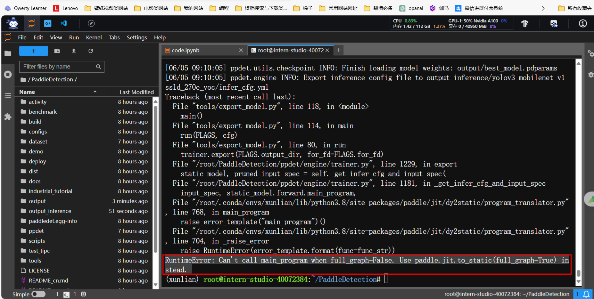
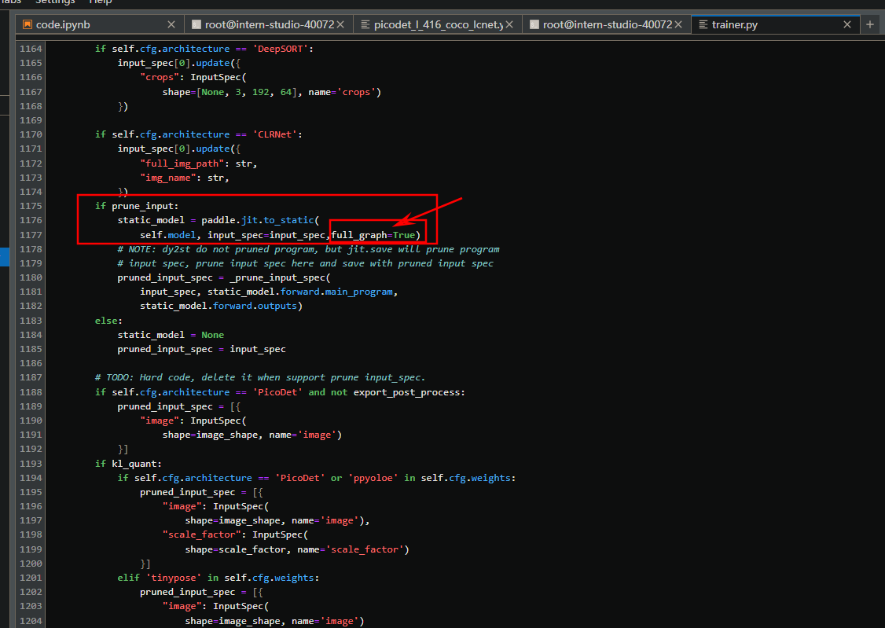

参考官方和非官方教程，总结一下

- 创建环境，aistudio是手动选一选paddle就可以安装了，我们需要自己安装
- 我的环境： cuda 11.7 python3.8（codna）创建 ，我试了一下3.7不行，至少3.8以上，要避坑啊
```markdown
conda create -n xunlian python=3.8
conda activate xunlian
```

- 装conda环境

参考：[https://www.paddlepaddle.org.cn/install/quick?docurl=/documentation/docs/zh/install/pip/linux-pip.html](https://www.paddlepaddle.org.cn/install/quick?docurl=/documentation/docs/zh/install/pip/linux-pip.html)
```markdown
python -m pip install paddlepaddle-gpu==2.6.1.post117 -f https://www.paddlepaddle.org.cn/whl/linux/mkl/avx/stable.html
```

- 拉取PadddleDection
```markdown
cd ~
git clone https://gitee.com/PaddlePaddle/PaddleDetection
# 安装PaddleDetection
cd PaddleDetection
pip install -r requirements.txt
# 编译安装paddledet
python setup.py install
cd ~

#########
pip install-r的时候可能会出现lap包装不上，这个时候你要
pip install numpy
```

- 数据集准备，也可以用从这里下载[https://aistudio.baidu.com/datasetdetail/257994](https://aistudio.baidu.com/datasetdetail/257994)，放入根目录下

[Car2024.zip](https://www.yuque.com/attachments/yuque/0/2024/zip/40770342/1717011389442-63d8785e-cfc6-49a5-975e-8c1bc5fcc42a.zip?_lake_card=%7B%22src%22%3A%22https%3A%2F%2Fwww.yuque.com%2Fattachments%2Fyuque%2F0%2F2024%2Fzip%2F40770342%2F1717011389442-63d8785e-cfc6-49a5-975e-8c1bc5fcc42a.zip%22%2C%22name%22%3A%22Car2024.zip%22%2C%22size%22%3A44923606%2C%22ext%22%3A%22zip%22%2C%22source%22%3A%22%22%2C%22status%22%3A%22done%22%2C%22download%22%3Atrue%2C%22taskId%22%3A%22u410d3443-18e0-4324-9556-147eb4b5e9d%22%2C%22taskType%22%3A%22upload%22%2C%22type%22%3A%22application%2Fx-zip-compressed%22%2C%22__spacing%22%3A%22both%22%2C%22mode%22%3A%22title%22%2C%22id%22%3A%22u8d72eb33%22%2C%22margin%22%3A%7B%22top%22%3Atrue%2C%22bottom%22%3Atrue%7D%2C%22card%22%3A%22file%22%7D)
```markdown
#解压模型
unzip Car2024.zip
```

- 生成train.txt和val.txt
```markdown
import os

#生成train.txt、val.txt
xml_dir  = '/root/Car2024/annotations'
img_dir = '/root/Car2024/images'
path_list = list()
for img in os.listdir(img_dir):
    img_path = os.path.join(img_dir,img)
    xml_path = os.path.join(xml_dir,img.replace('jpg', 'xml'))
    path_list.append((img_path, xml_path))

train_f = open('/root/Car2024/train.txt','w') 
val_f = open('/root/Car2024/val.txt','w') 

for i ,content in enumerate(path_list):
    img, xml = content
    text = img + ' ' + xml + '\n'
    if i % 5 == 0:
        val_f.write(text)
    else:
        train_f.write(text)
train_f.close()
val_f.close()
```

- 统计标签数量，可不选 
```markdown
# 本部分代码为统计标签数量
import os
from unicodedata import name
import xml.etree.ElementTree as ET
import glob

def count_num(indir):
    os.chdir(indir)
    annotations = os.listdir('.')
    annotations = glob.glob(f'{str(annotations)}*.xml')

    dict = {} 
    for file in annotations: 
        in_file = open(file, encoding = 'utf-8')
        tree = ET.parse(in_file)
        root = tree.getroot()

        for obj in root.iter('object'):
            name = obj.find('name').text
            if name in dict: dict[name] += 1 
            else: dict[name] = 1 

    print("各类标签的数量分别为：")
    for key in dict: 
        print(f'{key}: {str(dict[key])}')            

indir='/root/Car2024/annotations'   # xml文件所在的目录
count_num(indir) # 调用函数统计各类标签数目
```
### 数据集格式转换
```markdown
cd ~/PaddleDetection
# 生成训练集
python tools/x2coco.py \
        --dataset_type voc \
        --voc_anno_dir /root/Car2024/annotations/ \
        --voc_anno_list /root/Car2024/train.txt \
        --voc_label_list /root/Car2024/label_list.txt \
        --voc_out_name /root/Car2024/train.json

# 生成验证集
!python tools/x2coco.py \
        --dataset_type voc \
        --voc_anno_dir /root/Car2024/annotations/ \
        --voc_anno_list /root/Car2024/val.txt \
        --voc_label_list /root/Car2024/label_list.txt \
        --voc_out_name /root/Car2024/val.json
```


### 模型训练线下版
[赛事专用EB新板卡-模型训练及部署教程-v240221.pdf](https://www.yuque.com/attachments/yuque/0/2024/pdf/40770342/1717520967900-02f0b090-4629-4926-a999-623c1bee5005.pdf)
```markdown
# 将数据集Car2024放入PaddleDetection/dataset/voc目录下
cd ~/PaddleDetection/dataset/voc
mkdir Car2024
cp -r ~/Car2024/* ~/PaddleDetection/dataset/voc/Car2024
cd ~
# 进入 PaddleDetection/configs/datasets 下，双击打开 voc.yml 文件，修改路径
# 进入PaddleDetection/configs/yolov3/_base_/yolov3_reader.yml 文件中修改相关配置，将模型的输入尺寸改为 320 x320，
# 此处尤为重要，必须修改三处地方，

# 开启训练 
cd ~/PaddleDetection && python tools/train.py -c configs/yolov3/yolov3_mobilenet_v1_ssld_270e_voc.yml --eval

# 训练结束后，模型将自动保存至路径：
PaddleDetection/output/yolov3_mobilenet_v1_ssld_270e_voc

# 模型预测，将需要预测图片的压缩包上传到 output 文件夹下并解压
cd ~/PaddleDetection/ && python tools/infer.py \-c 
configs/yolov3/yolov3_mobilenet_v1_ssld_270e_voc.yml \-o 
weights=output/yolov3_mobilenet_v1_ssld_270e_voc/best_model.pdparams 
\--infer_dir=output/images \--output_dir=output/test

# 使用脚本导出模型文件
cd ~/PaddleDetection && python tools/export_model.py -c 
configs/yolov3/yolov3_mobilenet_v1_ssld_270e_voc.yml -o 
weights=output/yolov3_mobilenet_v1_ssld_270e_voc/best_model.pdparams 
--output_dir=output_inference
# 此处可能会遇到报错，提示RuntimeError: Can't call main_program when full_graph=False. Use paddle.jit.to_static(full_graph=True) instead.
# 解决方式：对PaddleDetection/ppdet/engine/trainer.py文件中代码进行修改


# 将导出的模型下载到 windows 本地并使用 netron 在线软件查看模型结构用来确定模型输出张量
```




### 模型训练线上版
```markdown
# 这里的命令指的是替换配置文件中的数据集文件
!rm ~/PaddleDetection/configs/datasets/coco_detection.yml

!cp -p ~/coco_detection.yml ~/PaddleDetection/configs/datasets/

```
这里的coco_dection.yml我放在这里了，记得要修改里面的路径！！！
[coco_detection.yml](https://www.yuque.com/attachments/yuque/0/2024/yml/40770342/1717169921966-4254a8bd-cad6-459e-b0df-c69e2aeb8250.yml?_lake_card=%7B%22src%22%3A%22https%3A%2F%2Fwww.yuque.com%2Fattachments%2Fyuque%2F0%2F2024%2Fyml%2F40770342%2F1717169921966-4254a8bd-cad6-459e-b0df-c69e2aeb8250.yml%22%2C%22name%22%3A%22coco_detection.yml%22%2C%22size%22%3A562%2C%22ext%22%3A%22yml%22%2C%22source%22%3A%22%22%2C%22status%22%3A%22done%22%2C%22download%22%3Atrue%2C%22taskId%22%3A%22u9f1061f7-9432-4b93-9f86-dfd16dd6b24%22%2C%22taskType%22%3A%22upload%22%2C%22type%22%3A%22%22%2C%22__spacing%22%3A%22both%22%2C%22mode%22%3A%22title%22%2C%22id%22%3A%22ucbd47303%22%2C%22margin%22%3A%7B%22top%22%3Atrue%2C%22bottom%22%3Atrue%7D%2C%22card%22%3A%22file%22%7D)

```markdown
# 模型训练
# 这里的代码已经开启边训练边评估，如果需要节约时间就吧--eval参数删除
# 如果要恢复训练，则加上 -r output/picodet_m_320_coco_lcnet/best_model
%cd ~
%cd PaddleDetection
!python tools/train.py \
    -c configs/picodet/picodet_l_320_coco_lcnet.yml \
    --eval \
    --use_vdl=True \
    --vdl_log_dir="./output" \
    
#这里也可以用large模型，就是把picodet_m_320_coco_lcnet.yml改一下picodet_l_320_coco_lcnet.yml
#有的终端需要一行粘贴，就需要换一下，去掉斜杠
python tools/train.py -c configs/picodet/picodet_l_320_coco_lcnet.yml --use_vdl=True --vdl_log_dir="./output/01"

python tools/train.py \
    -c configs/picodet/picodet_l_320_coco_lcnet.yml \
    --eval \
    --use_vdl=True \
    --vdl_log_dir="./output02" \

    python tools/train.py -c configs/picodet/picodet_l_320_coco_lcnet.yml --eval --use_vdl=True --vdl_log_dir="./output" 
```
### 预测模型
```markdown
# 预测模型，可不执行本单元格
%cd ~
%cd PaddleDetection
# 更换"--infer_img"里的图片路径以预测不同的图片
!python tools/infer.py -c configs/picodet/picodet_m_320_coco_lcnet.yml \
                    --infer_img=/root/Car2024/images/crosswalk74.jpg \
                    --output_dir=infer_output/ \
                    --draw_threshold=0.3 \
                    -o weights=/root/PaddleDetection/output/picodet_m_320_coco_lcnet/model_final.pdparams \
```
```markdown
cd ~/PaddleDetection/ && python tools/infer.py -c configs/picodet/picodet_l_320_coco_lcnet.yml -o weights=output/best_model.pdparams --infer_dir=output/images --output_dir=output/test
```

```markdown
cd ~/PaddleDetection/ && python tools/infer.py -c configs/picodet/picodet_m_320_coco_lcnet.yml -o weights=output/best_model.pdparams --infer_dir=output/images --output_dir=output/test04
```
```markdown
#导出模型
python tools/export_model.py -c configs/picodet/picodet_l_320_coco_lcnet.yml -o weights=/root/PaddleDetection/output/best_model.pdparams TestReader.fuse_normalize=true
```
### 生成result.json
```markdown

%cd ~
!mkdir submission
!unzip ~/submission.zip -d ~/submission/
```
```markdown
import os  
# 指定要搜索的文件夹路径  
folder_path = "/root/Car2024/images"  
# 指定要写入的txt文件路径  
output_file = "/root/submission/output.txt"
# 获取文件夹下的所有文件和子文件夹  
files = os.listdir(folder_path)
# 打开txt文件准备写入  
with open(output_file, "w") as file:  
    # 遍历所有文件和子文件夹  
    for item in files:  
        # 如果不是文件夹，则写入文件路径到txt文件中  
        if not os.path.isdir(os.path.join(folder_path, item)):  
            file.write(os.path.join(folder_path, item) + "\n")
```
```markdown
!cp -r ~/PaddleDetection/output_inference/picodet_l_320_coco_lcnet/* ~/submission/model/

# 可能耗时较长，40s-100s不等
%cd ~/submission
!python predict.py output.txt result.json
```
```markdown

%cd ~/submission
!zip -r submission.zip .
!echo "please download the submission.zip!"
```
参考：[https://aistudio.baidu.com/projectdetail/7450053](https://aistudio.baidu.com/projectdetail/7450053)

玄学问题：yolov3_reader.yml文件[3,320,320]一定要对齐
```markdown
 python tools/train.py -c configs/yolov3/yolov3_mobilenet_v3_large_270e_voc.yml --eval --use_vdl=True --vdl_log_dir="./output_03" 

```


