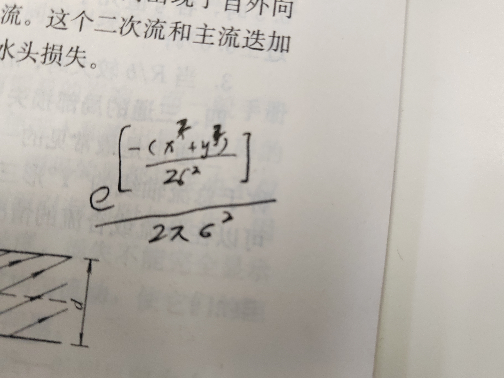

打开文件夹
[https://www.cnblogs.com/winafa/p/13689280.html](https://www.cnblogs.com/winafa/p/13689280.html)
二维数组的元素个数
canny.c中卷积核计算那部分28行
找kernel【i】【j】
从kenerl-size 3x3列表里找最优的卷积核大小

消防给水及消防栓系技术规范
[二维数组的元素个数怎么算 - 优草派](https://m.ycpai.cn/python/gGVHDkI7.html?use_xbridge3=true&need_sec_link=1&sec_link_scene=im)
