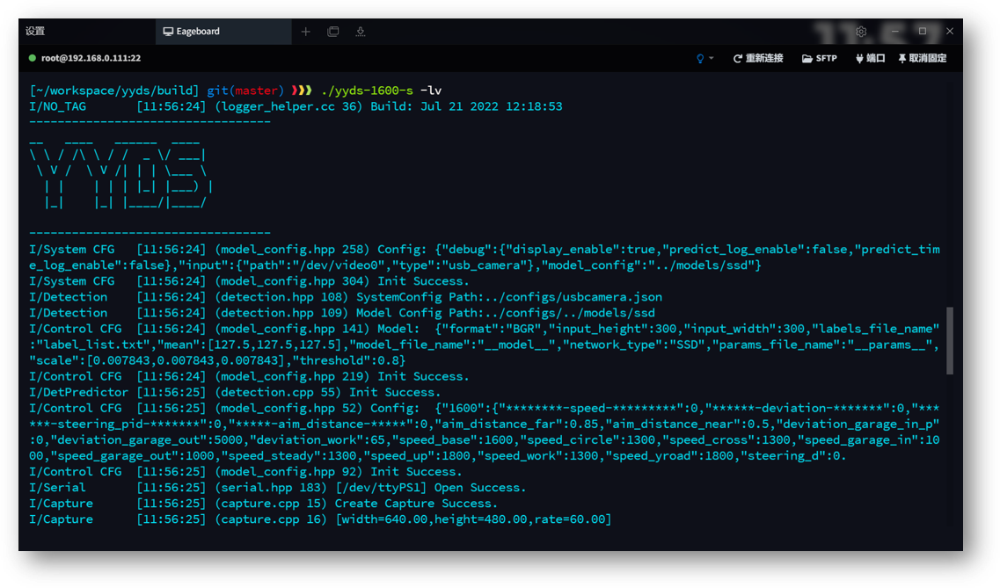
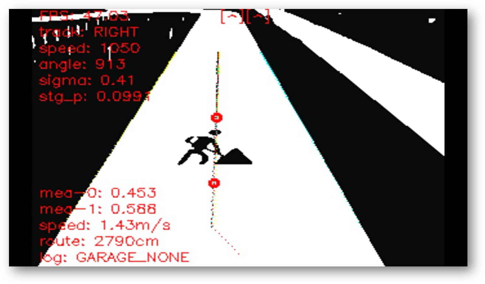
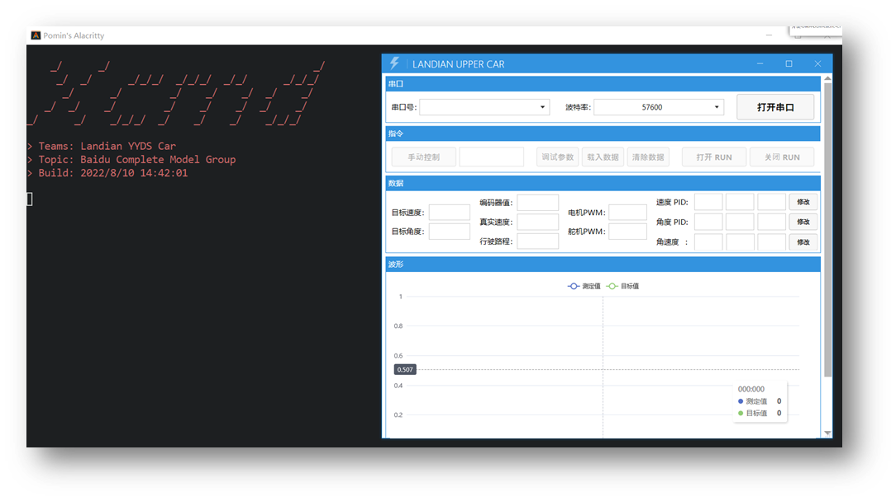

湖北工业大学 - 蓝电 YYDS Car
第十七届全国大学生智能汽车竞赛 - 完全模型组
校赛(第一名) -> 华南赛区(第四名) -> 国赛(线下第五名 - 全国一等奖)

---

---

## Edgeboard 程序
> 在此感谢以下开源算法:
上海交通大学: [https://github.com/SJTU-AuTop/RT1064-Code](https://gitee.com/link?target=https%3A%2F%2Fgithub.com%2FSJTU-AuTop%2FRT1064-Code)
完全模型组官方: [https://github.com/Leo-smart/Intelligentcar2022-FZ3B](https://gitee.com/link?target=https%3A%2F%2Fgithub.com%2FLeo-smart%2FIntelligentcar2022-FZ3B)

- [ ] 基础元素识别、打印
- [ ]  去畸变和透视变换
- [ ]  基于角点识别赛道元素
- [ ]  单线偏移的目标轨迹规划
- [ ] 标志识别、打印
- [ ] JSON 配置项读取
- [ ] 图像、边线、锚点显示
- [ ] 日志输出命令行、文件

## TC212 控制端调参上位机
为了能够观察各个变量的给定和输出波形，以更方便的进行调试分析，我队使用C#开发了一款上位机。

- [ ]  波形显示
- [ ]  命令行内交互
- [ ]  遥控车辆运动
- [ ]  PID参数调试、读写

> 来自: [landian-yyds: 第十七届全国大学生智能汽车竞赛 - 完全模型组 - 湖北工业大学 - 蓝电YYDS Car队 - Gitee.com](https://gitee.com/xinnz/landian-yyds/tree/master)

