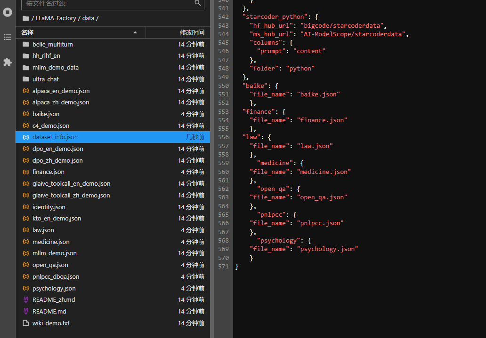

```
conda create -n hc3 python=3.8
conda activate hc3

git clone --depth 1 https://github.com/hiyouga/LLaMA-Factory.git
cd LLaMA-Factory
pip install -e '.[torch,metrics]' -i https://pypi.tuna.tsinghua.edu.cn/simple


# modelscope拉取internlm2-7b
git clone https://www.modelscope.cn/Shanghai_AI_Laboratory/internlm2-7b.git


#进入data/dataset_info.json,添加自定义的json文件路径

#可视化训练
CUDA_VISIBLE_DEVICES=0 GRADIO_SHARE=1 llamafactory-cli webui

CUDA_VISIBLE_DEVICES=0 llamafactory-cli train examples/qlora_single_gpu/llama3_lora_sft_bitsandbytes.yaml
```

