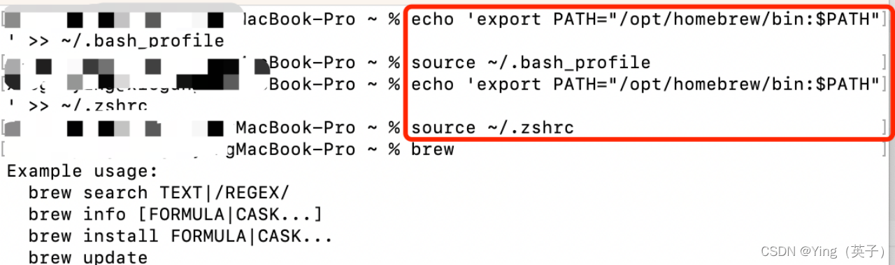

网上其实有很多安装brew的教程，但是良莠不齐吧，今天给大家分享一个小白[安装教程](https://so.csdn.net/so/search?q=%E5%AE%89%E8%A3%85%E6%95%99%E7%A8%8B&spm=1001.2101.3001.7020)。
如果不想看此长文，建议直接拉到本文底部，通过[命令行安装](https://so.csdn.net/so/search?q=%E5%91%BD%E4%BB%A4%E8%A1%8C%E5%AE%89%E8%A3%85&spm=1001.2101.3001.7020)brew，是最简洁方便的！！！
#### 目录

- [1、查看电脑有没有安装过brew](https://blog.csdn.net/ganyingxie123456/article/details/132182152?utm_medium=distribute.pc_relevant.none-task-blog-2~default~baidujs_baidulandingword~default-1-132182152-blog-135190834.235^v43^pc_blog_bottom_relevance_base8&spm=1001.2101.3001.4242.2&utm_relevant_index=2#1brew_7)
- [2、通过官网命令安装发现行不通](https://blog.csdn.net/ganyingxie123456/article/details/132182152?utm_medium=distribute.pc_relevant.none-task-blog-2~default~baidujs_baidulandingword~default-1-132182152-blog-135190834.235^v43^pc_blog_bottom_relevance_base8&spm=1001.2101.3001.4242.2&utm_relevant_index=2#2_9)
- [3、通过安装包成功安装brew步骤](https://blog.csdn.net/ganyingxie123456/article/details/132182152?utm_medium=distribute.pc_relevant.none-task-blog-2~default~baidujs_baidulandingword~default-1-132182152-blog-135190834.235^v43^pc_blog_bottom_relevance_base8&spm=1001.2101.3001.4242.2&utm_relevant_index=2#3brew_16)
   - [1）打开github页面，下载对应的mac系统安装包](https://blog.csdn.net/ganyingxie123456/article/details/132182152?utm_medium=distribute.pc_relevant.none-task-blog-2~default~baidujs_baidulandingword~default-1-132182152-blog-135190834.235^v43^pc_blog_bottom_relevance_base8&spm=1001.2101.3001.4242.2&utm_relevant_index=2#1githubmac_17)
   - [2）执行安装步骤](https://blog.csdn.net/ganyingxie123456/article/details/132182152?utm_medium=distribute.pc_relevant.none-task-blog-2~default~baidujs_baidulandingword~default-1-132182152-blog-135190834.235^v43^pc_blog_bottom_relevance_base8&spm=1001.2101.3001.4242.2&utm_relevant_index=2#2_21)
   - [3）配置环境变量](https://blog.csdn.net/ganyingxie123456/article/details/132182152?utm_medium=distribute.pc_relevant.none-task-blog-2~default~baidujs_baidulandingword~default-1-132182152-blog-135190834.235^v43^pc_blog_bottom_relevance_base8&spm=1001.2101.3001.4242.2&utm_relevant_index=2#3_28)
   - [4）安装完成](https://blog.csdn.net/ganyingxie123456/article/details/132182152?utm_medium=distribute.pc_relevant.none-task-blog-2~default~baidujs_baidulandingword~default-1-132182152-blog-135190834.235^v43^pc_blog_bottom_relevance_base8&spm=1001.2101.3001.4242.2&utm_relevant_index=2#4_40)
- [4、其他安装方法（命令安装）](https://blog.csdn.net/ganyingxie123456/article/details/132182152?utm_medium=distribute.pc_relevant.none-task-blog-2~default~baidujs_baidulandingword~default-1-132182152-blog-135190834.235^v43^pc_blog_bottom_relevance_base8&spm=1001.2101.3001.4242.2&utm_relevant_index=2#4_43)
- [5、总结](https://blog.csdn.net/ganyingxie123456/article/details/132182152?utm_medium=distribute.pc_relevant.none-task-blog-2~default~baidujs_baidulandingword~default-1-132182152-blog-135190834.235^v43^pc_blog_bottom_relevance_base8&spm=1001.2101.3001.4242.2&utm_relevant_index=2#5_51)
## 1、查看电脑有没有安装过brew

## 2、通过官网命令安装发现行不通
brew官网：[https://brew.sh/](https://brew.sh/)

直接执行官网安装命令：

运行结束发现安装失败：

## 3、通过安装包成功安装brew步骤
### 1）打开github页面，下载对应的mac系统安装包
下载地址：[https://github.com/Homebrew/brew/releases/tag/4.1.4](https://github.com/Homebrew/brew/releases/tag/4.1.4)

下载完成：
### 2）执行安装步骤
双击运行下载好安装包，直接点继续同意安装协议，然后继续或者下一步即可


安装完成，显示如下页面，关闭即可

### 3）配置环境变量
在终端依次执行以下4个命令：
```
echo 'export PATH="/opt/homebrew/bin:$PATH"' >> ~/.bash_profile 

source ~/.bash_profile

echo 'export PATH="/opt/homebrew/bin:$PATH"' >> ~/.zshrc   

source ~/.zshrc
```

### 4）安装完成
执行brew命令，发现有相关信息，表示已经成功安装了。

## 4、其他安装方法（命令安装）
执行命令以下，然后镜像选择输入：1
```
/bin/zsh -c "$(curl -fsSL https://gitee.com/cunkai/HomebrewCN/raw/master/Homebrew.sh)"
```

然后输入密码，等待安装即可完成。
## 5、总结
安装brew一般2两方式：安装包 或 命令行。
通过安装包来安装需要配置环境变量，一般通过命令行会比较方便，但命令行有可能会因为镜像问题导致安装失败，两种方式各有优劣。

> 来自: [mac安装brew小白指引_brew安装-CSDN博客](https://blog.csdn.net/ganyingxie123456/article/details/132182152?utm_medium=distribute.pc_relevant.none-task-blog-2~default~baidujs_baidulandingword~default-1-132182152-blog-135190834.235^v43^pc_blog_bottom_relevance_base8&spm=1001.2101.3001.4242.2&utm_relevant_index=2)

