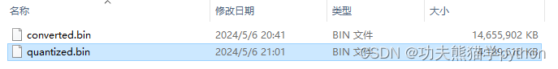

**目录**
[前言](https://blog.csdn.net/spiderwower/article/details/138506271#%E5%89%8D%E8%A8%80)
[一、下载源码](https://blog.csdn.net/spiderwower/article/details/138506271#t0)
[1.下载ollama源码](https://blog.csdn.net/spiderwower/article/details/138506271#t1)
[2.下载llama.cpp源码](https://blog.csdn.net/spiderwower/article/details/138506271#t2)
[3.复制项目文件](https://blog.csdn.net/spiderwower/article/details/138506271#t3)
[二、安装python依赖](https://blog.csdn.net/spiderwower/article/details/138506271#t4)
[三、合并模型文件](https://blog.csdn.net/spiderwower/article/details/138506271#t5)
[1.以Chinese-Mistral-7B-Instruct-v0.1为例，将4个safetensors文件合并为一个模型文件](https://blog.csdn.net/spiderwower/article/details/138506271#t6)
[2.下载Chinese-Mistral-7B-Instruct-v0.1模型](https://blog.csdn.net/spiderwower/article/details/138506271#t7)
[2.1下载模型](https://blog.csdn.net/spiderwower/article/details/138506271#t8)
[2.2合并文件](https://blog.csdn.net/spiderwower/article/details/138506271#t9)
[2.3合并过程](https://blog.csdn.net/spiderwower/article/details/138506271#t10)
[四、量化模型](https://blog.csdn.net/spiderwower/article/details/138506271#t11)
[1.安装cmake和编译器](https://blog.csdn.net/spiderwower/article/details/138506271#t12)
[2.开始编译](https://blog.csdn.net/spiderwower/article/details/138506271#t13)
[3.量化模型](https://blog.csdn.net/spiderwower/article/details/138506271#t14)
[五、制作ollama使用的模型](https://blog.csdn.net/spiderwower/article/details/138506271#t15)
[1.创建Modelfile 文件](https://blog.csdn.net/spiderwower/article/details/138506271#t16)
[2.创建模型](https://blog.csdn.net/spiderwower/article/details/138506271#t17)
[3.运行模型](https://blog.csdn.net/spiderwower/article/details/138506271#t18)

---

## 前言
使用ollama+open-webui可以轻松部署本地大模型，但是通过ollama下载的模型都是别人制作好的。我的模型部署思路是大模型为底座+lora微调，实现真正的个人大模型，后续将分享自己的lora微调经验和ollama调用lora。本文主要介绍如何在windows系统下将Safetensors 模型制作成ollama使用的自定义模型，linux系统自定义模型制作方法可直接按照官方文档执行。ollama官方文档提供了如何将GGUF，Pytorch或Safetensors 文件制作为自定义模型的方法。[官方文档https://github.com/ollama/ollama/blob/main/docs/import.md](https://github.com/ollama/ollama/blob/main/docs/import.md)

## 一、下载源码
### 1.下载ollama源码
[https://github.com/ollama/ollama/tree/main](https://github.com/ollama/ollama/tree/main)
### 2.下载llama.cpp源码
[https://github.com/ggerganov/llama.cpp](https://github.com/ggerganov/llama.cpp)
下载解压缩后，形成2个项目的文件

### 3.复制项目文件
3.1以ollama为主项目，用pycharm打开ollama文件夹，显示如下：

3.2将之前下载的llama.cpp项目文件夹复制到图上的llama.cpp位置。鼠标选中llm文件夹，按ctral+v即粘贴至llama.cpp文件夹。效果如下所示：

## 二、[安装python](https://so.csdn.net/so/search?q=%E5%AE%89%E8%A3%85python&spm=1001.2101.3001.7020)依赖
打开终端，确保自己的路径如下所示。养成良好习惯，创建一个虚拟环境，然后再执行pip安装命令，确保不与电脑上的其他项目环境发生冲突。

```
pip install ./llm/llama.cpp/requirements.txt
```
## 三、合并模型文件
### 1.以Chinese-Mistral-7B-Instruct-v0.1为例，将4个safetensors文件合并为一个模型文件

### 2.下载Chinese-Mistral-7B-Instruct-v0.1模型
### 2.1下载模型
模型可以在[https://huggingface.co/](https://huggingface.co/)，或者huggingface镜像网站[https://hf-mirror.com/](https://hf-mirror.com/)，或者[魔搭社区](https://modelscope.cn/)进行下载，我用[魔搭社区](https://modelscope.cn/)的python脚本进行下载，下载速度直接拉满，执行前需要先运行pip install modelscope 。
```
from modelscope import snapshot_download


 


#模型存放路径


model_path = r'D:\huggingface'


#模型名字


name = 'itpossible/Chinese-Mistral-7B-Instruct-v0.1'


model_dir = snapshot_download(name, cache_dir=model_path, revision='master')
```
### 2.2合并文件
```
# python llm/llama.cpp/convert.py 刚才下载好的模型文件地址 --outtype f16 --outfile 保存的文件名.bin


 


python llm/llama.cpp/convert.py D:\huggingface\itpossible\Chinese-Mistral-7B-Instruct-v0___1 --outtype f16 --outfile D:\huggingface\itpossible\converted.bin
```
### 2.3合并过程

合并后产生的文件converted.bin大小约14G
## 
## 四、量化模型
### 1.[安装cmake](https://so.csdn.net/so/search?q=%E5%AE%89%E8%A3%85cmake&spm=1001.2101.3001.7020)和编译器
接下来，需要将14G的bin文件量化为4G左右。这个步骤需要编译文件，使用cmake工具来编译。[传送门——cmake安装教程](https://blog.csdn.net/qq_42598221/article/details/121952160?ops_request_misc=%257B%2522request%255Fid%2522%253A%2522171499948616800188549161%2522%252C%2522scm%2522%253A%252220140713.130102334..%2522%257D&request_id=171499948616800188549161&biz_id=0&utm_medium=distribute.pc_search_result.none-task-blog-2~all~top_click~default-1-121952160-null-null.142%5Ev100%5Epc_search_result_base5&utm_term=windows%20cmake%E5%AE%89%E8%A3%85&spm=1018.2226.3001.4187)。同时，还需要安装[编译器](https://so.csdn.net/so/search?q=%E7%BC%96%E8%AF%91%E5%99%A8&spm=1001.2101.3001.7020)，我用visual studio安装的C++编译器。[传送门——vs使用教程](https://blog.csdn.net/Chen298/article/details/127551896?ops_request_misc=%257B%2522request%255Fid%2522%253A%2522171504525216800215063659%2522%252C%2522scm%2522%253A%252220140713.130102334..%2522%257D&request_id=171504525216800215063659&biz_id=0&utm_medium=distribute.pc_search_result.none-task-blog-2~all~top_positive~default-1-127551896-null-null.142%5Ev100%5Econtrol&utm_term=visual%20studio&spm=1018.2226.3001.4187)。
验证cmake是否安装成功，下图表示安装成功。

### 2.开始编译
在 llm/llama.cpp文件夹下开始编译
```
# 进入到llm/llama.cpp目录


cd llm/llama.cpp


 


#创建build文件夹


mkdir build


 


#进入build


cd build


 


# 构建


cmake ..


cmake --build . --config Release
```

编译过程需要一些，耐心等待一下。编译后生成的quantization.exe就是我们需要用到的工具。

### 3.量化模型
```
# bin/Release/quantize.exe 之前合并的14G大小文件.bin 量化后的文件.bin 量化大小


bin/Release/quantize.exe D:\huggingface\itpossible\converted.bin D:\huggingface\itpossible\quantized.bin q4_0
```
官方文档提供了多种量化格式，常用的就是q4_0。

量化过程如下：

压缩量化完成后，生成一个新的文件quantized.bin，大约4G。之前14G的源文件可以删除了。

## 五、制作ollama使用的模型
需要将quantized.bin文件制作为ollama可以使用的模型
### 1.创建`Modelfile` 文件
创建一个test.`Modelfile` 文件，添加的内容如下
```
FROM D:\huggingface\itpossible\quantized.bin


TEMPLATE "[INST] {{ .Prompt }} [/INST]"
```
### 2.创建模型
2.1指定生成的模型路径
设置模型文件保存位置，打开系统环境变量配置，添加一个环境变量OLLAMA_MODELS=D:\huggingface\ollama（自己指定任意一个文件夹路径），然后点确定。

2.2打开一个CMD终端
```
# ollama create 模型名字 -f Modelfile文件路径


ollama create panda -f C:\Users\Administrator\Desktop\ollama\test.Modelfile
```
2.3创建过程

2.4生成的模型

### 3.运行模型
```
ollama run panda
```


> 来自: [ollama 使用自定义大模型_ollama下载的模型使用-CSDN博客](https://blog.csdn.net/spiderwower/article/details/138506271)

