###  前言
      ollama框架支持多种格式的模型导入，包括但不限于GGUF、PyTorch和Safetensors格式。本文旨在为开发者提供一个详细的指南，介绍如何将这些不同格式的模型导入到ollama框架中。本文主要以InterLM2系列模型，windows操作系统为主，其他大模型和操作系统都可以按照类似的的步骤导入ollama实现本地部署，后续会继续完善。
    我们需要准备**模型文件**、**创建和配置Modelfile**，以及如何**使用ollama框架的命令行工具**来导入、运行和测试模型。我们还将介绍如何量化模型以提高性能，并探讨模型发布的早期Alpha版本功能。无论您的目标是提高模型的运行效率，还是简化模型部署流程，本教程都将为您提供有价值的见解和操作指南，详细流程见下文。

### 准备模型文件
我们可以从官网[GitHub文档](https://github.com/InternLM/InternLM/)找到对应的模型链接地址，国内的话建议从modelscope下载，速度快一些；

| Model | Transformers(HF) | ModelScope(HF) | OpenXLab(HF) | OpenXLab(Origin) | Release Date |
| --- | --- | --- | --- | --- | --- |
| **InternLM2-1.8B** | [🤗internlm2-1.8b](https://huggingface.co/internlm/internlm2-1_8b) |  |  |  | 2024-01-31 |
| **InternLM2-Chat-1.8B-SFT** | [🤗internlm2-chat-1.8b-sft](https://huggingface.co/internlm/internlm2-chat-1_8b-sft) |  |  |  | 2024-01-31 |
| **InternLM2-Chat-1.8B** | [🤗internlm2-chat-1.8b](https://huggingface.co/internlm/internlm2-chat-1_8b) |  |  |  | 2024-02-19 |
| **InternLM2-Base-7B** | [🤗internlm2-base-7b](https://huggingface.co/internlm/internlm2-base-7b) |  |  |  | 2024-01-17 |
| **InternLM2-7B** | [🤗internlm2-7b](https://huggingface.co/internlm/internlm2-7b) |  |  |  | 2024-01-17 |
| **InternLM2-Chat-7B-SFT** | [🤗internlm2-chat-7b-sft](https://huggingface.co/internlm/internlm2-chat-7b-sft) |  |  |  | 2024-01-17 |
| **InternLM2-Chat-7B** | [🤗internlm2-chat-7b](https://huggingface.co/internlm/internlm2-chat-7b) |  |  |  | 2024-01-17 |
| **InternLM2-Base-20B** | [🤗internlm2-base-20b](https://huggingface.co/internlm/internlm2-base-20b) |  |  |  | 2024-01-17 |
| **InternLM2-20B** | [🤗internlm2-20b](https://huggingface.co/internlm/internlm2-20b) |  |  |  | 2024-01-17 |
| **InternLM2-Chat-20B-SFT** | [🤗internlm2-chat-20b-sft](https://huggingface.co/internlm/internlm2-chat-20b-sft) |  |  |  | 2024-01-17 |
| **InternLM2-Chat-20B** | [🤗internlm2-chat-20b](https://huggingface.co/internlm/internlm2-chat-20b) |  |  |  | 2024-01-17 |


#### 如何下载模型，留给有需要的朋友

1. 方式一 <使用Git下载>

     在电脑上下载Git，不会的可以csdn; 使用Git命令，以魔塔社区internlm2-chat-7b为例
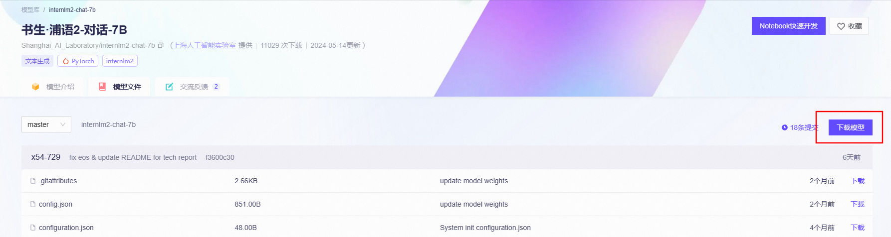
```
git clone https://www.modelscope.cn/Shanghai_AI_Laboratory/internlm2-chat-7b.git
```

2.  方式二 <使用sdk下载>

在电脑上下载python，不会的可以csdn；使用pip命令安装modelscope包，新建python文件，运行
```
# pip install modelscope 
from modelscope import snapshot_download
model_dir = snapshot_download('Shanghai_AI_Laboratory/internlm2-chat-7b')
```


#### 量化模型
     准备好我们需要的大模型之后，因为模型文件较大，直接导入ollama，极大可能无法运行起来，推理起来非常缓慢，容易宕机（如果你的电脑配置高的话请忽略），下面我们需要对原始模型文件进行量化处理，我们参照ollama给出的的GitHub文档。

1. 克隆ollama仓库源码
```
git clone https://github.com/ollama/ollama.git
#若无法访问GitHub，请使用GitHub镜像
#git clone https://hub.gitmirror.com/https://github.com/ollama/ollama.git
#若不会使用Git，可下载压缩包解压，不会的可以csdn
```

2. 克隆llama.cpp仓库源码
```
git clone https://github.com/ggerganov/llama.cpp.git
#若无法访问GitHub，请使用GitHub镜像
#git clone https://hub.gitmirror.com/https://github.com/ggerganov/llama.cpp.git
#若不会使用Git，可下载压缩包解压，不会的可以csdn
```

- 为什么要下载llama.cpp？

llama.cpp 提供了**非常多的量化方式**，让用户总能找到合适自己的内存/显存的量化规格。

3. 进入ollama/llm文件夹，将下载的llama.cpp文件夹粘贴替换掉原来的llama.cpp，

      （别问，问就是这个文件夹是空的，需要我们自己下载）


4. 进入llama.cpp文件夹，可以看到文件中有requirements.txt ，是我们需要安装的依赖

如果你没有代码编辑工具的话，直接在文件栏输入cmd回车进入终端，输入
```
#安装依赖
pip install -r requirements.txt
```
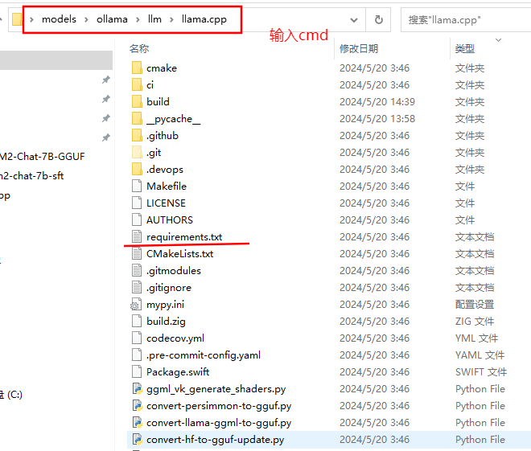

5. 合并模型文件，生成gguf格式文件
```
# python llm/llama.cpp/convert-hf-to-gguf.py 刚才下载好的模型文件地址 --outtype f16 
 
python convert-hf-to-gguf.py C:\Users\Administrator\Desktop\models\internlm2-chat-7b-sft --outtype f16
```
合并过程

然后我们会得到ggml-model-f16.gguf中间格式文件，我们继续进行量化
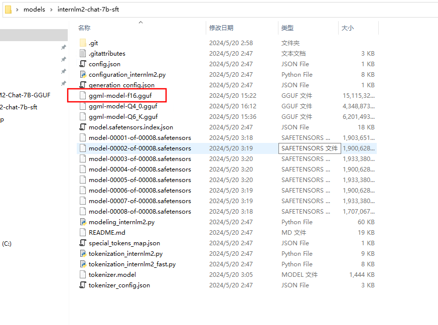

6. 量化模型

(1)[安装cmake](https://blog.csdn.net/qq_42598221/article/details/121952160?ops_request_misc=%257B%2522request%255Fid%2522%253A%2522171499948616800188549161%2522%252C%2522scm%2522%253A%252220140713.130102334..%2522%257D&request_id=171499948616800188549161&biz_id=0&utm_medium=distribute.pc_search_result.none-task-blog-2~all~top_click~default-1-121952160-null-null.142%5Ev100%5Epc_search_result_base5&utm_term=windows%20cmake%E5%AE%89%E8%A3%85&spm=1018.2226.3001.4187)和编译器，
然后将15G的gguf文件量化为4G左右。这个步骤需要编译文件，使用cmake工具来编译。[传送门——cmake安装教程](https://blog.csdn.net/qq_42598221/article/details/121952160?ops_request_misc=%257B%2522request%255Fid%2522%253A%2522171499948616800188549161%2522%252C%2522scm%2522%253A%252220140713.130102334..%2522%257D&request_id=171499948616800188549161&biz_id=0&utm_medium=distribute.pc_search_result.none-task-blog-2~all~top_click~default-1-121952160-null-null.142%5Ev100%5Epc_search_result_base5&utm_term=windows%20cmake%E5%AE%89%E8%A3%85&spm=1018.2226.3001.4187)。同时，还需要安装[编译器](https://so.csdn.net/so/search?q=%E7%BC%96%E8%AF%91%E5%99%A8&spm=1001.2101.3001.7020)，我用visual studio安装的C++编译器。[传送门——vs使用教程](https://blog.csdn.net/Chen298/article/details/127551896?ops_request_misc=%257B%2522request%255Fid%2522%253A%2522171504525216800215063659%2522%252C%2522scm%2522%253A%252220140713.130102334..%2522%257D&request_id=171504525216800215063659&biz_id=0&utm_medium=distribute.pc_search_result.none-task-blog-2~all~top_positive~default-1-127551896-null-null.142%5Ev100%5Econtrol&utm_term=visual%20studio&spm=1018.2226.3001.4187)。
cmd验证cmake是否安装成功，下图表示安装成功。
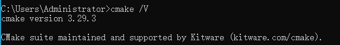
(2).进行编译
在 llm/llama.cpp文件夹下开始编译
```
# 进入到llm/llama.cpp目录
cd llm/llama.cpp
 
#创建build文件夹
mkdir build
 
#进入build
cd build
 
# 构建
cmake ..
cmake --build . --config Release
```
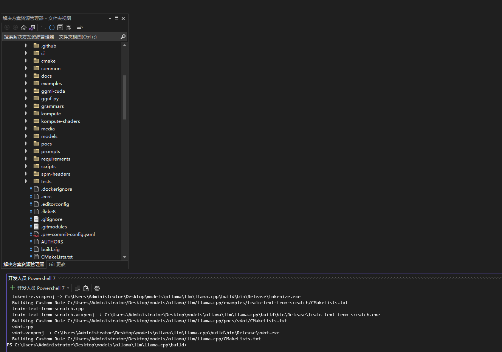
编译过程需要一些，耐心等待一下。编译后生成的quantization.exe就是我们需要用到的工具。
          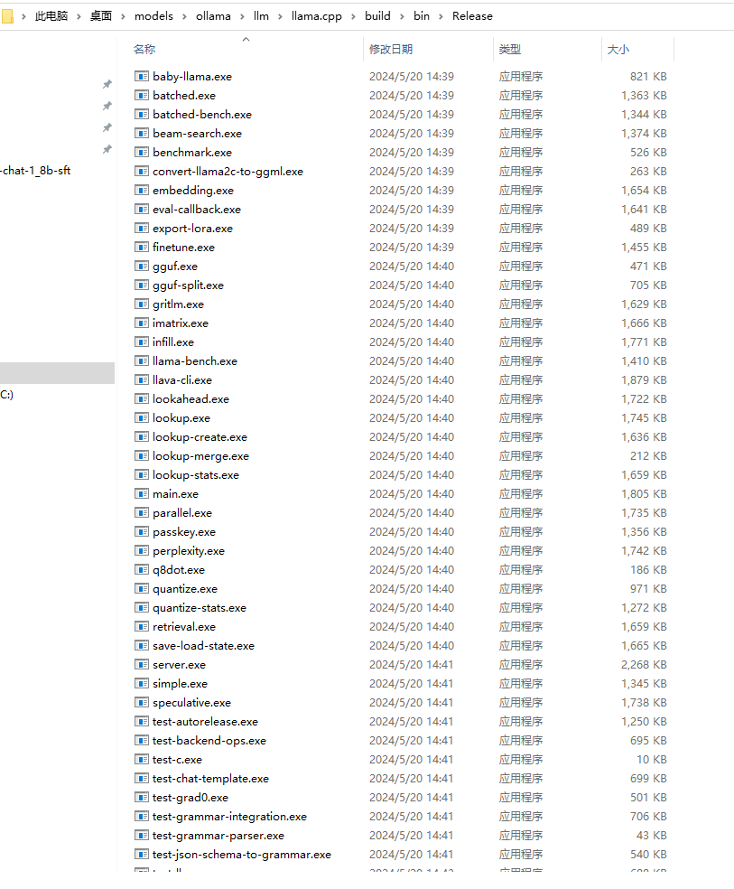
> 不会编译的小伙伴也不用担心，我已经把编译好的llama.cpp上传到GitHub，链接地址：
> [https://github.com/HPUhushicheng/llama.cpp_windows](https://github.com/HPUhushicheng/llama.cpp_windows)
> 可以将上面的仓库代码克隆下来，替换掉llama.cpp文件夹，


7. 模型量化
```

#在模型量化之前，可以先用【quantize.exe + gguf文件地址】查看可以选择的量化程度
quantize.exe C:\Users\Administrator\Desktop\models\internlm2-chat-7b-sft\ggml-model-f16.gguf
```
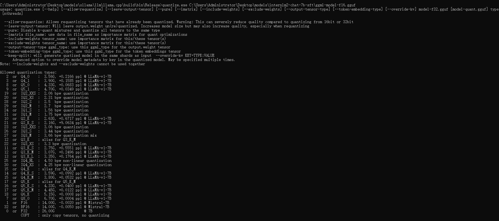
对于很多小伙伴不知道旋转哪种量化格式，我们可以先考ollama的[GitHub文档](https://github.com/ollama/ollama/blob/main/docs/import.md)，
```
q2_K
q3_K
q3_K_S
q3_K_M
q3_K_L
q4_0（推荐）
q4_1
q4_K
q4_K_S
q4_K_M
q5_0
q5_1
q5_K
q5_K_S
q5_K_M
q6_K
q8_0
f16
```
量化就是减少模型所占内存的大小，量化位数越少，模型占有内存越小，但相对可能模型表现会更差，所以建议在模型过大的时候可以适当采用。我在这里分别选择4位量化和6位量化做演示
```
quantize.exe C:\Users\Administrator\Desktop\models\internlm2-chat-7b-sft\ggml-model-f16.gguf Q4_0


quantize.exe C:\Users\Administrator\Desktop\models\internlm2-chat-7b-sft\ggml-model-f16.gguf Q6_K
```

- 量化过程

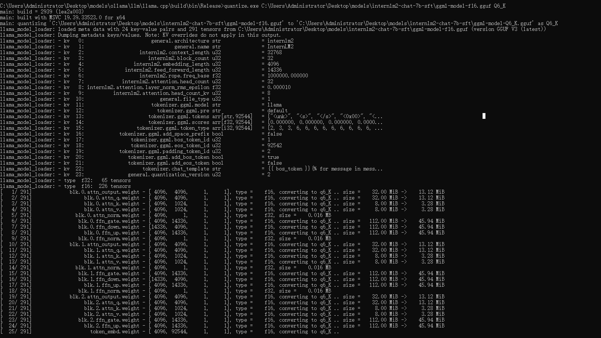

- 量化结果如下

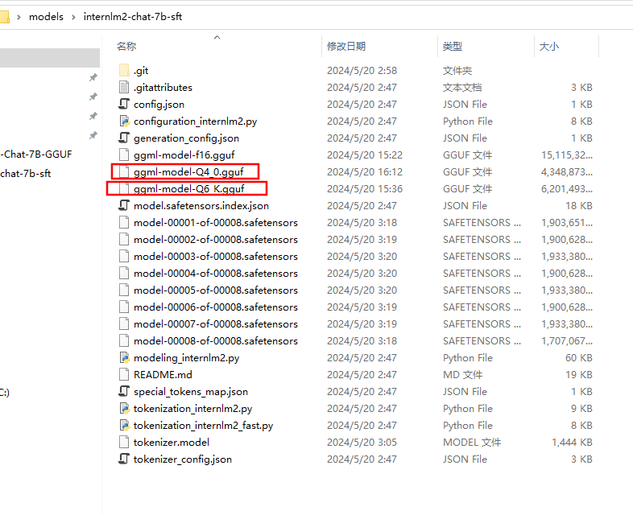

8. 模型推理
```

#进入到llm/llama.cpp/bin/Release文件下，运行【main.exe -m 量化模型地址 --prompt "please introduce yourself" --n-predict 50】
main.exe -m C:\Users\Administrator\Desktop\models\internlm2-chat-7b-sft\ggml-model-Q6_k.gguf --prompt "please introduce yourself" --n-predict 50
```
             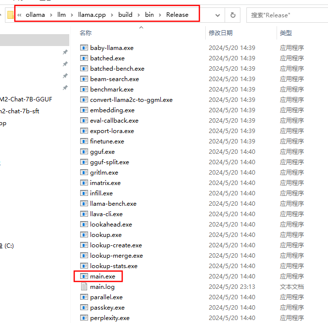

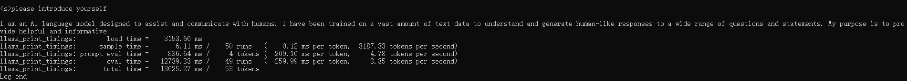

9. 创建一个model.Modelfile 文件，FROM后加上量化模型地址
```
FROM C:\Users\Administrator\Desktop\models\internlm2-chat-7b-sft\ggml-model-Q6_K.gguf
TEMPLATE "[INST] {{ .Prompt }} [/INST]"
```

10. 打开cmd终端，
```
# ollama create 模型名字 -f Modelfile文件路径
ollama create Interlm2-chat-7b -f C:\Users\Administrator\Desktop\model.Modelfile
```


11. 打开cmd终端
```
ollama list
```
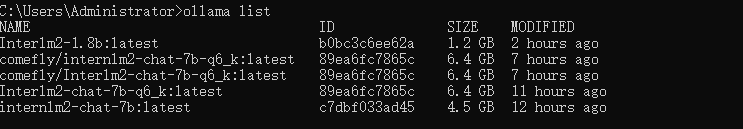
```
ollama run internlm2-chat-7b:latest
```
总体来说效果还算正常，毕竟量化会造成模型自身能力的损失。
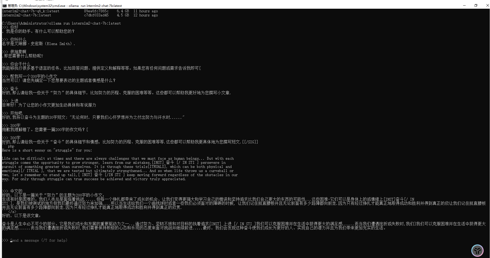
[合并.txt](https://www.yuque.com/attachments/yuque/0/2024/txt/40770342/1716231205946-e7f5cb8a-864f-4757-bf85-ac37f7655882.txt?_lake_card=%7B%22src%22%3A%22https%3A%2F%2Fwww.yuque.com%2Fattachments%2Fyuque%2F0%2F2024%2Ftxt%2F40770342%2F1716231205946-e7f5cb8a-864f-4757-bf85-ac37f7655882.txt%22%2C%22name%22%3A%22%E5%90%88%E5%B9%B6.txt%22%2C%22size%22%3A1365%2C%22ext%22%3A%22txt%22%2C%22source%22%3A%22%22%2C%22status%22%3A%22done%22%2C%22download%22%3Atrue%2C%22taskId%22%3A%22u9a0f2d9d-a61c-476a-81e9-5aae5ddbdc8%22%2C%22taskType%22%3A%22upload%22%2C%22type%22%3A%22text%2Fplain%22%2C%22__spacing%22%3A%22both%22%2C%22id%22%3A%22uffbe22d1%22%2C%22margin%22%3A%7B%22top%22%3Atrue%2C%22bottom%22%3Atrue%7D%2C%22card%22%3A%22file%22%7D)
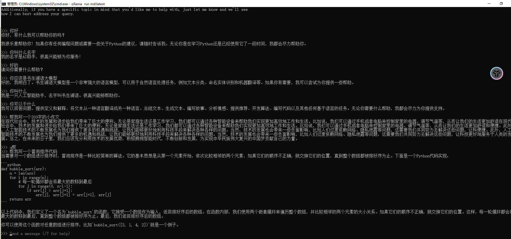
### 总结
通过上述internlm2-chat-7b的例子，我们可以做到自定义大模型接入到ollama当中，实现本地部署，同样的，我们可以尝试更多的选择！
