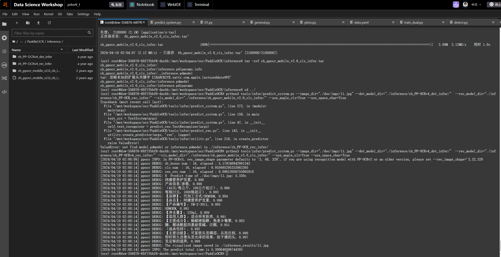

```
conda create -n ocr python==3.9
conda activate ocr


cd ocr
git clone https://gitcode.com/PaddlePaddle/PaddleOCR.git

cd PaddleOCR
pip install -r requirements.txt -i https://mirror.baidu.com/pypi/simple/


mkdir inference && cd inference
#下载推理和识别和分类模型的推理模型
wget https://paddleocr.bj.bcebos.com/PP-OCRv4/chinese/ch_PP-OCRv4_det_infer.tar
wget https://paddleocr.bj.bcebos.com/dygraph_v2.0/ch/ch_ppocr_mobile_v2.0_cls_infer.tar
wget https://paddleocr.bj.bcebos.com/PP-OCRv4/chinese/ch_PP-OCRv4_rec_infer.tar
cd ..

```

注意：阿里云dsw的主路径是/mnt/workspace，不是root,不需要cd ../../root，否者看不到文件夹
```
# 安装 paddlepaddle
#进入paddlepaddle官网输入以下指令安装paddlepaddle GPU版本
#（根据linux装合适版本）
conda install paddlepaddle --channel https://mirrors.tuna.tsinghua.edu.cn/anaconda/cloud/Paddle/

# 使用2.6.0版本
pip install "paddleocr==2.6.0" -i https://pypi.tuna.tsinghua.edu.cn/simple
```

```
#推理测试

python3 tools/infer/predict_system.py --image_dir="./doc/imgs/11.jpg" --det_model_dir="./inference/ch_PP-OCRv4_det_infer/"  --rec_model_dir="./inference/ch_PP-OCRv4_rec_infer/" --cls_model_dir="./inference/ch_ppocr_mobile_v2.0_cls_infer/" --use_angle_cls=True --use_space_char=True
```




文字识别参考：
[https://blog.csdn.net/weixin_41576149/article/details/107472977?utm_medium=distribute.pc_relevant.none-task-blog-2~default~baidujs_baidulandingword~default-9-107472977-blog-131299525.235^v43^pc_blog_bottom_relevance_base4&spm=1001.2101.3001.4242.6&utm_relevant_index=11](https://blog.csdn.net/weixin_41576149/article/details/107472977?utm_medium=distribute.pc_relevant.none-task-blog-2~default~baidujs_baidulandingword~default-9-107472977-blog-131299525.235^v43^pc_blog_bottom_relevance_base4&spm=1001.2101.3001.4242.6&utm_relevant_index=11)
