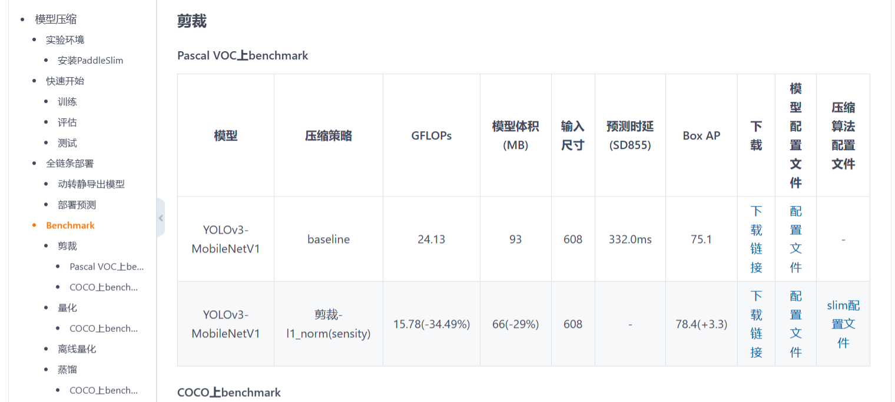
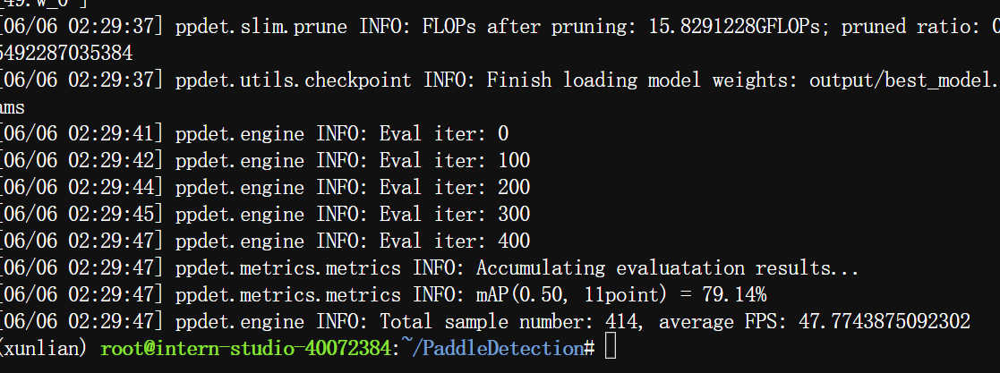
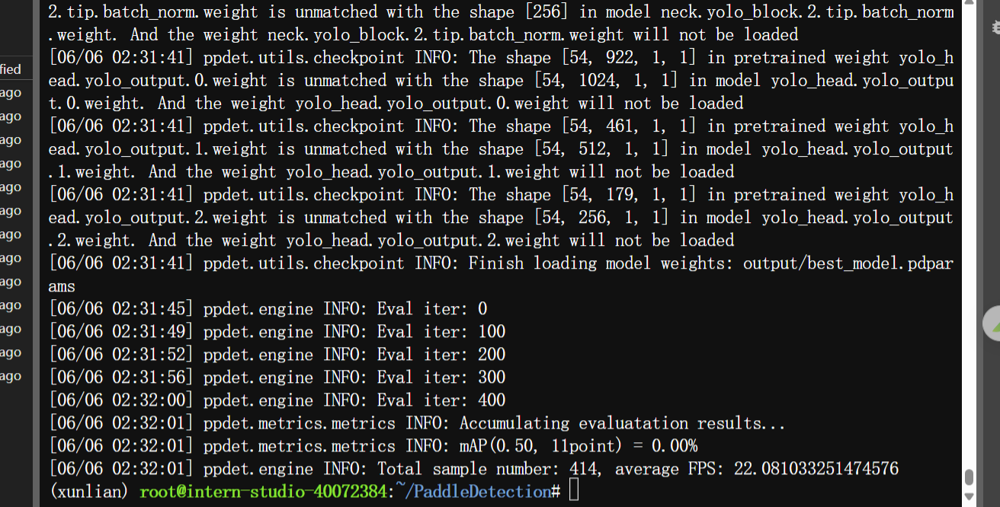
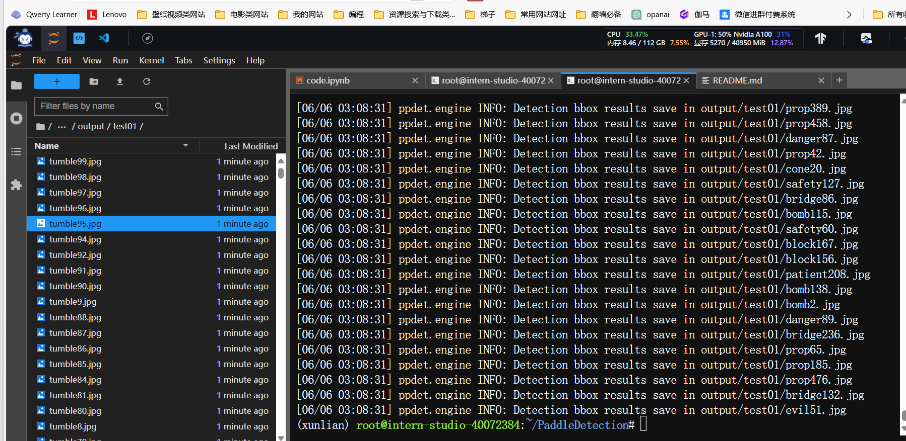

```
# 训练，优先选configs/slim/prune/yolov3_prune_l1_norm.yml ，信我
python tools/train.py -c configs/yolov3/yolov3_mobilenet_v1_ssld_270e_voc.yml --slim_config configs/slim/prune/yolov3_prune_l1_norm.yml  --eval
or 
python tools/train.py -c configs/yolov3/yolov3_mobilenet_v1_ssld_270e_voc.yml --slim_config configs/slim/quant/ssd_mobilenet_v1_qat.yml  --eval

# 评估
python tools/eval.py -c configs/yolov3/yolov3_mobilenet_v1_ssld_270e_voc.yml --slim_config configs/slim/prune/yolov3_prune_l1_norm.yml -o weights=output/best_model.pdparams
or
python tools/eval.py -c configs/yolov3/yolov3_mobilenet_v1_ssld_270e_voc.yml --slim_config configs/slim/quant/ssd_mobilenet_v1_qat.yml  -o weights=output/best_model.pdparams


#模型测试,infer_img是一张图片，infer_dir是文件夹
python tools/infer.py -c configs/yolov3/yolov3_mobilenet_v1_ssld_270e_voc.yml --slim_config configs/slim/prune/yolov3_prune_l1_norm.yml -o weights=output/best_model --infer_img=root/Car2024/images/block1.jpg

or

python tools/infer.py -c configs/yolov3/yolov3_mobilenet_v1_ssld_270e_voc.yml --slim_config configs/slim/prune/yolov3_prune_l1_norm.yml -o weights=output/best_model.pdparams --infer_dir=output_320x320/images --output_dir=output/test01


# 模型导出
- `-c`: 指定模型配置文件。
- `--slim_config`: 指定压缩策略配置文件。
- `-o weights`: 指定压缩算法训好的模型路径。

python tools/export_model.py -c configs/yolov3/yolov3_mobilenet_v1_ssld_270e_voc.yml --slim_config configs/slim/prune/yolov3_prune_l1_norm.yml  -o weights=output/best_model.pdparams 

python tools/export_model.py -c configs/yolov3/yolov3_mobilenet_v1_ssld_270e_voc.yml --slim_config configs/slim/prune/yolov3_prune_l1_norm.yml -o weights=output/{SLIM_CONFIG}/model_final
```


- 参考[https://gitee.com/paddlepaddle/PaddleDetection/tree/release/2.7/configs/slim#https://gitee.com/link?target=https%3A%2F%2Fgithub.com%2FPaddlePaddle%2FPaddleDetection%2Ftree%2Fdevelop%2Fconfigs%2Fslim%2Fprune%2Fyolov3_prune_l1_norm.yml](https://gitee.com/paddlepaddle/PaddleDetection/tree/release/2.7/configs/slim#https://gitee.com/link?target=https%3A%2F%2Fgithub.com%2FPaddlePaddle%2FPaddleDetection%2Ftree%2Fdevelop%2Fconfigs%2Fslim%2Fprune%2Fyolov3_prune_l1_norm.yml)


裁剪对比，优先选configs/slim/prune/yolov3_prune_l1_norm.yml 




