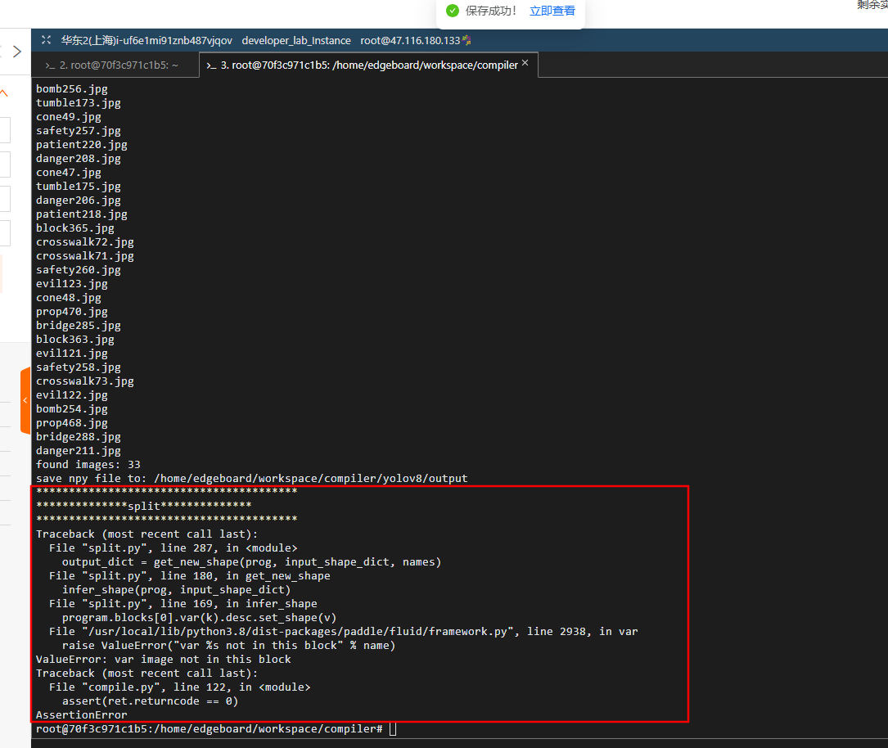

```
#训练集划分，最好的自己采集、标注，大概统计了一下提供的开源案例的数据集，cone、crosswalk、spy、thief的数量都少于100,肯定不行的，后面还要采集
#按照yolov8文档创建train、valid、test文件夹，分别放置images和labels，数据集给的是yolov3版本，给的是xml标注，后面的版本用的是txt标注，所以要转一下格式，
还要划分一下比列，7:2:1,这里要手动去做，fan

#xml转txt，同目录下创建label_xml和label_txt文件夹，可参考https://blog.csdn.net/uncle_ll/article/details/116197413

```
xml_txt.py
```
import copy
from lxml.etree import Element, SubElement, tostring, ElementTree

import xml.etree.ElementTree as ET
import pickle
import os
from os import listdir, getcwd
from os.path import join

classes = ["0", "1", "2", "3"]  # 类别

CURRENT_DIR = os.path.dirname(os.path.abspath(__file__))


def convert(size, box):
    dw = 1. / size[0]
    dh = 1. / size[1]
    x = (box[0] + box[1]) / 2.0    # (x_min + x_max) / 2.0
    y = (box[2] + box[3]) / 2.0    # (y_min + y_max) / 2.0
    w = box[1] - box[0]   # x_max - x_min
    h = box[3] - box[2]   # y_max - y_min
    x = x * dw
    w = w * dw
    y = y * dh
    h = h * dh
    return (x, y, w, h)


def convert_annotation(image_id):
    in_file = open('./label_xml\%s.xml' % (image_id), encoding='UTF-8')

    out_file = open('./label_txt\%s.txt' % (image_id), 'w')  # 生成txt格式文件
    tree = ET.parse(in_file)
    root = tree.getroot()
    size = root.find('size')
    w = int(size.find('width').text)
    h = int(size.find('height').text)

    for obj in root.iter('object'):
        cls = obj.find('name').text
        # print(cls)
        if cls not in classes:
            continue
        cls_id = classes.index(cls)
        xmlbox = obj.find('bndbox')
        b = (float(xmlbox.find('xmin').text), float(xmlbox.find('xmax').text), float(xmlbox.find('ymin').text),
             float(xmlbox.find('ymax').text))
        bb = convert((w, h), b)
        out_file.write(str(cls_id) + " " + " ".join([str(a) for a in bb]) + '\n')

xml_path = os.path.join(CURRENT_DIR, './label_xml/')

# xml list
img_xmls = os.listdir(xml_path)
for img_xml in img_xmls:
    label_name = img_xml.split('.')[0]
    print(label_name)
    convert_annotation(label_name)

```

整理好的数据集
[saidao_data.zip](https://www.yuque.com/attachments/yuque/0/2024/zip/40770342/1716833068325-6305bb9c-9c76-4c3a-ae41-ad2e1feafd4f.zip?_lake_card=%7B%22src%22%3A%22https%3A%2F%2Fwww.yuque.com%2Fattachments%2Fyuque%2F0%2F2024%2Fzip%2F40770342%2F1716833068325-6305bb9c-9c76-4c3a-ae41-ad2e1feafd4f.zip%22%2C%22name%22%3A%22saidao_data.zip%22%2C%22size%22%3A44528912%2C%22ext%22%3A%22zip%22%2C%22source%22%3A%22%22%2C%22status%22%3A%22done%22%2C%22download%22%3Atrue%2C%22taskId%22%3A%22u002ac096-5653-4c82-b7f5-bd0fb2f8ffd%22%2C%22taskType%22%3A%22upload%22%2C%22type%22%3A%22application%2Fx-zip-compressed%22%2C%22__spacing%22%3A%22both%22%2C%22mode%22%3A%22title%22%2C%22id%22%3A%22u2baf512a%22%2C%22margin%22%3A%7B%22top%22%3Atrue%2C%22bottom%22%3Atrue%7D%2C%22card%22%3A%22file%22%7D)

```
#训练部分
cd ultralytics

yolo task=detect mode=train model=datasets/yolov8s.pt epochs=训练轮数 batch=1 data=datasets/saidao.yaml

#得到weights权重，找到best.pt
#我这里是train4/best.pt
#下一步将pt转onnx,到官网文档上找，有教程
#https://docs.ultralytics.com/zh/modes/export/
#找一个文件夹创建一个python文件，我这里是在datasets文件夹下
touch pt_onnx.py
#粘贴几行代码
from ultralytics import YOLO

 
# 加载模型
model = YOLO('./yolov8s.pt')  # 加载官方模型（示例）
model = YOLO('../../runs/detect/train4/weights/best.pt')  # 加载自定义训练模型
 
# 导出模型,这里opset暂时不加，后面转paddle的时候会有warning，先用着，后面再看
# model.export(format='onnx', opset= '12')
model.export(format='onnx')

#运行一下
python pt_onnx.py

#然后就可以在weights同目录下拿到best.onnx，接下来继续转paddle格式，飞桨官网有文档，使用X2paddle导出
#安装paddle框架，官网有文档，一键安装，my环境：linux Ubuntu22.04 pytorch 2.00 
# padllde和x2paddle安装
python -m pip install paddlepaddle-gpu==2.6.1 -i https://pypi.tuna.tsinghua.edu.cn/simple
pip install x2paddle


# best.onnx转paddle格式，参考官网教程，文件夹命名为yolov10是因为前几天v10刚出，试了一下没改，凑合用，没影响
#https://docs.ultralytics.com/zh/integrations/paddlepaddle/#summary
#https://docs.ultralytics.com/zh/guides/model-deployment-options/#openvino
#https://www.paddlepaddle.org.cn/inference/master/user_guides/x2paddle.html
#x2paddle --framework=onnx --model=onnx_model.onnx --save_dir=pd_model   #onnx时
#修改一下文件位置
x2paddle --framework=onnx --model=/root/yolov10/runs/detect/train4/weights/best.onnx --save_dir=/root/yolov10/runs/detect/train4/weights/inference

#这里给出了warning，但是问了一下gpt，似乎是没什么影响，部署的时候在看会有什么问题
'''
(yolov10) root@autodl-container-734740b388-559f982a:~/yolov10/ultralytics/datasets# x2paddle --framework=onnx --model=/root/yolov10/runs/detect/train4/weights/best.onnx --save_dir=/root/yolov10/runs/detect/train4/weights/inference
WARNING: OMP_NUM_THREADS set to 12, not 1. The computation speed will not be optimized if you use data parallel. It will fail if this PaddlePaddle binary is compiled with OpenBlas since OpenBlas does not support multi-threads.
PLEASE USE OMP_NUM_THREADS WISELY.
model ir_version: 8, op version: 17
Shape inferencing ...
Shape inferenced.
Now, onnx2paddle support convert onnx model opset_verison [7, 8, 9, 10, 11, 12, 13, 14, 15], opset_verison of your onnx model is 17.
Total nodes: 229
Nodes converting ...
Converting node 373 ...     
Nodes converted.
Exporting inference model from python code ('/root/yolov10/runs/detect/train4/weights/inference/x2paddle_code.py')... 

W0528 01:02:57.356035  2772 gpu_resources.cc:119] Please NOTE: device: 0, GPU Compute Capability: 8.6, Driver API Version: 12.2, Runtime API Version: 11.8
W0528 01:02:57.362434  2772 gpu_resources.cc:164] device: 0, cuDNN Version: 8.9.
/root/miniconda3/envs/yolov10/lib/python3.9/site-packages/paddle/jit/dy2static/program_translator.py:712: UserWarning: full_graph=False don't support input_spec arguments. It will not produce any effect.
You can set full_graph=True, then you can assign input spec.

  warnings.warn(
I0528 01:02:58.702256  2772 program_interpreter.cc:212] New Executor is Running.
'''
# 得到的interfere文件夹如下，看了一样貌似和aistudio给出的形式不太一样，但是我记得推理的时候用不上pamodel后缀外的文件，

```


- 顺便训练10轮看一下召回率，挺拉，训练100轮


yolov8训练过程可以从网上找，教程很多，也可以看我总结的笔记或者是在之间在autodl上创建的公开镜像

[https://www.yuque.com/hututu-hpmbo/dev4p2/xi9e8rs88d8aa4ny?singleDoc#](https://www.yuque.com/hututu-hpmbo/dev4p2/xi9e8rs88d8aa4ny?singleDoc#) 《手把手实现 | 使用Yolov8训练自己的数据集【环境配置-准备数据集(采集&标注&划分)-模型训练(多种方式)-模型预测-模型导出】》


```
docker部分

```
```
sudo yum update -y
sudo yum install -y yum-utils device-mapper-persistent-data lvm2
sudo yum-config-manager --add-repo https://download.docker.com/linux/centos/docker-ce.repo
sudo yum install -y docker-ce docker-ce-cli containerd.io
sudo systemctl start docker
sudo systemctl enable docker

sudo docker --version

sudo curl -L "https://mirrors.aliyun.com/docker-toolbox/linux/compose/1.9.0/docker-compose-Linux-x86_64" -o /usr/local/bin/docker-compose
sudo chmod +x /usr/local/bin/docker-compose
sudo ln -s /usr/local/bin/docker-compose /usr/bin/docker-compose

docker-compose --version

sudo docker pull pphub/ppnc2.0:v1.0.1
mkdir work
sudo docker run -it --cap-add=SYS_PTRACE --name ppnc2.0_docker -v /root/work:/home/edgeboard/workspace pphub/ppnc2.0:v1.0.1 /bin/bash
sudo docker start ppnc2.0_docker
sudo docker exec -it ppnc2.0_docker /bin/bash

source /opt/compiler/scripts/activate_env.sh
mv /home/compiler/ /home/edgeboard/workspace
```

```
cd /home/edgeboard/workspace/compiler
```

```
python3 compile.py ./config.json
```
```
最痛苦的一集，最后一步竟然报错了
```



