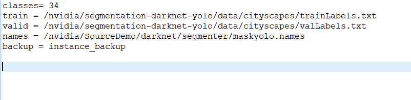

使用yolo做[语义分割](https://so.csdn.net/so/search?q=%E8%AF%AD%E4%B9%89%E5%88%86%E5%89%B2&spm=1001.2101.3001.7020)网上的资料不是很多，而且写的不是很清楚，不容易复现（对我这种菜鸟来说），在此小编整合网上的资料对yolo实现语义分割做了详细的介绍，希望能够帮助大家。以下内容如有错误，还望大家留言批评指正，小编一定会及时更改。

1. **概述**

语义分割是当今计算机视觉领域的关键问题之一。从宏观上看，语义分割是一项高层次的任务，为实现场景的完整理解铺平了道路。场景理解作为一个核心的计算机视觉问题，其重要性在于越来越多的应用程序通过从图像中推断知识来提供营养。其中一些应用包括自动驾驶汽车、人机交互、虚拟现实等，近年来随着深度学习的普及，许多语义分割问题正在采用深层次的结构来解决，最常见的是卷积神经网络，在精度上大大超过了其他方法。以及效率。
语义分割是从粗推理到精推理的自然步骤：

1. 原理可以定位在分类，分类包括对整个输入进行预测。
2. 本地化/检测，它不仅提供类，还提供关于这些类的空间位置的附加信息。
3. 语义分割通过对每个像素进行密集的预测、推断标签来实现细粒度的推理，从而使每个像素都被标记为其封闭对象矿石区域的类别。


**2.语义分割的基础**
也有必要回顾一些对计算机视觉领域做出重大贡献的标准深层网络，因为它们通常被用作语义分割系统的基础：
Alexnet:Toronto首创的Deep CNN，以84.6%的测试准确率赢得了2012年Imagenet竞赛。它由5个卷积层、最大池层、作为非线性的ReLUs、3个完全卷积层和dropout组成。
VGG-16：这款牛津型号以92.7%的准确率赢得了2013年的Imagenet竞争。它使用第一层中具有小接收场的卷积层堆栈，而不是具有大接收场的少数层。
GoogLeNet：这GoogLeNet赢得了2014年Imagenet的竞争，准确率为93.3%。它由22层和一个新引入的称为初始模块的构建块组成。该模块由网络层网络、池操作、大卷积层和小卷积层组成。
Resnet：这款微软的模型以96.4%的准确率赢得了2016年的Imagenet竞争。这是众所周知的，因为它的深度（152层）和残余块的引进。剩余的块通过引入标识跳过连接来解决培训真正深层架构的问题，以便层可以将其输入复制到下一层。

**3.语义分割的方法**
**3.1基于区域的语义分割**
基于区域的方法通常遵循“使用识别的分割”管道，首先从图像中提取自由形式的区域并对其进行描述，然后进行基于区域的分类。在测试时，基于区域的预测转换为像素预测，通常通过根据包含该预测的最高评分区域标记像素。具有代表性的R-CNN

**3.2全卷积网络语义分割**
原始的完全卷积网络（FCN）学习从像素到像素的映射，而不提取区域建议。FCN网络管道是经典CNN的延伸。其主要思想是使经典的CNN以任意大小的图像作为输入。CNN仅接受和生产特定尺寸输入的标签的限制来自完全连接的固定层。与之相反，FCN只有卷积层和池层，它们能够对任意大小的输入进行预测。

**3.3弱监督语义分割**
语义分割中的大多数相关方法都依赖于大量带有像素级分割遮罩的图像。然而，手工注释这些面具是相当费时，令人沮丧和商业成本。因此，最近提出了一些弱监督的方法，这些方法致力于通过使用带注释的边界框来实现语义分割。

**4.Yolo语义分割**
本文主要对darknet源码做了修改，这里使用的分割算法应用场景是车辆的语义分割，数据集选择了奔驰公司所开源的cityscapes数据集（官方网址：[https://www.cityscapes-dataset.com/，](https://www.cityscapes-dataset.com/%EF%BC%8C)在此小编已经下载完成分享给大家链接：https://pan.baidu.com/s/1hrI70ywbu_xEZ0M_y6aFfA 提取码：ae2a ）完成训练以及测试任务。代码方面主要做主程序、损失函数以及cfg结构文件的修改，下面看一下cityscapes数据集的用法。
**4.1 cityscapes数据集介绍**
Cityscapes是关于城市街道场景的语义理解图片数据集。它主要包含来自50个不同城市的街道场景，拥有5000张在城市环境中驾驶场景的高质量像素级注释图像（其中 2975 for train，500 for val,1525 for test， 共有19个类别）。根目录如下：

leftImg8bit文件夹里主要有train,val,test三个文件夹，每个文件夹都有很多城市的原始图像，而对应的精细标注文件就放在gtFine里面，不过每个原始图像在里面对应了6个标注文件如下所示：

其中 xxx_color.png是标注的可视化图片，真正对训练有用的是后面三个文件。xxx_instanceIds.png是用来做实例分割训练用的，而xxx_labelsIds.png是语义分割训练需要的。它们的像素值就是class值。而最后一个文件xxx_polygons.json是用labelme工具标注后所生成的文件，里面主要记录了每个多边形标注框上的点集坐标。
至于另外两个xxx_gtFine_instanceTrainIds.png和xxx_gtFine_labelTrainIds.png则是后面使用labels.py（存放在cityscapescripts文件夹，此文件夹是针对此数据集的一些脚本文件，下载源：[https://github.com/mcordts/cityscapesScripts/tree/master/cityscapesscripts](https://github.com/mcordts/cityscapesScripts/tree/master/cityscapesscripts/helpers)）来生成的。因为实际上这5000张精细标注的图片有34类(0~33)，但训练时可能只想关心其中19类(0~18)。所以需要做一个映射来将34类中感兴趣的类别映射到19类中，其它不感兴趣的类别就直接设成255，所以这也是为什么xxx_trainIds.png中有白色像素的原因，因为那些白色像素的类别不是我们感兴趣的，变成255白色了。  
**4.2 训练以及测试**
训练命令以及过程：


获得的权重文件：
 
测试结果：
由于测试结果为34类，每类的class值就是像素值，所以图像结果都是一片黑，为了可视化为彩色图像，使用matlab写了一个脚本用以测试结果可视化。代码如下：
```
clear;clc;


A=imread('pred.png');


[m,n]=size(A);


R=uint8(zeros(m,n));


G=uint8(zeros(m,n));


B=uint8(zeros(m,n));


for i=1:m


    for j=1:n


        switch(A(i,j))


            case{5}


                R(i,j)=111;


                G(i,j)=74;


            case{6}


               R(i,j)=81;


               B(i,j)=81;  


            case{7}


               R(i,j)=128;


               G(i,j)=64;   


               B(i,j)=128; 


            case{8}


               R(i,j)=244;


               G(i,j)=25;   


               B(i,j)=232;              


            case{9}


               R(i,j)=250;


               G(i,j)=170;   


               B(i,j)=160;      


            case{10}


               R(i,j)=250;


               G(i,j)=150;   


               B(i,j)=140; 


            case{11}


               R(i,j)=70;


               G(i,j)=70;   


               B(i,j)=70; 


            case{12}


               R(i,j)=102;


               G(i,j)=102;   


               B(i,j)=56; 


            case{13}


               R(i,j)=190;


               G(i,j)=153;   


               B(i,j)=153; 


            case{14}


               R(i,j)=180;


               G(i,j)=165;   


               B(i,j)=180; 


            case{15}


               R(i,j)=150;


               G(i,j)=100;   


               B(i,j)=100; 


            case{16}


               R(i,j)=150;


               G(i,j)=120;   


               B(i,j)=90; 


            case{17,18}


               R(i,j)=153;


               G(i,j)=153;   


               B(i,j)=153;               


            case{19}


               R(i,j)=250;


               G(i,j)=170;   


               B(i,j)=30; 


            case{20}


               R(i,j)=220;


               G(i,j)=220;   


               B(i,j)=0;                


            case{21}


               R(i,j)=107;


               G(i,j)=142;   


               B(i,j)=35;              


            case{22}


               R(i,j)=152;


               G(i,j)=251;   


               B(i,j)=152;                


            case{23}


               R(i,j)=70;


               G(i,j)=130;   


               B(i,j)=180;                


             case{24}


               R(i,j)=220;


               G(i,j)=20;   


               B(i,j)=20;                


              case{25}


               R(i,j)=255;


               G(i,j)=0;   


               B(i,j)=0; 


              case{26}


               R(i,j)=0;


               G(i,j)=0;   


               B(i,j)=142; 


              case{27}


               R(i,j)=0;


               G(i,j)=0;   


               B(i,j)=70;                


              case{28}


               R(i,j)=0;


               G(i,j)=60;   


               B(i,j)=100; 


              case{29}


               R(i,j)=0;


               G(i,j)=0;   


               B(i,j)=90; 


              case{30}


               R(i,j)=0;


               G(i,j)=0;   


               B(i,j)=110; 


              case{31}


               R(i,j)=0;


               G(i,j)=80;   


               B(i,j)=100; 


             case{32}


               R(i,j)=0;


               G(i,j)=0;   


               B(i,j)=230; 


              case{33}


               R(i,j)=119;


               G(i,j)=11;   


               B(i,j)=32;  


        end


    end


end              


RGB(:,:,1)=R;


RGB(:,:,2)=G;


RGB(:,:,3)=B;


imwrite(RGB,'C:\Users\zhuohai\Desktop\0717\mask.jpg')


imshow(RGB) ;
```
测试结果可视化效果如下：
       
       
上2幅为原始图像，下2幅为训练16400次的测试效果图，从效果上看，天空sky没有分割出来，还有第1张部分的road元素被误分割成别的物体，总体看效果还算可以，后面会继续再次基础上做自己感兴趣区域的分割。下载源码后只需要修改cfg/maskyolo.data文件和data/maskyolo.names文件，修改如下，配置文件cfg/segment.cfg不需要修改，使用 ./darknet segmenter train cfg/maskyolo.data cfg/segment.cfg segment.backup -gpus 0,1  以及  ./darknet segmenter test cfg/maskyolo.data cfg/segment.cfg backup/segment_97000.weights /nvidia/segmentation-darknet-yolo/data/cityscapes/leftImg8bit/train/aachen/aachen_000000_000019_leftImg8bit.png
分别做训练以及检测。


基于darknet的语义分割算法源码分享：
[https://gitee.com/sun_bao/yolo_segmentation](https://gitee.com/sun_bao/yolo_segmentation)
参考资料：
[https://blog.csdn.net/weixin_40446557/article/details/85624579](https://blog.csdn.net/weixin_40446557/article/details/85624579)
[https://blog.csdn.net/qq_20084101/article/details/80432960](https://blog.csdn.net/qq_20084101/article/details/80432960)
cityscapes数据集简介以及使用方法：
[https://blog.csdn.net/nefetaria/article/details/105728008](https://blog.csdn.net/nefetaria/article/details/105728008)
[https://blog.csdn.net/avideointerfaces/article/details/104139298](https://blog.csdn.net/avideointerfaces/article/details/104139298)

> 来自: [yolo实现语义分割（cityscapes数据集）附源码_yolo语义分割-CSDN博客](https://blog.csdn.net/A837838900/article/details/107413348)

