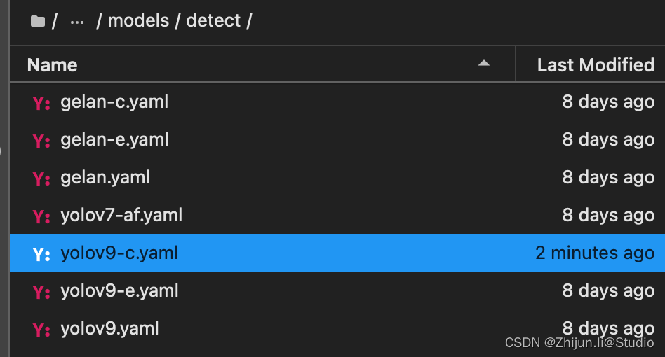

#### 【实战解析】YOLOv9全流程训练至优化终极指南
- [0.引言](https://blog.csdn.net/weixin_45921929/article/details/137327969#0_2)
- [1.环境准备](https://blog.csdn.net/weixin_45921929/article/details/137327969#1_21)
- [2.数据预处理](https://blog.csdn.net/weixin_45921929/article/details/137327969#2_49)
   - [（1）数据准备](https://blog.csdn.net/weixin_45921929/article/details/137327969#1_50)
   - [（2）按比例划分数据集](https://blog.csdn.net/weixin_45921929/article/details/137327969#2_72)
   - [（3）xml转txt脚本](https://blog.csdn.net/weixin_45921929/article/details/137327969#3xmltxt_171)
   - [（4）配置文件](https://blog.csdn.net/weixin_45921929/article/details/137327969#4_348)
- [3.模型训练](https://blog.csdn.net/weixin_45921929/article/details/137327969#3_367)
   - [（1）单GPU训练](https://blog.csdn.net/weixin_45921929/article/details/137327969#1GPU_371)
   - [（2）多GPU训练](https://blog.csdn.net/weixin_45921929/article/details/137327969#2GPU_380)
   - [（3）模型训练可配置参数](https://blog.csdn.net/weixin_45921929/article/details/137327969#3_390)
   - [（4）不同模型训练参数对比](https://blog.csdn.net/weixin_45921929/article/details/137327969#4_428)
   - [（5）重参脚本](https://blog.csdn.net/weixin_45921929/article/details/137327969#5_435)
   - [（6）使用超参进化自动寻找最优组合](https://blog.csdn.net/weixin_45921929/article/details/137327969#6_443)
- [4.模型验证](https://blog.csdn.net/weixin_45921929/article/details/137327969#4_493)
- [5.模型推理](https://blog.csdn.net/weixin_45921929/article/details/137327969#5_505)
- [参考链接](https://blog.csdn.net/weixin_45921929/article/details/137327969#_518)
## 0.引言
> YOLOv9 引入了可编程梯度信息 (PGI) 和广义高效层聚合网络 (GELAN)等开创性技术，标志着[实时目标检测](https://so.csdn.net/so/search?q=%E5%AE%9E%E6%97%B6%E7%9B%AE%E6%A0%87%E6%A3%80%E6%B5%8B&spm=1001.2101.3001.7020)领域的重大进步。该模型在效率、准确性和适应性方面都有显著提高，在 MS COCO 数据集上树立了新的标杆。

`主分支`：主分支主要用于推理过程。 由于推理阶段不需要 PGI 的其他组件，因此 YOLOv9 确保不会产生额外的推理成本。
`辅助可逆分支`：引入辅助可逆分支以确保网络中可靠的梯度生成和参数更新。 该分支通过利用可逆架构来维护完整的信息。 然而，将其直接与主分支集成会产生大量的推理成本，从而促使设计辅助可逆分支。 通过将该分支合并到深度监督框架中，主分支可以接收可靠的梯度信息，有助于提取目标任务的相关特征。 这使得它能够在浅层和深层网络中应用，同时通过在推理过程中删除辅助分支来保留推理能力。
`多级辅助信息`：通过集成特征金字塔层级之间的集成网络来增强深度监督，允许主分支接收来自不同预测头的聚合梯度信息。 这种方法缓解了深度特征金字塔丢失目标对象预测所需的重要信息的问题，确保主分支保留用于学习跨各种目标的预测的完整信息。
YOLOv9 = GELAN + PGI，GELAN权重没有PGI（参见论文第5.5节）。Converted权重结果与原始权重结果相同。在某些图像中，GELAN 版本可能会更好一点，但这会因图像而异。
[yolov9官方仓库：https://github.com/WongKinYiu/yolov9](https://github.com/WongKinYiu/yolov9)
[ultralytics（yolov8）仓库现已支持yolov9：https://docs.ultralytics.com/zh/models/yolov9/](https://docs.ultralytics.com/zh/models/yolov9/)

## 1.环境准备
在这之前，需要先准备主机的环境，环境如下：
> Ubuntu:20.04
cuda:12.0
python:3.10
pytorch:2.2.1
torchvision:0.17.1
torchaudio:2.2.1

准备好上述环境安装后，使用终端进入自己的环境，输入下述命令：
```
git clone https://github.com/WongKinYiu/yolov9.git
cd yolov9
pip install -r requirements.txt
```
当然也可以直接使用仓库中推荐的docker方式：
```
nvidia-docker run --name yolov9 -it -v your_coco_path/:/coco/ -v your_code_path/:/yolov9 --shm-size=64g nvcr.io/nvidia/pytorch:21.11-py3
apt update
apt install -y zip htop screen libgl1-mesa-glx
pip install seaborn thop
cd /yolov9
```
## 2.数据预处理
### （1）数据准备
把labelImg标注后的`images`和`Annotations`复制到`data/sub_dir`下，其中，`data`是原本就存在的文件夹，`sub_dir`是用来区分不同的[数据集](https://so.csdn.net/so/search?q=%E6%95%B0%E6%8D%AE%E9%9B%86&spm=1001.2101.3001.7020)，根据自己的数据修改，例如"person"/"fall"等。
```
.
├── ./data/sub_dir
│   ├── ./data/sub_dir/Annotations
│   │   ├── ./data/sub_dir/Annotations/fall_0.xml
│   │   ├── ./data/sub_dir/Annotations/fall_1000.xml
│   │   ├── ./data/sub_dir/Annotations/fall_1001.xml
│   │   ├── ./data/sub_dir/Annotations/fall_1002.xml
│   │   ├── ./data/sub_dir/Annotations/fall_1003.xml
│   │   ├── ./data/sub_dir/Annotations/fall_1004.xml
│   │   ├── ...
│   ├── ./data/sub_dir/images
│   │   ├── ./data/sub_dir/images/fall_0.jpg
│   │   ├── ./data/sub_dir/images/fall_1000.jpg
│   │   ├── ./data/sub_dir/images/fall_1001.jpg
│   │   ├── ./data/sub_dir/images/fall_1002.jpg
│   │   ├── ./data/sub_dir/images/fall_1003.jpg
│   │   ├── ./data/sub_dir/images/fall_1004.jpg
│   │   ├── ...
```
### （2）按比例划分数据集
在之前文章基础上，重新修改了脚本，使得脚本易用性更强；
在yolov9根目录下新建一个文件`splitDataset.py`，修改一下自己的路径运行即可。
`注意`：需要修改的是代码最后一行中的`sub_dir/train_percent/val_percent/test_percent`，其中`sub_dir`是data下面的数据集子目录，`train_percent/val_percent/test_percent`是按比例划分训练/验证/测试集，三者之和为1，如果不需要测试集则把测试集部分改为0即可。
```
split_dataset(data_dir='data', sub_dir='pp_fall', train_percent=0.8, val_percent=0.1, test_percent=0.1)
```
代码如下所示：
```
# 该脚本用于清理指定的数据目录，仅保留images文件夹和Annotations文件夹。
# 同时，该脚本还负责将数据分割为训练集、验证集和（可选的）测试集，并保存相应的文件名到txt文件中。

import os
import random
import shutil

# 清理目录的函数，保留指定的两个文件夹，删除目录下的其他所有文件和文件夹。
def clean_directory(data_dir, sub_dir):
    print(f"正在清理目录：{data_dir}/{sub_dir}")
    target_dirs = {'images', 'Annotations'}
    full_path = os.path.join(data_dir, sub_dir)
    for item in os.listdir(full_path):
        item_full_path = os.path.join(full_path, item)
        if os.path.isdir(item_full_path) and item not in target_dirs:
            shutil.rmtree(item_full_path)  # 删除非目标文件夹
            print(f"已删除文件夹：{item_full_path}")
        elif os.path.isfile(item_full_path):
            os.remove(item_full_path)  # 删除文件
            print(f"已删除文件：{item_full_path}")
    print("目录清理完成！")

# 根据给定的训练集、验证集和测试集的百分比划分数据集。
def split_dataset(data_dir, sub_dir='person', train_percent=0.8, val_percent=0.1, test_percent=0.1):
    # 检查给定的百分比之和是否小于或等于1
    assert train_percent + val_percent + test_percent <= 1, "总比例之和必须小于或等于1"
   
    # 首先执行清理目录操作
    clean_directory(data_dir, sub_dir)

    # 设置Annotations和ImageSets的文件路径
    xmlfilepath = os.path.join(data_dir, sub_dir, 'Annotations')
    txtsavepath = os.path.join(data_dir, sub_dir, 'ImageSets')
    
    # 如果ImageSets文件夹不存在，则创建该文件夹
    if not os.path.exists(txtsavepath):
        os.makedirs(txtsavepath)
        print(f"已创建文件夹：{txtsavepath}")

    # 获取所有Annotations文件夹中的XML文件名
    total_xml = os.listdir(xmlfilepath)
    print(f"在'{xmlfilepath}'中找到{len(total_xml)}个XML文件")

    # 计算训练集、验证集数量
    num_total = len(total_xml)
    num_train = int(num_total * train_percent)
    num_val = int(num_total * val_percent)
    
    # 生成文件索引列表，随机分配索引号到各个数据集
    list_indices = list(range(num_total))
    train_indices = random.sample(list_indices, num_train)
    list_indices = list(set(list_indices) - set(train_indices))
    val_indices = random.sample(list_indices, num_val)

    # 创建训练集、验证集文件
    ftrain = open(os.path.join(txtsavepath, 'train.txt'), 'w')
    fval = open(os.path.join(txtsavepath, 'val.txt'), 'w')
    print(f"分割数据集：训练集{num_train}个，验证集{num_val}个")

    # 如果测试集比例大于0，则创建测试集文件
    if test_percent > 0:
        num_test = num_total - num_train - num_val
        ftest = open(os.path.join(txtsavepath, 'test.txt'), 'w')
        print(f"测试集{num_test}个")
    else:
        print("没有创建测试集")

    # 遍历所有文件并分配到相应的文件
    for i in range(num_total):
        name = total_xml[i][:-4] + '\n'
        if i in train_indices:
            ftrain.write(name)
        elif i in val_indices:
            fval.write(name)
        elif test_percent > 0:
            ftest.write(name)

    # 关闭打开的文件
    ftrain.close()
    fval.close()
    print("训练集、验证集txt文件已生成！")
    if test_percent > 0:
        ftest.close()
        print("测试集txt文件已生成！")

# 示例：在'data'目录下的'pp_fall'子文件夹中，使用8:1:1的比例分割数据集
split_dataset(data_dir='data', sub_dir='pp_fall', train_percent=0.8, val_percent=0.1, test_percent=0.1)
```
### （3）xml转txt脚本
接下来是xml转txt脚本，需要修改`subfolder`的文件夹名，可与上述保持一致；运行脚本即可新建labels文件夹，并在其中生成图片对应的txt文件
```
# 这段代码的功能是将XML标注文件转换为适用于YOLO模型的标签格式，并检查图片文件的一致性。
# 如果在处理过程中遇到异常，会将有问题的XML文件和对应的图片移动到新的文件夹中，并打印相关信息。

import os
import shutil
import glob
import xml.etree.ElementTree as ET

def move_problematic_files(xml_file, img_file, destination):
    """将有问题的文件移动到指定的目录"""
    if not os.path.exists(destination):
        os.makedirs(destination)
    shutil.move(xml_file, os.path.join(destination, os.path.basename(xml_file)))
    if os.path.exists(img_file):
        shutil.move(img_file, os.path.join(destination, os.path.basename(img_file)))

def find_sets_in_folder(folder_path):
    """在指定文件夹下查找所有的`.txt`文件，并从中提取集合名称"""
    sets = []
    for file in os.listdir(folder_path):
        if file.endswith('.txt'):
            sets.append(file.split('.')[0])
    return sets

def assert_image_files_consistency(image_dir):
    """检查图片文件的扩展名是否一致"""
    image_files = os.listdir(image_dir)
    extensions = [file.split('.')[-1] for file in image_files if '.' in file]
    if len(set(extensions)) > 1:
        print("发现不一致的图片格式: ", set(extensions))
        exit()  # 如果格式不一致，则退出程序

def create_labels_folder(directory):
    """在指定目录下创建`labels`文件夹"""
    labels_folder = os.path.join(directory, 'labels')
    if not os.path.exists(labels_folder):
        os.makedirs(labels_folder)

def count_num(indir):
    """统计XML标注文件中每个类别出现的次数"""
    os.chdir(indir)
    annotations = glob.glob('*.xml')
    label_dict = {}
    for i, file in enumerate(annotations):
        in_file = open(file, encoding='utf-8')
        tree = ET.parse(in_file)
        root = tree.getroot()
        for obj in root.iter('object'):
            name = obj.find('name').text
            label_dict[name] = label_dict.get(name, 0) + 1
    label_list = list(label_dict.keys())
    return label_list, label_dict

def convert_annotation(image_id, image_paths, classes, indir, outdir, error_dir):
    """将XML标注文件转换为文本标签文件"""
    img_file_path = image_paths[0] if image_paths else None
    in_file_path = os.path.join(indir, '%s.xml' % image_id)
    out_file_path = os.path.join(outdir, '%s.txt' % image_id)
    
    try:
        with open(in_file_path, encoding='utf-8') as in_file, \
                open(out_file_path, 'w', encoding='utf-8') as out_file:
            tree = ET.parse(in_file)
            root = tree.getroot()
            size = root.find('size')
            if size is None or int(size.find('width').text) == 0 or int(size.find('height').text) == 0:
                raise ValueError("Image size is invalid or zero.")
            w = int(size.find('width').text)
            h = int(size.find('height').text)
            for obj in root.iter('object'):
                difficult = obj.find('difficult').text
                cls = obj.find('name').text
                if cls not in classes or int(difficult) == 1:
                    continue
                cls_id = classes.index(cls)
                xmlbox = obj.find('bndbox')
                b = (float(xmlbox.find('xmin').text), float(xmlbox.find('xmax').text), float(xmlbox.find('ymin').text), float(xmlbox.find('ymax').text))
                bb = convert((w, h), b)
                out_file.write(str(cls_id) + " " + " ".join([str(a) for a in bb]) + '\n')
                
    except (ValueError, ET.ParseError) as e:
        print(f"处理{image_id}时发生错误: {e}")
        if img_file_path and os.path.exists(img_file_path):
            move_problematic_files(in_file_path, img_file_path, error_dir)
        else:
            print(f"警告：未找到{image_id}的图片文件或已被移动。")


def convert_annotation(image_id, classes, image_extension, indir, outdir, error_dir):
    """将XML标注文件转换为文本标签文件"""
    try:
        in_file = open(os.path.join(indir, '%s.xml' % image_id), encoding='utf-8')
        out_file = open(os.path.join(outdir, '%s.txt' % image_id), 'w', encoding='utf-8')
        tree = ET.parse(in_file)
        root = tree.getroot()
        size = root.find('size')
        if size is None or int(size.find('width').text) == 0 or int(size.find('height').text) == 0:
            raise ValueError("Image size is invalid or zero.")
        w = int(size.find('width').text)
        h = int(size.find('height').text)
        for obj in root.iter('object'):
            difficult = obj.find('difficult').text
            cls = obj.find('name').text
            if cls not in classes or int(difficult) == 1:
                continue
            cls_id = classes.index(cls)
            xmlbox = obj.find('bndbox')
            b = (float(xmlbox.find('xmin').text), float(xmlbox.find('xmax').text), float(xmlbox.find('ymin').text), float(xmlbox.find('ymax').text))
            bb = convert((w, h), b)
            out_file.write(str(cls_id) + " " + " ".join([str(a) for a in bb]) + '\n')

    except Exception as e:
        print(f"处理{image_id}时发生错误: {e}")
        in_file.close()
        out_file.close()
        os.remove(out_file.name)  # 删除已创建的不完整的标签文件
        image_paths = glob.glob(os.path.join(images_dir, '%s.*' % image_id))
        move_problematic_files(in_file.name, image_paths[0], error_dir)  # 使用image_paths[0]作为图片路径
    else:
        in_file.close()
        out_file.close()


# 进行归一化操作
def convert(size, box): # size:(原图w,原图h) , box:(xmin,xmax,ymin,ymax)
    dw = 1./size[0]     # 1/w
    dh = 1./size[1]     # 1/h
    x = (box[0] + box[1])/2.0   # 物体在图中的中心点x坐标
    y = (box[2] + box[3])/2.0   # 物体在图中的中心点y坐标
    w = box[1] - box[0]         # 物体实际像素宽度
    h = box[3] - box[2]         # 物体实际像素高度
    x = x*dw    # 物体中心点x的坐标比(相当于 x/原图w)
    w = w*dw    # 物体宽度的宽度比(相当于 w/原图w)
    y = y*dh    # 物体中心点y的坐标比(相当于 y/原图h)
    h = h*dh    # 物体宽度的宽度比(相当于 h/原图h)
    return (x, y, w, h)    # 返回 相对于原图的物体中心点的x坐标比,y坐标比,宽度比,高度比,取值范围[0-1]


        
if __name__ == '__main__':
    subfolder = 'pp_fall'  # 新增加的子文件夹名称
    
    root_dir = os.getcwd()
    data_dir = os.path.join(root_dir, 'data', subfolder)  # 更新数据文件夹路径, 包含子文件夹
    annotations_dir = os.path.join(data_dir, 'Annotations')  # 标注文件夹路径
    images_dir = os.path.join(data_dir, 'images')  # 图片文件夹路径
    error_dir = os.path.join(data_dir, 'error_files')  # 出错文件的存放路径

    create_labels_folder(data_dir)  # 在subfolder下创建labels文件夹
    classes, class_count = count_num(annotations_dir)  # 获取标签列表和数量
    sets = find_sets_in_folder(os.path.join(data_dir, 'ImageSets'))  # 获取数据集名称列表
    assert_image_files_consistency(images_dir)  # 断言图片文件扩展名是否一致

    print("标签类别及其数量：", class_count)
    for image_set in sets:
        image_ids = open(os.path.join(data_dir, 'ImageSets', '%s.txt' % image_set)).read().strip().split()
        list_file = open(os.path.join(data_dir, '%s.txt' % image_set), 'w')
        for image_id in image_ids:
            image_paths = glob.glob(os.path.join(images_dir, '%s.*' % image_id))
            # print(f"当前正在处理的图片路径为:{image_paths}")
            if len(image_paths) == 1:
                image_extension = image_paths[0].split('.')[-1]
                list_file.write(os.path.join(images_dir, '%s.%s\n' % (image_id, image_extension)))
                try:
                    convert_annotation(image_id, classes, image_extension, annotations_dir, os.path.join(data_dir, 'labels'), error_dir)
                except ZeroDivisionError as zde:
                    print(f"在处理{image_id}时，宽度或高度为零: {zde}")
            else:
                print(f"找不到图片或存在多个同名但不同扩展名的图片：{image_id}")
        list_file.close()
```
### （4）配置文件
最后，需要在`data/sub_dir`下新建一个xxx.yaml，例如下面我自己的fall.yaml，train/val/test填写自己的路径（最好是绝对路径不会出错），nc填写类别数量，names填写自己的类别名，当然也可以复制上述脚本的打印信息里面的类别
```
train: /mnt/workspace/yolov9/data/pp_fall/train.txt
val: /mnt/workspace/yolov9/data/pp_fall/val.txt
test: /mnt/workspace/yolov9/data/pp_fall/test.txt

# number of classes
nc: 1

# class names
names: ['score']
```
另外，把`models/detect/yolov9-c.yaml`路径下的nc改为自己数据集的类别数量

这里注意一个点，里面分为yolov9-x.yaml和gelan-x.yaml，前者是带上辅助分支的配置，训练或者推理需要使用后缀带dual的脚本，如train_dual.py；后者是不带辅助分支的配置，训练或推理使用不带后缀的脚本，如train.py

## 3.模型训练
`train.py`：常规的训练，没有辅助分支的
`train_dual`：一个辅助分支 + 一个主分支
`train_triple`：两个辅助分支 + 一个主分支
### （1）单GPU训练
```
# 训练yolov9模型（带PGI分支）
python train_dual.py --workers 8 --device 0 --batch 8 --data data/pp_fall/voc.yaml --img 640 --cfg models/detect/yolov9-c.yaml --weights '' --name yolov9-c --hyp hyp.scratch-high.yaml --min-items 0 --epochs 500 --close-mosaic 15

# 训练gelan模型（无PGI分支）
python train.py --workers 8 --device 0 --batch 8 --data data/pp_fall/voc.yaml --img 640 --cfg models/detect/gelan-c.yaml --weights '' --name gelan-c --hyp hyp.scratch-high.yaml --min-items 0 --epochs 500 --close-mosaic 15
```
### （2）多GPU训练
```
# 训练yolov9模型
python -m torch.distributed.launch --nproc_per_node 8 --master_port 9527 train_dual.py --workers 8 --device 0,1,2,3,4,5,6,7 --sync-bn --batch 128 --data data/pp_fall/voc.yaml --img 640 --cfg models/detect/yolov9-c.yaml --weights '' --name yolov9-c --hyp hyp.scratch-high.yaml --min-items 0 --epochs 500 --close-mosaic 15

# 训练gelan模型
python -m torch.distributed.launch --nproc_per_node 4 --master_port 9527 train.py --workers 8 --device 0,1,2,3 --sync-bn --batch 128 --data data/pp_fall/voc.yaml --img 640 --cfg models/detect/gelan-c.yaml --weights '' --name gelan-c --hyp hyp.scratch-high.yaml --min-items 0 --epochs 500 --close-mosaic 15
```
### （3）模型训练可配置参数
> –weights: 指定模型的初始权重路径。如果你有一个预训练好的模型，你可以把这个路径指定到你的模型权重文件上。
–cfg: 配置文件的路径，定义了模型的架构。
–data: 数据集配置文件的路径，其中包含了数据集的路径、类别信息等。
–hyp: 超参数配置文件的路径，定义了学习率、权重衰减等超参数。
–epochs: 训练的总轮数。
–batch-size: 批量大小，决定了每次训练时输入模型的样本数量。
–imgsz (–img, --img-size): 训练和验证时图像的大小（像素）。
–rect: 是否采用矩形训练，特定情况下可能会提高性能。
–resume: 是否从最近一次的训练中继续训练。
–nosave: 是否只保存最后一次检查点。
–noval: 是否只在最后一个epoch进行验证。
–noautoanchor: 是否关闭AutoAnchor。
–noplots: 是否不保存绘图文件。
–evolve: 进化超参数的代数。
–bucket: gsutil云存储的bucket路径。
–cache: 图像缓存策略，ram表示内存，disk表示磁盘。
–image-weights: 是否使用加权图像选择进行训练。
–device: 使用的设备，例如CUDA设备编号或CPU。
–multi-scale: 是否在训练中改变图像大小（± 50%）。
–single-cls: 是否将多类别数据作为单一类别进行训练。
–optimizer: 选择优化器，如SGD、Adam等。
–sync-bn: 是否使用同步批量归一化，仅在分布式数据并行（DDP）模式下可用。
–workers: 数据加载时的工作进程数。
–project: 训练结果保存的项目路径。
–name: 训练结果保存的名称。
–exist-ok: 如果项目/名称已存在是否覆盖。
–quad: 是否使用四通道数据加载器。
–cos-lr: 是否使用余弦学习率调度器。
–flat-cos-lr: 是否使用平坦余弦学习率调度器。
–fixed-lr: 是否使用固定学习率调度器。
–label-smoothing: 标签平滑的epsilon值。
–patience: 早停机制的容忍度，表示在指定epoch数内无改进时触发停止。
–freeze: 冻结特定层的训练。
–save-period: 每隔多少epochs保存一次检查点。
–seed: 全局训练种子，用于可复现性。
–local_rank: 自动多GPU参数，用户通常不需要手动修改。

### （4）不同模型训练参数对比
带PGI分支的yolov9与不带PGI分支的gelan训练参数几乎是双倍的存在
`yolov9-c训练参数`：

`gelan-c训练参数`：

### （5）重参脚本
另外，`tools/reparameterization.ipynb`是yolov9重参的脚本，使用重参脚本可以将带PGI的yolov9转换为不带PGI的gelan的模型。转换后，模型的权重大小基本掉了一半，就和上面Performance 上看到的尺寸对应上了，这就是YOLOv9最核心的东西！转换后的模型应该使用val.py或者predict.py，而不是使用val_dual.py或者predict_dual.py。

训练完成后，通过`reparameterization.ipynb` 文件，选择对应转换版本的代码块（目前作者提供了 c 和 e 版本模型转换），进行如下修改：
修改 cfg 为版本对应的 gelan.yaml 文件路径；
修改 nc 为标签数量；
修改 ckpt 为训练好的模型权重文件路径。
### （6）使用超参进化自动寻找最优组合
训练中使用的–evolve参数指的是启用超参数进化策略。当这个参数被设置时，训练过程将包括一个搜索步骤，用于自动寻找最优的超参数组合。这个过程是通过遗传算法来完成的，它模仿生物进化中的选择、交叉（杂交）和变异过程。
具体来说，进化策略会：

1. 选择：从当前的超参数组合（也称为“个体”）中选择表现最佳的一部分。
2. 交叉：将选中的个体之间的超参数进行组合，生成新的超参数组合。
3. 变异：在新生成的超参数组合中随机改变某些超参数的值，以探索可能的新解。

这个进程重复进行多代，每一代都会根据验证集上的性能评估超参数组合，以期望找到更优秀的超参数组合。在实际使用中，–evolve后可以跟一个数字，表示进化的代数，也就是要重复进化策略的次数。具体使用如下：
```
# 训练yolov9模型（带PGI分支）
python train_dual.py --workers 8 --device 0 --batch 8 --data data/pp_fall/voc.yaml --img 640 --cfg models/detect/yolov9-c.yaml --weights '' --name yolov9-c --hyp hyp.scratch-high.yaml --min-items 0 --epochs 500 --close-mosaic 15 --evolve

# 训练gelan模型（无PGI分支）
python train.py --workers 8 --device 0 --batch 8 --data data/pp_fall/voc.yaml --img 640 --cfg models/detect/gelan-c.yaml --weights '' --name gelan-c --hyp hyp.scratch-high.yaml --min-items 0 --epochs 500 --close-mosaic 15 --evolve
```
使用进化策略可以不依赖于专业知识和人工猜测来调整超参数，但它也会消耗更多的计算资源和时间。常用于精细调整模型参数，尤其在寻找特定任务的最优设置时非常有效。设定–evolve时，训练将会变得更长，因为每一代都要对几个候选的超参数组合进行训练和验证。
下面是具体调整的参数部分，这部分参数在`data/hyp/hyp.scratch-high.yaml`下：
> lr0：初始学习率，对于SGD通常设置为1E-2，对于Adam通常设置为1E-3。 lrf：最终学习率，为初始学习率lr0的倍率。
momentum：SGD的动量或Adam的beta1参数，用于加速SGD在相关方向上前进，并减少震荡。
weight_decay：优化器的权重衰减，用于正则化和防止过拟合。
warmup_epochs：预热期的轮数，可以是小数，用于在训练初期使学习率线性增长。
warmup_momentum：预热期间的初始动量。
warmup_bias_lr：预热期间偏置项的学习率。
box：边框损失的增益，用于调整边框损失的比重。
cls：类别损失的增益，用于调整分类损失的比重。
cls_pw：类别损失中正例的权重。
obj：目标损失的增益，根据像素比例进行缩放。
obj_pw：目标损失中正例的权重。
iou_t：IoU训练阈值，用于确定正负样本。
anchor_t：锚框匹配阈值，决定锚框是否与真实框匹配。
anchors：每个输出网格的锚点数，设为0表示忽略。
fl_gamma：Focal Loss的γ参数，用于减少容易分类样本的权重。
hsv_h：图像HSV色彩空间中色调（Hue）的调整范围。
hsv_s：图像HSV色彩空间中饱和度（Saturation）的调整范围。
hsv_v：图像HSV色彩空间中明度（Value）的调整范围。
degrees：图像旋转度数的范围。
translate：图像平移的范围，以图像尺寸的分数表示。
scale：图像缩放的范围。
shear：图像剪切的范围。
perspective：图像透视变换的范围，0-0.001之间。
flipud：图像上下翻转的概率。
fliplr：图像左右翻转的概率。
mosaic：图像mosaic数据增强的概率，多图像拼接。
mixup：图像mixup数据增强的概率，图像混合。
copy_paste：分割复制粘贴的数据增强概率。

## 4.模型验证
```
#验证转换后的yolov9模型
python val.py --data data/pp_fall/voc.yaml --img 640 --batch 32 --conf 0.001 --iou 0.7 --device 0 --weights './yolov9-c-converted.pt' --save-json --name yolov9_c_c_640_val

#验证yolov9模型
python val_dual.py --data data/pp_fall/voc.yaml --img 640 --batch 32 --conf 0.001 --iou 0.7 --device 0 --weights './yolov9-c.pt' --save-json --name yolov9_c_640_val

#验证gelan模型
python val.py --data data/pp_fall/voc.yaml --img 640 --batch 32 --conf 0.001 --iou 0.7 --device 0 --weights './gelan-c.pt' --save-json --name gelan_c_640_val
```
## 5.模型推理
```
# 推理转换后的yolov9模型
python detect.py --source './data/images/horses.jpg' --img 640 --device 0 --weights './yolov9-c-converted.pt' --name yolov9_c_c_640_detect

# 推理yolov9模型
python detect_dual.py --source './data/images/horses.jpg' --img 640 --device 0 --weights './yolov9-c.pt' --name yolov9_c_640_detect

# 推理gelan模型
python detect.py --source './data/images/horses.jpg' --img 640 --device 0 --weights './gelan-c.pt' --name gelan_c_c_640_detect
```
## 参考链接
[https://zhuanlan.zhihu.com/p/690115605](https://zhuanlan.zhihu.com/p/690115605)
[https://aijishu.com/a/1060000000452122](https://aijishu.com/a/1060000000452122)

> 来自: [【实战解析】YOLOv9全流程训练至优化终极指南_yolov9教程-CSDN博客](https://blog.csdn.net/weixin_45921929/article/details/137327969)

