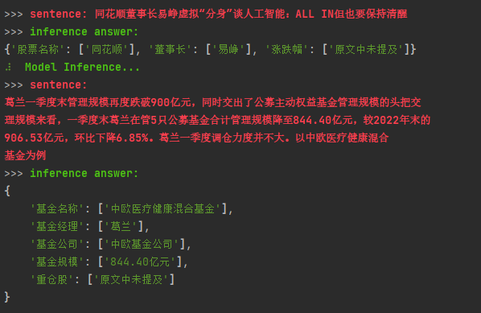

大家好，我是东方财富的一名算法工程师，这里分享一些利用大模型赋能知识图谱建设的一些实践。
### 为什么知识图谱需要大模型
在金融场景中，天然会有大量结构化的数据需要投入大量的人力去生产和维护，而这样的数据又会大量被应用在下游的标签、推荐、风控等场景。比如基金关联的基金经理，基金净值，基金重仓股等信息，需要从各个基金公司的公告信息中进行提取。
做个类比，在 1.0 时代，我们会利用大量的规则和人力去提取和校验相应的数据，但这种方法往往需要针对特定的文本内容去维护各自的规则，成本较高。在 2.0 时代我们可以构建相应的深度学习模型，去辅助完成 NER、实体链接等工作。**在这个过程中，数据的清洗，标注和训练，往往需要非常专业的标注人员和算法开发参与，而且其准确率需要大量的工作来提高**。在大模型时代，我们发现 ChatGPT 能以一个相对非常高的准确率去完成各式各样的任务，这也让我们有一个想法，是否可以利用大模型去辅助我们建设知识图谱（毕竟不是啥业务都上得起大模型，一个图谱能解决下游很多任务）。
通过一些实践发现，ChatGPT 的确可以根据海量文本数据自动生成实体、属性和关系三元组等知识元素，从而快速构建大规模的知识图谱。
### 利用 ChatGPT 构建知识图谱
社区里已经有不少利用 ChatGPT 甚至 GPT4 构建知识图谱的案例：

- [ChatGPT+SmartKG 3分钟生成「哈利波特」知识图谱](https://cloud.tencent.com/developer/tools/blog-entry?target=https%3A%2F%2Fwww.msn.cn%2Fzh-cn%2Fnews%2Ftechnology%2Fchatgpt-smartkg-3%2525E5%252588%252586%2525E9%252592%25259F%2525E7%252594%25259F%2525E6%252588%252590-%2525E5%252593%252588%2525E5%252588%2525A9%2525E6%2525B3%2525A2%2525E7%252589%2525B9-%2525E7%25259F%2525A5%2525E8%2525AF%252586%2525E5%25259B%2525BE%2525E8%2525B0%2525B1%2Far-AA17ykNr&source=article&objectId=2302253)
- [使用 ChatGPT 从视频脚本创建知识图谱，使用 GPT-4 作为领域专家来帮助您从视频转录中提取知识](https://cloud.tencent.com/developer/tools/blog-entry?target=https%3A%2F%2Fblog.csdn.net%2FiCloudEnd%2Farticle%2Fdetails%2F129984488&source=article&objectId=2302253)

假设我们已经在图[数据库](https://cloud.tencent.com/solution/database?from_column=20065&from=20065)中建了一些节点，囊括了所以上市公司，我们的目标是想构建一个关于上市公司的知识图谱，包括董事长，上市时间等信息。
这里推荐修改下面的代码，构建相应的知识图谱：[https://github.com/cocacola-lab/ChatIE](https://cloud.tencent.com/developer/tools/blog-entry?target=https%3A%2F%2Fgithub.com%2Fcocacola-lab%2FChatIE&source=article&objectId=2302253)，我们只需将预设的实体类型和关系类型修改成我们需要的种类，就能实现零样本的大规模知识图谱构建，当然能用 GPT4 的话效果更佳。
### 本地部署的 ChatGLM 方案
考虑到本地部署的数据隐私问题，也可以将 ChatIE 中的 ChatGPT 接口换成 ChatGLM-6B，理论上可以接近 ChatGPT 的效果。
但在实际应用中，我们发现 ChatGLM 虽然具备了一定的内容抽取和链接能力，但是生成内容的可控性较差。
比如我们希望令模型按（实体1，实体2，...）或者 实体1 关系1 实体2 \n这样的格式输出结果，可以在大模型的输入中添加：不要编造答案，并严格按照（实体1，实体2，...）的格式回答，不要有额外内容“ 类似的话。 
但往往结果中还是有大量不可控的内容，需要做大量的正则匹配去清洗数据。
在后来的尝试中，我们在 ChatGLM 中前置了两轮对话达到了较好的效果。具体的代码 demo 可以参考
[利用 ChatGLM 进行金融知识抽取](https://cloud.tencent.com/developer/tools/blog-entry?target=https%3A%2F%2Fgithub.com%2Fzhuojianc%2Ffinancial_chatglm_KG%2Fblob%2Fmain%2Fllm_financial_ie.py&source=article&objectId=2302253)，具体的效果演示参考下图：

当然这只是一个初级的 demo，后续还有更多利用 ES 和 NebulaGraph 进行校验和应用的代码，欢迎大家进行讨论。
### 同主题线上分享
如果你对 LLM、知识图谱感兴趣，可以看看同主题的线上分享：[和 LLM、图数据库从业者一起夜谈这波 AI 风](https://cloud.tencent.com/developer/tools/blog-entry?target=https%3A%2F%2Fdiscuss.nebula-graph.com.cn%2Ft%2Ftopic%2F13560&source=article&objectId=2302253)

> 来自: [与 AI 同行，利用 ChatGLM 构建知识图谱-腾讯云开发者社区-腾讯云](https://cloud.tencent.com/developer/article/2302253?areaId=106001)

