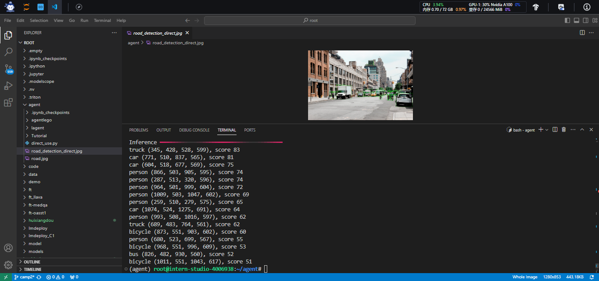

## 1. 概述
### 1.1 Lagent 是什么
Lagent 是一个轻量级开源智能体框架，旨在让用户可以高效地构建基于大语言模型的智能体。同时它也提供了一些典型工具以增强大语言模型的能力。
Lagent 目前已经支持了包括 AutoGPT、ReAct 等在内的多个经典智能体范式，也支持了如下工具：

- Arxiv 搜索
- Bing 地图
- Google 学术搜索
- Google 搜索
- 交互式 IPython 解释器
- IPython 解释器
- PPT
- Python 解释器
### 1.2 AgentLego 是什么

AgentLego 是一个提供了多种开源工具 API 的多模态工具包，旨在像是乐高积木一样，让用户可以快速简便地拓展自定义工具，从而组装出自己的智能体。通过 AgentLego 算法库，不仅可以直接使用多种工具，也可以利用这些工具，在相关智能体框架（如 Lagent，Transformers Agent 等）的帮助下，快速构建可以增强大语言模型能力的智能体。

AgentLego 目前提供了如下工具：

| 
- 计算器
- 谷歌搜索
 | 
- 文本 -> 音频（TTS）
- 音频 -> 文本（STT）
 | 
- 描述输入图像
- 识别文本（OCR）
- 视觉问答（VQA）
- 人体姿态估计
- 人脸关键点检测
- 图像边缘提取（Canny）
- 深度图生成
- 生成涂鸦（Scribble）
- 检测全部目标
- 检测给定目标
- SAM             
   - 分割一切
   - 分割给定目标
 | 
- 文生图
- 图像拓展
- 删除给定对象
- 替换给定对象
- 根据指令修改
- ControlNet 系列             
   - 根据边缘+描述生成
   - 根据深度图+描述生成
   - 根据姿态+描述生成
   - 根据涂鸦+描述生成
- ImageBind 系列             
   - 音频生成图像
   - 热成像生成图像
   - 音频+图像生成图像
   - 音频+文本生成图像
 |
| --- | --- | --- | --- |


### 1.3 两者的关系

经过上面的介绍，我们可以发现，Lagent 是一个智能体框架，而 AgentLego 与大模型智能体并不直接相关，而是作为工具包，在相关智能体的功能支持模块发挥作用。

两者之间的关系可以用下图来表示：

## 2. Lagent：轻量级智能体框架
###  2.1 创建环境,拉取仓库,安装依赖
```bash
studio-conda -t agent -o pytorch-2.1.2
conda activate agent

mkdir agent

cd /root/agent
conda activate agent
git clone https://gitee.com/internlm/lagent.git
cd lagent && git checkout 581d9fb && pip install -e . && cd ..
git clone https://gitee.com/internlm/agentlego.git
cd agentlego && git checkout 7769e0d && pip install -e . && cd ..

conda activate agent
pip install lmdeploy==0.3.0
cd /root/agent
git clone -b camp2 https://gitee.com/internlm/Tutorial.git
```
### 2.2 使用 LMDeploy 部署
由于 Lagent 的 Web Demo 需要用到 LMDeploy 所启动的 api_server，因此我们首先按照下图指示在 vscode terminal 中执行如下代码使用 LMDeploy 启动一个 api_server。
```bash
conda activate agent
lmdeploy serve api_server /root/share/new_models/Shanghai_AI_Laboratory/internlm2-chat-7b \
                            --server-name 127.0.0.1 \
                            --model-name internlm2-chat-7b \
                            --cache-max-entry-count 0.1
```


### 2.3 启动并使用 Lagent Web Demo
新建一个 terminal 以启动 Lagent Web Demo。在新建的 terminal 中执行如下指令：
```bash
conda activate agent
cd /root/agent/lagent/examples
streamlit run internlm2_agent_web_demo.py --server.address 127.0.0.1 --server.port 7860
```


```bash
#在等待 LMDeploy 的 api_server 与 Lagent Web Demo 完全启动后（如下图所示），在本地进行端口映射，将 LMDeploy api_server 的23333端口以及 Lagent Web Demo 的7860端口映射到本地。可以执行：

ssh -CNg -L 7860:127.0.0.1:7860 -L 23333:127.0.0.1:23333 root@ssh.intern-ai.org.cn -p 39571
```

接下来在本地的浏览器页面中打开 [http://localhost:7860](http://localhost:7860/) 以使用 Lagent Web Demo。首先输入模型 IP 为 127.0.0.1:23333，**在输入完成后按下回车键以确认**。并选择插件为 ArxivSearch，以让模型获得在 arxiv 上搜索论文的能力。


## AgentLego：组装智能体“乐高”
### 1. 直接使用 AgentLego
```bash
cd /root/agent
wget http://download.openmmlab.com/agentlego/road.jpg

conda activate agent
pip install openmim==0.3.9
mim install mmdet==3.3.0
```
然后通过 touch /root/agent/direct_use.py（大小写敏感）的方式在 /root/agent 目录下新建 direct_use.py 以直接使用目标检测工具，
```bash
import re

import cv2
from agentlego.apis import load_tool

# load tool
tool = load_tool('ObjectDetection', device='cuda')

# apply tool
visualization = tool('/root/agent/road.jpg')
print(visualization)

# visualize
image = cv2.imread('/root/agent/road.jpg')

preds = visualization.split('\n')
pattern = r'(\w+) \((\d+), (\d+), (\d+), (\d+)\), score (\d+)'

for pred in preds:
    name, x1, y1, x2, y2, score = re.match(pattern, pred).groups()
    x1, y1, x2, y2, score = int(x1), int(y1), int(x2), int(y2), int(score)
    cv2.rectangle(image, (x1, y1), (x2, y2), (0, 255, 0), 1)
    cv2.putText(image, f'{name} {score}', (x1, y1), cv2.FONT_HERSHEY_SIMPLEX, 0.8, (0, 255, 0), 1)

cv2.imwrite('/root/agent/road_detection_direct.jpg', image)
```
接下来在执行 python /root/agent/direct_use.py 以进行推理。



### 2 使用 LMDeploy 部署
由于 AgentLego 的 WebUI 需要用到 LMDeploy 所启动的 api_server，因此我们首先按照下图指示在 vscode terminal 中执行如下代码使用 LMDeploy 启动一个 api_server。

```
conda activate agent
lmdeploy serve api_server /root/share/new_models/Shanghai_AI_Laboratory/internlm2-chat-7b \
                            --server-name 127.0.0.1 \
                            --model-name internlm2-chat-7b \
                            --cache-max-entry-count 0.1
```
### 3 启动 AgentLego WebUI
接下来我们按照下图指示新建一个 terminal 以启动 AgentLego WebUI。在新建的 terminal 中执行如下指令：

```
conda activate agent
cd /root/agent/agentlego/webui
python one_click.py
```
###   
### 4 体验自定义工具效果

```
conda activate agent
lmdeploy serve api_server /root/share/new_models/Shanghai_AI_Laboratory/internlm2-chat-7b \
                            --server-name 127.0.0.1 \
                            --model-name internlm2-chat-7b \
                            --cache-max-entry-count 0.1
```

```
conda activate agent
cd /root/agent/agentlego/webui
python one_click.py
```


