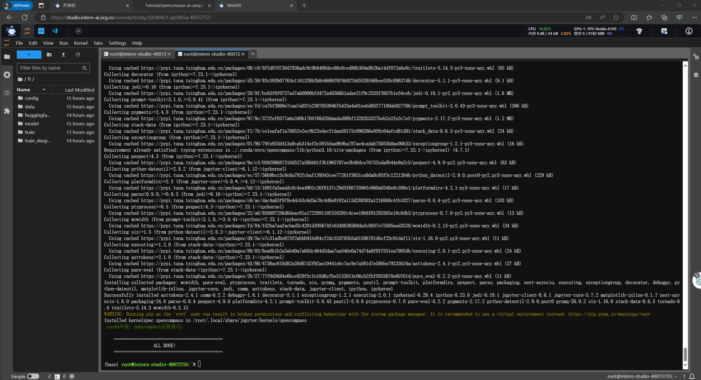
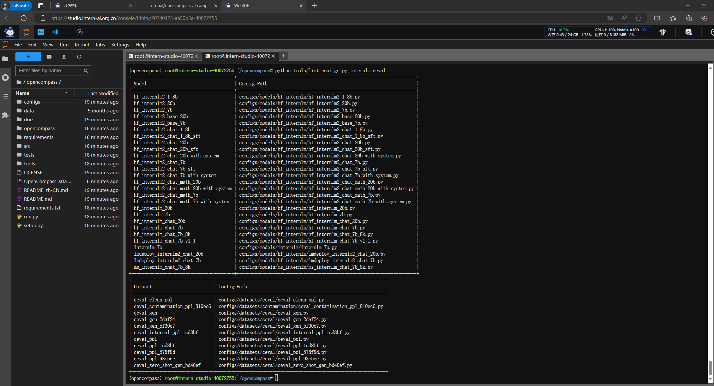
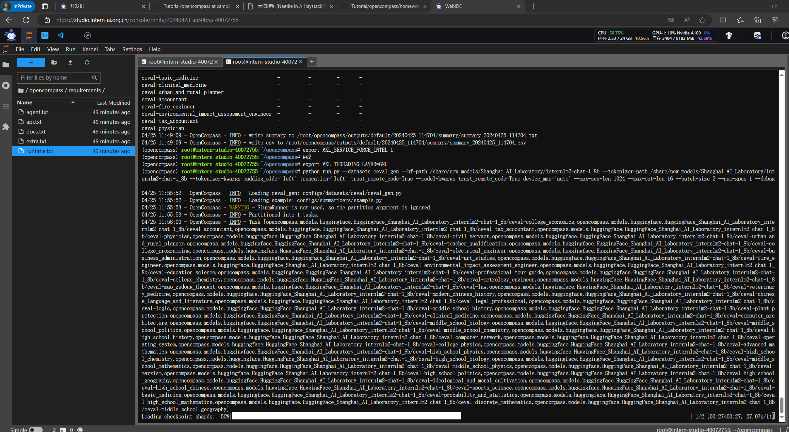
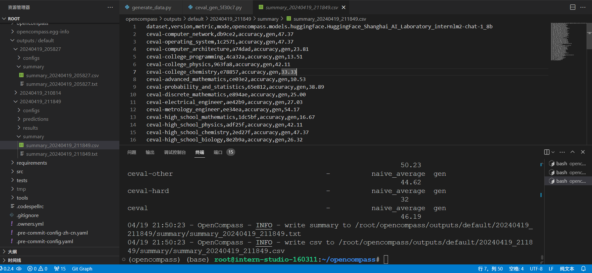

#### 面向GPU的环境安装

```
studio-conda -o internlm-base -t opencompass
source activate opencompass
git clone -b 0.2.4 https://github.com/open-compass/opencompass
cd opencompass
pip install -e .
```
有部分第三方功能,如代码能力基准测试 HumanEval 以及 Llama 格式的模型评测,可能需要额外步骤才能正常运行，如需评测，详细步骤请参考安装指南。

#### 数据准备
解压评测数据集到 data/ 处

```
cp /share/temp/datasets/OpenCompassData-core-20231110.zip /root/opencompass/
unzip OpenCompassData-core-20231110.zip
```
将会在 OpenCompass 下看到data文件夹
#### 查看支持的数据集和模型
列出所有跟 InternLM 及 C-Eval 相关的配置
```bash
python tools/list_configs.py internlm ceval
```



#### 启动评测 
确保按照上述步骤正确安装 OpenCompass 并准备好数据集后，可以通过以下命令评测 InternLM2-Chat-1.8B 模型在 C-Eval 数据集上的性能。由于 OpenCompass 默认并行启动评估过程，我们可以在第一次运行时以 --debug 模式启动评估，并检查是否存在问题。在 --debug 模式下，任务将按顺序执行，并实时打印输出。
```bash
python run.py --datasets ceval_gen --hf-path /share/new_models/Shanghai_AI_Laboratory/internlm2-chat-1_8b --tokenizer-path /share/new_models/Shanghai_AI_Laboratory/internlm2-chat-1_8b --tokenizer-kwargs padding_side='left' truncation='left' trust_remote_code=True --model-kwargs trust_remote_code=True device_map='auto' --max-seq-len 1024 --max-out-len 16 --batch-size 2 --num-gpus 1 --debug
```
会遇到报错，装一下protobuf包
```bash
pip install protobuf
```
**还会遇到mkl-service + Intel(R) MKL MKL_THREADING_LAYER=INTEL is incompatible with libgomp.so.1 ...**
** 解决方案：**
```bash
export MKL_SERVICE_FORCE_INTEL=1
```

评测完成后，将会得到csv文件，记录了测评结果

