## 1.InternStudio开发机创建conda环境
由于环境依赖项存在torch，下载过程可能比较缓慢。InternStudio上提供了快速创建conda环境的方法。打开命令行终端，创建一个名为lmdeploy的环境：
```shell
studio-conda -t lmdeploy -o pytorch-2.1.2
```

## 1.2安装LMDeploy
接下来，激活刚刚创建的虚拟环境。
```shell
conda activate lmdeploy
```
安装0.3.0版本的lmdeploy。
```shell
pip install lmdeploy[all]==0.3.0
```
## 1.3 下载模型
本次实战营已经在开发机的共享目录中准备好了常用的预训练模型，可以运行如下命令查看：
```shell
ls /root/share/new_models/Shanghai_AI_Laboratory/
```
显示如下，每一个文件夹都对应一个预训练模型。
[](https://github.com/InternLM/Tutorial/blob/camp2/lmdeploy/imgs/2.2_1.jpg)以InternLM2-Chat-1.8B模型为例，从官方仓库下载模型。
### InternStudio开发机上下载模型
如果你是在InternStudio开发机上，可以按照如下步骤快速下载模型。
首先进入一个你想要存放模型的目录，本教程统一放置在Home目录。执行如下指令：
```shell
cd ~
```
然后执行如下指令由开发机的共享目录**软链接**或**拷贝**模型：

```
ln -s /root/share/new_models/Shanghai_AI_Laboratory/internlm2-chat-1_8b /root/
# cp -r /root/share/new_models/Shanghai_AI_Laboratory/internlm2-chat-1_8b /root/
```
## 1.4 使用Transformer库运行模型
Transformer库是Huggingface社区推出的用于运行HF模型的官方库。

在终端中输入如下指令，新建pipeline_transformer.py。
```shell
touch /root/pipeline_transformer.py
```
将以下内容复制粘贴进入pipeline_transformer.py。
```shell
import torch
from transformers import AutoTokenizer, AutoModelForCausalLM

tokenizer = AutoTokenizer.from_pretrained("/root/internlm2-chat-1_8b", trust_remote_code=True)

# Set `torch_dtype=torch.float16` to load model in float16, otherwise it will be loaded as float32 and cause OOM Error.
model = AutoModelForCausalLM.from_pretrained("/root/internlm2-chat-1_8b", torch_dtype=torch.float16, trust_remote_code=True).cuda()
model = model.eval()

inp = "hello"
print("[INPUT]", inp)
response, history = model.chat(tokenizer, inp, history=[])
print("[OUTPUT]", response)

inp = "please provide three suggestions about time management"
print("[INPUT]", inp)
response, history = model.chat(tokenizer, inp, history=history)
print("[OUTPUT]", response)

```
运行代码
```shell
python /root/pipeline_transformer.py
```

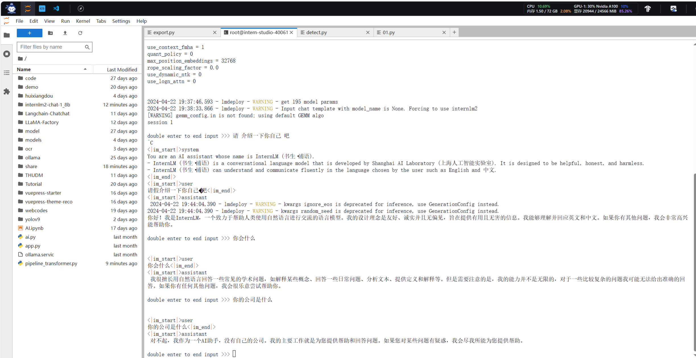
## 2.1 设置最大KV Cache缓存大小

KV Cache是一种缓存技术，通过存储键值对的形式来复用计算结果，以达到提高性能和降低内存消耗的目的。在大规模训练和推理中，KV Cache可以显著减少重复计算量，从而提升模型的推理速度。理想情况下，KV Cache全部存储于显存，以加快访存速度。当显存空间不足时，也可以将KV Cache放在内存，通过缓存管理器控制将当前需要使用的数据放入显存。

模型在运行时，占用的显存可大致分为三部分：模型参数本身占用的显存、KV Cache占用的显存，以及中间运算结果占用的显存。LMDeploy的KV Cache管理器可以通过设置`--cache-max-entry-count`参数，控制KV缓存**占用剩余显存**的最大比例。默认的比例为0.8。

下面通过几个例子，来看一下调整`--cache-max-entry-count`参数的效果。首先保持不加该参数（默认0.8），运行1.8B模型。

```shell
lmdeploy chat /root/internlm2-chat-1_8b
```

与模型对话，查看右上角资源监视器中的显存占用情况。


此时显存占用为20944MB。下面，改变`--cache-max-entry-count`参数，设为0.5。

```shell
lmdeploy chat /root/internlm2-chat-1_8b --cache-max-entry-count 0.5
```

与模型对话，再次查看右上角资源监视器中的显存占用情况。
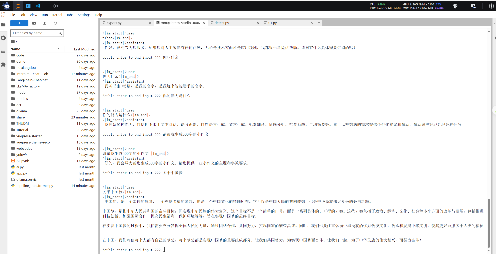

看到显存占用明显降低，变为14832M。

下面把`--cache-max-entry-count`参数设置为0.4

```shell
lmdeploy chat /root/internlm2-chat-1_8b --cache-max-entry-count 0.4
```

然后与模型对话，可以看到，此时显存占用仅为12776MB
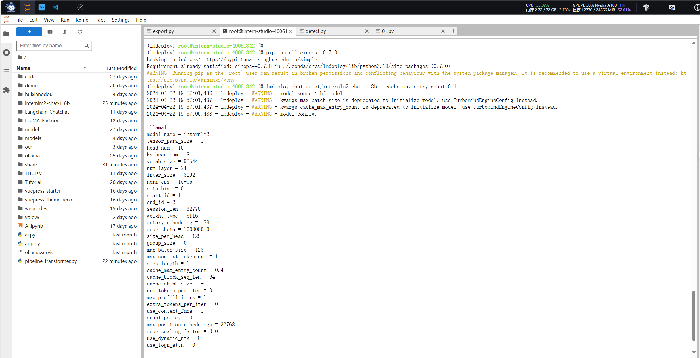


## 2.2 使用W4A16量化

LMDeploy使用AWQ算法，实现模型4bit权重量化。推理引擎TurboMind提供了非常高效的4bit推理cuda kernel，性能是FP16的2.4倍以上。

运行前，首先安装一个依赖库。

```shell
pip install einops==0.7.0
```

执行以下命令，就可以完成模型量化工作。

```shell
lmdeploy lite auto_awq \
   /root/internlm2-chat-1_8b \
  --calib-dataset 'ptb' \
  --calib-samples 128 \
  --calib-seqlen 1024 \
  --w-bits 4 \
  --w-group-size 128 \
  --work-dir /root/internlm2-chat-1_8b-4bit
```

这一步时间很长，等吧
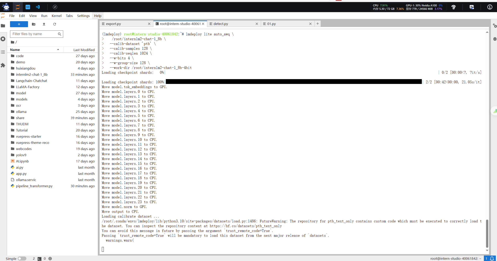
:::warning
这一步有坑，因为我一开始用的是cuda 11.7 版本，不兼容，显示超时，最后更换cuda 12.2版本可以正常
:::
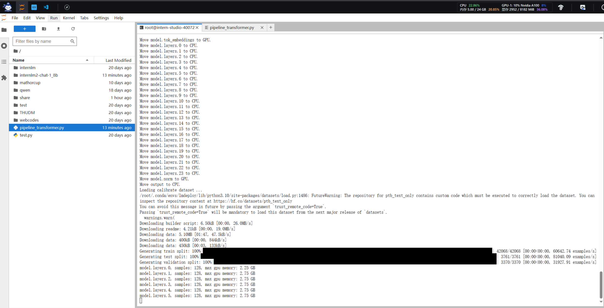
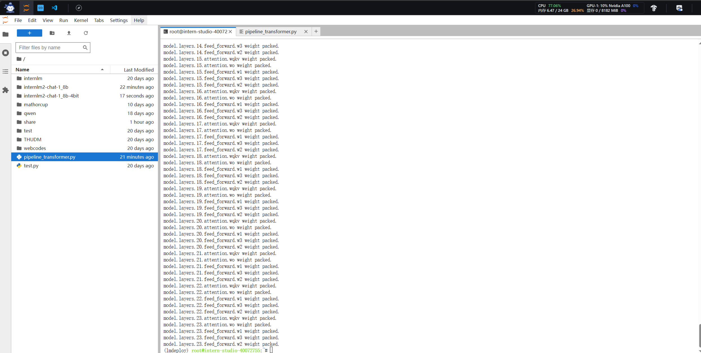

量化工作结束后，新的HF模型被保存到`internlm2-chat-1_8b-4bit`目录。下面使用Chat功能运行W4A16量化后的模型。

```shell
lmdeploy chat /root/internlm2-chat-1_8b-4bit --model-format awq
```

为了更加明显体会到W4A16的作用，我们将KV Cache比例再次调为0.4，查看显存占用情况。

```shell
lmdeploy chat /root/internlm2-chat-1_8b-4bit --model-format awq --cache-max-entry-count 0.
```
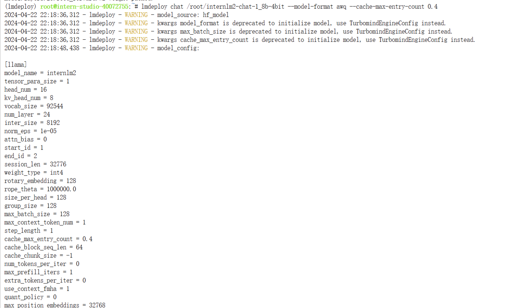
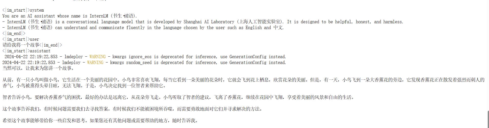
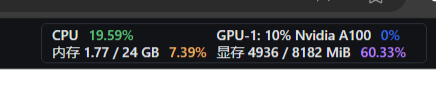
可以看到，显存占用变为4936MB，明显降低。


**拓展内容**：有关LMDeploy的lite功能的更多参数可通过-h命令查看。

```shell
lmdeploy lite -h
```

## 3.LMDeploy服务(serve)

在第二章和第三章，我们都是在本地直接推理大模型，这种方式成为本地部署。在生产环境下，我们有时会将大模型封装为API接口服务，供客户端访问。

我们来看下面一张架构图：


我们把从架构上把整个服务流程分成下面几个模块。

- 模型推理/服务。主要提供模型本身的推理，一般来说可以和具体业务解耦，专注模型推理本身性能的优化。可以以模块、API等多种方式提供。
- API Server。中间协议层，把后端推理/服务通过HTTP，gRPC或其他形式的接口，供前端调用。
- Client。可以理解为前端，与用户交互的地方。通过通过网页端/命令行去调用API接口，获取模型推理/服务。

值得说明的是，以上的划分是一个相对完整的模型，但在实际中这并不是绝对的。比如可以把“模型推理”和“API Server”合并，有的甚至是三个流程打包在一起提供服务。

## 3.1 启动API服务器

通过以下命令启动API服务器，推理`internlm2-chat-1_8b`模型：

```shell
lmdeploy serve api_server \
    /root/internlm2-chat-1_8b \
    --model-format hf \
    --quant-policy 0 \
    --server-name 0.0.0.0 \
    --server-port 23333 \
    --tp 1
```

其中，model-format、quant-policy这些参数是与第三章中量化推理模型一致的；server-name和server-port表示API服务器的服务IP与服务端口；tp参数表示并行数量（GPU数量）。

通过运行以上指令，我们成功启动了API服务器，请勿关闭该窗口，后面我们要新建客户端连接该服务。

可以通过运行一下指令，查看更多参数及使用方法：

```shell
lmdeploy serve api_server -h
```


注意，这一步由于Server在远程服务器上，所以本地需要做一下ssh转发才能直接访问。**在你本地打开一个cmd窗口**，输入命令如下：

```shell
ssh -CNg -L 23333:127.0.0.1:23333 root@ssh.intern-ai.org.cn -p 你的ssh端口号
```


然后打开浏览器，访问`http://127.0.0.1:23333`。
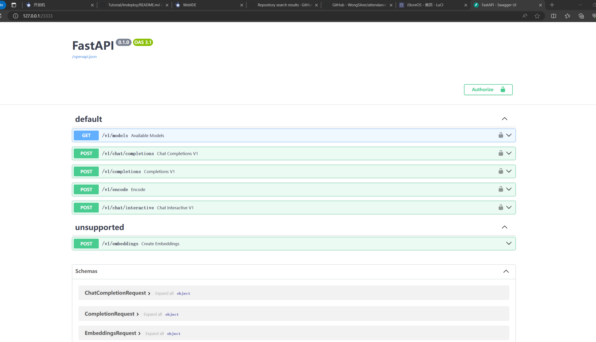

## 3.2 命令行客户端连接API服务器

在“4.1”中，我们在终端里新开了一个API服务器。

本节中，我们要新建一个命令行客户端去连接API服务器。首先通过VS Code新建一个终端：


激活conda环境。

```shell
conda activate lmdeploy
```

运行命令行客户端：

```shell
lmdeploy serve api_client http://localhost:23333
```

运行后，可以通过命令行窗口直接与模型对话：
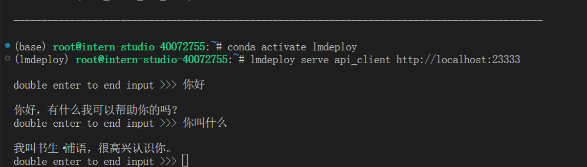


## 3.3 网页客户端连接API服务器

关闭刚刚的VSCode终端，但服务器端的终端不要关闭。

新建一个VSCode终端，激活conda环境。

```shell
conda activate lmdeploy
```

使用Gradio作为前端，启动网页客户端。

```shell
lmdeploy serve gradio http://localhost:23333 \
    --server-name 0.0.0.0 \
    --server-port 6006
```
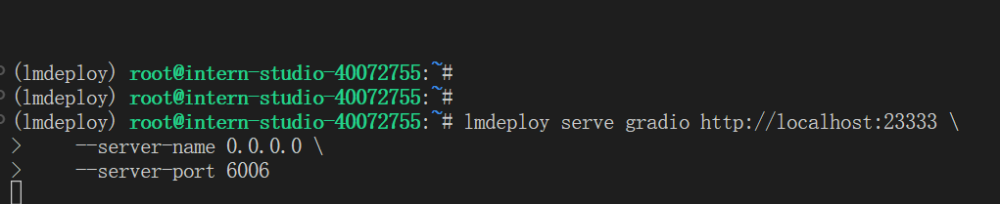


运行命令后，网页客户端启动。在电脑本地新建一个cmd终端，新开一个转发端口：

```shell
ssh -CNg -L 6006:127.0.0.1:6006 root@ssh.intern-ai.org.cn -p <你的ssh端口号>
```

打开浏览器，访问地址`http://127.0.0.1:6006`
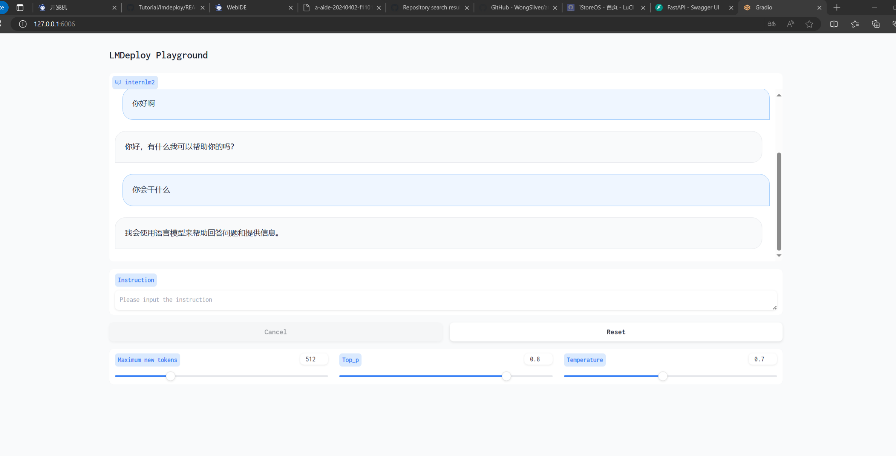

然后就可以与模型进行对话了！


## 4.Python代码集成
在开发项目时，有时我们需要将大模型推理集成到Python代码里面。
## 4.1 Python代码集成运行1.8B模型
首先激活conda环境。
```shell
conda activate lmdeploy
```
新建Python源代码文件pipeline.py。
```shell
touch /root/pipeline.py
```
打开pipeline.py，填入以下内容。

```
from lmdeploy import pipeline

pipe = pipeline('/root/internlm2-chat-1_8b')
response = pipe(['Hi, pls intro yourself', '上海是'])
print(response)
```

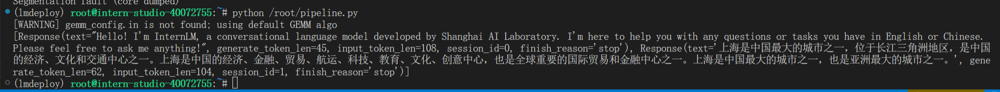
## 4.2 向TurboMind后端传递参数
在第3章，我们通过向lmdeploy传递附加参数，实现模型的量化推理，及设置KV Cache最大占用比例。在Python代码中，可以通过创建TurbomindEngineConfig，向lmdeploy传递参数。
以设置KV Cache占用比例为例，新建python文件pipeline_kv.py。
```shell
touch /root/pipeline_kv.py
```
打开pipeline_kv.py，填入如下内容：

```
from lmdeploy import pipeline, TurbomindEngineConfig

# 调低 k/v cache内存占比调整为总显存的 20%
backend_config = TurbomindEngineConfig(cache_max_entry_count=0.2)

pipe = pipeline('/root/internlm2-chat-1_8b',
                backend_config=backend_config)
response = pipe(['Hi, pls intro yourself', '上海是'])
print(response)
```
保存后运行python代码：
```shell
python /root/pipeline_kv.py
```
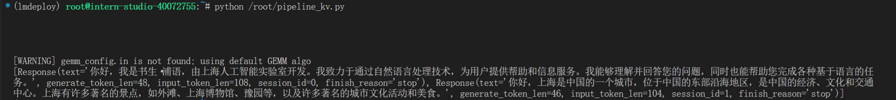

## 5.使用 LMDeploy 运行视觉多模态大模型 llava gradio demo
这里我测试了一下，10%的显存直接跑满，准备下次用30%


