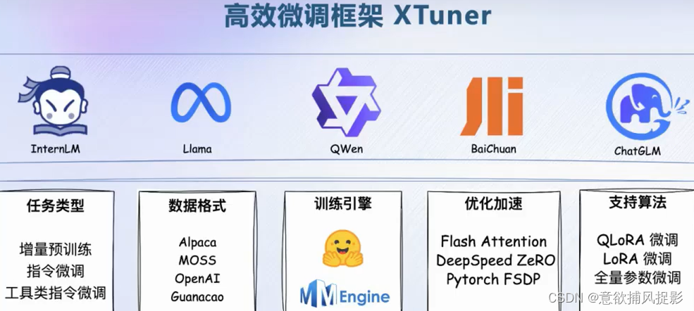
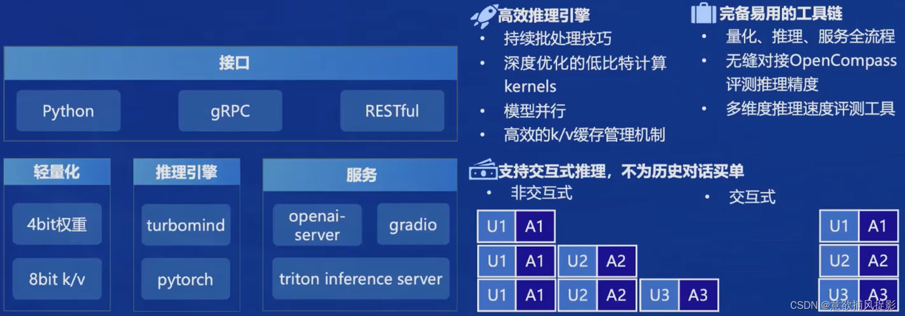
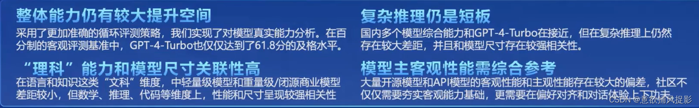
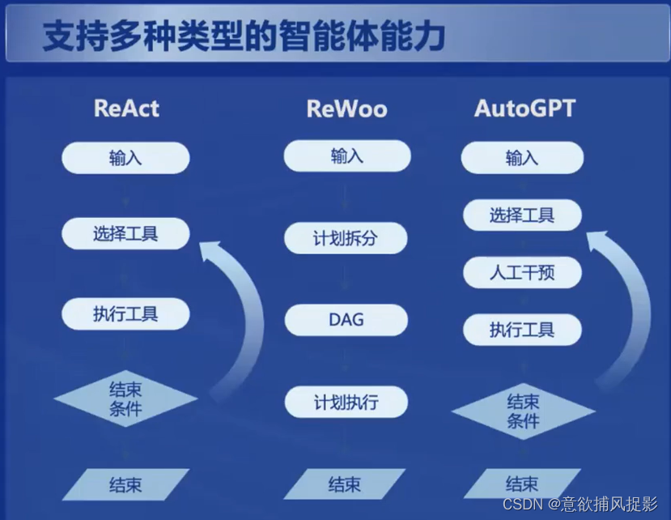
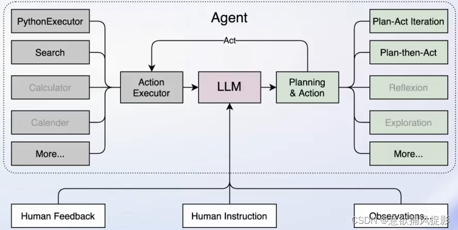
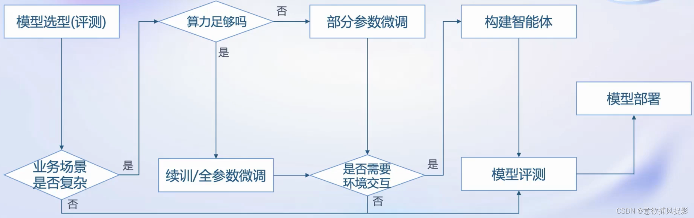
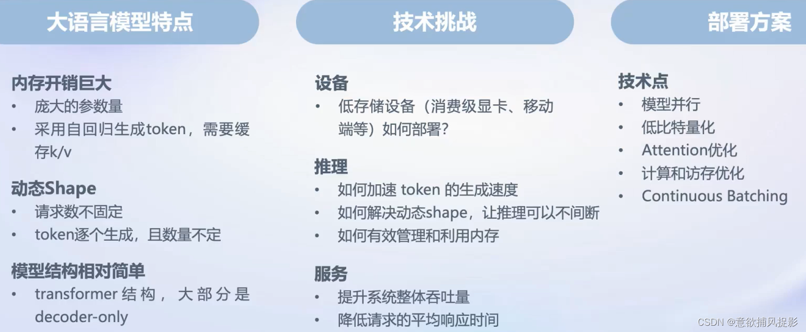

## 课堂重点
1. 大模型的发展历程
   - 由专用模型（针对特定任务，一个模型解决一个问题）-> 通用大模型（一个模型应对多个任务、多种模态）
   - 通用大模型是通往通用人工智能的关键途径
2. 书生浦语大模型的开源历程
   - 2023年6月 InternLm 千亿语言大模型发布，到7月升级开源
   - 8月书生万卷多模态模型发布，升级对话模型，Lagent发布，参数量升级至123B
   - 9月20B开源
   - 2024年 InternLm2 发布
3. InternLm2 特点和优势
- 超长上下文处理能力、优秀的对话和创作体验、强大的工具调用能力和出色的数理分析能力
- 通过与其他同类产品的对比，性能全方位提升，突出了书生葡语大模型的优势地位
- 模型创作富有想象力，举例展示了模型在各种应用场景下的表现，例如提供旅行计划建议、给予富有同情心的人工智能助手的回答等
- 工具调用能力升级，工具复合调用完成复杂任务
- 内在的计算能力强大，同时还能借助代码解释器，提升计算能力

### 书生·浦语全链条开源开放体系
#### 1、数据：书生·万卷
OpenDatalab
#### 2、预训练：InternLM-Train
优于Megatron-deepSpeed，使用[Hyper](https://so.csdn.net/so/search?q=Hyper&spm=1001.2101.3001.7020) Zero技术，
#### 3、[微调](https://so.csdn.net/so/search?q=%E5%BE%AE%E8%B0%83&spm=1001.2101.3001.7020)：XTuner
**增量续训**：使用场景：让基座模型学习新知识多为垂直领域，训练数据：文章书籍代码等。**有监督微调**：使用场景：让模型学会理解或遵循指令或注入少量领域知识，训练数据：高质量对话、问答数据，（全量参数微调、部分参数微调如LoRa）

#### 4、部署：LMDeploy

#### 5、评测：OpenCompass

#### 6、应用：智能体/Lagent AgentLego
轻量型智能体框架Lagent：

多模态智能体工具箱：AgentLego
智能体：大模型的局限性：最新信息和知识的获取、数学计算、回复的可靠性、工具的使用和交互
Lagent：

> 来自: [书生· 浦语InternLM实战_1-CSDN博客](https://blog.csdn.net/weixin_60184485/article/details/136220533?spm=1001.2014.3001.5501)

