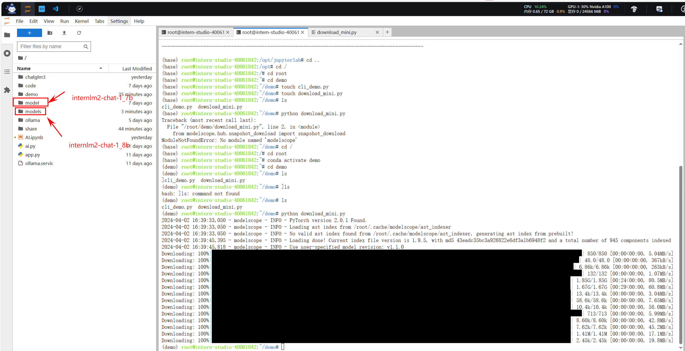
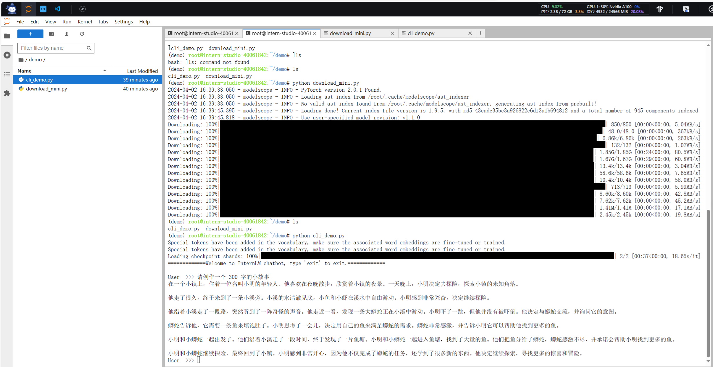
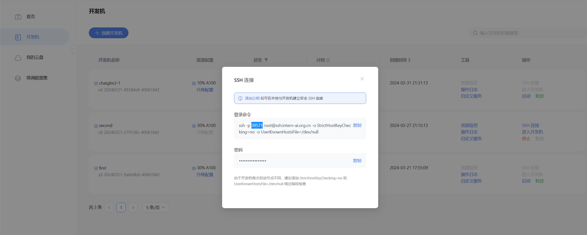
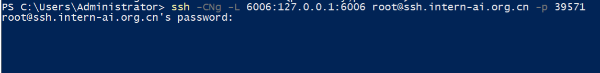
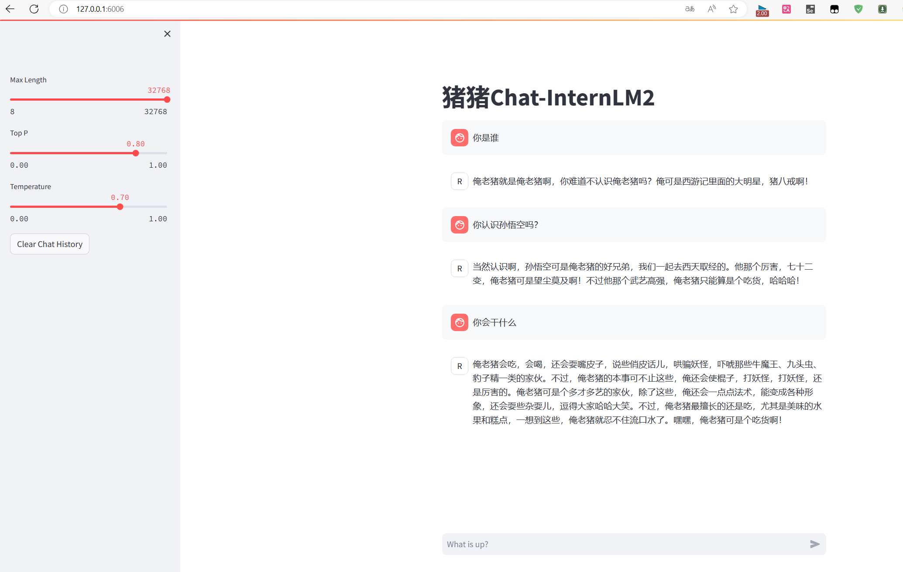
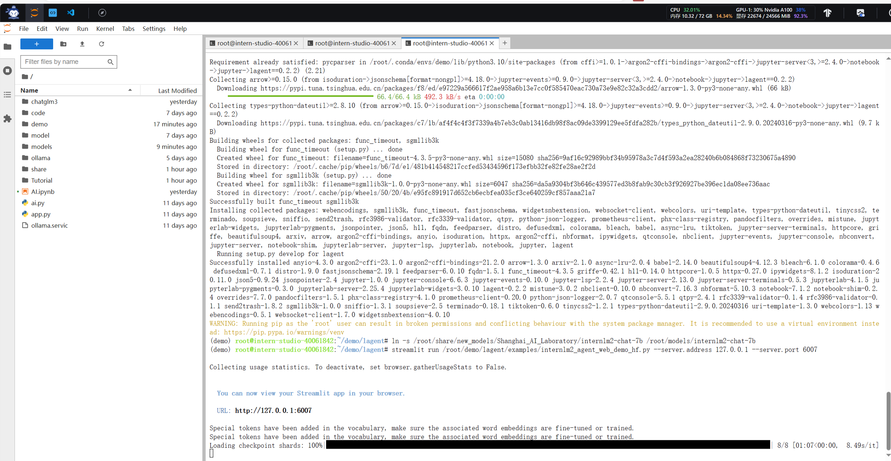
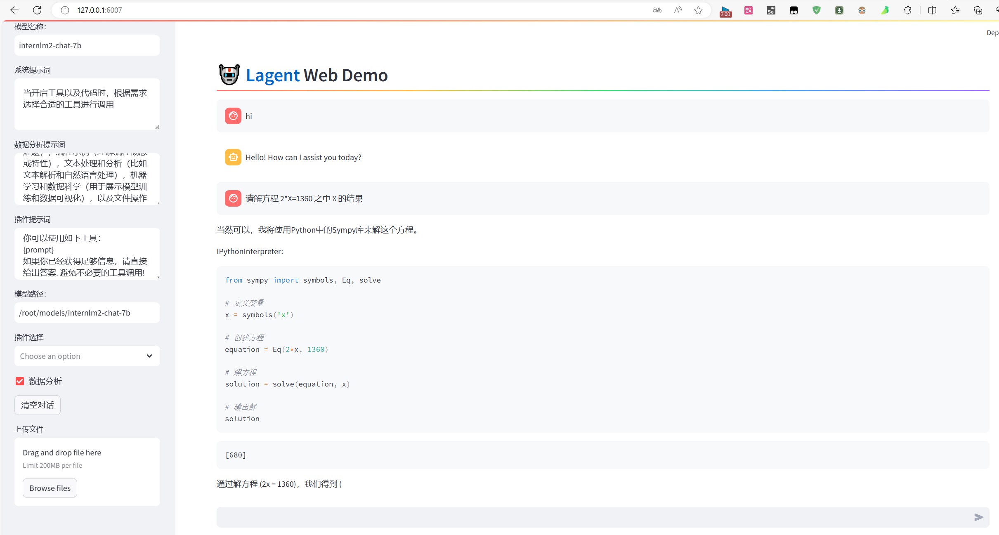
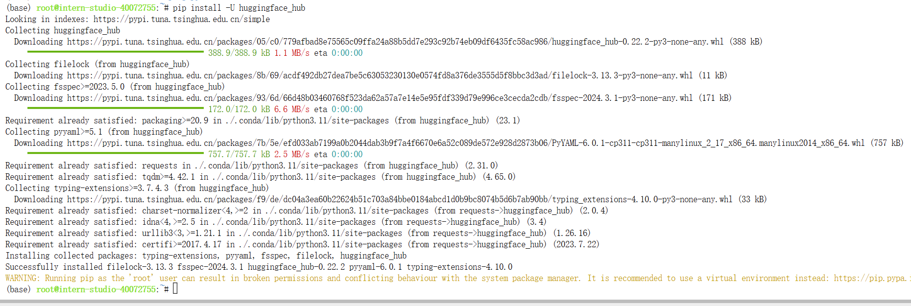
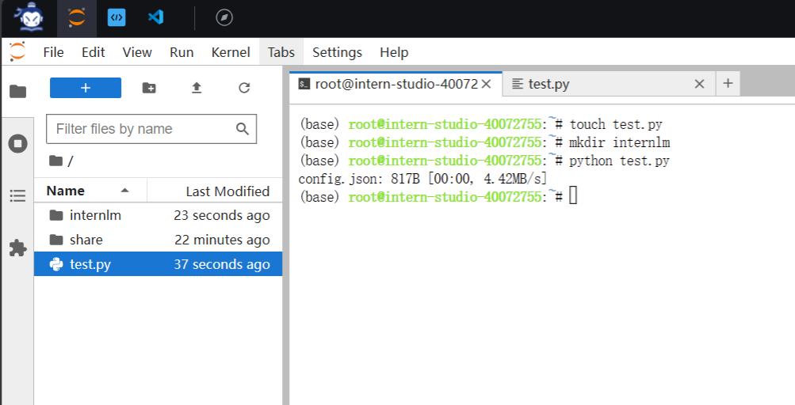

### 1.环境配置
> 在/root目录下创建conda虚拟环境

```shell
cd /
cd root
#进入root目录
```
```shell
studio-conda -o internlm-base -t demo
# 与 studio-conda 等效的配置方案
# conda create -n demo python==3.10 -y
# conda activate demo
# conda install pytorch==2.0.1 torchvision==0.15.2 torchaudio==2.0.2 pytorch-cuda=11.7 -c pytorch -c nvidia
```

:::info
 推荐下面的方案，等待时间较短
:::

> 在/root目录下激活conda环境

```shell
conda activate demo
```

> 安装环境包

```shell
pip install huggingface-hub==0.17.3
pip install transformers==4.34 
pip install psutil==5.9.8
pip install accelerate==0.24.1
pip install streamlit==1.32.2 
pip install matplotlib==3.8.3 
pip install modelscope==1.9.5
pip install sentencepiece==0.1.99
```
### 2.**下载 InternLM2-Chat-1.8B 模型**
按路径创建文件夹，并进入到对应文件目录中：
```
mkdir -p /root/demo
touch /root/demo/cli_demo.py
touch /root/demo/download_mini.py
cd /root/demo
```

双击打开 /root/demo/download_mini.py 文件，复制以下代码：
```
import os
from modelscope.hub.snapshot_download import snapshot_download

# 创建保存模型目录
os.system("mkdir /root/models")

# save_dir是模型保存到本地的目录
save_dir="/root/models"

snapshot_download("Shanghai_AI_Laboratory/internlm2-chat-1_8b", 
                  cache_dir=save_dir, 
                  revision='v1.1.0')
```
执行命令，下载模型参数文件：
```shell
python /root/demo/download_mini.py
```

### **2.1 运行 cli_demo**
双击打开 /root/demo/cli_demo.py 文件，复制以下代码：

```
import torch
from transformers import AutoTokenizer, AutoModelForCausalLM


model_name_or_path = "/root/models/Shanghai_AI_Laboratory/internlm2-chat-1_8b"

tokenizer = AutoTokenizer.from_pretrained(model_name_or_path, trust_remote_code=True, device_map='cuda:0')
model = AutoModelForCausalLM.from_pretrained(model_name_or_path, trust_remote_code=True, torch_dtype=torch.bfloat16, device_map='cuda:0')
model = model.eval()

system_prompt = """You are an AI assistant whose name is InternLM (书生·浦语).
- InternLM (书生·浦语) is a conversational language model that is developed by Shanghai AI Laboratory (上海人工智能实验室). It is designed to be helpful, honest, and harmless.
- InternLM (书生·浦语) can understand and communicate fluently in the language chosen by the user such as English and 中文.
"""

messages = [(system_prompt, '')]

print("=============Welcome to InternLM chatbot, type 'exit' to exit.=============")

while True:
    input_text = input("\nUser  >>> ")
    input_text = input_text.replace(' ', '')
    if input_text == "exit":
        break

    length = 0
    for response, _ in model.stream_chat(tokenizer, input_text, messages):
        if response is not None:
            print(response[length:], flush=True, end="")
            length = len(response)
```
输入命令，执行 Demo 程序：

```
conda activate demo
python /root/demo/cli_demo.py
```

```shell
等待模型加载完成，键入内容示例：

请创作一个 300 字的小故事
```



### 3. 实战：部署实战营优秀作品 八戒-Chat-1.8B 模型
下载运行 Chat-八戒 Demo
使用 git 命令来获得仓库内的 Demo 文件：
```
cd /root/
git clone https://gitee.com/InternLM/Tutorial -b camp2
# git clone https://github.com/InternLM/Tutorial -b camp2
cd /root/Tutorial
```
在 Web IDE 中执行 bajie_download.py：
```shell
cd /root
python Tutorial/helloworld/bajie_download.py
```
待程序下载完成后，输入运行命令：
```shell
streamlit run Tutorial/helloworld/bajie_chat.py --server.address 127.0.0.1 --server.port 6006
```

待程序运行的同时，对端口环境配置本地 PowerShell 。使用快捷键组合 Windows + R（Windows 即开始菜单键）打开指令界面，并输入命令，按下回车键。（Mac 用户打开终端即可）
[](https://github.com/InternLM/Tutorial/blob/camp2/helloworld/images/img-8.png)


```shell
# 从本地使用 ssh 连接 studio 端口
# 将下方端口号 39571 替换成自己的端口号
ssh -CNg -L 6006:127.0.0.1:6006 root@ssh.intern-ai.org.cn -p 39571
```
再复制下方的密码，输入到 password 中，直接回车：

打开 [http://127.0.0.1:6006](http://127.0.0.1:6006/) 后，等待加载完成即可进行对话，



### 4 实战：使用 Lagent 运行 InternLM2-Chat-7B 模型
### 4.1 **初步介绍 Lagent 相关知识**
Lagent 是一个轻量级、开源的基于大语言模型的智能体（agent）框架，支持用户快速地将一个大语言模型转变为多种类型的智能体，并提供了一些典型工具为大语言模型赋能。它的整个框架图如下:
[](https://github.com/InternLM/Tutorial/blob/camp2/helloworld/images/Lagent-1.png)
Lagent 的特性总结如下：

- 流式输出：提供 stream_chat 接口作流式输出，本地就能演示酷炫的流式 Demo。
- 接口统一，设计全面升级，提升拓展性，包括：
   - Model : 不论是 OpenAI API, Transformers 还是推理加速框架 LMDeploy 一网打尽，模型切换可以游刃有余；
   - Action: 简单的继承和装饰，即可打造自己个人的工具集，不论 InternLM 还是 GPT 均可适配；
   - Agent：与 Model 的输入接口保持一致，模型到智能体的蜕变只需一步，便捷各种 agent 的探索实现；
- 文档全面升级，API 文档全覆盖。

### 4.2 配置环境

重新开启开发机，换到30%，输入命令，开启 conda 环境：
```shell
conda activate demo
```
打开文件子路径
```shell
cd /root/demo
```

使用 git 命令下载 Lagent 相关的代码库：
```shell
git clone https://gitee.com/internlm/lagent.git
# git clone https://github.com/internlm/lagent.git
cd /root/demo/lagent
git checkout 581d9fb8987a5d9b72bb9ebd37a95efd47d479ac
pip install -e . # 源码安装
```

运行截图如下


### 
### 5 **实战：实践部署 浦语·灵笔2 模型（开启 50% A100 权限）**


### 6.2.1 **Hugging Face**
使用 Hugging Face 官方提供的 huggingface-cli 命令行工具。安装依赖:


