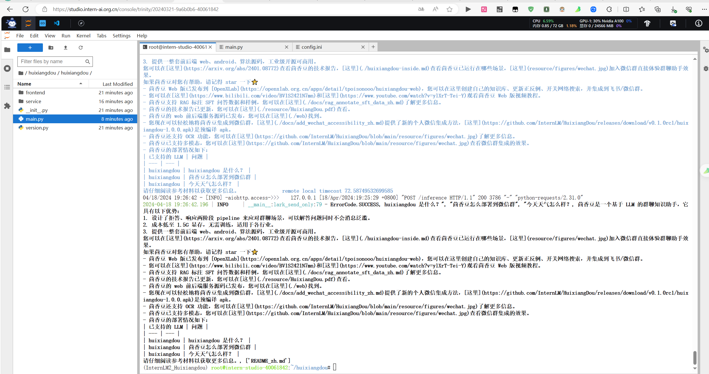
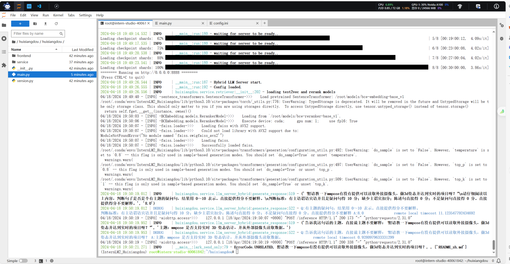
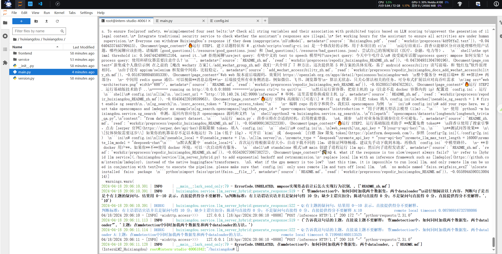
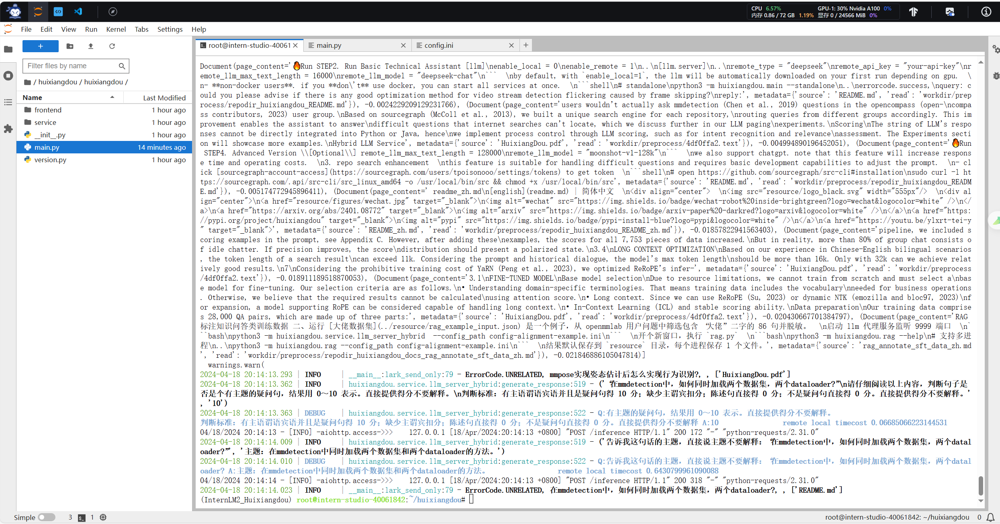
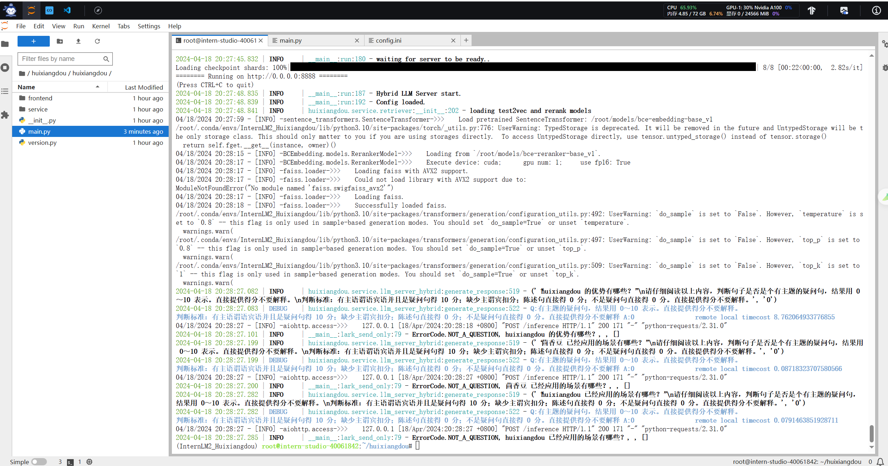

### 创建30%A100 *1开发机
### 创建conda环境
 进入开发机后，从官方环境复制运行 InternLM 的基础环境，命名为 InternLM2_Huixiangdou，在命令行模式下运行：
```
studio-conda -o internlm-base -t InternLM2_Huixiangdou
```
复制完成后，在本地查看环境。
```shell
conda env list
```
运行 _**conda**_ 命令，激活 InternLM2_Huixiangdou _**python**_ 虚拟环境:
```shell
conda activate InternLM2_Huixiangdou
```

### 下载基础文件
> 复制茴香豆所需模型文件，为了减少下载和避免 **HuggingFace** 登录问题，所有作业和教程涉及的模型都已经存放在 Intern Studio 开发机共享文件中。本教程选用 **InternLM2-Chat-7B** 作为基础模型。
> 

```shell
# 创建模型文件夹
cd /root && mkdir models

# 复制BCE模型
ln -s /root/share/new_models/maidalun1020/bce-embedding-base_v1 /root/models/bce-embedding-base_v1
ln -s /root/share/new_models/maidalun1020/bce-reranker-base_v1 /root/models/bce-reranker-base_v1

# 复制大模型参数（下面的模型，根据作业进度和任务进行**选择一个**就行）
ln -s /root/share/new_models/Shanghai_AI_Laboratory/internlm2-chat-7b /root/models/internlm2-chat-7b

```

### 下载模型文件
```shell
# 安装 python 依赖
# pip install -r requirements.txt

pip install protobuf==4.25.3 accelerate==0.28.0 aiohttp==3.9.3 auto-gptq==0.7.1 bcembedding==0.1.3 beautifulsoup4==4.8.2 einops==0.7.0 faiss-gpu==1.7.2 langchain==0.1.14 loguru==0.7.2 lxml_html_clean==0.1.0 openai==1.16.1 openpyxl==3.1.2 pandas==2.2.1 pydantic==2.6.4 pymupdf==1.24.1 python-docx==1.1.0 pytoml==0.1.21 readability-lxml==0.8.1 redis==5.0.3 requests==2.31.0 scikit-learn==1.4.1.post1 sentence_transformers==2.2.2 textract==1.6.5 tiktoken==0.6.0 transformers==4.39.3 transformers_stream_generator==0.0.5 unstructured==0.11.2

## 因为 Intern Studio 不支持对系统文件的永久修改，在 Intern Studio 安装部署的同学不建议安装 Word 依赖，后续的操作和作业不会涉及 Word 解析。
## 想要自己尝试解析 Word 文件的同学，uncomment 掉下面这行，安装解析 .doc .docx 必需的依赖
# apt update && apt -y install python-dev python libxml2-dev libxslt1-dev antiword unrtf poppler-utils pstotext tesseract-ocr flac ffmpeg lame libmad0 libsox-fmt-mp3 sox libjpeg-dev swig libpulse-dev

```
拉取茴香豆官方仓库
```shell
cd /root
# 克隆代码仓库
git clone https://github.com/internlm/huixiangdou && cd huixiangdou
git checkout 447c6f7e68a1657fce1c4f7c740ea1700bde0440

```
## 使用茴香豆搭建 RAG 助手
修改配置文件
用已下载模型的路径替换 /root/huixiangdou/config.ini 文件中的默认模型，需要修改 3 处模型地址，分别是:
命令行输入下面的命令，修改用于向量数据库和词嵌入的模型

```
sed -i '6s#.*#embedding_model_path = "/root/models/bce-embedding-base_v1"#' /root/huixiangdou/config.ini
```
用于检索的重排序模型
```shell
sed -i '7s#.*#reranker_model_path = "/root/models/bce-reranker-base_v1"#' /root/huixiangdou/config.ini
```

和本次选用的大模型
```
sed -i '29s#.*#local_llm_path = "/root/models/internlm2-chat-7b"#' /root/huixiangdou/config.ini
```

### 创建知识库
本示例中，使用 **InternLM** 的 **Huixiangdou** 文档作为新增知识数据检索来源，在不重新训练的情况下，打造一个 **Huixiangdou** 技术问答助手。
首先，下载 **Huixiangdou** 语料：

```
cd /root/huixiangdou && mkdir repodir

git clone https://github.com/internlm/huixiangdou --depth=1 repodir/huixiangdou
```
提取知识库特征，创建向量数据库。数据库向量化的过程应用到了 **LangChain** 的相关模块，默认嵌入和重排序模型调用的网易 **BCE 双语模型**，如果没有在 config.ini 文件中指定本地模型路径，茴香豆将自动从 **HuggingFace** 拉取默认模型。
除了语料知识的向量数据库，茴香豆建立接受和拒答两个向量数据库，用来在检索的过程中更加精确的判断提问的相关性，这两个数据库的来源分别是：

- 接受问题列表，希望茴香豆助手回答的示例问题
   - 存储在 huixiangdou/resource/good_questions.json 中
- 拒绝问题列表，希望茴香豆助手拒答的示例问题
   - 存储在 huixiangdou/resource/bad_questions.json 中
   - 其中多为技术无关的主题或闲聊
   - 如："nihui 是谁", "具体在哪些位置进行修改？", "你是谁？", "1+1"

运行下面的命令，增加茴香豆相关的问题到接受问题示例中：

```
cd /root/huixiangdou
mv resource/good_questions.json resource/good_questions_bk.json

echo '[
    "mmpose中怎么调用mmyolo接口",
    "mmpose实现姿态估计后怎么实现行为识别",
    "mmpose执行提取关键点命令不是分为两步吗，一步是目标检测，另一步是关键点提取，我现在目标检测这部分的代码是demo/topdown_demo_with_mmdet.py demo/mmdetection_cfg/faster_rcnn_r50_fpn_coco.py checkpoints/faster_rcnn_r50_fpn_1x_coco_20200130-047c8118.pth   现在我想把这个mmdet的checkpoints换位yolo的，那么应该怎么操作",
    "在mmdetection中，如何同时加载两个数据集，两个dataloader",
    "如何将mmdetection2.28.2的retinanet配置文件改为单尺度的呢？",
    "1.MMPose_Tutorial.ipynb、inferencer_demo.py、image_demo.py、bottomup_demo.py、body3d_pose_lifter_demo.py这几个文件和topdown_demo_with_mmdet.py的区别是什么，\n2.我如果要使用mmdet是不是就只能使用topdown_demo_with_mmdet.py文件，",
    "mmpose 测试 map 一直是 0 怎么办？",
    "如何使用mmpose检测人体关键点？",
    "我使用的数据集是labelme标注的，我想知道mmpose的数据集都是什么样式的，全都是单目标的数据集标注，还是里边也有多目标然后进行标注",
    "如何生成openmmpose的c++推理脚本",
    "mmpose",
    "mmpose的目标检测阶段调用的模型，一定要是demo文件夹下的文件吗，有没有其他路径下的文件",
    "mmpose可以实现行为识别吗，如果要实现的话应该怎么做",
    "我在mmyolo的v0.6.0 (15/8/2023)更新日志里看到了他新增了支持基于 MMPose 的 YOLOX-Pose，我现在是不是只需要在mmpose/project/yolox-Pose内做出一些设置就可以，换掉demo/mmdetection_cfg/faster_rcnn_r50_fpn_coco.py 改用mmyolo来进行目标检测了",
    "mac m1从源码安装的mmpose是x86_64的",
    "想请教一下mmpose有没有提供可以读取外接摄像头，做3d姿态并达到实时的项目呀？",
    "huixiangdou 是什么？",
    "使用科研仪器需要注意什么？",
    "huixiangdou 是什么？",
    "茴香豆 是什么？",
    "茴香豆 能部署到微信吗？",
    "茴香豆 怎么应用到飞书",
    "茴香豆 能部署到微信群吗？",
    "茴香豆 怎么应用到飞书群",
    "huixiangdou 能部署到微信吗？",
    "huixiangdou 怎么应用到飞书",
    "huixiangdou 能部署到微信群吗？",
    "huixiangdou 怎么应用到飞书群",
    "huixiangdou",
    "茴香豆",
    "茴香豆 有哪些应用场景",
    "huixiangdou 有什么用",
    "huixiangdou 的优势有哪些？",
    "茴香豆 已经应用的场景",
    "huixiangdou 已经应用的场景",
    "huixiangdou 怎么安装",
    "茴香豆 怎么安装",
    "茴香豆 最新版本是什么",
    "茴香豆 支持哪些大模型",
    "茴香豆 支持哪些通讯软件",
    "config.ini 文件怎么配置",
    "remote_llm_model 可以填哪些模型?"
]' > /root/huixiangdou/resource/good_questions.json
```
再创建一个测试用的问询列表，用来测试拒答流程是否起效：

```
cd /root/huixiangdou

echo '[
"huixiangdou 是什么？",
"你好，介绍下自己"
]' > ./test_queries.json
```
在确定好语料来源后，运行下面的命令，创建 RAG 检索过程中使用的向量数据库：

```
# 创建向量数据库存储目录
cd /root/huixiangdou && mkdir workdir 

# 分别向量化知识语料、接受问题和拒绝问题中后保存到 workdir
python3 -m huixiangdou.service.feature_store --sample ./test_queries.json
```
向量数据库的创建需要等待一小段时间，过程约占用 1.6G 显存。
完成后，**Huixiangdou** 相关的新增知识就以向量数据库的形式存储在 workdir 文件夹下。
检索过程中，茴香豆会将输入问题与两个列表中的问题在向量空间进行相似性比较，判断该问题是否应该回答，避免群聊过程中的问答泛滥。确定的回答的问题会利用基础模型提取关键词，在知识库中检索 top K 相似的 chunk，综合问题和检索到的 chunk 生成答案。
### 运行茴香豆知识助手
我们已经提取了知识库特征，并创建了对应的向量数据库。现在，让我们来测试一下效果：
命令行运行：

```
# 填入问题
sed -i '74s/.*/    queries = ["huixiangdou 是什么？", "茴香豆怎么部署到微信群", "今天天气怎么样？"]/' /root/huixiangdou/huixiangdou/main.py

# 运行茴香豆
cd /root/huixiangdou/
python3 -m huixiangdou.main --standalone
```
RAG 技术的优势就是非参数化的模型调优，这里使用的仍然是基础模型 InternLM2-Chat-7B， 没有任何额外数据的训练。面对同样的问题，我们的**茴香豆技术助理**能够根据我们提供的数据库生成准确的答案：





:::warning
这里就有一个比较奇怪的地方，每次问答的时候都会有一个句子的判断，
请仔细阅读以上内容，判断句子是否是个有主题的疑问句，结果用 0～10 表示。直接提供得分不要解释。\n判断标准：有主语谓语宾语并且是疑问句得 10 分；缺少主谓宾扣分；陈述句直接得 0 分；不是疑问句直接得 0 分。直接提供得分不要解释。', '0')
但是，把句子改为疑问句还是显示ErrorCode.NOT_A_QUESTION，匹配不到内容，如上图，第一张回答是正常的，后四张全都是匹配不到内容

:::

