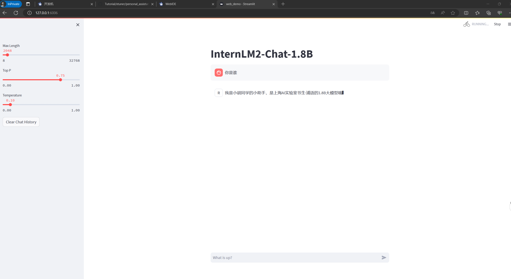

# XTuner 微调个人小助手认知
## 1 开发机准备
首先我们需要前往 [InternStudio](https://studio.intern-ai.org.cn/) 中创建一个开发机进行使用。然后在进入界面后首先选择开发机。
首先，打开 `Intern Studio` 界面，点击 创建开发机 配置开发机系统。
之后我们填写 `开发机名称` 后，点击 选择镜像 使用 `Cuda11.7-conda` 镜像，然后在资源配置中，使用 `10% A100 * 1` 的选项，然后立即创建开发机器。
点击 `进入开发机` 选项。
最后我们点击 `Terminal` 进入终端界面即可开始操作！
## 2 快速上手
### 2.1 环境安装

首先我们需要先安装一个 XTuner 的源码到本地来方便后续的使用。

```bash
# 如果你是在 InternStudio 平台，则从本地 clone 一个已有 pytorch 的环境：
# pytorch    2.0.1   py3.10_cuda11.7_cudnn8.5.0_0

studio-conda xtuner0.1.17
# 如果你是在其他平台：
# conda create --name xtuner0.1.17 python=3.10 -y

# 激活环境
conda activate xtuner0.1.17
# 进入家目录 （~的意思是 “当前用户的home路径”）
cd ~
# 创建版本文件夹并进入，以跟随本教程
mkdir -p /root/xtuner0117 && cd /root/xtuner0117

# 拉取 0.1.17 的版本源码
git clone -b v0.1.17  https://github.com/InternLM/xtuner
# 无法访问github的用户请从 gitee 拉取:
# git clone -b v0.1.15 https://gitee.com/Internlm/xtuner

# 进入源码目录
cd /root/xtuner0117/xtuner

# 从源码安装 XTuner
pip install -e '.[all]'
```

> 假如速度太慢可以 `Ctrl + C` 退出后换成 `pip install -e '.[all]' -i https://mirrors.aliyun.com/pypi/simple/`


### 2.2 前期准备

#### 2.2.1 数据集准备

```bash
# 前半部分是创建一个文件夹，后半部分是进入该文件夹。
mkdir -p /root/ft && cd /root/ft

# 在ft这个文件夹里再创建一个存放数据的data文件夹
mkdir -p /root/ft/data && cd /root/ft/data

# 创建 `generate_data.py` 文件
touch /root/ft/data/generate_data.py
```

打开该 python 文件后将下面的内容复制进去。

```python
import json

# 设置用户的名字
name = '不要姜葱蒜大佬'
# 设置需要重复添加的数据次数
n =  10000

# 初始化OpenAI格式的数据结构
data = [
    {
        "messages": [
            {
                "role": "user",
                "content": "请做一下自我介绍"
            },
            {
                "role": "assistant",
                "content": "我是{}的小助手，内在是上海AI实验室书生·浦语的1.8B大模型哦".format(name)
            }
        ]
    }
]

# 通过循环，将初始化的对话数据重复添加到data列表中
for i in range(n):
    data.append(data[0])

# 将data列表中的数据写入到一个名为'personal_assistant.json'的文件中
with open('personal_assistant.json', 'w', encoding='utf-8') as f:
    # 使用json.dump方法将数据以JSON格式写入文件
    # ensure_ascii=False 确保中文字符正常显示
    # indent=4 使得文件内容格式化，便于阅读
    json.dump(data, f, ensure_ascii=False, indent=4)
```

并将文件 `name` 后面的内容修改为你的名称。比如说我是小胡同学的话就是：

```diff
# 将对应的name进行修改（在第4行的位置）
- name = '不要姜葱蒜大佬'
+ name = "小胡同学"
```

修改完成后运行 `generate_data.py` 文件即可。

```bash
# 确保先进入该文件夹
cd /root/ft/data

# 运行代码
python /root/ft/data/generate_data.py
```

可以看到在data的路径下便生成了一个名为 `personal_assistant.json` 的文件，这样我们最可用于微调的数据集就准备好啦！里面就包含了 5000 条 `input` 和 `output` 的数据对。假如 我们认为 5000 条不够的话也可以调整文件中第6行 `n` 的值哦！

```
|-- data/
    |-- personal_assistant.json
    |-- generate_data.py
```


> 除了我们自己通过脚本的数据集，其实网上也有大量的开源数据集可以供我们进行使用。有些时候我们可以在开源数据集的基础上添加一些我们自己独有的数据集，也可能会有很好的效果。


#### 2.2.2 模型准备

在准备好了数据集后，接下来我们就需要准备好我们的要用于微调的模型。由于本次课程显存方面的限制，这里我们就使用 InternLM 最新推出的小模型 `InterLM2-Chat-1.8B` 来完成此次的微调演示。

```bash
# 创建目标文件夹，确保它存在。
# -p选项意味着如果上级目录不存在也会一并创建，且如果目标文件夹已存在则不会报错。
mkdir -p /root/ft/model

# 复制内容到目标文件夹。-r选项表示递归复制整个文件夹。
cp -r /root/share/new_models/Shanghai_AI_Laboratory/internlm2-chat-1_8b/* /root/ft/model/
```

那这个时候我们就可以看到在 model 文件夹下保存了模型的相关文件和内容了。

```
|-- model/
    |-- tokenizer.model
    |-- config.json
    |-- tokenization_internlm2.py
    |-- model-00002-of-00002.safetensors
    |-- tokenizer_config.json
    |-- model-00001-of-00002.safetensors
    |-- model.safetensors.index.json
    |-- configuration.json
    |-- special_tokens_map.json
    |-- modeling_internlm2.py
    |-- README.md
    |-- configuration_internlm2.py
    |-- generation_config.json
    |-- tokenization_internlm2_fast.py
```

我们也可以通过以下代码一键通过符号链接的方式链接到模型文件，这样既节省了空间，也便于管理。

```bash
# 删除/root/ft/model目录
rm -rf /root/ft/model

# 创建符号链接
ln -s /root/share/new_models/Shanghai_AI_Laboratory/internlm2-chat-1_8b /root/ft/model
```

执行上述操作后，`/root/ft/model` 将直接成为一个符号链接，这个链接指向 `/root/share/new_models/Shanghai_AI_Laboratory/internlm2-chat-1_8b` 的位置。


#### 2.2.3 配置文件选择

在准备好了模型和数据集后，我们就要根据我们选择的微调方法方法结合前面的信息来找到与我们最匹配的配置文件了，从而减少我们对配置文件的修改量。

```bash
# 列出所有内置配置文件
# xtuner list-cfg

# 假如我们想找到 internlm2-1.8b 模型里支持的配置文件
xtuner list-cfg -p internlm2_1_8b
```

> 这里就用到了第一个 XTuner 的工具 `list-cfg` ，对于这个工具而言，可以选择不添加额外的参数，就像上面的一样，这样就会将所有的配置文件都打印出来。那同时也可以加上一个参数 `-p` 或 `--pattern` ，后面输入的内容将会在所有的 config 文件里进行模糊匹配搜索，然后返回最有可能得内容。我们可以用来搜索特定模型的配置文件，比如例子中的 internlm2_1_8b ,也可以用来搜索像是微调方法 qlora 。
根据上面的定向搜索指令可以看到目前只有两个支持 internlm2-1.8B 的模型配置文件。


```
==========================CONFIGS===========================
PATTERN: internlm2_1_8b
-------------------------------
internlm2_1_8b_full_alpaca_e3
internlm2_1_8b_qlora_alpaca_e3
=============================================================
```


#### 2.4.3 训练结果
##### 使用 deepspeed 来加速训练
```bash
xtuner train /root/ft/config/internlm2_1_8b_qlora_alpaca_e3_copy.py --work-dir /root/ft/train_deepspeed --deepspeed deepspeed_zero2
```

#### 


#### 
### 2.5 模型转换、整合、测试及部署
#### 2.5.1 模型转换
```bash
# 创建一个保存转换后 Huggingface 格式的文件夹
mkdir -p /root/ft/huggingface

# 模型转换
# xtuner convert pth_to_hf ${配置文件地址} ${权重文件地址} ${转换后模型保存地址}
xtuner convert pth_to_hf /root/ft/train/internlm2_1_8b_qlora_alpaca_e3_copy.py /root/ft/train/iter_768.pth /root/ft/huggingface
```


```bash
# 使用 --adapter 参数与完整的模型进行对话
xtuner chat /root/ft/model --adapter /root/ft/huggingface --prompt-template internlm2_chat
```

#### 2.5.2 web demo部署
```bash
pip install streamlit==1.24.0

# 创建存放 InternLM 文件的代码
mkdir -p /root/ft/web_demo && cd /root/ft/web_demo

# 拉取 InternLM 源文件
git clone https://github.com/InternLM/InternLM.git

# 进入该库中
cd /root/ft/web_demo/InternLM
```
修改/root/ft/web_demo/InternLM/chat/web_demo.py
```bash
streamlit run /root/ft/web_demo/InternLM/chat/web_demo.py --server.address 127.0.0.1 --server.port 6006
```
ssh端口转发
```bash
# 从本地使用 ssh 连接 studio 端口
# 将下方端口号 38374 替换成自己的端口号
ssh -CNg -L 6006:127.0.0.1:6006 root@ssh.intern-ai.org.cn -p 39571
```


### 
### 
