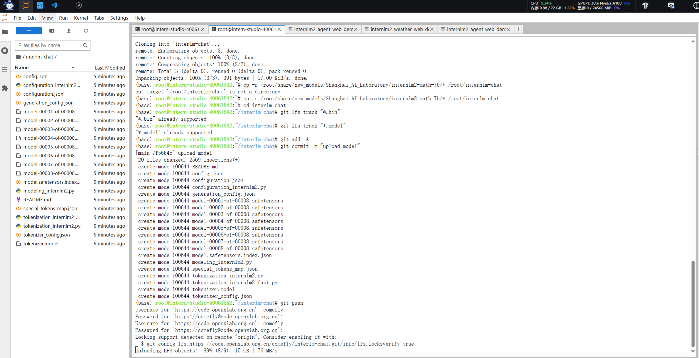

```bash
apt-get update
apt-get install git
apt-get install git-lfs
git lfs install

```

```bash
#配置 Git Username，用于作为 Git 提交的身份标识
git config --global user.name "comefly"

#配置 Git Email
git config --global user.email "hscyyds01@163.com"

```
```bash
#拉取模型仓库
#首先需要在 OpenXLab 先创建一个空仓库，填写模型仓库的基本信息，包括仓库名称、任务类型、访问权限等
#创建完成空的模型仓库后，找到该仓库的 git 地址并拉取该空仓库至本地
#获取 Git Access Token
#在 OpenXLab 的密钥管理添加 Git 令牌，步骤如下

```

```bash
cp -r /root/share/new_models/Shanghai_AI_Laboratory/internlm2-math-7b/* /root/interlm-chat
```
```bash
cp -r /root/share/new_models/Shanghai_AI_Laboratory/internlm2-chat-1_8b/* /root/internlm-chat-1.8b
```

```bash
git clone https://code.openxlab.org.cn//username/reponame.git
```
