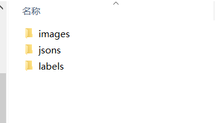
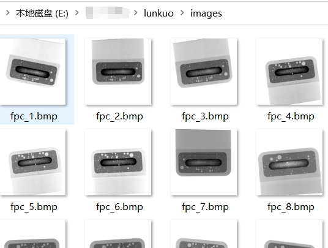
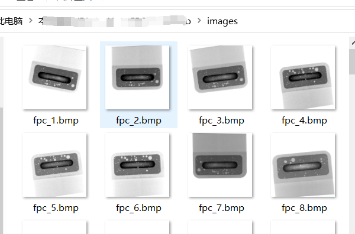
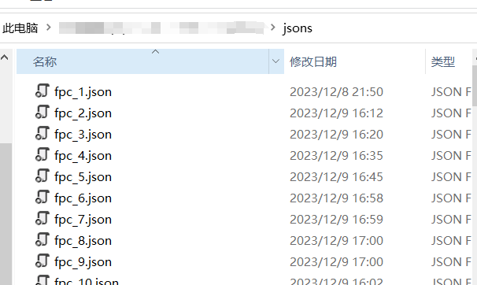
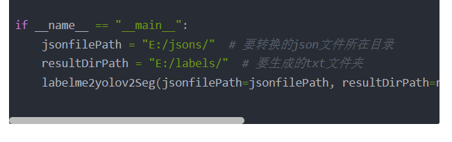
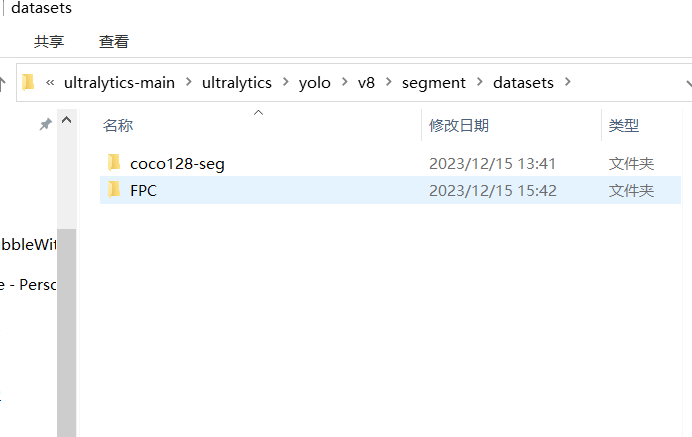
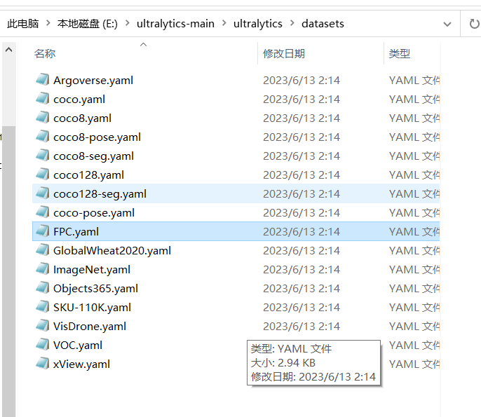
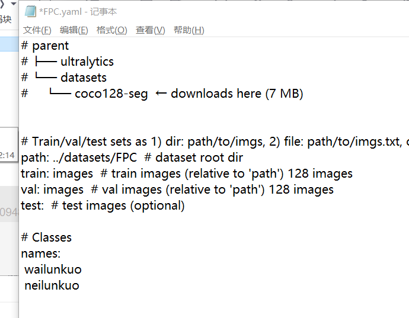
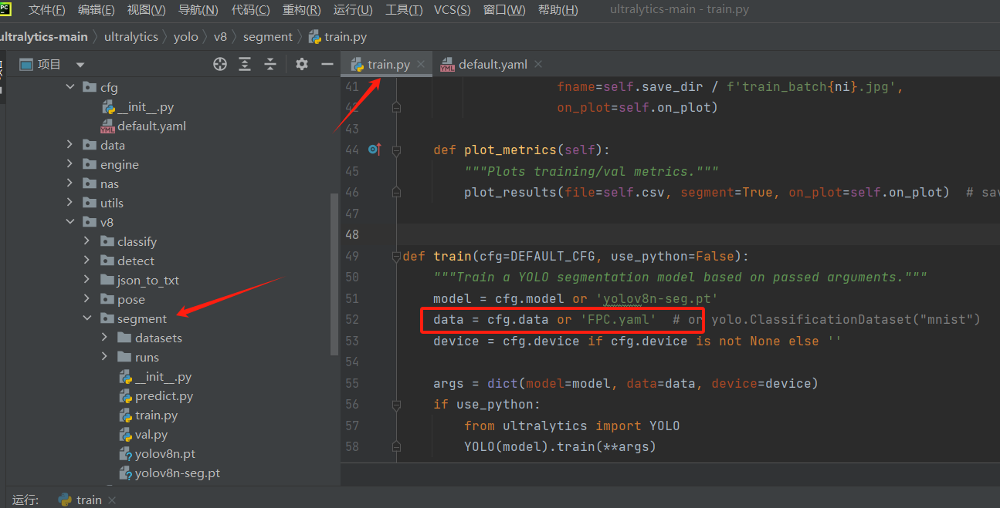
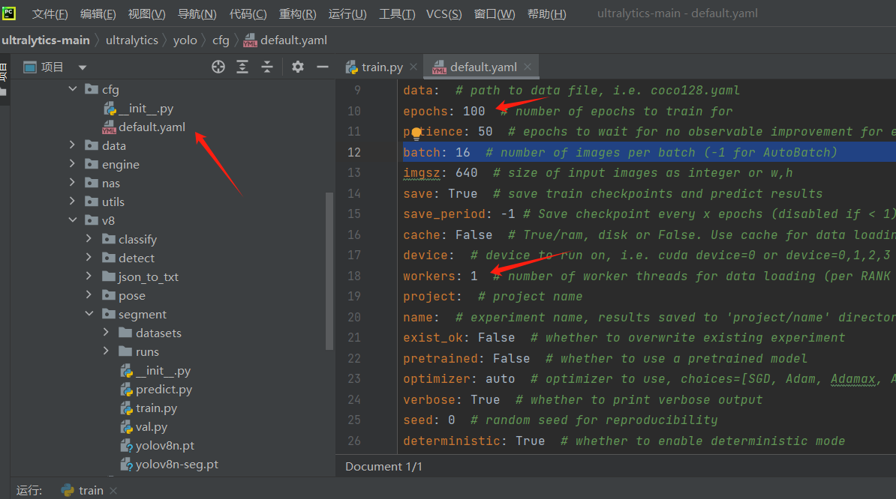

## 图像标注
1、按照以下的格式，将图片放入images中。（不限制[文件夹](https://so.csdn.net/so/search?q=%E6%96%87%E4%BB%B6%E5%A4%B9&spm=1001.2101.3001.7020)路径）


2、然后下载[labelme](https://so.csdn.net/so/search?q=labelme&spm=1001.2101.3001.7020)标注工具，[链接](https://download.csdn.net/download/WDX4092410/88632717)；按照我之前写的这篇博客进行操作，[链接](https://blog.csdn.net/WDX4092410/article/details/132420619)，如果没有下载到，可以联系我发给你。


## jsons转txt格式
1、将以下代码用pycharm打开，修改输入路径、输出路径和classList列表。（classList就是标注的时候定义的类别）

//
```
import json
import os
import glob
import os.path as osp


def labelme2yolov2Seg(jsonfilePath="", resultDirPath="", classList=["bub","bub2"]):
    """
    此函数用来将labelme软件标注好的数据集转换为yolov5_7.0sege中使用的数据集
    :param jsonfilePath: labelme标注好的*.json文件所在文件夹
    :param resultDirPath: 转换好后的*.txt保存文件夹
    :param classList: 数据集中的类别标签
    :return:
    """
    # 0.创建保存转换结果的文件夹
    if(not os.path.exists(resultDirPath)):
        os.mkdir(resultDirPath)

    # 1.获取目录下所有的labelme标注好的Json文件，存入列表中
    jsonfileList = glob.glob(osp.join(jsonfilePath, "*.json"))
    print(jsonfileList)  # 打印文件夹下的文件名称

    # 2.遍历json文件，进行转换
    for jsonfile in jsonfileList:
        # 3. 打开json文件
        with open(jsonfile, "r",encoding='utf-8') as f:
            file_in = json.load(f)

            # 4. 读取文件中记录的所有标注目标
            shapes = file_in["shapes"]

            # 5. 使用图像名称创建一个txt文件，用来保存数据
            with open(resultDirPath + "\\" + jsonfile.split("\\")[-1].replace(".json", ".txt"), "w") as file_handle:
                # 6. 遍历shapes中的每个目标的轮廓
                for shape in shapes:
                    # 7.根据json中目标的类别标签，从classList中寻找类别的ID，然后写入txt文件中
                    file_handle.writelines(str(classList.index(shape["label"])) + " ")

                    # 8. 遍历shape轮廓中的每个点，每个点要进行图像尺寸的缩放，即x/width, y/height
                    for point in shape["points"]:
                        x = point[0]/file_in["imageWidth"]  # mask轮廓中一点的X坐标
                        y = point[1]/file_in["imageHeight"]  # mask轮廓中一点的Y坐标
                        file_handle.writelines(str(x) + " " + str(y) + " ")  # 写入mask轮廓点

                    # 9.每个物体一行数据，一个物体遍历完成后需要换行
                    file_handle.writelines("\n")
            # 10.所有物体都遍历完，需要关闭文件
            file_handle.close()
        # 10.所有物体都遍历完，需要关闭文件
        f.close()

if __name__ == "__main__":
    jsonfilePath = "E:/jsons/"  # 要转换的json文件所在目录
    resultDirPath = "E:/labels/"  # 要生成的txt文件夹
    labelme2yolov2Seg(jsonfilePath=jsonfilePath, resultDirPath=resultDirPath, classList=["waiyuan","neiyuan"])
```
2、然后将images文件夹和labels文件夹放入一个文件夹中，例如我方的FPC文件夹。
3、然后将FPC文件夹拷贝到分割程序目录下的datasets文件夹中，我的目录是E:\ultralytics-main\ultralytics\yolo\v8\segment\datasets；

4、然后将路径E:\ultralytics-main\ultralytics\datasets下的coco128-seg.yaml文件复制一份，改名为FPC，保存在同级文件夹下。如下图

5、然后修改以下内容，names里面放的是类别。


6、修改完毕后，打开E:\ultralytics-main\ultralytics\yolo\v8\segment路径下的train文件，修改data = cfg.data or ‘FPC.yaml’

7、修改完毕后，在打开E:\ultralytics-main\ultralytics\yolo\cfg目录下的default.xml文件，修改以下参数

8、然后返回train文件，右键运行，开始训练。训练完成后，在E:\ultralytics-main\ultralytics\yolo\v8\segment\runs\segment\train6\weights，目录下可以找到pt文件。
9、到此，模型训练任务完成。

> 来自: [二、yolov8图像标注和模型训练(语义分割)_yolov8的图片标记-CSDN博客](https://blog.csdn.net/WDX4092410/article/details/135017941?utm_medium=distribute.pc_relevant.none-task-blog-2~default~baidujs_baidulandingword~default-4-135017941-blog-107413348.235^v43^pc_blog_bottom_relevance_base4&spm=1001.2101.3001.4242.3&utm_relevant_index=5)

