关于图床，做过建站或写博客的朋友应该都不陌生。市面上用于搭建图床的系统有很多，五花八门。单说免费开源的就有PicGo、Chevereto、easyimage、兰空等等，一般都需要购买第三方的OSS服务作为存储底层，或者是基于Github存储搭建的一些方案。笔者今天介绍的这个与基于Github的方案有点类（白）似（嫖），是基于Cloudflare Pages服务和开源图床项目Telegraph来实现。
核心原理就是利用Cloudflare Workers和Pages的免费额度，将图床系统和图片储存都托管在Cloudflare网络中，从而实现一毛不拔！
**温馨提示：本保姆级教程全文比较长，请耐心看完哦~~**
## 前提条件

- 拥有Github帐号
- 拥有Cloudflare帐号
- 最好拥有1个域名并托管在Cloudflare中（域名可能要拔点毛）
## 部署方法
#### 一、Fork 项目
打开项目`https://github.com/cf-pages/Telegraph-Image`，登录自己的Github帐号，然后Fork这个项目。
**1、Fork Telegraph项目**
在项目主页点击`Fork`按钮
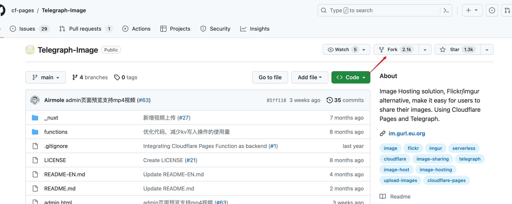
**2、设置Fork**
页面中什么都不要改，直接点击`Create fork`按钮，等待片刻就创建完成了。这时候你自己的Github中就有了这个项目的镜像。
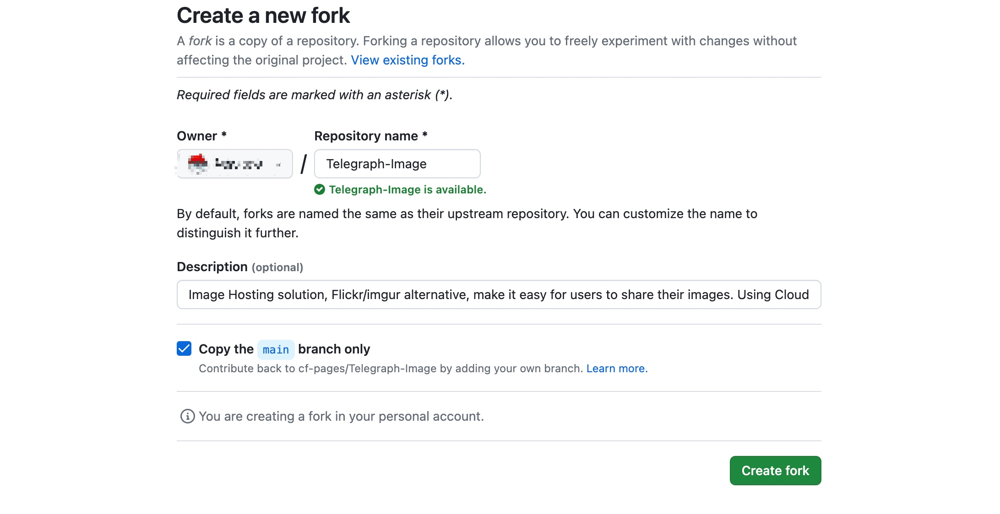
#### 二、连接Github仓库和部署图床
**1、进入Workers和Pages概述界面**
在Cloudflare主页，点击左侧`Workers和Pages`——>`概述`菜单
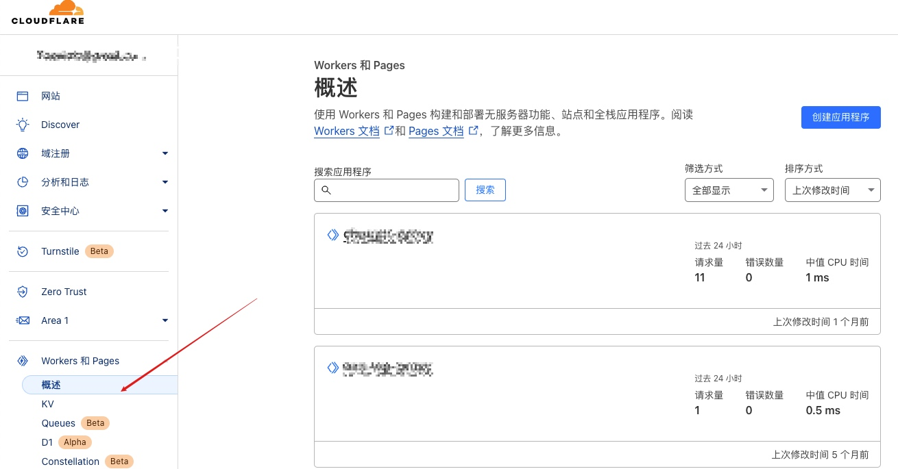
**2、连接Github项目**
首先，点击右上角`创建应用程序`，跳转到创建应用程序页面，并切换到Pages界面：
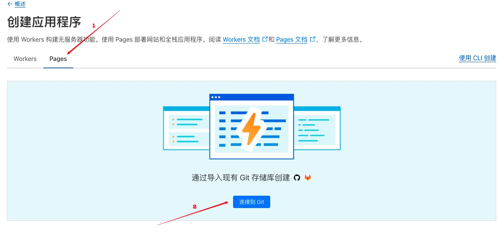
点击页面中的`连接到Git`按钮，在弹出界面中选择`Github`，并点击`连接Github`按钮：

之后，Cloudflare会自动引导你到Github授权页面，如果没有登录Github，则会先到登录界面：
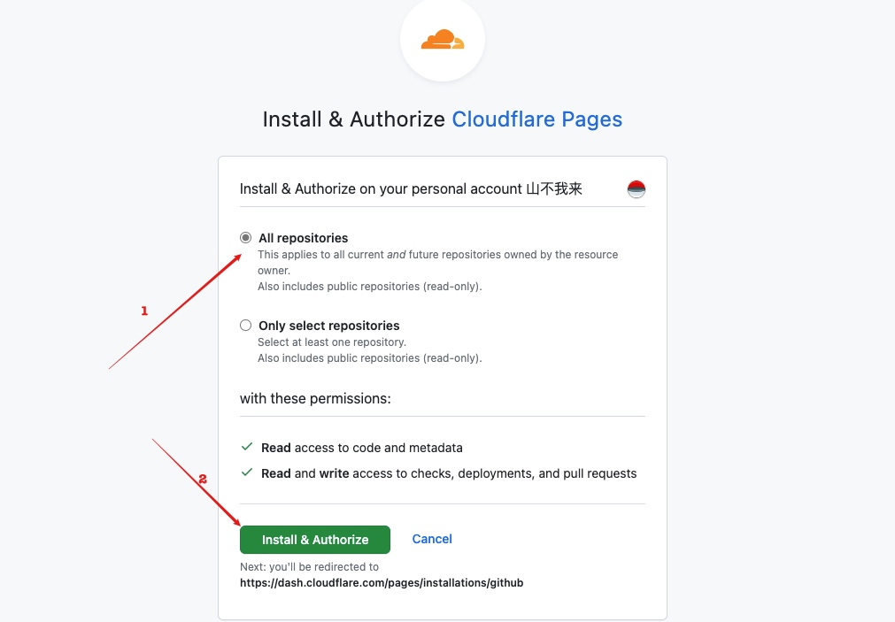
接着，选择`Only Select repositories`，并选择上面fork好的项目，然后点击`Install & Authorize`按钮，确认完成授权和开始安装：
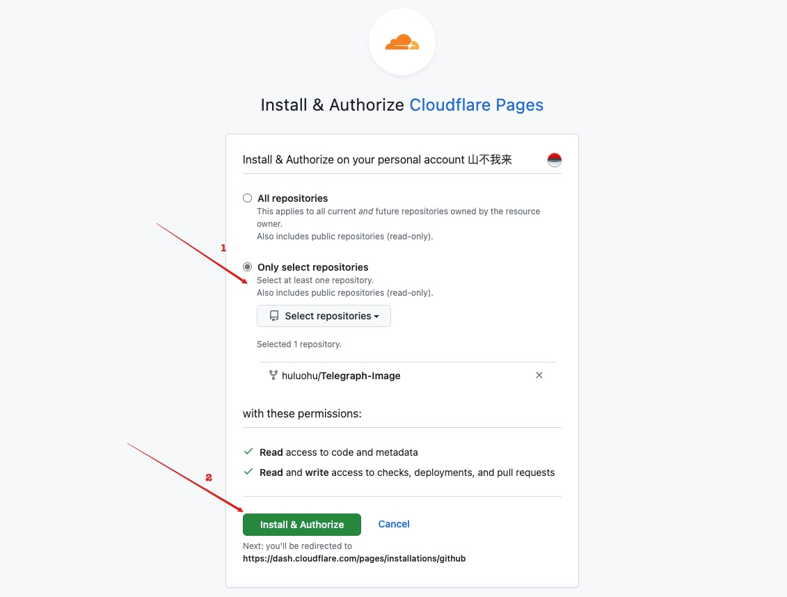
最后，Github可能会要求你输入账号密码，以确认上面的授权。输入你的Github密码并`Confirm`即可：

**3、部署到Cloudflare**
> 上面确认授权后，会从Github自动跳回到Cloudflare中，继续开始后续的部署设置。

首选，选中上面授权好的Github项目，点击`开始设置`：
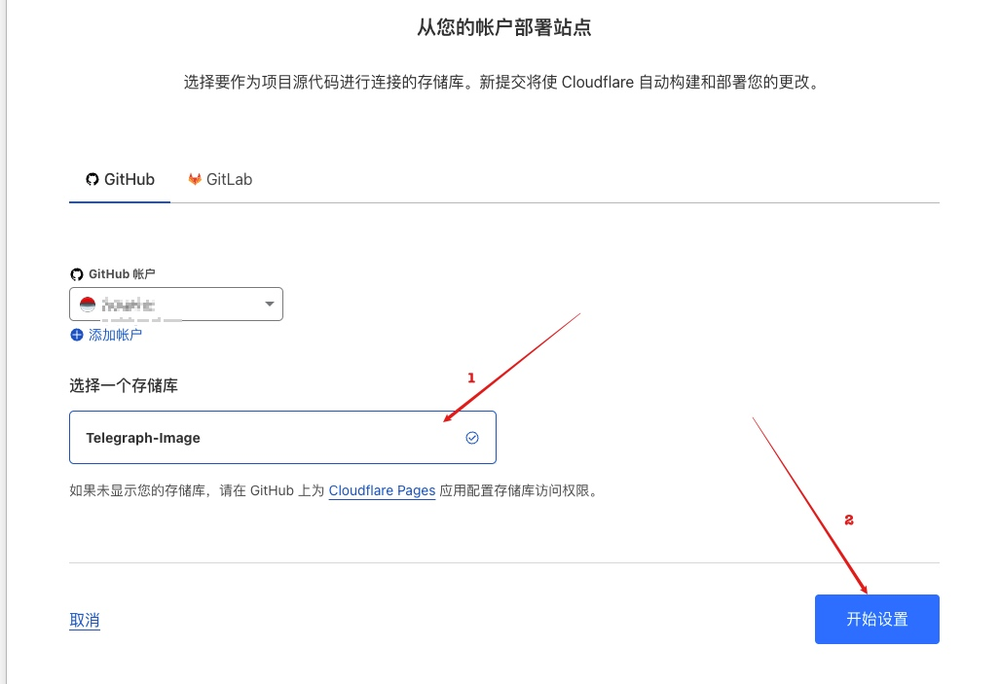
项目名称可以改成你自己喜欢的，生产分支建议保持默认的`main`，其他的不要动：
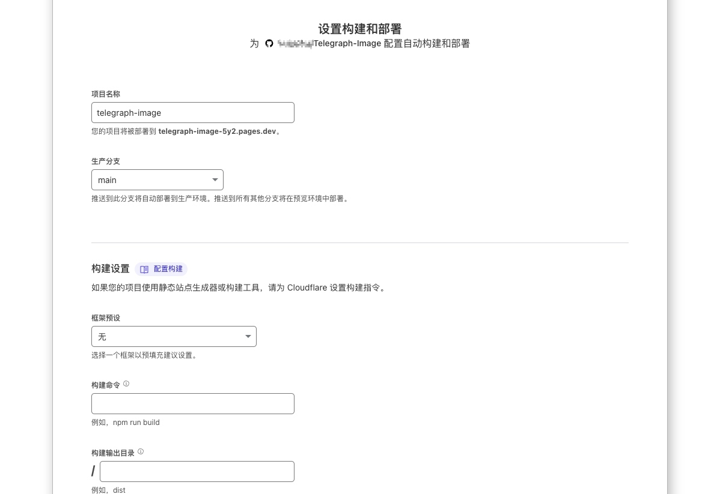
拉到页面下面，点击`保存并部署`，等待Pages自动部署项目：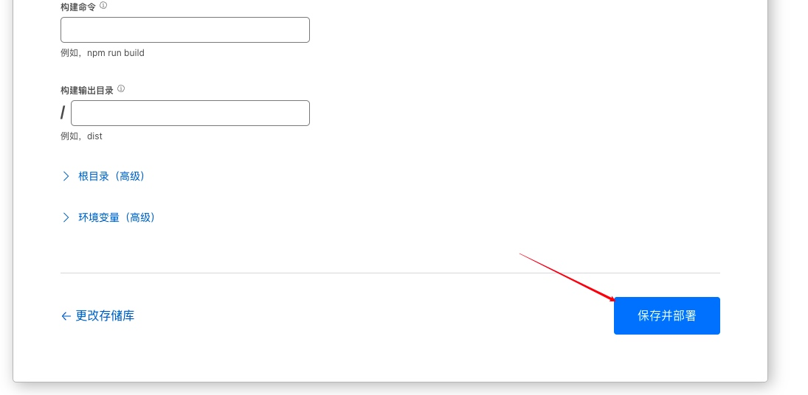
当看到`成功`提示时，表示我们的图床已经部署完成了。此时Cloudflare自动分配了一个默认的域名，直接点击即可打开图床的上传页面：
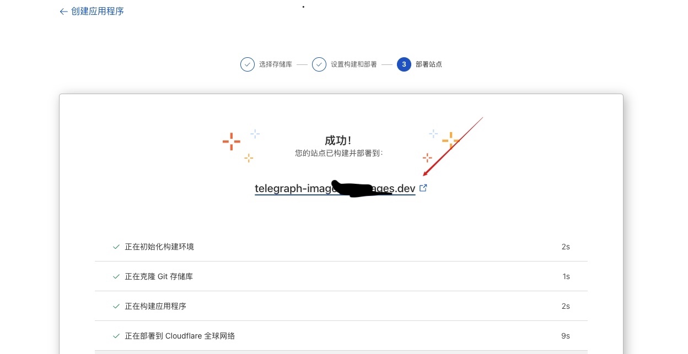
如下图，Telegraph的上传界面非常简洁，直接点击`选中上传图片或视频`按钮即可进行上传：

## 设置图床
以上过程就完成在Cloudflare中部署Telegraph图床系统了，不过这时候还存在一些问题，包括如何管理用户上传的内容？如何绑定自己的域名？如何审查用户上传的内容是否违规？下面一一来解答。
#### 一、配置管理后台
Telegraph的后台管理功能和登录验证功能默认都是关闭的，我们仅需对部署的Pages项目进行一些设置就可以开启这些功能了。
**1、创建KV命名空间**
打开`Workers和Pages`——>`KV`管理界面，然后点击右上角`创建命名空间`按钮，创建一个名为`img_url`的命名空间：
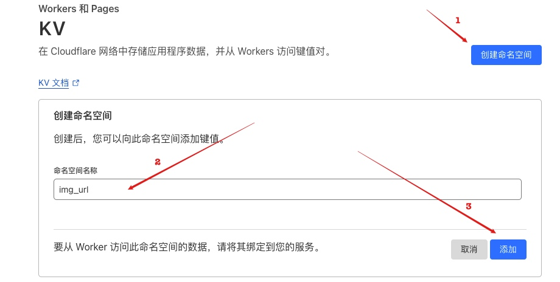
**2、查看Pages项目**
回到`Workers和Pages`——>`概述`界面，找到上面部署好的Telegraph项目，直接点击名称，进入项目的详情页面：
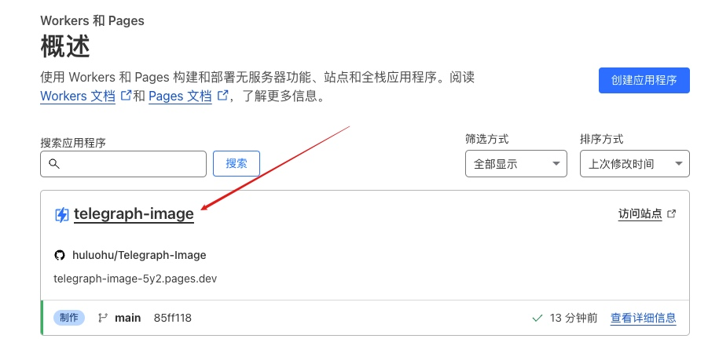
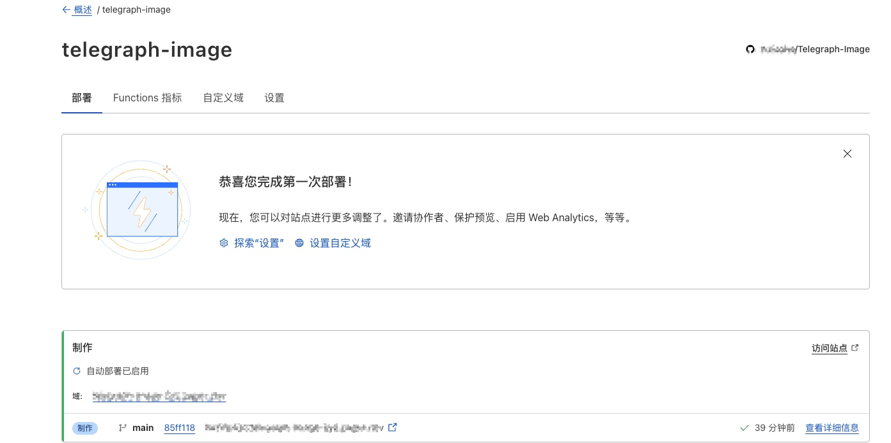
**3、绑定KV命名空间**
点击`设置`-`函数`，拉到页面的下面，找到`KV命名空间`绑定模块：
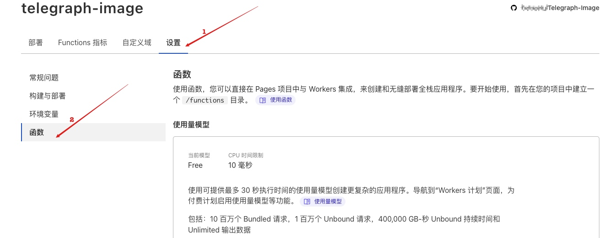
点击`添加绑定`按钮，`将变量名称`和`KV命名空间`均设置为`img_url`，然后保存：
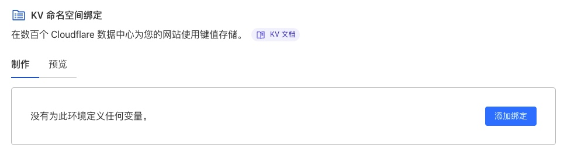
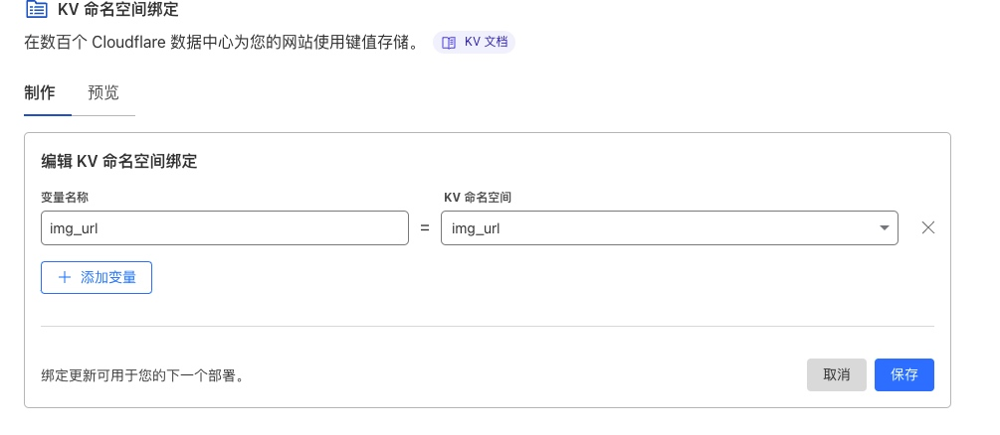
**4、设置管理后台登录验证**
切换到`环境变量`页面，点击`制作`中的`添加变量`按钮，添加两个环境变量：
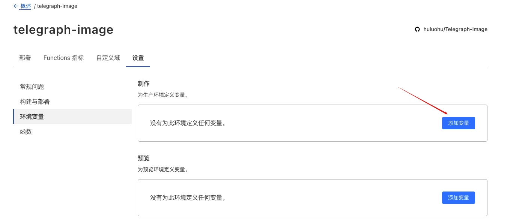
变量名分别是`BASIC_USER`和`BASIC_PASS`，分别代表管理员的用户名和密码，然后保存：
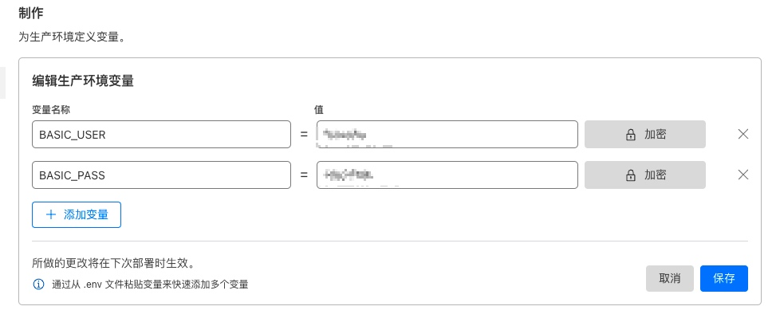
> 当然，你也可以不设置这两个变量，这时候管理后台就是无需验证即可登录。但是你可以结合`Cloudflare Access`服务实现支持邮件验证码、Microsoft、Github等第三方帐号登录方式，更加灵活强大。如果使用`Cloudflare Access`，则需要对`/admin`和`/api/manage/*`两个路径进行保护。由于不是本文的重点，笔者就不展开了。

**5、重新部署**
做完以上的操作并不会立即生效，需要重新部署下系统才可以。
重新部署也非常简单，点击`查看详细信息`，在项目部署详情信息页面的右上角有个`管理部署`，点击其中的`重新部署`，等待重新部署完成即可。
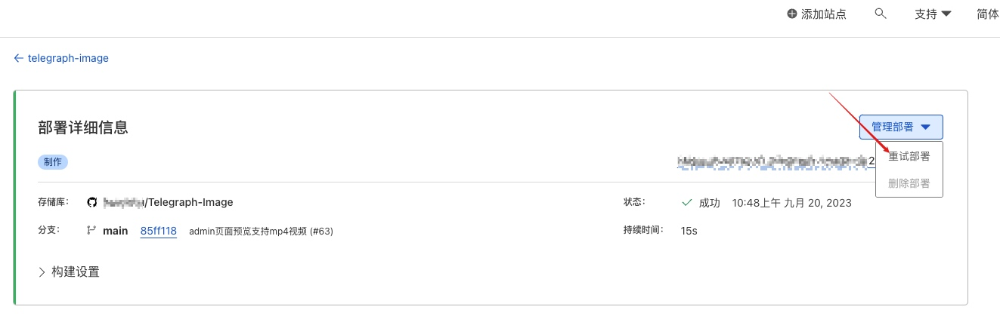
**6、登录管理后台**
以上步骤操作完就实现了图床系统的管理后台功能和登录验证功能的设置，可以输入图床域名+`/admin`路径，就能打开管理后台了。例如：`https://telegraph-image-xxx.pages.dev/admin`:
打开后，在弹出框中输入上面设置好的用户名和密码即可：
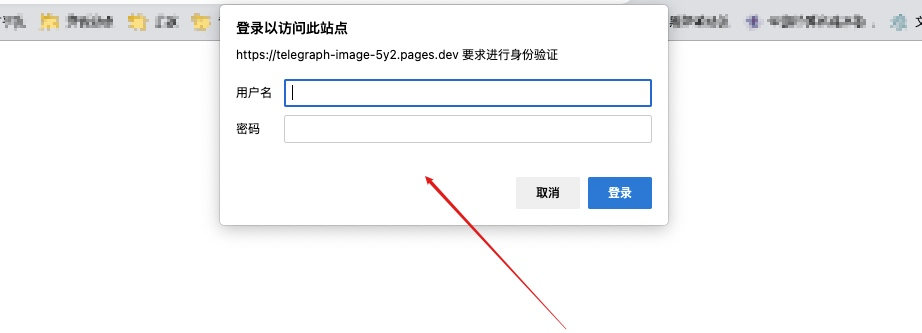
管理界面有点简陋，可以看到图片的状态信息，也可以对图片进行黑/白名单设置或删除操作：
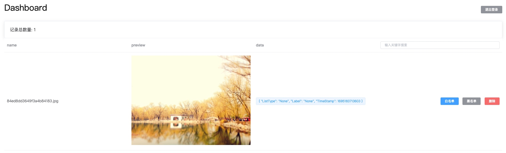
> 图片状态信息字段含义

| 字段 | 含义 |
| --- | --- |
| ListType | 表示图片当前是否在黑白名单当中。None则表示既不在黑名单中也不在白名单中，White表示在在白名单中，Block表示在黑名单中。 |
| TimeStamp | 图片首次加载的时间戳 |
| Label | 图片审查的结果。 |

#### 二、绑定自定义域名
Cloudflare自动分配的域名不好记（当然，如果你能忍受就可以不自定义），我们可以设置成我们自己的域名，方便使用，设置也很简单。
**1、进入Pages项目**
同样先进入项目页面，切换到`自定义域`页面：
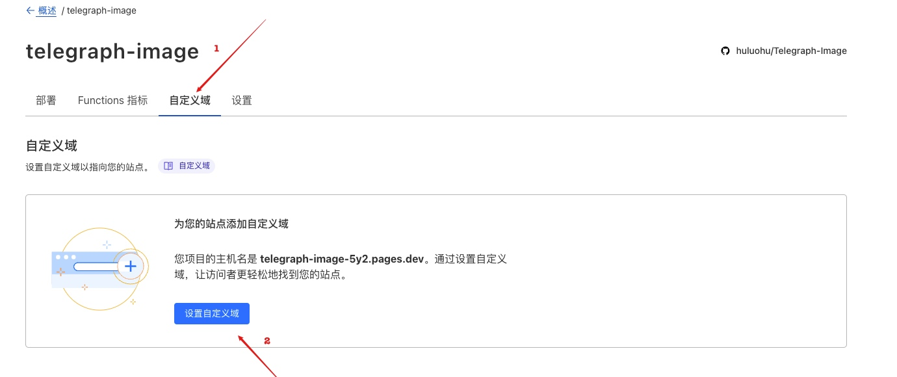
**2、添加自定义域**
点击`设置自定义域`，输入你自己想用的二级域名，并点击`继续`按钮：
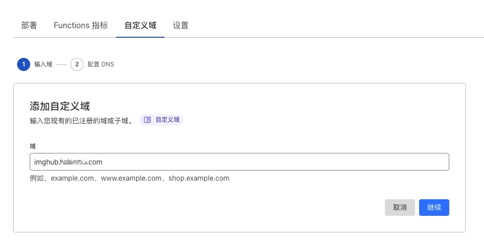
**3、激活自定义域**
可以看到Cloudflare将自动在域名DNS中添加一个`CNAME`解析记录，将自定义域名指向默认分配的域名。直接点击`激活域`按钮，然后等待验证即可：
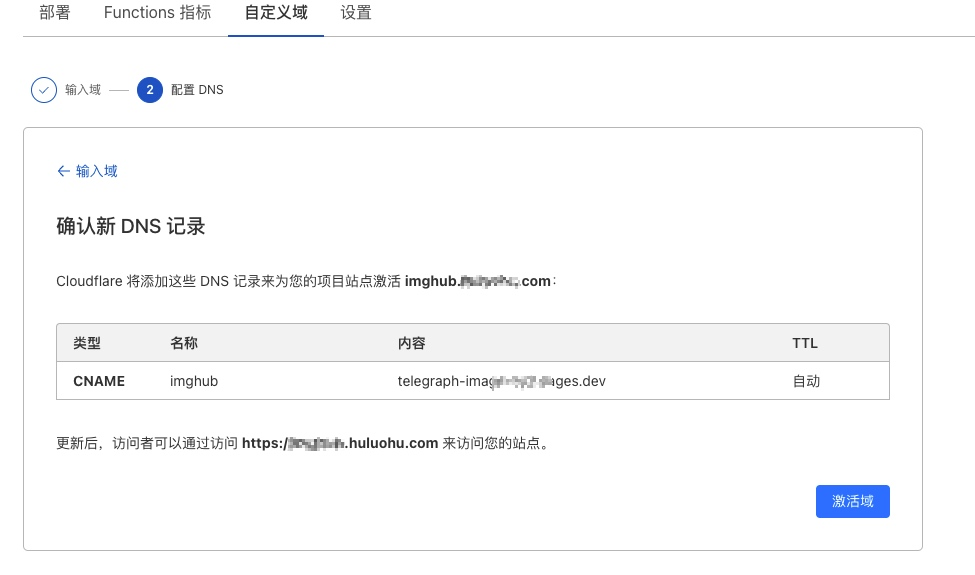
验证中：
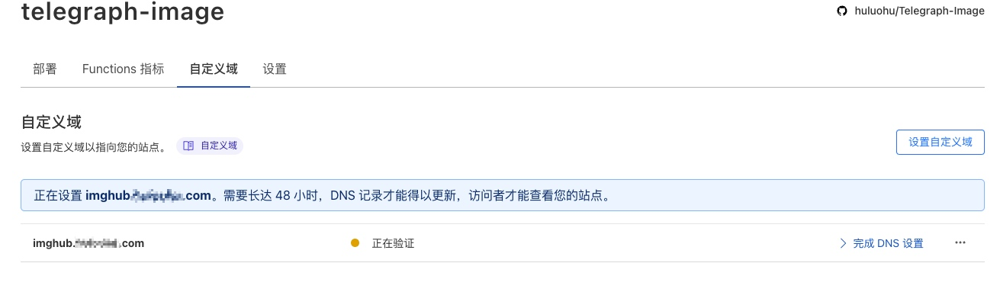
验证完成：
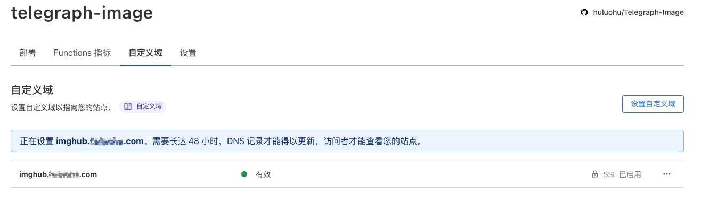
**4、使用自定义域**
自定义域验证完成后，而且自动帮你配置好了SSL证书，非常贴心了。此时就可以使用新的域名访问你的图床系统了。例如
#### 三、开启内容审查
图床中上传的图片或视频默认是不经过审查的，上传后就可以被访问了。作为一个上传无需登录的图床，没有审核还是很危险的。如果被人恶意上传了不法内容，作为域名持有人，躺枪荣获"银手镯"就不妙了。Telegraph支持使用“moderatecontent”来进行自动内容审查，下面进行简单的配置就可以开启这项功能，**强烈建议开启**！
**1、获取API Key**
打开"moderatecontent.com"网站，点击`SIGN UP`，输入你的邮箱，点击`SUBMIT`，界面上就直接为你生成`API Key`，复制并保存下来：
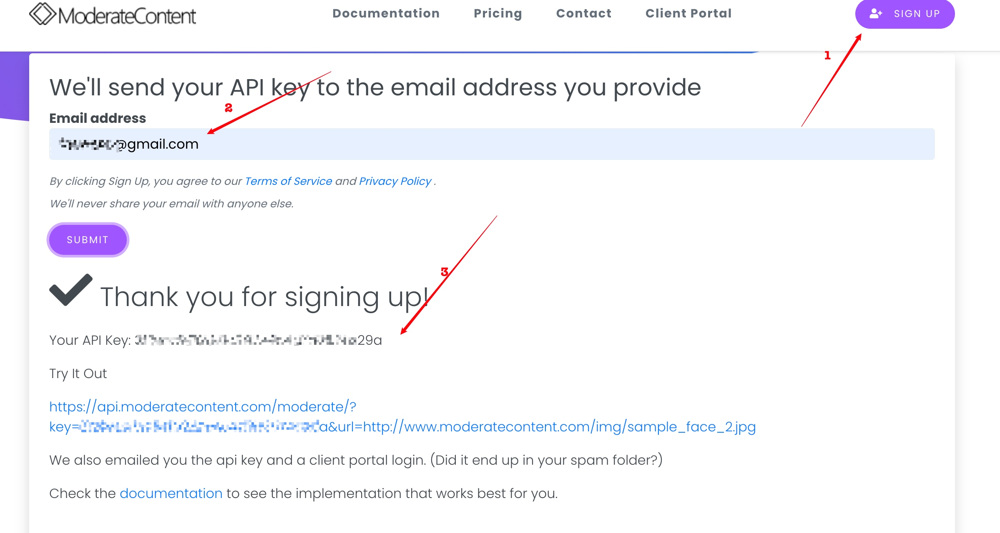
**2、设置环境变量**
与上文中`设置管理后台登录验证`的步骤一样，到项目的`设置`——>`环境界面中`，添加一个环境变量，名称为：`ModerateContentApiKey`，值就是上面获得的API Key。
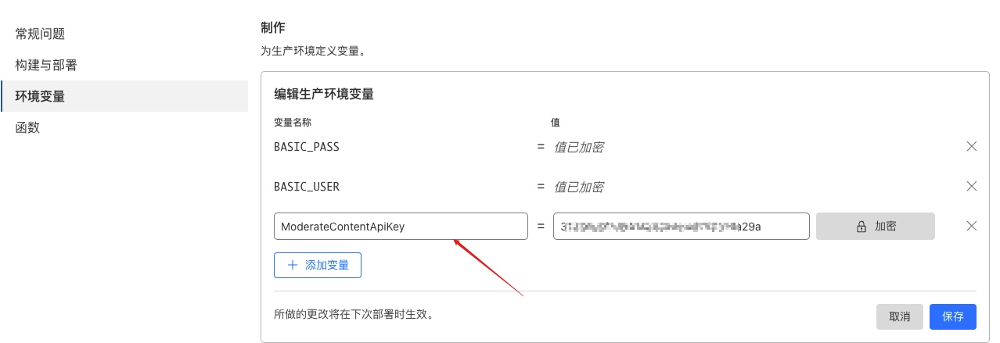
**3、重新部署**
同样的，做完以上的操作并不会立即生效，需要重新部署下系统才可以。
> 特别说明：开启图片审查后，因为审查需要时间，首次的图片加载将会变得缓慢，审查完成后的图片加载由于存在缓存，就不会受到影响了。

## 更新图床系统
如果`Telegraph-Image`项目更新了，如何才能更新自己部署的图床呢？
很简单，如果项目更新后，需要添加新的KV命名空间或环境变量，则先在Cloudflare的项目中配置好。然后到你自己的Github中，在`Telegraph-Image`项目页面上点击`Sync fork`——>`Update branch`即可。
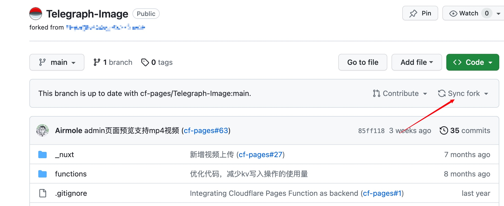
更新完成后，稍等一会，等Cloudflare Pages那边检测到你的仓库更新了之后就会自动部署最新的代码了。
## 注意事项
以上就是关于如何利用Cloudflare Workers的和Pages搭建无成本图床的全部过程了，内容稍微有点长，但都不复杂，基本上属于一劳永逸的事。
不过，说完好听的，还是得提一下稍微需要注意的事项，主要有以下方面：

- 每天最多**100,000**次免费读取操作，图片每加载一次都会占用该额度。建议在Cloudflare上开启域名缓存设置，这样仅当缓存未命中时才会占用该额度。如果额度用完了，则黑白名单等功能可能会失效。
- 每天最多**1,000**次免费删除操作，每有一条图片记录都会占用该额度，超过了将无法删除图片记录。
- 每天最多**1,000**次免费列出操作，每打开或刷新一次后台`/admin`都会占用该额度，超过了将无法进行后台图片管理。

如果你搭建的图床仅供自己使用，以上限制其实可以忽略。绝大多数情况下，免费额度都基本够用，并且可以稍微超出一点，不是一超出就立马停用了，而且每项额度都是单独计算。某项操作超出免费额度后只会停用该项操作，不影响其他的功能。例如免费写入额度用完了，读取功能不受影响，图片能够正常加载，只是不能在图片管理后台看到新的图片了。
另外，还有一些特殊的注意事项，需要关注下：

- 上传的单个文件最大支持**5MB**，有大文件需求的可以直接拜拜了。
- 开启图片审查后，不良图片会被自动屏蔽，不支持加载。
- 加入白名单中的内容可绕过图片审查结果，无论是否通过都能正常加载。而加入黑名单的图片将无法正常加载。
- 每次修改部署项目的KV、环境变量等，记得要**重新部署**，否则不会生效。
> 原创不易，如果觉得此文对你有帮助，不妨点赞+收藏+关注，你的鼓励是我最大的动力！

> 来自: [保姆级教程：使用Cloudflare+Telegraph搭建零成本图床系统 - 胡萝虎的博客](https://www.huluohu.com/posts/456/)

