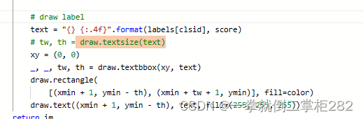

## 模型训练时报错，将num_work改为0
## 模型导出失败：RuntimeError: Can't call main_program when full_graph=False. Use paddle.jit.to_static(full_graph=True) instead.
解决方案 ：对PaddleDetection/ppdet/engine/trainer[.py文件](https://so.csdn.net/so/search?q=.py%E6%96%87%E4%BB%B6&spm=1001.2101.3001.7020)中代码进行修改

模型推理时失败：在PaddleDetection/deploy/python/visualize.py文件中
tw, th = draw.textsize(text) 修改为
xy = (0, 0)
_, _, tw, th = draw.textbbox(xy, text)

> 来自: [在百度AIstudio上运行自己PaddleDetection所遇到的问题及解决方案_运行飞桨ai studio数据集报错-CSDN博客](https://blog.csdn.net/qq_60518643/article/details/135900605)

